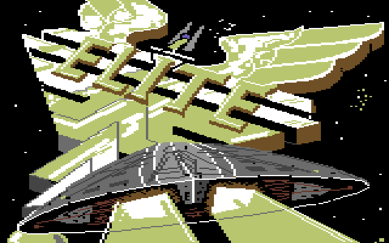

# Elite (C64) — tape format, loader, and game analysis

A reverse-engineering reference for `Elite.tap` (the tape carries a single
autostarting file named "ELITE"). So far it covers the tape image, the
self-modifying copy-protection loader, the game program's startup and the ship
graphics, with the remaining data formats and mechanics to follow, in reading
order:

* **Part I** — the TAP container and both tape encodings (standard KERNAL and
  the custom fastloader), enough to extract every byte from the raw image;
* **Part II** — the boot chain from the KERNAL autostart trick to the game's
  first instruction, including the self-modifying loader and its
  copy-protection tricks;
* **Part III** — the game program's startup: the layered decryption, the
  relocation of the engine, the hardware and interrupt setup, and the memory
  map after loading;
* **Part IV** — graphics and data formats: the wireframe ship models (blueprint
  structure and vector-drawing pipeline), the procedural generation of the
  galaxies and planet names, and the string/token tables behind every in-game
  name and label;
* **Part V** — game mechanics: the per-frame game loop, and how the other ships
  spawn, move, fight, and disappear; the legal-status/bounty system, the combat
  rating, docking, the game-over conditions, the Thargoid threat, the scripted
  missions, and how a system's economy and government shape play;
* **Part VI** — sound and music: the table-driven sound-effects player, and the
  nibble-bytecode music sequencer that plays the Blue Danube docking waltz;
* **Appendices** — toolchain and reproduction.

Methods: purely static analysis of the image bytes — no external tools or
references, everything below was derived from the bytes in the image and
disassembly of the loader and game code it carries. Because the fastloader
rewrites its own wire format as it runs, the Go extraction toolchain
(`extract/` plus the shared `tools/`) does not reimplement the protocol; it
*runs* the actual loader on a small 6502 emulator and logs what it writes
(Appendix A). The game code is encrypted on tape; the same emulator runs the
loaded image far enough to decrypt it in memory, which is how the routines in
Part III were recovered for disassembly. All addresses are C64 memory
addresses.

---

## Contents

- [Part I — The tape image](#part-i--the-tape-image)
  - [1. TAP container](#1-tap-container)
    - [Layout of this image](#layout-of-this-image)
  - [2. Standard KERNAL encoding (boot file)](#2-standard-kernal-encoding-boot-file)
  - [3. The fastloader encoding](#3-the-fastloader-encoding)
    - [Bit encoding — CIA timer as pulse discriminator](#bit-encoding--cia-timer-as-pulse-discriminator)
    - [Byte framing, pilot and sync](#byte-framing-pilot-and-sync)
    - [Block format](#block-format)
- [Part II — Boot chain and loader internals](#part-ii--boot-chain-and-loader-internals)
  - [1. Autostart](#1-autostart)
  - [2. Boot code (entry $02A8)](#2-boot-code-entry-02a8)
  - [3. Self-modification — the loader rewrites itself from the tape](#3-self-modification--the-loader-rewrites-itself-from-the-tape)
  - [4. Exit-code variants](#4-exit-code-variants)
  - [5. The multi-stage load chain](#5-the-multi-stage-load-chain)
- [Part III — Game program architecture](#part-iii--game-program-architecture)
  - [1. Decryption and relocation (SYS 30215 → $7607)](#1-decryption-and-relocation-sys-30215--7607)
  - [2. In-place decrypt and hand-off ($1D1F)](#2-in-place-decrypt-and-hand-off-1d1f)
  - [3. Hardware init ($B3B2)](#3-hardware-init-b3b2)
  - [4. Interrupt architecture](#4-interrupt-architecture)
  - [5. Memory map (after load)](#5-memory-map-after-load)
  - [6. The loading screen](#6-the-loading-screen)
- [Part IV — Graphics and data formats](#part-iv--graphics-and-data-formats)
  - [1. Ship models](#1-ship-models)
    - [1.1 The blueprint table](#11-the-blueprint-table)
    - [1.2 Blueprint layout](#12-blueprint-layout)
    - [1.3 Worked example — type 1](#13-worked-example--type-1)
    - [1.4 The rendering pipeline](#14-the-rendering-pipeline)
    - [1.5 Routine and data map (ship rendering)](#15-routine-and-data-map-ship-rendering)
    - [1.6 Rendered models](#16-rendered-models)
  - [2. Planet names and galaxies](#2-planet-names-and-galaxies)
    - [2.1 Why the names aren't there: the text system](#21-why-the-names-arent-there-the-text-system)
    - [2.2 The seed](#22-the-seed)
    - [2.3 The generator: a Fibonacci twist](#23-the-generator-a-fibonacci-twist)
    - [2.4 Building a name](#24-building-a-name)
    - [2.5 Coordinates — the same seed/generator](#25-coordinates--the-same-seedgenerator)
    - [2.6 What dynamic tracing settled, and what is still open](#26-what-dynamic-tracing-settled-and-what-is-still-open)
    - [2.7 Routine and data map (universe generation)](#27-routine-and-data-map-universe-generation)
  - [3. String and token tables](#3-string-and-token-tables)
    - [3.1 How text is stored: recursive tokens and digrams](#31-how-text-is-stored-recursive-tokens-and-digrams)
    - [3.2 The game's vocabulary](#32-the-games-vocabulary)
- [Part V — Game mechanics: the other ships](#part-v--game-mechanics-the-other-ships)
  - [1. Two engines: the IRQ and the foreground loop](#1-two-engines-the-irq-and-the-foreground-loop)
  - [2. The universe: slots, records, and the update pass](#2-the-universe-slots-records-and-the-update-pass)
    - [2.1 How ships are stored](#21-how-ships-are-stored)
    - [2.2 The update pass](#22-the-update-pass)
  - [3. Spawning — when and where traffic appears](#3-spawning--when-and-where-traffic-appears)
    - [3.1 `spawn_ship` (`$855B`): putting a ship into the world](#31-spawn_ship-855b-putting-a-ship-into-the-world)
    - [3.2 `spawn_director` (`$8E0D`): the traffic generator](#32-spawn_director-8e0d-the-traffic-generator)
  - [4. Movement and AI](#4-movement-and-ai)
    - [4.1 `ship_move_draw` (`$ABA0`): the per-ship mover](#41-ship_move_draw-aba0-the-per-ship-mover)
    - [4.2 `ship_tactics` (`$32AA`): the AI](#42-ship_tactics-32aa-the-ai)
  - [5. Despawning — when ships disappear](#5-despawning--when-ships-disappear)
  - [6. Routine and data map (ship mechanics)](#6-routine-and-data-map-ship-mechanics)
  - [7. Legal status and bounty](#7-legal-status-and-bounty)
  - [8. Game over — and can you win?](#8-game-over--and-can-you-win)
  - [9. The combat rating](#9-the-combat-rating)
  - [10. Docking at the station](#10-docking-at-the-station)
  - [11. The Thargoids](#11-the-thargoids)
  - [12. Scripted missions](#12-scripted-missions)
  - [13. System character: economy and government](#13-system-character-economy-and-government)
- [Part VI — Sound and music](#part-vi--sound-and-music)
  - [1. Two engines, one IRQ tail](#1-two-engines-one-irq-tail)
  - [2. Sound effects — the table-driven player (`$B256`)](#2-sound-effects--the-table-driven-player-b256)
  - [3. The music sequencer (`$BDDC`)](#3-the-music-sequencer-bddc)
  - [4. The music — the Blue Danube docking waltz](#4-the-music--the-blue-danube-docking-waltz)
  - [5. Routine and data map (sound)](#5-routine-and-data-map-sound)
- [Appendix A — Toolchain and reproduction](#appendix-a--toolchain-and-reproduction)

---

# Part I — The tape image

## 1. TAP container

The image is a standard TAP v1 file. The TAP format stores the duration of
every pulse (time between falling edges) that the datasette would deliver to
the C64:

```
0000  43 36 34 2d 54 41 50 45 2d 52 41 57    "C64-TAPE-RAW"
000C  01                                     version 1
000D  00 00 00                               (padding)
0010  24 3b 0c 00                            payload size = $000C3B24 (801572)
0014  30 30 30 30 ...                        pulse data
```

* Each payload byte `n ≠ 0` is one pulse of `n × 8` clock cycles
  (PAL clock = 985248 Hz, so `$30` = 384 cycles ≈ 390 µs).
* In version 1, a `00` byte is an escape: the next three bytes are a
  little-endian pulse length in cycles. This image uses it for the silent
  gaps between files (e.g. `00 40 e1 0f` = 1,040,000 cycles ≈ 1.06 s).

Only five pulse widths matter on this tape:

| byte | cycles | used by |
|------|--------|------------------------------|
| `$30`| 384    | ROM format *short*, fastloader *0-bit* |
| `$42`| 528    | ROM format *medium* |
| `$56`| 688    | ROM format *long* |
| `$5D`| 744    | fastloader *1-bit* |
| `00 …`| ≥ 10⁶ | pauses between segments |

### Layout of this image

The pauses split the tape into 12 segments:

| seg | TAP offset | content |
|-----|-----------|---------|
| 0 | $000014 | CBM ROM format: header block for file "ELITE" |
| 1 | $008A49 | CBM ROM format: data block, boot code `$029F-$03C0` |
| 2 | $00CEA5 | turbo: vector patch, BASIC stub `$0801`, exit patch |
| 3 | $00DD25 | turbo (BASIC `LOAD` #1): game part `$4000-$86CC` |
| 4 | $042E7D | turbo (BASIC `LOAD` #2): multi-load routine `$CE0E-$CF40`, `$8609-$86CC` |
| 5 | $044B91 | turbo (kernal LOAD 1): colour data `$6000-$6400` → `$D800` |
| 6 | $0485EC | turbo (kernal LOAD 2): colour data `$6000-$6400` |
| 7 | $04C33E | turbo (kernal LOAD 3): bitmap loading picture `$4000-$6000` |
| 8 | $06378A | turbo (kernal LOAD 4): game part `$1D00-$3ECF` |
| 9 | $07BEFC | turbo (kernal LOAD 5): game part `$7300-$CA6D` |
| 10 | $0BBEB2 | turbo (kernal LOAD 6): colour data `$6000-$6400` |
| 11 | $0BFFD4 | turbo (kernal LOAD 7): `$4000-$41EA` + `$6000-$6400` |

## 2. Standard KERNAL encoding (boot file)

The first two segments are a normal CBM tape file, readable by the kernal
ROM loader:

* Bits are pairs of pulses: `(short,medium)` = 0, `(medium,short)` = 1.
* A byte frame is a `(long,medium)` marker, 8 data bit pairs LSB-first, and an
  odd-parity bit pair. `(long,short)` marks end-of-data.
* A block is: leader of short pulses, sync countdown `89 88 87 86 85 84 83 82
  81`, payload, XOR checksum; the block then repeats with countdown
  `09 08 … 01`.

Decoded header block (segment 0):

```
03 9F 02 C0 03 45 4C 49 54 45 20 20 ...
│  └──┬──┘ └──┬──┘ E  L  I  T  E
│  $029F   $03C0   filename (16 chars, space padded)
└─ type 3 = non-relocatable program
```

Segment 1 is the 289-byte program `$029F-$03C0` plus XOR checksum — the boot
code. Its load address is the whole trick that autostarts the loader; that and
the boot code itself are covered in Part II.

## 3. The fastloader encoding

From segment 2 on, the tape uses a custom turbo encoding. This section
describes the bytes on the tape; how the loader code that reads them is itself
patched mid-stream is Part II.

### Bit encoding — CIA timer as pulse discriminator

Two pulse widths encode bits: `$30` (384 cycles) = **0**, `$5D` (744 cycles) =
**1**. The threshold is implemented with CIA 2 timer A, latch `$0243` = 579
cycles: the loader restarts the timer on every edge, and if it underflowed
during the pulse, the pulse was "long". Cassette edges arrive on CIA 1's FLAG
line (ICR bit 4, `$DC0D`).

```
0334  LDA #$10                       getbit:
0336  BIT $DC0D                        wait for FLAG (tape edge)
0339  BEQ $0336
033B  LDA #$11
033D  STA $DD0E                        restart CIA2 timer A (latch $0243)
0340  LDA $DD0D                        read CIA2 ICR
0343  LSR A                            bit 0 (timer A underflow) → carry
0344  BIT $DC0D                        clear FLAG
0347  ROL $FC                          shift bit into $FC
0349  RTS

034A  LDX #$09                       getbyte:
034C  JSR $0334                        read 9 bits into $FC
034F  INC $D020                        (border flicker)
0352  DEX
0353  BNE $034C
0355  LDA $FC
0357  RTS
```

Latch setup at the loader entry point:

```
0378  LDA #$43  STA $DD04            timer A latch = $0243 = 579 cycles
037D  LDA #$02  STA $DD05            (between 384 and 744)
0382  LDY #$7F  STY $DD0D  STY $DC0D disable CIA interrupts
038A  LDA #$07  STA $01              tape motor on, ROMs in
```

### Byte framing, pilot and sync

A byte is **9 pulses: one start bit (always 1) followed by 8 data bits,
MSB first** (`ROL` into `$FC`; the ninth shift pushes the start bit out).
Raw TAP bytes:

```
pilot, repeated ~256 times (= byte $00):      5D 30 30 30 30 30 30 30 30
sync byte $16 (1 00010110):                   5D 30 30 30 5D 30 5D 5D 30
```

Synchronisation (entry `$038E`):

1. shift bits into `$FC` (preset `$7F`) until 8 consecutive 0-bits arrive
   → guaranteed to happen only inside the pilot;
2. read byte frames while they decode to `$00`;
3. the first non-zero byte must be `$16`, otherwise restart at 1.

### Block format

After the sync byte comes a sequence of blocks, **back to back, with no
checksums and no gaps**:

```
end-hi  end-lo  start-hi  start-lo  data[end-start] ...next block...
```

Real example — the first frames after the very first `$16` (TAP offset
$00D7A5): header `03 34 03 00` = block `$0300-$0334`, followed by 52 data
bytes. The header is stored to `$AF,$AE,$AD,$AC` and the store loop is:

```
03A3  LDY #$03                       read 4 header bytes
03A5  JSR $034A
03A8  STA $00AC,Y                     Y=3..0 → $AF,$AE,$AD,$AC
03AB  DEY
03AC  BPL $03A5
03AE  JSR $034A                      data loop:
03B1  STA ($AC,X)                     store byte (X=0)
03B3  JSR $FCDB                       kernal: $AC/$AD++
03B6  JSR $FCD1                       kernal: compare with $AE/$AF
03B9  BCC $03AE                       until start == end
03BB  BCS $03A3                       then: next block header — forever!
```

Note the loop never terminates by itself: it always branches back for another
block header. That non-terminating loop is the hook the copy protection hangs
on — how the tape stops it (and rewrites the loader between blocks) is Part II.

Net data rate of the turbo format is ≈ 190 bytes/s (9 pulses × ~570 µs
average), roughly five times the effective rate of the ROM format with its
duplicated blocks. There is **no checksum** on any turbo data.

---

# Part II — Boot chain and loader internals

## 1. Autostart

The kernal saves the IRQ vector at `$029F/$02A0` while it uses the tape, and
**restores `$0314/$0315` from there when the load finishes**. The boot file
(segment 1) starts at `$029F` and its first two bytes are `A8 02`:

```
029F  A8 02            ← restored into $0314/$0315 = IRQ vector $02A8
```

So the first timer IRQ after "FOUND ELITE" jumps straight into the loaded
code at `$02A8` — no `RUN` needed, and the file also overwrites the BASIC
vector table at `$0300-$0333` on the way (it keeps almost all default values;
`$0314/$0315` inside the file is `2C F9` = `$F92C`, a kernal tape-IRQ routine,
so the machine survives the moment the vector table is overwritten *during*
the load).

## 2. Boot code (entry $02A8)

```
02A8  LDA #$20            fill $03C0-$07FF with spaces
02AE  STA ($AC),Y         ($AC/$AD = end-of-load address $03C0)
02B0  JSR $FCDB           kernal: increment $AC/$AD
...
02B9  LDA $FCD1,Y         fill $0800-$CFFF with kernal ROM garbage
...
02C7  LDA #$80  STA $9D   kernal messages off
02CB  STA $0800, STA $C6  zero BASIC start, clear keyboard buffer
02D2  JMP $0378           → fastloader
```

The jump to `$0378` enters the turbo loader described in Part I §3.

## 3. Self-modification — the loader rewrites itself from the tape

**Exit trick.** The block store loop (Part I §3) never terminates on its own.
To end a load, the tape simply sends a block whose address range covers the
loop itself, e.g. `$03BB-$03EB`. While that block loads, the byte at `$03BB`
changes from `B0` (`BCS`) to `A9` (`LDA #`), so when the block is complete the
loop *falls through* into the code that was just loaded:

```
03BB  A9 E6              was: BCS $03A3 — now falls through
03BD  LDA #$B0
03BF  STA $03BB          repair the BCS for the next use
03C2  ...                stage-specific exit code
```

**Protocol mutations.** Between payload blocks, the tape sends 1-3 byte
blocks aimed at single instructions of the loader, changing the wire format
on the fly (all values below were observed in the image):

| target | instruction | effect |
|--------|-------------|--------|
| `$0347` | `ROL $FC` ↔ `ROR $FC` (`$26`/`$66`) | bit order MSB-first ↔ LSB-first |
| `$034B` | `LDX #$09` operand → `$08`/`$0A` | bits per byte frame (8 = no start bit, 10 = two start bits) |
| `$03A4` | `LDY #$03` operand → `$04` | header grows to 5 bytes; the extra first byte lands in `$B0` and is never read — a decoy |
| `$03BB` | `BCS` opcode | exit trick, see above |
| `$0300-$0333` | vector table | rewritten over and over (ILOAD `$0330` → `$0378` keeps `LOAD` hijacked) |
| `$0350-$03C0` | whole loader tail | periodically re-written wholesale, sometimes byte-identical (a decoy — the stores race the executing loop and must match it) |

Because of the `ROR` flips, the *same* pilot/sync logic produces different
raw bit patterns in different phases: in LSB mode the sync byte `$16` appears
on tape as `01101000` (= `$68` read MSB-first). The pilot `$00` is a
palindrome and is unaffected.

The main payload of segment 3 (`$4000-$86CC`) is transmitted as ~70 blocks of
256 bytes, with patch blocks interleaved between almost every page —
extracting it without executing the patches is hopeless, which is clearly the
point: it is a copy-protection scheme, not just a fastloader.

## 4. Exit-code variants

Three kinds of exit blocks occur:

1. **Continue** (mid-segment): restore `BCS`, fix up some zero-page/vector
   values, `JMP $0378` — re-synchronise on the next pilot and keep loading.
2. **Return to BASIC** (end of segment 2): `JSR $FCCA` (motor off), set
   `$2D/$2E` = `$082C` (end of BASIC program), `JSR $A871`, `JMP $A7EA` —
   i.e. `RUN` the BASIC stub that was just loaded.
3. **RTS** (end of segments 3-11): set `$90` (STATUS) = `$40` (EOF),
   `CLC`, `RTS` — return as a well-behaved `ILOAD` implementation to the
   kernal `LOAD` caller.

## 5. The multi-stage load chain

```
kernal ROM load  →  boot "ELITE" $029F-$03C0 (autostart via IRQ vector $029F/$02A0)
$02A8 boot code  →  JMP $0378 fastloader
  seg 2:  vectors ($0330 ILOAD → $0378), BASIC stub $0801, exit → RUN
BASIC stub:      10 IF F=0 THEN F=1:LOAD
                 20 IF F=1 THEN F=2:LOAD
                 30 SYS 30215
  LOAD #1 (ILOAD = fastloader) → seg 3: game part $4000-$86CC
  LOAD #2                      → seg 4: $CE0E-$CF40, $8609-$86CC, patch $7604
SYS 30215 = $7607 → ... → JMP $CE0E:
  7 × JSR $FFD5 (kernal LOAD, still via ILOAD = $0378):
     seg 5  colours  $6000-$6400  → copied to colour RAM $D800
     seg 6  colours  $6000-$6400
     seg 7  bitmap   $4000-$6000  (loading picture, shown during...)
     seg 8  game     $1D00-$3ECF
     seg 9  game     $7300-$CA6D
     seg 10 colours  $6000-$6400  → copied to $D800
     seg 11 data     $4000-$41EA + $6000-$6400
  restore default vectors (table at $CF00, ILOAD back to $F4A5)
  JMP $1D1F  →  game starts
```

The BASIC-stub detour exists because a tape `LOAD` from inside a running
BASIC program restarts the program afterwards — the `F` flag variable makes
each line run once. The 5-byte headers, the bit-order flips and the no-op
rewrites have no functional purpose other than to frustrate exactly the kind
of analysis done here.

---

# Part III — Game program architecture

Part II ended at the two hand-off jumps: `SYS 30215` ($7607) and, after the
seven picture-covered loads, `JMP $1D1F`. This part follows the code from
there — how the loaded blob decrypts and relocates itself, how the display
and interrupts are set up, and how the game reaches its first frame.

Everything in the game image arrives **encrypted** and is unpacked in three
stages by three near-identical rolling-subtraction decryptors. None of the
game code is ever in plaintext on the tape, and even after loading it is
decrypted in pieces, at different times, with different keys — one more layer
of the protection.

## 1. Decryption and relocation (SYS 30215 → $7607)

The 18 KB blob loaded to `$4000–$86CC` (Part II, seg 3) is encrypted. `$7607`
first decrypts it with the routine at `$7631`: each byte is the previous
plaintext byte subtracted from the ciphertext (a rolling key), and the loop's
end address is self-modified at `$7604/$7605`:

```
7631  STX $1A            key = X
7633  STA $19            pointer high
7635  LDA #$00 STA $18   pointer low = 0
7639  LDA ($18),Y        ciphertext byte
763B  SEC SBC $1A        minus rolling key
763E  STA ($18),Y        store plaintext
7640  STA $1A            key for next byte = this plaintext
7642  TYA BNE $7647
7645  DEC $19            cross to previous page when Y wraps
7647  DEY
7648  CPY $7604          end-of-range low  (self-modified)
764B  BNE $7639
764D  LDA $19 CMP $7605  end-of-range high (self-modified)
7652  BNE $7639
7654  RTS
```

`$7607` calls it twice, walking **downward** through memory:

| pass | range          | initial key |
|------|----------------|-------------|
| 1    | `$7655–$86CB`  | `$8E`       |
| 2    | `$4000–$7600`  | `$6C`       |

The gap `$7601–$7654` is the decryptor itself, left in clear. Concretely, the
12 bytes at `$7655` go from ciphertext to code:

```
encrypted:  b8 bf a9 85 9d c1 b0 8c 9e c2 a9 85
decrypted:  a2 16 a9 00 85 18 a9 07 85 19 a9 00   (LDX #$16 / LDA #$00 / STA $18 …)
```

The decrypted `$7655` then **relocates** the engine and sets up the loading
screen. Copies use the page-mover at `$7885` (X pages, source `$1A/$1B` →
destination `$18/$19`):

```
7655  copy $16 pages  $4000-$55FF -> $0700        (engine code low)
7669  $01 = $04                                   bank RAM in under I/O
7671  copy $20 pages  $5600-$75FF -> $D000-$EFFF   (engine code hidden under I/O)
7684  $01 = $05                                   I/O back in
768C  DD02 |= $03, DD00 = (..&$FC)|$02            VIC bank
76A6  D018=$81, D011=$3B (bitmap), D016=$C0        loading-screen display
76C4  D025/D026/D029-D02E …                        sprite colours
```

Relocating `$5600–$75FF` underneath `$D000–$EFFF` hides the bulk of the engine
as RAM under the I/O area, reached by toggling the `$01` bank bits. After a few
more copies (character and sprite data) it `JMP`s to `$CE0E`, the multi-load
routine that pulls in the remaining seven segments behind the bitmap picture
(Part II §5) and finally jumps to `$1D1F`.

## 2. In-place decrypt and hand-off ($1D1F)

`$1D1F` is the game's real entry. It preserves the loader's zero page, decrypts
the last two regions in place, initialises the hardware, and starts the game:

```
1D1F  CLD
1D20  LDX #$02                  back up zero page $02-$FF
1D22  LDA $00,X  STA $CE00,X    -> $CE02-$CEFF
1D27  INX  BNE $1D22
1D2A  JSR $1D33                 in-place decrypt (below)
1D2D  JSR $B3B2                 hardware init (§3)
1D30  JMP $916F                 game start
```

`$1D33` is the same rolling-subtraction cipher as `$7631` (its end addresses
self-modify `$0452/$0453`), run over the two regions that arrived encrypted on
the last loads:

| range          | initial key |
|----------------|-------------|
| `$1D7E–$3ECE`  | `$36`       |
| `$7300–$CA6C`  | `$49`       |

The second region holds the running engine — the IRQ handler, hardware-init
and SID player all live in `$7300–$CA6C`.

## 3. Hardware init ($B3B2)

```
B3B2  clear $0400-$06FF
B3C7  $0318/$0319 = $B433       NMI vector -> CLI/RTI (RESTORE neutralised)
B3D1  $0326/$0327 = $BA61       BSOUT vector
B3DB  LDA #$05 JSR $8B8B        bank helper: all-RAM + I/O
B3E0  SEI; wait for raster $37  sync
B3ED  DC0D/DD0D = $03           disable CIA interrupts
B3F5  D418 = $0F                SID volume
B400  D01A = $01                enable raster IRQ
B40B  D012 = $28                first IRQ at line $28
B40D  D011 &= $7F               (clear high raster bit)
B410  $01 = $04                 KERNAL/BASIC banked out, I/O in
B41D  $FFFA/$FFFB = $B433       RAM NMI hardware vector
B427  $FFFE/$FFFF = $B1FA       RAM IRQ hardware vector
B431  CLI RTS
```

With the KERNAL ROM banked out (`$01` bit 1 = 0), the CPU takes its IRQ/NMI
vectors from **RAM** at `$FFFE`/`$FFFA`, so interrupts dispatch straight to the
game's own handlers with no ROM in the path.

## 4. Interrupt architecture

The IRQ at `$B1FA` is a table-driven raster-split engine. It reads the current
split index from `$B1D9` and loads that split's register values from seven
two-entry tables at `$B1DA–$B1E7`:

```
B20D  LDX $B1D9
B210  LDA $B1DA,X  STA $D018    char/screen base
B216  LDA $B1E0,X  STA $D016    mode / x-scroll
B21C  LDA $B1DE,X  STA $D012    next split's raster line
B222  LDA $B1E2,X  STA $D01C    sprite multicolour
B228  LDA $B1E4,X  STA $D028    sprite colour
B236  LDA $B1E6,X  STA $D021    background
B23C  LDA $B1DC,X  STA $B1D9    next split index
B242  BNE $B1ED                 not the last split -> just RTI
```

There are **two splits per frame**, raster lines `$33` and `$C2`:

| reg    | split 0 (`$33`) | split 1 (`$C2`) |
|--------|-----------------|-----------------|
| `$D012` next line | `$C2` | `$33` |
| `$D018`           | `$81` | `$81` |
| `$D016`           | `$C0` | `$C0` |
| `$D01C` spr. MC   | `$FE` | `$FC` |
| `$D028` spr. col  | `$02` | `$00` |
| `$D021` bg        | `$00` | `$00` |
| next index        | `1`   | `0`   |

When the index returns to 0 (the second split completes the frame), the
handler falls through to the per-frame work instead of exiting early: a
three-voice SID player driven from the tables at `$B313`, plus an optional
`JSR $BDDC` when `$1D03` bit 7 is set. The handler restores `$01` from `$8B9A`
and `RTI`s.

From `$B3B2`'s `CLI` onward the game is interrupt-driven. `$916F` runs the
one-time game setup — it clears the flag block `$1D01–$1D11`, then builds the
title/commander screen through a chain of subroutines (`$8CD6`, `$9563`,
`$9220` text, …) — before the foreground settles into its main loop (left to a
later part).

## 5. Memory map (after load)

| range         | content                                                       |
|---------------|---------------------------------------------------------------|
| `$0002–$00FF` | zero page (backed up to `$CE02` at game start)                |
| `$0100–$01FF` | stack                                                         |
| `$0300–$0333` | KERNAL vectors (restored defaults; NMI `$0318`→`$B433`, BSOUT `$0326`→`$BA61`) |
| `$0400–$06FF` | cleared at init                                               |
| `$0700–$1CFF` | engine code, relocated from `$4000–$55FF`                     |
| `$1D00–$1D7D` | game entry + in-place decryptor (plaintext)                   |
| `$1D7E–$3ECF` | game code/data, decrypted in place (key `$36`)                |
| `$7300–$CA6C` | game engine, decrypted in place (key `$49`): IRQ `$B1FA`, hardware-init `$B3B2`, game start `$916F`, SID player `$B313`/`$BDDC` |
| `$CE00–$CF40` | zero-page backup + the multi-load routine                     |
| `$D000–$EFFF` | engine code under I/O, relocated from `$5600–$75FF` (reached via the `$01` bank bits) |
| `$FFFA/$FFFE` | RAM NMI/IRQ hardware vectors (`$B433` / `$B1FA`)              |

The character sets, sprite shapes and in-game screen and colour memory are
graphics data, covered in a later part. The bitmap **loading** picture, which
also occupies `$4000–$6000` during the load, is covered next.

## 6. The loading screen

While the long segments stream in, Elite shows its title picture — the 3-D
"ELITE" logo and a Cobra Mk III over a starfield:



It is a **multicolor bitmap** (160×200 colour pixels), stored **uncompressed**
and split across three tape segments rather than packed — consistent with the
rest of the tape, which favours obfuscation over economy. The multi-load
routine at `$CE0E` (Part II §5) assembles it from those segments:

- seg 7 → `$4000–$5F3F`: the 8000-byte VIC bitmap (the pixel data);
- seg 6 → `$6000`: the 1000-byte video matrix (colours for bit-pairs 01/10);
- seg 5 → `$6000`, then copied to colour RAM `$D800` (`$CE3F` loop): the third
  colour, bit-pair 11. The background (bit-pair 00) is white — `$D021 = $01`,
  set at `$CE60`.

Multicolor mode is selected at `$CE56` (`$D016` bit 4), and the display is
switched on at `$CE65` (`$D011` DEN bit) *after* the bitmap and its colours are
in place but *before* the two largest loads — the game code at `$1D00–$3ECF`
and `$7300–$CA6D` — so the picture masks the slowest part of the load. When
those finish, the loader blanks the screen, zeroes `$4000–$5FFF` to reclaim the
bitmap RAM for the game, restores the KERNAL vectors and jumps to `$1D1F`.

The image above was produced by the `loadingscreen` tool (Appendix A), which
reassembles the three segments and renders the multicolor bitmap.

---

# Part IV — Graphics and data formats

## 1. Ship models

Elite's ships are filled-edge **wireframe vector models**: each is a list of
3-D vertices joined by edges, with face normals used to hide the back. All of
the model data lives in the engine block that the loader hid under the I/O area
at `$D000–$EFFF` (Part III §1), so the routines that read it bank ROM/I-O out
first.

### 1.1 The blueprint table

A pointer table of 16-bit little-endian addresses, indexed by ship type × 2,
sits at `$CFFE` (so type *T*'s blueprint address is at `$CFFE + T*2`; type 1 is
the first real entry, at `$D000`). There are **33 ship types**, with blueprints
packed from `$D0A5` to about `$EE2D`:

```
type  1: $D0A5     type 12: $DA4B     type 23: $E45B
type  2: $D1A3     type 13: $DB3D     type 24: $E50B
...                ...                ...
type 11: $D8C3     type 22: $E395     type 33: $EE2D
```

The table is read by the spawn routine (`$855B`, spawn_ship) and the per-ship draw
path (`$2030` → `$ABA0`), each doing `LDA $CFFE,Y / STA $57 ; LDA $CFFF,Y / STA
$58` to point a zero-page vector (`$57/$58`) at the chosen blueprint.

### 1.2 Blueprint layout

Each blueprint is a 20-byte header followed by three packed arrays — vertices,
edges, faces:

```
+0           flags (laser/missile/AI bits)
+1 +2        targetable area (16-bit: bounding-radius², for laser hits)
+3           EDGES offset  (byte offset from blueprint start to the edge array)
+4           FACES offset  (low byte of the offset to the face array)
+5           visibility distance / model "size" (drawn as a dot beyond this)
+9           number of edges (NE)
+0E +0F      level-of-detail / max-size attributes (read by spawn_ship and ship_move_draw)
+13          AI / energy attributes
... (remaining bytes: scaling and AI/economy attributes)
```

The header carries no explicit vertex or face count; both are derived from the
offsets, because every array has a fixed record size:

```
vertices start at offset 20           NV = (EDGES_offset − 20) / 6
edges    start at EDGES_offset         NE = header[+9]   (= FACES_offset − EDGES_offset, /4)
faces    start at FACES_offset         NF = (blueprint_length − FACES_offset) / 4
```

This was confirmed two ways. First, **header[+9] equals (FACES−EDGES)/4** on
26 of the 33 ships (the other seven are large models whose face offset exceeds
255, so the single header byte at +4 holds only the low byte — the true offset
is still `EDGES_offset + NE*4`). Second, the resulting vertex/edge/face counts
satisfy **Euler's polyhedron formula V − E + F = 2** for every model that is
stored contiguously, e.g.:

| type | NV | NE | NF | V−E+F |
|------|----|----|----|-------|
| 1    | 17 | 24 | 9  | 2     |
| 2    | 16 | 28 | 14 | 2     |
| 9    | 19 | 30 | 13 | 2     |
| 13   | 13 | 24 | 13 | 2     |

**Vertex record — 6 bytes:**

```
+0  |x|        magnitude of the x coordinate
+1  |y|        magnitude of the y coordinate
+2  |z|        magnitude of the z coordinate (depth; ships point along +z)
+3  %sss vvvvv bits 7-5 = sign of x,y,z; bits 4-0 = visibility distance
+4  %aaaa bbbb two face numbers (nibbles) this vertex belongs to
+5  %cccc dddd two more face numbers
```

The four face references let the projector decide a vertex is visible if **any**
of its faces is visible. The visibility-distance field is level-of-detail: fine
detail vertices carry a small value and are only drawn close up.

**Edge record — 4 bytes:**

```
+0  visibility distance (skip the edge when the ship is further than this)
+1  %aaaa bbbb the two faces on either side of the edge (nibbles)
+2  vertex 1 number × 4
+3  vertex 2 number × 4
```

Vertex numbers are pre-multiplied by 4 because the projected screen coordinates
are stored 4 bytes per vertex (x and y as 16-bit words) in a work buffer, so the
stored value indexes that buffer directly. An edge is drawn only if at least one
of its two faces is currently visible.

A face nibble of **`$F` (15) is a sentinel meaning "no face on this side"** — an
edge with an `$F` face is always drawn, never back-face culled. It appears on flat
models that have no enclosing solid: the **alloy plate** (type 4) is a single face
whose four boundary edges all carry `$F`, so its outline is drawn from any angle.
The sentinel is not a real face and must be excluded when counting faces (so the
plate has **1** face, not 16).

**Face record — 4 bytes:**

```
+0  %sss vvvvv bits 7-5 = sign of the normal's x,y,z; low bits = visibility/illum
+1  |normal_x|
+2  |normal_y|
+3  |normal_z|
```

The signed normal vector is dotted with the vector from the ship to the viewer;
a positive result means the face points towards the camera and is visible. This
back-face test is what makes the wireframe look solid — only the front edges are
drawn.

### 1.3 Worked example — type 1

```
header:  00 40 06 7a da 55 00 0a 66 18 00 00 24 0e 02 2c 00 00 02 00
         └+0   └+1+2  └+3 └+4 └+5       └+9
```

`+3 = $7A (122)` → vertices = (122−20)/6 = **17**.
`+4 = $DA (218)`, `+9 = $18 (24)` → edges = (218−122)/4 = **24**.
blueprint is 254 bytes → faces = (254−218)/4 = **9**.  17 − 24 + 9 = 2. ✓

```
vertex 0:  00 00 44 1f 10 32   (0, 0, 68); signs +,+,+; vis 31; faces {1,0,3,2}
vertex 1:  08 08 24 5f 21 54   (8, -8, 36); sign of y set; vis 31; faces {2,1,5,4}
edge 0:    1f 21 00 04         vis 31; faces 2,1; vertices 0 and 1 (00/4, 04/4)
face 0:    9f 40 00 10         normal (-64, 0, 16) (x sign set); always visible
```

Vertex 0 at (0, 0, 68) sits on the +z axis — the model's nose — shared by four
faces, exactly as expected for a pointed ship.

### 1.4 The rendering pipeline

Drawing one ship runs through these stages (all addresses below are also in the
table in §1.5):

1. **Per-ship setup (`$2030`).** The ship's 37-byte state block is copied from
   its universe slot into the zero-page workspace at `$0009`, and its blueprint
   pointer is loaded into `$57/$58`.
2. **Rotate & cull-by-distance (`$ABA0`, ship_move_draw).** The ship's orientation
   vectors are applied; the model "size" is clamped against header byte `+0F`
   for level-of-detail, and far ships are dropped or reduced.
3. **Project & build the line heap (`$A3A0`, draw_ship).** Each vertex is rotated into
   view space and perspective-projected (the depth divide) to a screen x,y,
   stored 4 bytes per vertex. Faces are back-face tested with their normals;
   each edge whose face(s) are visible and whose visibility distance passes is
   appended to the ship's **line heap at `$0580`** as a 4-byte record
   `(x1, y1, x2, y2)`. The heap begins with a length byte.
4. **Draw the heap.** The line-list drawer (`$AA72`) walks the heap — a count
   followed by 4-byte endpoint records — calling the **line** routine for each.
5. **line (`$B49D`).** A Bresenham line drawn into the multicolor space-view
   bitmap at `$4000`. The major/minor axis split is handled at `$B814`; the
   gradient comes from the reciprocal tables at `$9C00–$9F00`; the bitmap byte
   address is formed from the row tables `$A000` (low) / `$A100` (high) plus
   `(x & $F8)`; the inner plot loop EORs pixels (relocated, at `$8888`).
   Single points (stars, distant ships) instead use **pixel (`$2911`)**, which
   plots a 1-, 2- or 4-pixel dot depending on distance (`$A1`), using the
   2-bit multicolor masks at `$28C5`.

Because lines are plotted with EOR, the previous frame's ship can be erased by
drawing the same line heap again before the new one is built — the standard
Elite flicker-free redraw.

### 1.5 Routine and data map (ship rendering)

| address | name | role |
|---------|------|------|
| `$CFFE` | blueprint_ptrs | blueprint pointer table (33 ships, word per type×2) |
| `$D0A5–$EE2D` | — | the 33 ship blueprints (under I/O) |
| `$0580` | line heap | per-ship list of projected line segments |
| `$0009–$002D` | workspace | the active ship's 37-byte state block |
| `$2030` | — | per-ship processor: slot↔workspace copy, fetch blueprint, call ship_move_draw |
| `$ABA0` | ship_move_draw | rotate ship, level-of-detail/visibility, dispatch draw |
| `$A3A0` | draw_ship | project vertices, back-face cull, build the line heap |
| `$855B` | spawn_ship | create a ship in a universe slot (reads blueprint attrs +5,+0E,+0F,+13) |
| `$AA72` | — | draw a line list (count + 4-byte `x1,y1,x2,y2` records) via `$2A` |
| `$B49D` | line | draw one Bresenham line into the view bitmap (multicolor) |
| `$B814` | — | line's steep-axis (dy>dx) variant |
| `$8888` | — | line inner EOR plot loop (relocated under I/O) |
| `$2911` | pixel | plot a distance-scaled point (1/2/4 px) to the view bitmap |
| `$9C00–$9F00` | — | reciprocal/gradient tables used by line |
| `$A000 / $A100` | — | bitmap scanline address tables (low / high byte) |
| `$28B7` | — | 8-bit hires pixel-mask table |
| `$28C5` | — | multicolor 2-bit dot-mask table (used by pixel) |
| `$8DBB` | fib_rng | random-number generator |

The view bitmap itself is at `$4000` (VIC bank 1, multicolor — Part III), the
same RAM the loading picture used; once loading is done it becomes the live
space view that the ship renderer draws into.

### 1.6 Rendered models

The `shiprender` tool (Appendix A) reads the decoded blueprints and draws them
exactly as described above — projecting the vertices and applying the same
back-face hidden-surface removal the game uses (an edge appears only when one of
its two faces points towards the camera) — as white lines on black. It decodes
32 of the 33 table entries (one slot is not a model) and writes a montage plus a
rotating animation per ship:


The animations spin each model around its up axis. Four examples — a faceted
freighter hull, a flat angular hull, a sharp-nosed fighter, and a rounded
many-faceted station-like hull (identified here only by blueprint type, since
the in-game names are stored as encrypted text tokens not yet decoded):

|  |  |  |  |
|:--:|:--:|:--:|:--:|
| type 10 | type 11 | type 19 | type 33 |

(These are animated PNGs; they spin in any viewer that supports APNG — including
GitHub's markdown — and show the first frame as a still everywhere else.)

## 2. Planet names and galaxies

Elite's universe — hundreds of star systems with names like Lave, Diso and
Leesti, each with its own economy, government and position — is **not stored**.
Searching the whole 64 KB image for those names finds nothing: not in plain
text, and not under the game's text obfuscation (see §2.1). Every name and every
system attribute is **generated on demand from a tiny seed**.

### 2.1 Why the names aren't there: the text system

Almost all of Elite's text is stored as EOR-obfuscated **tokens**, not letters,
so a raw search of the image for "LAVE", "DISO" or any other planet name finds
nothing — the letters are not there in sequence. The full token machinery
(recursive tokens, two-letter digrams, and a worked byte-by-byte decode) is
documented in §3.1. The one part that matters for the names is the **digram
table at `$254B`** — the two-letter pairs `AB OU SE IT IL ET …` — because that
same table is the alphabet the planet-name generator draws from in §2.4:

```
$254B: "ABOUSEITILETSTONLONUTHNO" + "ALLEXEGEZACEBISOUSESARMAINDIREA?ERATENBERALAVETIEDORQUANTEISRION"
       pairs: AB OU SE IT IL ET ST ON LO NU TH NO  AL LE XE GE  ZA CE BI SO  US ES …
```

(the `"LAVE"` that *does* turn up in the image is just the adjacent pair bytes
`LA`+`VE` sitting inside this table — a coincidence, not a stored planet name).

### 2.2 The seed

A whole galaxy is defined by a **6-byte seed** (three 16-bit words). The
galaxy-1 seed is the only one stored, inside the default commander block
("JAMESON") at `$2614`:

```
$2614: 45 2E 4A 41 4D 45 53 4F 4E 0D 00 …   "·.JAMESON"+CR
$2621: 4A 5A 48 02 53 B7                    seed = $5A4A, $0248, $B753
$2627: 00 00 03 E8 …                        starting credits $03E8 = 100.0 Cr
```

That `5A4A / 0248 / B753` is the canonical Elite galaxy-1 seed. From it, the
generator produces every system in the galaxy; the other galaxies come from
transforming the same seed, so the entire universe lives in those six bytes plus
the algorithm.

### 2.3 The generator: a Fibonacci twist

All procedural values come from one routine — a Fibonacci-style pseudo-random
generator at `$8DBB`, named **`fib_rng`** here (with inline copies at `$824D`
and `$8264`). It is a two-word lagged-sum step over a 4-byte seed at `$02–$05`:

```
8DBB  LDA $02  ROL A  TAX  ADC $04  STA $02  STX $04   ; word0' = rol(word0)+word1
      LDA $03         TAX  ADC $05  STA $03  STX $05   ; word1' = word0+word1 (carry)
      RTS
```

Each call advances the seed deterministically, so the *same* starting seed
always yields the *same* stream — which is what makes a system's name and data
reproducible. To work on a particular system the code loads that system's seed
into `$02–$05` (the chart routine at `$81F3` does this, copying the stored seed
bytes **EOR-`$AA`** into `$02–$05`) before calling the generator.

### 2.4 Building a name

A digram-name generator sits at `$24CB` (a text-token handler reached through the
table at `$2507`):

```
24CB  JSR $24EA          ; select "capitalise first, lower-case rest" output mode
24CE  JSR $8DBB  AND #$03 ; A = 0..3  -> TAY : number of letter-pairs minus one (1-4 pairs)
24D4  JSR $8DBB  AND #$3E ; A = even 0..62 -> TAX : 5-bit digram index ×2
24DA  LDA $254B,X         ; first letter of the pair
24DD  JSR print
24E0  LDA $254C,X         ; second letter of the pair
24E3  JSR print
24E6  DEY  BPL $24D4      ; repeat for each pair
```

So a name is **one to four digram pairs** (2–8 letters): one fib_rng call picks
the length, then each pair is five seed-derived bits indexing the digram table.
This is the procedural-name mechanism, and **running `$24CB` under emulation
confirms it** — it produces valid digram names (`ESALOUXE`, `NULEARIT`,
`MAON`…) and advances the fib_rng seed as it goes.

**But this routine is not the full planet-name generator.** The `AND #$3E` mask
limits the index to 0–31, so `$24CB` can only ever use the *first 32* of the
table's ~44 pairs. Running it across 20 000 seeds confirms exactly 32 distinct
pairs appear (AB OU SE IT … RE A? ER AT EN BE) and the last twelve — including
**LA, VE, TI, ED, OR, QU, AN, TE, IS, RI** — *never* do. Those are precisely the
pairs needed for the canonical galaxy-1 names: "Lave" = `LA`+`VE`, "Leesti" =
`LE`+`ES`+`TI`, "Riedquat" = `RI`+`ED`+`QU`+`AT`. So `$24CB` **cannot** generate
them. It is a 32-pair digram generator used somewhere in the game, but the
routine that prints the real system names (full table, with the `?`
single-letter marker handled, as the message-token printer at `$23F1` does)
was not isolated — see §2.6.

### 2.5 Coordinates — the same seed/generator

The seeded-dot routines at `$81C6` and `$8300` show the same machinery used for
position: each reseeds `$02–$05` from a stored seed (the bytes EOR-`$AA`), then
derives an on-screen coordinate through `$8264` (fib_rng followed by a signed
scale via `$39E7` and the `$9B/$9C` accumulator) and plots it with `pixel`
(`$2937`). This is how the deterministic star/dust field — and the dots on the
star charts — are produced from a seed rather than stored.

### 2.6 What dynamic tracing settled, and what is still open

The `galaxytrace` tool (Appendix A) executes the real generator routines on a
flat-RAM image of the decrypted engine, so they can be driven directly and their
output captured. It established two things and a correction:

- The digram-name **mechanism is real and runnable** — `$24CB` produces valid
  two-letter-pair names from a seed and advances fib_rng as it does.
- **Correction:** `$24CB` is *not* the routine that prints the real system names
  (§2.4): its 32-pair limit cannot produce Lave/Leesti/Riedquat. That generator —
  full table, `?` handling — was not isolated.

These pieces remain **open**:

- **The real planet-name generator** (full digram table, seed-driven), and where
  it gets the current system's seed.
- **System enumeration** — the step that advances from one system's seed to the
  next. A useful *negative* result: the C64 port does **not** use the classic
  6-byte seed-shift twist (that instruction cascade is absent from the whole 64 KB
  image); generation runs through the 4-byte fib_rng RNG, but the fixed advance per
  system was not pinned down.
- **The per-galaxy transform** — how the galactic hyperdrive turns one galaxy's
  seed into the next.
- The bit-field extraction of the non-name attributes (economy, government, tech
  level, population, productivity).

The seed flow is deliberately hard to follow: the seed is never referenced by its
address (the commander block is copied wholesale), generation shares the
general-purpose RNG rather than a dedicated twist, text uses self-modifying token
dispatch, and the core logic was relocated under the I/O area (Part III §1) next
to data that disassembles into misleading instructions. The `galaxytrace`
harness is the lever for the rest: it can already run any engine routine and
watch its memory access, so the remaining work is to locate the system-name and
enumeration routines and drive them with it — rather than to run the whole
IRQ-driven game (which the loader-oriented emulator does not support: it lacks a
raster/IRQ model and maps `$D000–$DFFF` as I/O, where game code actually runs).

### 2.7 Routine and data map (universe generation)

| address | role |
|---------|------|
| `$2614` | default commander block ("JAMESON"); holds the galaxy-1 seed and starting state |
| `$2621` | galaxy-1 seed: `$5A4A, $0248, $B753` (6 bytes) |
| `$254B` | digram (two-letter) table — alphabet for both message tokens and planet names |
| `$2507` | text-token handler address table (dispatches the name generator) |
| `$0700` | message token strings, EOR-`$23` encrypted |
| `$8DBB` | fib_rng — the Fibonacci pseudo-random generator (seed at `$02–$05`) |
| `$824D`, `$8264` | inline fib_rng copies; `$8264` turns it into a signed coordinate |
| `$24CB` | a digram name generator (1–4 pairs from the seed, first 32 pairs only — *not* the full system-name generator, see §2.4/§2.6) |
| `$8111` | recursive message-token expander (EOR `$23` at `$813B`) |
| `$8100` | digram-token expander (pairs from `$2563`) |
| `$81C6`, `$8300` | seeded-dot plotters (star/dust field, chart dots): reseed `$02–$05` (`$81F3`/`$832B`), derive coordinates, plot via `pixel` |

So the answer to "are the names stored or generated?" is firmly **generated**:
the seed plus a Fibonacci RNG, with a 90-byte letter-pair table as the only
stored fragment of any name. The deeper enumeration and per-galaxy transform are
flagged as open in §2.6.

## 3. String and token tables

Almost every word the game ever prints — commodity and equipment names, the
descriptions of governments, economies and alien races, the combat ranks, the
mission briefings, even "GAME OVER" — is held as compressed, obfuscated
**tokens** rather than plain letters. This section documents how that encoding
works (§3.1) and what the tables contain (§3.2).

### 3.1 How text is stored: recursive tokens and digrams

There are two token tables, read by two printers but built on the same idea:

| table | contents | printer | key |
|-------|----------|---------|-----|
| `$0700`–`$0AC7` | the word dictionary — names, labels, ranks | `expand_msgtoken $8111` → `print_token $807E` | EOR-`$23` |
| `$0E00`–`$1CFF` | the long messages — mission briefings, prompts | `print_dispatch $238D` | EOR-`$57` |

Each table is a run of strings separated by `$00` bytes; a *token number* selects
the n-th string. To read a string you walk to it, then decode and print each
byte. The bytes are not plain ASCII — every byte is first XORed with the table's
key (`$23` or `$57`), which is why a raw search of the image for English never
matches. The decoded byte is then interpreted **by its value**:

| decoded byte | meaning |
|--------------|---------|
| `$20`–`$5F` | a literal character (printed, with case handling) |
| `$80`–`$9F` | a **digram token** — a two-letter pair, index `byte − $80`, from the digram table at `$2563` |
| `$A0`+ | a **nested token** — recurse and expand that whole string here |
| `< $20` | a control code (newline, case switch, or — in the `$0E00` table — a dynamic insert such as the commander's name or a number) |

So a word is a mix of literal letters, two-letter digrams, and references to
other tokens, and expansion is **recursive**: a token can name tokens that name
further tokens, down to the literal letters and digram pairs at the leaves. The
digram pairs are:

```
$2563 pairs: AL LE XE GE ZA CE BI SO US ES AR MA IN DI RE A?
             ER AT EN BE RA LA VE TI ED OR QU AN TE IS RI ON
```

(a pair whose second letter is `?` prints only its first letter, for odd-length
words.)

**A worked example — "RADIOACTIVES".** The trade-good name at `$0859` is twelve
letters but only eight stored bytes:

```
stored:    B7 AE 6C 62 60 B4 B5 70   ($00 terminator)
EOR $23:   94 8D 4F 41 43 97 96 53
```

Decoding each byte in turn:

| byte | rule | output |
|------|------|--------|
| `$94` | digram `$94 − $80 = 20` | `RA` |
| `$8D` | digram `13` | `DI` |
| `$4F` | literal | `O` |
| `$41` | literal | `A` |
| `$43` | literal | `C` |
| `$97` | digram `23` | `TI` |
| `$96` | digram `22` | `VE` |
| `$53` | literal | `S` |
| `$00` | end of string | — |

Concatenated: `RA·DI·O·A·C·TI·VE·S` → **RADIOACTIVES**. Four digram tokens and
three literals encode a twelve-letter word in eight bytes.

**A recursive example — "MULTI-GOVERNMENT".** RADIOACTIVES used only digrams and
literals; recursion appears when a token's bytes reference *another* token. The
government type at `$077B` is six stored bytes:

```
stored:  6E 76 6F B4 0E 81
EOR $23: 4D 55 4C 97 2D A2
```

| byte | rule | output |
|------|------|--------|
| `$4D` `$55` `$4C` | literals | `M` `U` `L` |
| `$97` | digram `23` | `TI` |
| `$2D` | literal | `-` |
| `$A2` | nested token `$A2 − $A0 = 2` | → expand token #2 here |

The last byte is ≥ `$A0`, so rather than a letter it names **token #2**, and the
printer recurses into it. Token #2 at `$070A` is itself stored (after EOR-`$23`)
as `47 4F 96 52 4E 4D 92 54` = `G·O·`+digram `VE`+`R·N·M·`+digram `EN`+`T` →
**GOVERNMENT**. So the whole expansion is `MUL` + `TI` + `-` + ⟨token 2⟩ →
**MULTI-GOVERNMENT**: fifteen characters from six stored bytes, because the
common word "GOVERNMENT" is stored once (token #2, also used on its own as a
screen label) and merely *referenced* here. That reference-and-recurse is what
lets one shared fragment — "GOVERNMENT", or the "COM" that begins COMMANDER,
COMMUNIST and COMPUTERS — serve many entries at once.

This is the same trick that makes the planet names (§2) and the mission briefings
(Part V §12) compact. The briefings additionally use the control-code inserts of
the `$0E00` table; the tool `extract/cmd/missiontext` expands them end to end.

### 3.2 The game's vocabulary

Decoding the `$0700` table recovers the game's entire vocabulary. The notable
lists:

| category | entries (in table order) |
|----------|--------------------------|
| **Trade goods** (17) | Food, Textiles, Radioactives, Slaves, Liquor/Wines, Luxuries, Narcotics, Computers, Machinery, Alloys, Firearms, Furs, Minerals, Gold, Platinum, Gem-Stones, Alien Items |
| **Equipment** | Fuel, Missile, Large Cargo Bay, E.C.M. System, Pulse/Beam/Military/Mining Laser, Fuel Scoops, Escape Pod, Energy Bomb, Energy Unit, Docking Computer, Galactic Hyperdrive |
| **Government** (8) | Anarchy, Feudal, Multi-Government, Dictatorship, Communist, Confederacy, Democracy, Corporate State |
| **Economy** | Rich / Average / Poor / Mainly, combined with Industrial / Agricultural |
| **Alien races** | Slimy, Bug-Eyed, Horned, Bony, Fat, Furry (forms) × Rodents, Frogs, Lizards, Lobsters, Birds, Humanoids, Felines, Insects (kinds) |
| **Planet colours** | Green, Red, Yellow, Blue, Black (used in the system descriptions) |
| **Combat rank** (9) | Harmless, Mostly Harmless, Poor, Average, Above Average, Competent, Dangerous, Deadly, `---- E L I T E ----` |
| **Legal status** (3) | Clean, Offender, Fugitive |
| **UI labels** | Government, Economy, System, Population, Productivity, Cash, Rating:, Unit, View, "GAME OVER", … |

**What is *not* there is as telling as what is.** Searching the whole image —
plaintext and EOR-`$23` — for the ship names every Elite player knows (Cobra,
Viper, Python, Mamba, Krait, Adder, Asp, Anaconda, Sidewinder, Thargoid, …)
returns nothing. The ships are identified only by their wireframe blueprints
(§1); their names exist solely in the printed manual and novella that shipped in
the box, never in the program. The game knows a Cobra by its geometry, not by a
string.

---

# Part V — Game mechanics: the other ships

Parts I–IV covered how the program loads, starts, and stores its graphics and
universe data. This part is about what the program *does* once flight begins:
the per-frame loop that drives everything, and — the focus here — the *other
ships*. How does traffic appear around the player, how does it move and fight,
and when does it vanish again?

Everything below was read out of `disasm/elite.asm` (the recursive-descent
disassembly of the reconstructed engine, see Appendix A step 7). Addresses are
in the running-game image; routine names are descriptions of observed
behaviour, not labels from any external source.

## 1. Two engines: the IRQ and the foreground loop

The game runs on two cooperating control flows:

- **The raster IRQ** (`irq_handler` at `$B1FA`, Part III §4) fires on each
  screen split. It only swaps VIC registers between the bitmap and dashboard
  regions and ticks the music player. It contains *no* game logic.
- **The foreground loop** does all of the game logic — moving and drawing every
  object, spawning, combat, scoring, and reading the controls. `game_start`
  (`$916F`) finishes its one-time setup with `JMP $8FB0`, and `$8FB0` is the top
  of this loop. It never returns; the whole game lives inside it.

The loop body, with the load-bearing addresses:

```
   $8FB0  main loop top  (entered once from game_start, A = view id $25)
   $8DF9 ─ JSR $1EBE      universe_update: move + draw every object (§2)
   $8DFC ─ DEC $048B      tick assorted countdown timers
   $8E06 ─ DEC $A3        spawn counter
           └ if it reached 0:  spawn_director ($8E0D, §3) injects new ships
   $8F33 ─ reset stack, tick timers, ambient events, sound
   $8FAD ─ JSR $8AEB      read_controls: poll keyboard / joystick → command code
   $8FB0 ─ JSR $8FBD      view_dispatch: run the handler for the current screen
   $8FB3 ─ if docked/menu ($A7) → loop without the flight model
   $8FBA ─ JMP $8DF9      next frame
```

`view_dispatch` (`$8FBD`) is the master screen selector: it takes a one-byte
view id in A and `JMP`s to the handler for that screen — `$25` → the flight /
cockpit view, others → the market, status, charts, equip screens, etc. While
docked, the loop services menus and skips the universe model entirely; in flight
it runs the model every pass. The loop is paced by how long the move-and-draw
work takes (roughly one displayed frame), while the IRQ keeps the split screen
and music going underneath it.

## 2. The universe: slots, records, and the update pass

### 2.1 How ships are stored

The universe is a small fixed set of object **slots**:

- **`$0452` — the slot array.** One byte per slot holding that slot's *ship
  type* (positive types are craft — 1 = missile, 2 = station, and so on up
  through the traders, pirates and aliens; the planet and sun are special
  objects with *negative* type bytes, handled separately; `$00` terminates the
  list). At most ten slots are used, so no more than ten objects — planet,
  station/sun, and up to a handful of ships — can exist at once.
- **`$28A1` — the slot pointer table.** Two bytes per slot pointing at that
  slot's 37-byte **ship record**. `slot_ptr` (`$3E84`) turns a slot index in X
  into a record pointer in `$59/$5A` (`X*2` indexes the table).
- **`$0009`–`$002D` — the workspace.** A 37-byte scratch copy of *one* ship
  record. The update pass copies a slot's record here, works on it in zero page
  (fast, and the same code serves every slot), then copies it back.

The fields of the 37-byte record that drive behaviour:

| record bytes | when in workspace | meaning |
|--------------|-------------------|---------|
| `+0..+8` | `$09–$11` | x, y, z position — three 24-bit signed values (low, high, sign byte each) |
| `+0A..+18` | `$13–$21` | orientation vectors and rotation rates (the mover reads the nose components at `$13/$15/$17`) |
| `+1B` | `$24` | speed along the nose vector |
| `+1C` | `$25` | acceleration |
| `+1F` | `$28` | display/state flags — bit 7 = exploding, bit 5 = just killed |
| `+20` | `$29` | AI flag (bit 7 = has hostile AI) plus energy/aggression in the low bits |
| `+23` | `$2C` | running hit/energy counter (compared against the blueprint's limit) |
| `+24` | `$2D` | tactics flags; bit 7 = scheduled for removal |

### 2.2 The update pass

`universe_update` (`$1EBE`, the routine that contains the slot loop at `$202A`)
runs once per frame. It first turns the player's joystick/keyboard pitch and
roll into a small rotation, then walks the slot array:

```
$202A  LDX #$00          ; slot index → $9D
$202E  LDA $0452,X       ; this slot's ship type
$2031  BNE process       ; non-zero → there is a ship here
$2033  JMP $21F7         ; zero terminator → done, go run the spawn director
process:
       JSR $3E84         ; $59/$5A ← this slot's 37-byte record
       copy 37 bytes ($00..$24) from ($59) into the workspace $0009
       $CFFE,type*2 → $57/$58   ; the ship's blueprint (Part IV §1)
       JSR $ABA0         ; ship_move_draw: rotate, move, draw this ship
       …per-ship outcome logic (collision, docking, removal — §5)…
       copy the workspace back to ($59)
       INX → next slot
```

Crucially, the player's ship never moves: the *universe* is rotated and
translated around a stationary camera. Each ship's position is updated by the
player's own motion (so flying forward makes everything stream toward you) and
then by the ship's own velocity and rotation.

## 3. Spawning — when and where traffic appears

### 3.1 `spawn_ship` (`$855B`): putting a ship into the world

Everything that creates a ship goes through `spawn_ship`. Given a ship type in
A, it:

1. Scans `$0452` for the first free slot (`X = 0..9`); if all ten are taken it
   returns with carry clear — the universe is full and nothing spawns.
2. Looks up the blueprint via the pointer table at `$CFFE` (type `$80`+ are the
   special objects — planet, sun, missiles — which have no blueprint).
3. Computes an initial position. Ordinary traffic is placed *far away* (a large
   z distance) so it approaches from a distance; the station (type 2) is placed
   relative to the planet.
4. Writes the type into the free slot (`$85C4`) and increments two counters:
   `$047F` (total live traffic) and `$045D,type` (how many of that type exist).

### 3.2 `spawn_director` (`$8E0D`): the traffic generator

The spawn director runs only when the spawn counter `$A3` wraps to zero — i.e.
roughly once every 256 frames — and never while docked or in a menu
(`$0482 ≠ 0` aborts it). When it does run, it makes a series of weighted random
rolls (all using `fib_rng`, Part IV §2) to decide what, if anything, to add:

- **Lone traffic** (`$8E12`): about a 1-in-7 chance, and only while live traffic
  is below a small cap. Spawns a single trader-class ship of a low type.
- **Law enforcement** (`$8E76`): builds a "danger budget" in `$BB` from how many
  police are already present (`$046D`) and the player's accumulated bounty
  (`$04CD`), then rolls against it to spawn a type-`$10` enforcement ship — the
  same craft the station launches at wanted pilots. The dirtier your record, the
  more of these appear.
- **Pirates** (`$8EB4`): gated by the system's government byte (`$0499`) and a
  per-commander danger rating (`$04F0`) — lawless systems and more dangerous
  commanders see more. A roll chooses between a **single** pirate (`$8EFE`,
  types in the `$18–$1B` range) and a **pack** of one to four (`$8F17`–`$8F2C`,
  random types `$11–$18` spawned in a loop).

So *where*: new ships are placed at long range and fly in. *When*: on a periodic
director pass, never while docked. *What*: a mix of traders, police scaled to
your bounty, and pirates scaled to the system's lawlessness — plus the station
and any escorts launched by the AI itself (§4).

The ten callers of `spawn_ship` confirm the same split between the director and
event-driven spawns:

| caller | what it spawns |
|--------|----------------|
| `$8DF6` | passing traffic (director, lone-ship path) |
| `$8E6B` | a trader (director) |
| `$8E91` | a police/enforcement ship (director, bounty-scaled) |
| `$8EFE` | a single pirate / special encounter (director) |
| `$8F2C` | a pirate in a pack (director loop) |
| `$32E9` | a ship *launched by another ship's AI* (station defenders, escorts — §4) |
| `$8BC5` | the station itself, on arrival in a system |
| `$376D`, `$3DED`, `$7CA4`, `$83E0` | event spawns (missiles, escape capsule, hyperspace arrival, etc.) |
| `$924D` | the slowly-rotating display ship on the title / commander screen |

## 4. Movement and AI

### 4.1 `ship_move_draw` (`$ABA0`): the per-ship mover

For each ship the update pass calls `ship_move_draw`, which:

1. If the ship has hostile AI (`$29` bit 7) and is not the planet, calls the
   tactics routine `$32AA` — but only every eighth frame (`$A3 EOR $9D AND 7`),
   so the relatively expensive AI is time-sliced across ships and frames.
2. Moves the ship forward along its nose vector by its speed (`$24`).
3. Rotates the ship by its own angular velocity, then re-orthonormalises the
   orientation vectors so rounding errors don't accumulate.
4. Hands the result to `draw_ship` (`$A3A0`, Part IV §1) to project and draw the
   wireframe.

### 4.2 `ship_tactics` (`$32AA`): the AI

The AI dispatches on ship type:

- **The station (type 2)** doesn't fly — its "AI" is a launch controller. It
  rolls occasionally and, if the player is wanted or unlucky, launches an
  enforcement ship (`$32E7` → `spawn_ship`) to intercept.
- **A mothership-class ship (type `$0F`)** launches escorts the same way —
  spawning a small group of low-type craft around itself.
- **Ordinary combat ships** run the general tactics at `$330C`: they track their
  target (normally the player), accelerate up toward the blueprint's speed
  limit, steer to point at or away from the target, and — depending on the
  aggression bits in `$2D` and the player's bounty (`$04CD`) — fire lasers
  (`$9571`) or break off into evasive manoeuvres (`$34A9`/`$34B9`). A ship that
  takes enough damage can flip from attacking to fleeing.

The behaviour you see in flight — traders cruising past, police forming up on a
wanted player, pirates closing to fire — is all this one routine, parameterised
by ship type and the per-ship flag bytes.

## 5. Despawning — when ships disappear

After `ship_move_draw` returns, the per-ship tail (`$21B0`–`$21F4`) decides the
ship's fate. There are three ways a ship leaves the universe, all funnelling
into `remove_ship`:

1. **Marked for removal** (`$21B0`): `$2D` bit 7 is set — the ship has finished
   whatever it was doing (a completed explosion, a missile that struck, a ship
   that has flown off). Removed immediately.
2. **Killed** (`$21B2`): `$28` says the ship just died. Before removal the game
   banks the reward — the kill's bounty is OR-ed into the player's legal-status
   byte `$04CD`, and cargo/credit is awarded (`$7D81`). Killing a *police* ship
   adds to your bounty rather than your bank — this is where a clean trader
   becomes a fugitive.
3. **Out of range** (`$21E6`): `ship_in_range` (`$90B2`) compares the high byte
   of each position coordinate against `$E0`. If the ship has drifted too far on
   any axis, it is dropped. This is why traffic quietly thins out behind you as
   you fly on.

`remove_ship` (`$8BFF`) does the bookkeeping:

- Decrements `$045D,type` (that type's population) and `$047F` (total traffic),
  the same counters the spawn director reads — so removing a ship makes room for
  the next one.
- **Compacts the arrays**: it copies every higher slot in `$0452` down by one
  (`$8C50`: `LDA $0452,X / STA $0451,X`) and shifts the matching record pointers
  in `$28A1` down too, closing the gap so the slot list stays contiguous and
  zero-terminated.
- Handles special cases on the way out (the station, the escape-capsule/mission
  type `$1F`, etc.).

## 6. Routine and data map (ship mechanics)

| address | role |
|---------|------|
| `$8FB0` | main loop top — dispatch input/view, then run the universe and spawn passes each frame |
| `$8FBD` | `view_dispatch` — screen/command selector (A = view id; `$25` = flight) |
| `$8AEB` | `read_controls` — poll keyboard/joystick into the command code |
| `$1EBE` | `universe_update` — rotate the player's frame, then move + draw every slot |
| `$202A` | the slot loop inside `universe_update` |
| `$3E84` | `slot_ptr` — slot index → 37-byte ship-record pointer (`$59/$5A`) |
| `$ABA0` | `ship_move_draw` — time-slice AI, move along nose, rotate, re-orthonormalise, draw |
| `$32AA` | `ship_tactics` — per-ship AI: station/escort launches and combat steering/firing |
| `$8E0D` | `spawn_director` — periodic traffic generator (traders / police / pirates) |
| `$855B` | `spawn_ship` — place a ship in a free slot; bump the population counters |
| `$90B2` | `ship_in_range` — distance cull (position high byte vs `$E0`) |
| `$8BFF` | `remove_ship` — delete a slot and compact the slot + pointer arrays |
| `$0452` | the slot array — one ship-type byte per slot, zero-terminated, ≤ 10 |
| `$28A1` | slot pointer table — record pointer per slot |
| `$0009`–`$002D` | the 37-byte ship-record workspace |
| `$045D` | per-type population counter (indexed by ship type) |
| `$047F` | live-traffic counter |
| `$04CD` | player legal status / bounty (driven by kills; read by the spawn director and AI) |
| `$0482` | docked / in-menu flag (suppresses spawning and the flight model) |
| `$A3` | spawn counter (its wrap to zero triggers the spawn director) |

## 7. Legal status and bounty

One byte, `$04CD`, holds the player's standing with the law. The flight HUD turns
it into one of three labels (`$2CC9`):

| `$04CD` | status |
|---------|--------|
| `$00` | **Clean** (token `$13`) |
| `$01`–`$31` (1–49) | **Offender** (token `$14`) |
| `$32`+ (≥ 50) | **Fugitive** (token `$15`) |

**How it goes up.** Every ship carries an "offence" value in its data. When you
destroy a ship, that value is *OR-ed* into `$04CD` (`$21BE` in the kill path,
`$7D41` in the bounty-award routine). The OR means offences accumulate and ratchet
upward rather than averaging out. Lawful ships — chiefly the type-`$10`
enforcement craft — carry the largest offence value, so shooting a police ship is
what turns a clean pilot into a Fugitive in a single act. Innocent kills cost you;
killing pirates does not.

**How it goes down.** Each hyperspace jump halves it. The arrival handler
(`$7CDD`) calls the cleanup routine `sub_838F`, whose `LSR $04CD` (`$83B2`) shifts
the byte right by one. A minor offence therefore cools off to Clean after a few
quiet jumps, while a serious one (a high value) lingers across many systems.

**What it changes.** The byte is read in two gameplay-critical places:

- **Police pressure.** The spawn director ORs `$04CD` into its enforcement "danger
  budget" (`$8E7F`), so a dirty record makes the galaxy spawn more police to hunt
  you down.
- **AI hostility.** `ship_tactics` compares `$04CD` against `$28` (40) at `$3335`;
  past that threshold ships treat you as a target and engage on sight. A Clean
  trader is mostly left alone; a Fugitive flies through a running gun battle.

So bounty is both a consequence (it tracks your worst recent act) and a driver
(it dials up how dangerous the galaxy is for you) — a self-reinforcing pressure
that the player manages by flying clean and jumping away to let it decay.

## 8. Game over — and can you win?

The main loop is abandoned in exactly one way: the death sequence at `$90DC`.
Three conditions jump to it:

| trigger | address | cause |
|---------|---------|-------|
| Energy gone | `$84F8` | the energy/shield bank `$04E9` reaches zero while taking fire |
| Ship collision | `$210A` | ramming another ship (impact severity `$96` ≥ 5) |
| Planet/sun crash | `$22AF` | flying inside the lethal radius of the planet or the sun |

The death sequence silences the sound, prints message token `$92` ("game over"),
runs the familiar tumbling cabin-debris explosion (the loop at `$9109` scatters
fragments outward), and then rebuilds the title/commander screen (`$918E`, the
same setup `game_start` uses). You resume from your **last saved commander**, not
from scratch — death costs you only the progress since your last save.

**Can you win?** No. There is no victory state anywhere in the code. The death
routine has three callers and they are the only paths that leave the per-frame
loop; none of them is a "you won" branch, and the view dispatcher has no ending
screen. Elite is deliberately open-ended: the long-term goal is the combat rating
that climbs as you rack up kills and is shown among your status, with "Elite" as
its top rank — but reaching it only changes a label. Nothing in the loop ever
checks a progress value and stops the game. The session ends when you die, when
you save and switch off, or when you simply decide you have flown far enough.

## 9. The combat rating

The "Elite" of the title is the top of a nine-step **combat rating** that the
game shows on the commander status screen. The nine ranks are stored as tokens
[136]–[144] in the string dictionary (Part IV §3):

> Harmless → Mostly Harmless → Poor → Average → Above Average → Competent →
> Dangerous → Deadly → `---- E L I T E ----`

The rating is a running tally of combat success: every ship you destroy pays a
bounty, awarded by the kill handler at `$7D81`, which adds the dead ship's bounty
value (taken from its blueprint) into the player's running total. The rank is
derived from that cumulative score, so it only ever climbs — you cannot be demoted
from Deadly back to Competent. Reaching the top rank takes thousands of kills,
which is exactly why "Elite" is the game's nominal goal even though, as §8 showed,
nothing in the code treats it as a win: it changes the printed rank and the
status colour, and the game simply continues.

Rating and legal status (§7) are independent axes. The rating measures *how good
a fighter you are* and only goes up; the legal-status byte `$04CD` measures *how
wanted you are* and rises and falls with your behaviour. An Elite-rated pilot can
still be a Fugitive, and a Clean trader can still be Harmless.

## 10. Docking at the station

Docking is the one piece of flight that the AI does not do for you — you fly the
ship into the station's rotating slot yourself, and getting it wrong is fatal.
The check lives in the per-ship outcome logic, in the branch taken when the ship
being processed is the station (type 2) and it has grown large enough on screen
to be touching you (`$20E0`):

```
$20E0  LDA $F049 / AND #$04   ; you must be on the slot side of the station …
       BNE fail               ;   (wrong face → no dock)
$20E7  LDA $17  / CMP #$D6     ; … pointing roughly straight in (alignment) …
       BCC fail
$20ED  JSR $9571               ; project the slot
$20F0  LDA $6D  / CMP #$59     ; … lined up with the slot opening …
       BCC fail
$20F6  LDA $19  / AND #$7F / CMP #$50   ; … and rolled to match the slot’s long axis
       BCC fail
$20FE  JSR $9B1E               ; all four conditions met → dock_complete
$2101  JMP $1D7E               ; arrive: hand off to the docked/station screens
fail:
$2104  LDA $96 / CMP #$05      ; missed the slot: was the impact hard?
       BCC survive             ;   gentle → bounce off and live
       JMP $90DC               ;   hard   → crash, game over
```

So a legal dock requires four things at once: approaching the **correct face**
of the station (the one with the docking bay), pointing **nearly straight in**,
**laterally lined up** with the slot, and **rolled** so the ship fits the
rectangular opening — all while slow enough that the contact (`$96`) stays under
the fatal threshold. Meet them and `dock_complete` (`$9B1E`) runs: it silences
the SID (clearing `$D400`–`$D418`), sets the docked state, and hands control to
`$1D7E`, which brings up the station's menus. Miss the slot while moving fast and
you hit the station hull — the same `$90DC` death path as flying into a planet.

Because the station continuously rotates, the player must roll *with* it to keep
the slot aligned, which is the whole skill of docking. (A purchasable docking
computer automates this; it flies the same approach the manual checks above
require.)

## 11. The Thargoids

The alien Thargoids are a distinct, scripted threat sitting on top of the ordinary
traffic system. Two ship types implement them:

- **Type `$1D` — the Thargoid** (the large mothership), and
- **Type `$1E` — the Thargon** (the small drones it launches).

**Where they come from.** Thargoids arrive two ways, both routed through the
spawner `$7C9B`, which always creates a `$1D`/`$1E` pair with full hostile AI
(`$29 = $FF`):

- *A misjump into witchspace.* When a hyperspace jump is executed, the code rolls
  a misjump check (`$7CF8`: a random value masked by the jump state in `$1D08`).
  On a misjump you are dumped into empty **witchspace** — the destination is
  scrambled (`$049B EOR #$1F`), the witchspace flag `$045F` is set (which
  suppresses ordinary traffic), and the ambush loop at `$7CB3` calls `$7C9B`
  repeatedly to seed up to three Thargoid pairs (it loops while the live-Thargoid
  count stays at or below 3). This is the classic "pulled out of hyperspace into
  a nest of Thargoids" encounter.
- *A random in-system attack.* The spawn director also checks the current
  system's flags (`$8EA1`: `$0499 AND $0C == $08`) and, on a ~1-in-5 roll, calls
  the same `$7C9B` to drop a Thargoid pair into normal space.

**How they behave.**

- The **Thargoid** (`$1D`) is tough and aggressive, and its tactics routine
  (`$33EC`) periodically *manufactures* more Thargons: when it acts it loads
  `X = $1E` and calls the launch routine `$3707`, so a single mothership keeps
  spawning drones around it — the swarm grows if you ignore it.
- The **Thargon** (`$1E`) fights only while a mothership is alive. Its branch in
  the combat AI (`$3316`) reads `$047A` — and here is the neat part: `$047A` is
  not a bespoke variable, it is exactly the type-`$1D` slot of the per-type
  population table (`$045D + $1D = $047A`), so it always equals the number of
  live Thargoids, maintained automatically by `spawn_ship`/`remove_ship`. While
  that count is non-zero the Thargon attacks normally; the moment it reaches zero
  (you destroyed the last mothership) the Thargon clears its active-AI bit and
  halves its speed (`LSR $29 / ASL $29`, `LSR $24`) — it goes inert and simply
  drifts. **Kill the mothership and its drones die with it.**

That single shared counter is the whole trick: there is no explicit "deactivate
my children" code in the Thargoid's death path. Because the Thargons test the
same population byte that tracks their parent type, removing the last `$1D`
through the ordinary despawn machinery (§5) is enough to switch the whole swarm
off.

**Why they are a threat.** Thargoids appear without warning (a misjump can happen
on any jump), come in groups, carry full combat AI, and continuously replenish
their own escorts — so a drawn-out fight only makes the swarm bigger. The counter
to all of it is to ignore the drones and concentrate fire on the motherships,
after which the surviving Thargons go quiet and can be mopped up or left to drift.

## 12. Scripted missions

On top of the open-ended trading and combat there is a small **scripted mission
chain**, driven by what happens when you arrive in a system. Each hyperspace
arrival runs an event dispatcher (in the arrival handler at `$1D7E`, the logic at
`$1D9D`) that checks four things and, on a match, jumps to a scripted handler:

- **`$04A8` — the mission-stage counter.** It is advanced by `INC $04A8` at
  `$7ADD` each time you dock, alongside a 6-byte "ticks elapsed" register at
  `$049C` that is rotated one bit per dock. Missions therefore become available
  only after you have played (docked) for a while.
- **`$0499` — mission flag bits**, set and cleared by the handlers as a mission
  moves through its stages.
- **`$04E1` — an objective counter**, bumped when you destroy the mission target.
- **The destination's galactic coordinates `$049A`/`$049B`.** Several branches
  fire *only* at one specific system — e.g. `$1DD7` requires `$049A == $D7` **and**
  `$049B == $54` before taking event `$3D8A`; another waits for `$049A == $3F`,
  `$049B == $48`. These are hard-coded target systems.

The handlers (`$3D7A`, `$3D8A`, `$3D98`, `$3DAC`, `$3DDC`) implement the actual
mission beats:

- **Briefings.** Most call the text dispatcher `$238D` with a message token
  (`$0B`, `$C7`, `$DE`, `$DF`) — the briefing you read on docking — and return to
  the commander screen.
- **Spawning the target.** `$3DDC` is the set-piece: it spawns the unique
  **type-`$1F`** ship (`LDA #$1F / STA $A5 / JSR spawn_ship`), after spinning it
  on screen for `$40` frames as an introduction. This is the special,
  tougher-than-usual enemy you are sent to hunt.
- **Completion and reward.** Killing the type-`$1F` ship is detected in
  `remove_ship` (`$8C1A`: `CPX #$1F` → set `$0499` bit 1, `INC $04E1`), flagging
  the objective done. The next time you dock the dispatcher sees `$0499 & 3 == 3`
  and jumps to `$3DAC`, which calls the cash routine (`$7D81`) to pay a large
  fixed reward and prints the success message.

So the shape of a mission is: dock enough times to trigger a briefing → fly to a
named system → carry out the task → return and get paid.

**The briefing text.** The tokens those handlers print (`$0B`, `$C7`, `$DE`,
`$DF`) are not in the `$0700` dictionary of Part IV §3 but in a *second*,
larger message-token table at `$0E00` — same idea, but obfuscated with EOR-`$57`
and read by `print_dispatch` (`$238D`), which expands nested tokens, two-letter
digrams and control codes (a control code inserts the commander's name, a
generated captain's name, a number, and so on). Decoding that table recursively
(the tool `extract/cmd/missiontext` does exactly this against the image) recovers
the actual messages, and they name the missions outright:

> **`$0B`** (`$3D7A`) — *"ATTENTION COMMANDER ‹cmdr›, I AM CAPTAIN ‹name› OF HER
> MAJESTY'S SPACE NAVY. WE HAVE NEED OF YOUR SERVICES AGAIN. IF YOU WOULD BE SO
> GOOD AS TO GO TO **CEERDI** YOU WILL BE BRIEFED. IF SUCCESSFUL, YOU WILL BE WELL
> REWARDED. MESSAGE ENDS"*
>
> **`$DE`** (`$3D8A`) — *"GOOD DAY COMMANDER ‹cmdr›. I AM AGENT **BLAKE** OF NAVAL
> INTELLEGENCE. … OUR BOYS ARE READY FOR A PUSH RIGHT TO THE HOME SYSTEM OF THOSE
> MURDERERS. I HAVE OBTAINED THE DEFENCE PLANS FOR THEIR HIVE WORLDS. … IF I
> TRANSMIT THE PLANS TO OUR BASE ON **BIRERA** THEY'LL INTERCEPT THE TRANSMISSION.
> I NEED A SHIP TO MAKE THE RUN. YOU'RE ELECTED. … YOU WILL BE PAID. GOOD LUCK
> COMMANDER. MESSAGE ENDS"*
>
> **`$DF`** (`$3D98`) — *"WELL DONE COMMANDER. YOU HAVE SERVED US WELL AND WE SHALL
> REMEMBER. WE DID NOT EXPECT THE THARGOIDS TO FIND OUT ABOUT YOU. FOR THE MOMENT
> PLEASE ACCEPT THIS NAVY ‹reward› AS PAYMENT. MESSAGE ENDS"*
>
> **`$C7`** (`$3DBD`) — *"GOOD DAY COMMANDER ‹cmdr›, ALLOW ME TO INTRODUCE MYSELF.
> I AM THE MERCHANT PRINCE OF THRUN … I AM OFFERING YOU, FOR THE PALTRY SUM OF
> JUST 5000 CR THE RAREST THING IN THE KNOWN UNIVERSE. WILL YOU TAKE IT (Y/N)?"*

So there are three scripted events: a **Navy bounty hunt** (you are sent to Ceerdi
for a briefing, then hunt down the unique type-`$1F` ship that `$3DDC` spawns), a
**courier run** for Naval Intelligence (carry stolen Thargoid plans to Birera —
which is why a run can be jumped by the witchspace Thargoids of §11) with a "well
done" payoff, and a one-off **trade offer** from a travelling merchant. The
placeholders `‹cmdr›`/`‹name›`/`‹reward›` are the dynamic control-code inserts;
the `5000 CR`, `CEERDI`, `BIRERA`, `BLAKE` and the rest are literally in the
table. (The spelling "INTELLEGENCE" is the game's own.)

## 13. System character: economy and government

Every system carries four attributes, and two of them shape gameplay directly.
They are derived from the system's seed when you look at it, by the routine at
`$74A9`, and stored in a four-byte block:

| address | attribute | derivation |
|---------|-----------|------------|
| `$0500` | **economy** (0–7) | three bits of the seed; low = rich industrial, high = poor agricultural |
| `$0501` | **government** (0–7) | three bits of the seed; 0 = Anarchy … 7 = Corporate State |
| `$0502` | tech level | `(7 − economy)` + a little randomness + `government/2` |
| `$0503` | productivity | a function of economy, government and tech |

The derivation already couples them: at `$74BA`, if the government is below 2
(Anarchy or Feudal — the lawless end) the economy is forced poorer, and tech
level rises with both wealth and good government. So well-run, wealthy systems
are also high-tech, and lawless ones are poor and backward. On arrival the block
is copied into the working variables the rest of the engine reads: economy →
`$04EE`, government → `$04F0`, tech level → `$04F1`.

**Economy drives prices — this is the trading game.** The market screen prices
each of the 17 goods with the routine `$7B46`, using a per-commodity record in
the table at `$999D`: a base price, a *signed* economy slope, and a random-mask
for day-to-day fluctuation. The price is

```
price = base  ±  (economy × slope)  +  (random AND mask)
```

where the slope's sign is per-commodity (`$7B7C` adds or subtracts based on it).
Because the sign differs between goods, the *same* commodity is cheap in one kind
of economy and dear in another: industrial worlds sell computers and machinery
cheaply and pay well for food and minerals, agricultural worlds the reverse.
Buying where a good is produced and selling where it is consumed is the whole
basis of profitable trade routes, and it falls straight out of this one signed
multiply.

**Government drives danger.** The spawn director (§3) gates pirate spawning on
`$04F0` at `$8EB4`: if it is zero (Anarchy) pirates are spawned freely; as the
government value rises the roll `(random AND 7) < government` increasingly
suppresses them, so a Corporate State is almost pirate-free. Travelling through
lawless space is lucrative — poor systems make for big price gradients — but you
fly it through a gauntlet of pirates, while the safe, high-government systems
offer thinner margins. That risk/reward tension is the same `$04F0` byte read in
two places.

**Tech level decides what you can buy.** The equipment screen (`$7DBB`) sizes its
list from `$04F1` (`items = tech level + 3`, capped at `$7DD6`), so advanced kit —
better lasers, the docking computer, the galactic hyperdrive — only appears for
sale at high-tech (rich, well-governed) systems. Productivity and population fill
out the "data on system" screen (`data_on_system $73A1`) and the system
descriptions, completing the picture a trader reads before deciding where to jump.

---

# Part VI — Sound and music

Elite carries **two completely independent sound systems**, both ticked once per
frame from the tail of the raster IRQ (Part III §4): a small **table-driven
sound-effects player** for the in-flight blips and explosions, and a separate
**music sequencer** that plays one long piece — the Blue Danube docking waltz. They are gated
by their own flags, so effects can play with the music off and vice versa.

## 1. Two engines, one IRQ tail

After the IRQ's second raster split completes the frame (Part III §4), the handler
falls through at `$B244` and decides what sound work to do:

```
B244  TYA / PHA
B246  BIT $1D03            ; music enabled?
B249  BPL $B256            ;   no  -> straight to the effects player
B24B  JSR $BDDC            ;   yes -> run the music sequencer first  (§3)
B24E  BIT $1D11            ; effects enabled?
B251  BMI $B256            ;   yes -> fall into the effects player   (§2)
B253  JMP $B304            ;   no  -> skip it, just finish the IRQ
```

So `$1D03` bit 7 is the **music-on** flag and `$1D11` bit 7 the **effects-on** flag.
A third flag, `$1D05`, *suppresses* the triggering of new effects (`$B159`: `LDA
$1D05 / BNE …`), set on the screens that want silence. Both engines write the SID at
`$D400`; the music engine owns it whenever it runs, and the effects engine layers its
voices on top through the same per-voice slots.

## 2. Sound effects — the table-driven player (`$B256`)

The effects player at `$B256` is a three-voice state machine over a set of **parallel
tables at `$B313`–`$B331`** (one byte per voice, the three SID voices selected by the
base-offset table `$B32F` = `$00`/`$07`/`$0E`):

| table | per-voice field |
|-------|-----------------|
| `$B313` | current sound id / state (bit 7 = release phase) |
| `$B316` | duration counter |
| `$B319` | priority / retrigger guard |
| `$B320` | **frequency accumulator** (a per-frame pitch sweep) |
| `$B323`/`$B326`/`$B329` | control (waveform+gate) / attack-decay / sustain-release |
| `$B32C` | duration mask (how fast the sweep steps) |
| `$B32F` | SID voice base (`$00`/`$07`/`$0E`) |

Each frame, for every active voice (`$B258`–`$B2F9`), it advances the **frequency
accumulator** — `ADC $B320,Y / STA $B320,Y`, then the value is shifted into the voice's
`$D400/$D401` — so an effect is a *pitch slide* rather than a fixed note (the laser
zap, the rising hyperspace whine). On a new trigger it zeroes the voice's seven SID
registers, writes the control/AD/SR bytes from the tables, and counts the duration down;
when the duration's masked bits expire it drops the sustain and finally clears the gate.

Sounds are fired by **`play_sfx` (`$B158`)**, called with a sound id in `Y`; it finds a
free/lower-priority voice (`$B16A`: scan the `$B313` states, honouring `$1D05`) and
loads that id into the voice tables. The call sites cover the in-flight effect set —
`Y` = `$01`, `$04` (the most common — laser/impact), `$06`, `$09`, `$0D`, `$0F`, … —
fired from the flight loop, the combat code, hyperspace (`$BA00`) and collisions. A
compound routine `$B139` layers two of them for a richer event. The whole effects
engine is data-light: a dozen-odd parameter sets in the bytes from `$B332` on, played
through these tables.

## 3. The music sequencer (`$BDDC`)

The music is a far more capable engine: a compact **nibble-packed bytecode**
interpreter. A 16-bit play pointer at `$C2/$C3` walks a command stream; the byte reader
`$BF16` pre-increments it and returns `($C2),Y`. The init `$BF6E` (called from
`start_music`, §4) points the pointer — and the loop-restart copy `$C4/$C5` — at
**`$C034`**, clears all 25 SID registers and sets full volume.

**Dispatch.** Commands are 4-bit opcodes packed two to a byte, buffered in zero-page
`$D1` (low nibble first). The dispatcher at `$BDE7` peels one nibble, indexes the
**16-entry jump tables at `$C016` (low) / `$C025` (high — overlapping the low table's
last byte by one)**, and reaches the handler by **self-modifying the `JMP` operand at
`$BE0D`**:

```
BDE7  LDA $D1 / CMP #$10 / BCS $BDF5   ; nibbles still queued?
      (else) JSR $BF16 / STA $D1       ; refill from the stream
BDF5  AND #$0F / TAX                   ; X = opcode (low nibble)
BDF8  LDA $D1 / LSR×4 / STA $D1        ; shift the queue down
BE00  LDA $C016,X / STA $BE0D          ; patch the JMP low byte
BE06  LDA $C025,X / STA $BE0E          ; patch the JMP high byte
BE0C  JMP $BDE7  (→ patched → handler) ; dispatch
```

The sixteen opcodes:

| op | handler | effect |
|---:|---------|--------|
| 1 / 2 / 3 | `$BE0F`/`$BE18`/`$BE21` | **note on voice 1 / 2 / 3** — a 16-bit SID frequency (2 bytes) plus the voice's gate from `$BDD8`/`$BDD9`/`$BDDA` |
| 4 | `$BE2A` | note on **voices 1+2** (4 bytes) |
| 5 | `$BE39` | **chord** — a note on all three voices (6 bytes) |
| 6 | `$BE4E` | `INC $BDD7` (a section counter) |
| 7 | `$BE65` | set **ADSR** (attack-decay + sustain-release) for all three voices (6 bytes) |
| 8 | `$BE5D` | **step time** — set the frame counter `$C6` to the default note length `$BDDB`, then yield to the next frame |
| 0 / 15 | `$BE60`/`$BE54` | step time, short form (op 15 re-packs the nibble queue so one stream byte carries a wait *and* the next opcode) |
| 9 / 11 | `$BE8C`/`$BEC2` | **loop** — reset the play pointer to `$C4/$C5` (the start) |
| 10 | `$BE9B` | set **pulse widths** for all three voices (6 bytes) |
| 12 | `$BEC5` | set the **default note length** `$BDDB` — the tempo (1 byte) |
| 13 | `$BECE` | set the three voices' **waveform/control** bytes (3 bytes) |
| 14 | `$BEE3` | set **filter** cutoff/resonance and the master volume register (3 bytes) |

**Timing.** The note steps (op 8/0/15) load a frame counter `$C6` and `JMP $BDDC`
(yield). While `$C6` counts down, the per-frame work at `$BFEA` runs; when it reaches
`2` the handler clears the three voices' gate bits (`$BFFE`: `STX $D404/$D40B/$D412`),
starting the ADSR **release** so notes decay before the next step. So the stream reads
as: *set timbre → play notes → wait N frames → repeat*, with op 12 changing N (the
tempo) per section.

**The two-oscillator "Elite" shimmer.** Voices 2 and 3 are detuned against themselves.
When a note is set, `$BF2C`/`$BF4D` store not just the frequency (`$C9/$CA`, `$CD/$CE`)
but a **copy `+$20` higher** (`$CB/$CC`, `$CF/$D0`). The per-frame updater alternates
which copy is live — voice 2 swaps on a 5-frame cycle (`$BFF2`: `INC $C7 / CMP #$05`),
voice 3 on a 6-frame cycle (`$BFEA`: `INC $C8 / CMP #$06`) — so the two upper voices
beat against a slightly sharp copy of themselves at two different rates, the phased,
chorused texture the music is known for. Voice 1 plays clean, carrying the bass line.

## 4. The music — the Blue Danube docking waltz

Walking the `$C034` stream to its loop opcode (a Go reimplementation of the dispatcher,
rendered through the shared SID emulator `tools/c64/sid` and confirmed by ear) shows the
engine plays **one piece**: `$C034`–`$CA6A`, about **2.6 KB**, **916 notes** across the
three voices, ~141 s long, ending in a single op-9 loop back to the start. The piece is
**Johann Strauss II's *The Blue Danube* waltz** — the classic nod to *2001: A Space
Odyssey*, which Elite plays during **automatic docking**. The tempo (op 12) and waveform
(op 13) changes through the stream are the waltz's own sections, not separate songs; it
is one continuous arrangement, not a medley.

The voice roles fall out of the ADSR (op 7) and routing (op 14): **voices 1 and 2 are
sawtooth with a low sustain** (e.g. `SR=$19` → sustain level 1/15) — the plucked
"oom-pah-pah" bass and accompaniment — while **voice 3 is a pulse with a high sustain**
(`SR=$A9` → 10/15), routed alone through the resonant low-pass filter (`$D417=$F4`: only
voice 3 filtered): the sustained melody. Voices 2 and 3 also carry the `+$20` detune of
§3, so the accompaniment and melody both shimmer.

**When it plays.** The music-on flag `$1D03` is set in exactly one place —
`start_music` (`$9AF6`), reached from the per-frame **game-event handler** at `$1FCF`
when the docking condition trips — and cleared in one place, **`dock_complete`
(`$9B1E`)**, which silences the SID (`$9B35`: zero `$D400`–`$D418`) and hands off to the
station screens (`$1D7E`, Part III §2). So the waltz is the **docking music**: it plays
through the approach (it is the docking-computer sequence that triggers it) and stops the
instant you dock, leaving the station menus silent. The title/commander screen is silent
too under this engine — its builder explicitly stops the music (`$8CEB`: `JSR $9B1E`).

**The title theme is elsewhere.** The game also has a separate **intro / title tune**
(distinct from the waltz, heard from the title screen until the player first launches),
but it is **not** in this engine: the decrypted image contains exactly one music engine
(`$BDDC`) with one stream (`$C034`, the waltz) and one entry point — an exhaustive search
of the 64 KB image finds no second song-data block, no second SID-writing routine, and no
code that re-points the player or copies a different stream over `$C034`. The likely
explanation is that **the intro tune was cut from this cassette release** to save space and
shorten the (long) tape load — the disk version is reported to stream the intro music with
the multicolor loading bitmap, so on disk it is loader-stage music, but on this tape image
it is simply absent. Either way it is not in the resident engine and there is nothing here
to recover: this image plays only the docking waltz.

### Rendering it

The format is fully reimplemented in `extract/cmd/musicrender`: it runs the `$BDDC`
opcode list over the `$C034` data and drives a from-scratch MOS 6581 emulator
(`tools/c64/sid` — three oscillators, the reSID-style ADSR, and the multimode filter),
ticking at the PAL frame rate and modelling the `+$20` two-oscillator detune and the
`$C6==2` gate-release, to render the waltz straight from the ROM image to audio.

## 5. Routine and data map (sound)

| address | role |
|---------|------|
| `$B244` | IRQ sound tail — gate on `$1D03` (music) / `$1D11` (effects) |
| `$1D03` / `$1D11` / `$1D05` | music-on / effects-on / suppress-new-effects flags |
| `$B256` | effects player — three-voice, table-driven, per-frame |
| `$B158` | `play_sfx(Y)` — trigger sound id `Y` into a free voice |
| `$B139` | layered two-effect trigger |
| `$B313`–`$B331` | effects per-voice tables (state, duration, freq accumulator, control/AD/SR, voice base) |
| `$BDDC` | music sequencer — the nibble-bytecode interpreter |
| `$BDE7` | opcode dispatch (self-modified `JMP`, tables at `$C016`/`$C025`) |
| `$BE0F`–`$BEE3`, `$BE54` | the 16 opcode handlers |
| `$BF16` | stream byte reader (pre-increment `$C2/$C3`) |
| `$BF1F`/`$BF2C`/`$BF4D` | per-voice frequency setters (voices 2/3 build the `+$20` detune copy) |
| `$BFEA`–`$C015` | per-frame note update: detune swap (voices 2/3) and gate-release at `$C6==2` |
| `$BF6E` | music init — point `$C2/$C3` and `$C4/$C5` at `$C034`, clear the SID |
| `$9AF6` / `$9B1E` | `start_music` / `dock_complete` (stop + silence) |
| `$BDD7`/`$BDD8`–`$BDDA`/`$BDDB` | music state: section counter / three voice control bytes / default note length |
| `$C016`/`$C025` | opcode jump tables (16 entries, overlapping by one byte) |
| `$C034`–`$CA6A` | the Blue Danube waltz command stream (~2.6 KB, 916 notes, single loop) |

The music format is fully understood — the `extract/cmd/musicrender` interpreter
reproduces the note/timbre/tempo stream from the `$C034` data exactly and renders the
waltz through the SID model (§4) — identifying it conclusively as *The Blue Danube*.

---

# Appendix A — Toolchain and reproduction

Because the wire format is rewritten on the fly by code that arrives on the
wire itself, the extractor does not reimplement the protocol. Instead it
**runs the actual loader** from the image. Most of the machinery is shared
with the other games in this repository via the `tools` module (see the
root `README.md`); only the Elite-specific glue lives in `extract/`:

1. `tools/c64/tap` parses the TAP container into pulses.
2. `tools/c64/cbmtape` decodes the ROM-format boot file (checksum verified).
3. `tools/mos6502` (CPU) and `tools/c64/c64` (machine model) run the boot
   code on a small 6502 emulator. The only hardware modelled is what the
   loader touches: CIA1 FLAG edges fed from the TAP pulse stream, and CIA2
   timers A/B as pulse-width discriminators against their latches. The
   standard KERNAL tape entry points ($FCDB, $FCD1, $FCCA, $FF90) are
   provided by `tools/c64/c64`; the Elite-specific hooks in `extract/driver.go`
   add KERNAL LOAD ($FFD5/ILOAD) and the BASIC statement loop $A7EA, which
   drives the loaded `LOAD`/`LOAD`/`SYS` stub.
4. `extract/main.go` logs every memory write performed while tape pulses are
   being consumed; contiguous runs are coalesced into blocks and written out
   as `.prg` files (one per contiguous region per tape segment), plus
   `memory_final.bin` (the full 64 KB RAM image at the end) and `report.txt`
   (every block in load order).

```
# Run from this game folder ("Elite (C64)/"). The go.work workspace at the
# repository root lets the extract module find the shared tools packages.

# 1. Summarise the tape (pulse histogram + segment map)
go run stupidcoder.com/tools/c64/cmd/tapdump Elite.tap

# 2. Extract all program files by running the loader under emulation
( cd extract && go build -o extract . )
extract/extract -o extracted Elite.tap

# 3. Render the multicolor-bitmap loading screen to rendered/loading-screen.png
( cd extract && go run ./cmd/loadingscreen -o ../rendered )

# 4. Render the wireframe ships (rotating animated PNGs + a montage)
( cd extract && go run ./cmd/shiprender -o ../rendered )

# 5. Disassemble anything (shared tool, run by import path) — e.g. the
#    getbit/getbyte routines at $0334 inside the boot file
( cd extract && go run stupidcoder.com/tools/cmd/dis6502 -start 0334 -end 0358 \
    ../extracted/00_cbm_ELITE_029f.prg )

# 6. Dynamic tracing: run real engine routines under emulation and watch output
#    (used to study the procedural name generator — Part IV §2)
( cd extract && go run ./cmd/galaxytrace )

# 6b. Decode the mission-briefing message tokens (Part V §12) from the $0E00
#     token table in the reconstructed engine
( cd extract && go run ./cmd/missiontext )

# 7. Reconstruct the full decrypted engine and recursive-descent disassemble it
#    into disasm/elite.asm: follow every branch/jump/call from the entry points
#    plus the text-token handler table at $2509, separating code from data, and
#    apply the running function names/notes from disasm/annotations.txt. Game
#    code does not rewrite itself (unlike the loader), so the disassembly is
#    stable; annotations in disasm/annotations.txt grow as analysis progresses.
( cd extract && go run ./cmd/enginedump /tmp/elite-engine.prg )
go run stupidcoder.com/tools/cmd/codetrace6502 \
    -entry 1D1F,916F,B3B2,B1FA,B433 -table 2509:21 \
    -annotate disasm/annotations.txt -o disasm/elite.asm /tmp/elite-engine.prg

# run this module's tests
( cd extract && go test ./... )
```

The run consumes all 801,536 pulses of the image; the emulated game ends up
in its idle loop with the tape exhausted. Output files with `loader_` in their
name are the self-modification blocks aimed at `$0280-$03FF`; the rest are the
actual program data listed in the segment table in Part I §1.

Package overview — game-specific (`extract/`): `main.go` (write coalescing and
file output), `driver.go` (the BASIC-stub driver and Elite-specific KERNAL
hooks), `shipmodel` (engine reconstruction + blueprint decoding),
`cmd/loadingscreen` (reassembles and renders the loading picture),
`cmd/shiprender` (wireframe ship animations), `cmd/galaxytrace` (runs engine
routines under emulation to study the procedural generator), `cmd/missiontext`
(decodes the mission-briefing message tokens from the `$0E00` table),
`cmd/enginedump` (writes the reconstructed 64 KB engine for static tools). Shared (`tools/`): `tap` (TAP
container), `cbmtape` (ROM-loader decoder), `mos6502` (disassembler + CPU
emulator), `c64` (machine model), `gfx` (rendering primitives: multicolor
bitmap, line drawing, animated-PNG output), `cmd/dis6502`, `cmd/tapdump`.
