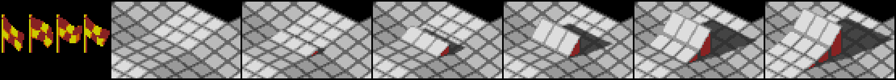

# Marble Madness (Amiga) — disk format and game analysis

A reverse-engineering reference for `Marble_Madness.adf`, the Amiga release of
Marble Madness (disk volume `MarbleMadness!`). This is the first Amiga title in
this repository and the writeup follows the same shape as the C64 games, in
reading order:

* **Part I** — the disk image: the ADF container, the AmigaDOS filesystem on it,
  and the full file inventory — enough to pull every byte off the disk;
* **Part II** — the boot chain: from the boot block through the AmigaDOS
  startup to the game launcher and how the program and its overlays load;
* **Part III** — the game program: the 68000 startup, interrupt/copper setup
  and memory map;
* **Part IV** — graphics and data formats: the per-course level, image, vector
  and audio modules and how they are encoded;
* **Part V** — game mechanics: the marble, the courses, the hazards and enemies,
  scoring and progression.
* **Appendices** — toolchain and reproduction.

Methods: purely static analysis of the disk image, plus the 68000 toolchain
built for it in the shared `tools/` module — the AmigaDOS reader
(`tools/amiga/adf`), the disassemblers (`tools/cmd/dis68k`,
`tools/cmd/codetrace68k`) and an instruction-level 68000 execution core
(`tools/m68k`) for dynamic verification. All addresses are 68000 addresses;
sizes are `.b`/`.w`/`.l` (8/16/32-bit). Parts I–III are complete and Part IV is
under way; Part V is still a stub.

---

## Contents

- [Part I — The disk image](#part-i--the-disk-image)
  - [1. The ADF container](#1-the-adf-container)
  - [2. The AmigaDOS filesystem](#2-the-amigados-filesystem)
  - [3. The disk contents](#3-the-disk-contents)
- [Part II — Boot chain](#part-ii--boot-chain)
  - [1. The boot block](#1-the-boot-block)
  - [2. AmigaDOS startup and the Workbench launch](#2-amigados-startup-and-the-workbench-launch)
  - [3. The launcher](#3-the-launcher)
  - [4. The decryptor (`c/zzz`)](#4-the-decryptor-czzz)
  - [5. The track loader (`c/xxx`)](#5-the-track-loader-cxxx)
- [Part III — Game program architecture](#part-iii--game-program-architecture)
  - [1. The multi-stage load](#1-the-multi-stage-load)
  - [2. The decoder](#2-the-decoder)
  - [3. The copy protection](#3-the-copy-protection)
  - [4. What the static analysis recovers — and where it stops](#4-what-the-static-analysis-recovers--and-where-it-stops)
  - [5. Inside the decrypted program — the code/data split](#5-inside-the-decrypted-program--the-codedata-split)
- [Part IV — Graphics and data formats](#part-iv--graphics-and-data-formats)
  - [1. The splash (boot) screen](#1-the-splash-boot-screen)
  - [2. The Workbench icons](#2-the-workbench-icons)
  - [3. Tile map (`.mlb`)](#3-tile-map-mlb)
  - [4. Obstacles (`.ilb`)](#4-obstacles-ilb)
  - [5. Course layout (`*Track`)](#5-course-layout-track)
- [Part V — Game mechanics](#part-v--game-mechanics)
- [Appendix A — Toolchain and reproduction](#appendix-a--toolchain-and-reproduction)

---

# Part I — The disk image

## 1. The ADF container

An ADF is the simplest possible disk image: a flat dump of the floppy's logical
blocks with no header or metadata. Marble Madness ships on one standard
double-density disk — **1760 blocks of 512 bytes = 901,120 bytes** — so block
*N* is simply the 512 bytes at file offset *N* × 512. The exact copy this
analysis is based on is pinned by size and MD5 in the repository
[README](../README.md#image-files).

## 2. The AmigaDOS filesystem

The disk is formatted with the original AmigaDOS filesystem (**OFS**). The boot
block (blocks 0–1) opens with the 4-byte signature `"DOS\0"`; the trailing zero
is the filesystem-flags byte, and zero means OFS (a `1` would be FFS). The same
header points the root block at **block 880** (`numBlocks / 2` for a DD disk),
and the root block carries the volume name, **`MarbleMadness!`**.

The on-disk structures, all decoded by `tools/amiga/adf`, are the standard
AmigaDOS ones:

- **Directories** (the root and the three subdirectories) store their entries in
  a 72-slot hash table; entries that collide in a slot are threaded through a
  hash-chain field in each header block.
- **File headers** list their data blocks in a table filled from the end of the
  block; a file larger than ~72 blocks continues into *file-extension* blocks.
- **Data blocks**, under OFS, are not raw payload: each 512-byte block begins
  with a 24-byte header (the owning file, a sequence number, the next-block
  link, and a valid-byte count) followed by up to 488 bytes of file data. (FFS
  would store 512 raw bytes per block; this disk does not.)

The boot block itself contains the **standard AmigaDOS boot code**, not a custom
loader: its 68000 fragment references the string `dos.library`, opens it through
an Exec library call and returns its base, which is exactly what an ordinary
bootable AmigaDOS disk does.

## 3. The disk contents

The volume holds **50 files across 3 directories** (`c/`, `s/`, `libs/`). Almost
every file begins with the **`HUNK_HEADER`** magic of an Amiga
loadable object — a relocatable code/data segment that AmigaDOS brings in with
`LoadSeg`. So the game is not one monolithic binary but a launcher plus a main
program plus a large set of per-course overlays, each a hunk file loaded on
demand.

A **hunk file** is the Amiga's relocatable program format, produced by the linker
and loaded by `LoadSeg`. It opens with a header (the `$3F3` magic, then the size
of each segment) and is followed by the segments themselves — `CODE`, `DATA` and
zero-filled `BSS` blocks — each optionally trailed by a 32-bit relocation table.
Because a segment may be placed anywhere in memory, that table lists every
longword inside the segment that holds an address, and `LoadSeg` adds the
segment's real load address to each of them as it brings the file in; the program
is therefore position-independent. The shared reader `tools/amiga/hunk` does the
same — it lays the segments out from a chosen base, applies the relocations, and
returns a flat image that `dis68k`/`codetrace68k` can disassemble.

Two files are exceptions. `c/MarbleMadness!.dat` (the main program) and `c/xxx`
are not plain hunks: after a `$0000_03F3 8F01…` header their contents are
near-random (entropy ≈ 7.95 of 8 bits/byte), i.e. **stored encrypted** and
decrypted at load by the small `c/zzz` helper, as described in part II §4.

**System and boot files** — an ordinary AmigaDOS boot setup:

| file | role |
|------|------|
| `s/startup-sequence` | the boot script (21 bytes): `LoadWb` then `endcli` — it boots to Workbench |
| `c/LoadWb`, `c/EndCLI` | the AmigaDOS CLI commands the script runs |
| `c/splash` | the title/splash screen — an IFF ILBM bitmap (Part IV §1) |
| `c/bootscr` | the boot-screen program (a 50-hunk overlay) that displays the splash (Part II §3) |
| `c/zzz` | the decryptor — decrypts the encrypted files at load (Part II §4) |
| `c/xxx` | the disk fast-loader (encrypted, Part II §5) |
| `c/sigfile` | a disk-signature / copy-protection table (`"DOW"`+incrementing bytes) |
| `libs/icon.library` | bundled so the disk shows icons without the user's Workbench disk |
| `MarbleMadness!.info`, `Disk.info`, `.info` | Workbench icons (`$E310` magic, not hunks) |

**The game program:**

| file | size | role |
|------|------|------|
| `MarbleMadness!` | 5,864 | the launcher executable (started from the Workbench icon) |
| `c/MarbleMadness!.dat` | 175,360 | the main game program — stored encrypted, decrypted at load by `c/zzz` |

**Per-course modules.** The bulk of the disk is six parallel families of files,
one per Marble Madness course, keyed by a short prefix and a type suffix:

| prefix | course | tile map | obstacles | `.vlb` | sound | layout |
|--------|--------|-------|-------|--------|-------|-------|
| `prc` / `practy` | Practice | `practy.mlb` | `practy.ilb` | — | `PrcSnd` | `PrcTrack` |
| `beg` / `beginr` | Beginner | `beginr.mlb` | `beginr.ilb` | `begobsc.vlb` | `BegSnd` | `BegTrack` |
| `int` / `interm` | Intermediate | `interm.mlb` | `interm.ilb` | `intobsc.vlb` | `IntSnd` | `IntTrack` |
| `aer` / `aerial` | Aerial | `aerial.mlb` | `aerial.ilb` | `aerobsc.vlb` | `AerSnd` | `aertrack` |
| `sil` / `silly` | Silly | `silly.mlb` | `silly.ilb` | `silobsc.vlb`, `slink.vlb` | `SilSnd` | `SilTrack` |
| `ult` / `ultima` | Ultimate | `ultima.mlb` | `ultima.ilb` | `ultobsc.vlb` | `UltSnd` | `ulttrack` |

Plus shared assets: `marbdat` / `marbdat.vlb` (the marble), and `birdink.vlb`
and `ooze.vlb` (the creatures). The suffix conventions: `.mlb` is the per-course
**tile map** (Part IV §3) and `.ilb` the **obstacle sprites** (Part IV §4); the
`*Track` files are the per-course **course layout** (actor placements and
animation data, `LoadSeg`'d at course init — Part IV §5), **not** music. The rest
stay **provisional** — `.vlb` moving-object graphics and `*Snd` sound effects.

**Compression and encryption.** Several encodings appear on the disk, decoded in
this writeup where possible. The two executables that matter most —
`c/MarbleMadness!.dat` (the main program) and `c/xxx` — are **encrypted** by a
custom scheme (a shared `$0000_03F3 8F01…` header, contents at ≈ 7.95 of 8
bits/byte — high entropy from the cipher, **not** compression: the bodies are
stored at full size) and decrypted at load by `c/zzz`; reaching the main code
therefore means reversing that decryptor (Part III). The title screen `c/splash` is an IFF ILBM
whose pixels are **ByteRun1 (PackBits)** compressed (Part IV §1). The per-course
tile maps (`.mlb`) and obstacle sprites (`.ilb`) carry the same PackBits packing
(Part IV §3–§4).
`c/sigfile` is not compression but a copy-protection signature table. The
remaining per-course formats (`.mlb`, `.vlb`, `Snd`, `Track`) and whatever
encoding they use are still to be decoded. (The on-disk filesystem also frames
every file in OFS data blocks — a storage layout, not compression — which the
`adf` reader undoes when it extracts the files, Part I §2.)

Putting it together, the boot model is: a standard AmigaDOS disk boots to
Workbench via `startup-sequence`; the player launches the game from the
`MarbleMadness!` icon; the launcher pulls in `c/MarbleMadness!.dat` (the main
program) which then loads each course's `.mlb`/`.ilb`/`.vlb`/`Snd`/`Track`
overlays as the game reaches that course. Tracing that startup is Part II.

---

# Part II — Boot chain

Where the C64 tapes hid a custom fastloader that had to be reverse-engineered
before a single byte could be read, the Amiga disk boots through entirely
**stock AmigaDOS**. The chain is: ROM runs the boot block → the boot block
hands off to `dos.library` → AmigaDOS runs `s/startup-sequence` → Workbench
comes up → the player launches the game from its icon → a small compiled
launcher pulls the game in with `LoadSeg`. Each link is a standard mechanism;
the only game-specific code is the launcher.

## 1. The boot block

Blocks 0–1 are the boot block: the `"DOS\0"` signature, a checksum longword, the
root-block pointer (880), and then a short 68000 routine. Disassembled, it is the
**unmodified AmigaDOS 1.x boot code**:

```
0000: 43FA 0018     LEA   dosName(pc),a1     ; a1 -> "dos.library"
0004: 4EAE FFA0     JSR   -$60(a6)           ; FindResident()   (a6 = ExecBase)
0008: 4A80          TST.l d0
000A: 670A          BEQ   fail
000C: 2040          MOVEA.l d0,a0             ; a0 = the Resident node
000E: 2068 0016     MOVEA.l $16(a0),a0        ; a0 = rt_Init  (DOS boot entry)
0012: 7000          MOVEQ #0,d0               ; d0 = 0  -> success
0014: 4E75          RTS
fail:
0016: 70FF          MOVEQ #-1,d0
0018: 60FA          BRA   $0014
001A: "dos.library",0
```

It calls Exec's `FindResident` (LVO `-$60`) to locate the resident `dos.library`,
reads its `rt_Init` field (offset `$16` of the Resident node — the DOS boot
point) into `a0`, and returns success. The ROM then calls that boot point to
bring DOS up. There is no decryption, no custom track format, no game code here
at all — exactly the standard bootstrap, which is why an ADF reader plus stock
AmigaDOS knowledge is enough to get at everything (Part I).

## 2. AmigaDOS startup and the Workbench launch

Once DOS is running it mounts the volume and executes the boot script
`s/startup-sequence`, which is just two lines:

```
LoadWb
endcli > nil:
```

`LoadWb` starts Workbench; `endcli` closes the boot shell. Workbench here is the
Amiga's desktop GUI — and it is not a single program but a service of the
operating system: the windowing, menu and gadget machinery (`intuition.library`,
`graphics.library`, and the kernel `exec`) lives in the Kickstart **ROM**, and
`LoadWb` is just the small command that brings the desktop up on top of those ROM
libraries. The disk itself carries no Workbench binary; the only GUI pieces it
bundles are `libs/icon.library` (which draws icons) and the `.info` files, so that
it can show its own window and icons even on a bare machine without the user's
Workbench floppy. The game is then launched the Workbench way — by double-clicking
the **`MarbleMadness!`** icon, which is a *tool* icon (icon type 3), so Workbench
`LoadSeg`s and runs the `MarbleMadness!` program directly.

## 3. The launcher

`MarbleMadness!` is a small (5,864-byte) compiled program — 23 hunks, with a
`HUNK_SYMBOL` table left in. Its entry point is a standard C-runtime startup that
works out how it was launched:

```
MOVEM.l d3-d7/a0-a6,-(a7)     ; save registers
MOVE.l  a7,$1C.l              ; stash the stack pointer
MOVE.l  d0,$24.l / a0,$28.l   ; CLI argument length / pointer (0 from Workbench)
MOVEA.l $4.l,a6               ; a6 = ExecBase (AbsExecBase at $0000.0004)
SUBA.l  a1,a1
JSR     -$126(a6)             ; FindTask(0) -> our task
MOVEA.l d0,a4
TST.l   $AC(a4)               ; Process.pr_CLI : zero => launched from Workbench
BEQ     wbStartup             ; …which is the path taken here
```

The `pr_CLI` test (`$AC`) is the textbook Workbench-vs-CLI check, and because the
game is started from its icon it takes the Workbench branch and collects the
`WBStartup` message.

What the launcher then does is read off its symbol table and data hunk rather
than guessed: the symbols name the exact library entry points it links against —
from `dos.library` `_LoadSeg` / `_UnLoadSeg` / `_Lock` / `_CurrentDir` /
`_Input` / `_Output`, and from `exec.library` `_AllocMem` / `_FreeMem` /
`_FindTask` / `_CreatePort` / `_DeletePort` / `_PutMsg` / `_GetMsg` — so it
allocates memory, sets up message ports, and brings program segments in with
`LoadSeg`. Its data hunk holds the asset names it pulls from the `c/` directory:

| asset | what it is |
|-------|------------|
| `c/splash` | the title/splash screen — an IFF `FORM…ILBM` image |
| `c/bootscr` | a boot screen (hunk object) |
| `c/xxx` | opaque, high-entropy data (likely packed) |
| `c/zzz` | a second small compiled stage (also links `dos.library`) |

So the launcher displays the splash and then uses `LoadSeg` to load the game
proper. The main program is `c/MarbleMadness!.dat` — the 175 KB hunk from Part I —
with `c/zzz` and `c/xxx` as supporting loader/data pieces. Every loadable element,
the launcher included, is an ordinary Amiga hunk object brought in through
`LoadSeg`, which is the same mechanism the running game later uses to stream its
per-course overlays (Parts III–IV).

Tracing the launcher's own code confirms the shape. Loaded into a flat, relocated
image by `tools/amiga/hunk` (whose symbol-table support labels the library stubs
the linker left in the file) and traced with `codetrace68k`, the C-runtime
startup takes the Workbench branch shown above and calls `main`. `main` then
parses the `WBStartup` message, uses its lock to `CurrentDir` into the program's
own drawer, creates a reply port, and proceeds to bring the game in. Because the
game's main file is *encrypted* (Part I §3), that load does not go through plain
`LoadSeg` — it goes through `c/zzz`, the subject of §4.

The full annotated disassembly is in
[`disasm/MarbleMadness.asm`](disasm/MarbleMadness.asm) (with the names and notes
in [`disasm/MarbleMadness.annotations.txt`](disasm/MarbleMadness.annotations.txt)). The boot-screen path is
worth following concretely, because `c/bootscr` is one of the unencrypted hunks
and so loads the ordinary way:

```
LoadSeg("c/bootscr")            ; -> seglist; bail to exit(1) if it fails
Lock("c/splash", ACCESS_READ)   ; does the splash file exist?
  if present:  run bootscr(seglist, 1, "c/splash")        ; paint the splash
  else:        run bootscr(seglist, 1, "lo-res/paintcan") ; fallback image
…                               ; (decrypt/stream the game meanwhile)
run bootscr(seglist, 0, 0)      ; tear the boot screen back down
UnLoadSeg(bootscr)
```

`c/bootscr` is thus a small overlay that the launcher `LoadSeg`s, *runs* via the
seglist-call thunk `call_seglist` (which converts the `LoadSeg` BPTR to an address
and `JSR`s into the first hunk with `d0`/`a0` arguments) — handing it the image
filename so the overlay loads the IFF and displays it — and then runs once more
with `(0, 0)` to dismiss it before `UnLoadSeg`ing it. The same `call_seglist`
thunk is how `c/zzz` and the decrypted `c/xxx` are entered.

One detail is worth pinning down because it looks suspicious: the launcher binary
**also** carries a complete copy of `c/zzz`'s decrypt engine — the key-table
builder, the keystream generator and the vector-keyed protection of Part III. The
copy is the *same compiled code* (the keystream generator, for instance, is
byte-identical to `c/zzz`'s but for the 15 bytes of its three relocated global
pointers). It is tempting to wonder whether the disk `c/zzz` is leftover junk and
this embedded copy is what runs — but it is the other way round. The embedded
decrypt engine is **dead code**: a scan of the whole binary finds *zero*
control-flow references into it. The launcher does the real decryption by
`LoadSeg`-ing `c/zzz` from disk and `JSR`-ing into it (twice — to decrypt `c/xxx`,
then to bring the game in — before `UnLoadSeg`-ing it). What drags the dead engine
in is one routine main genuinely uses, `checksum_seglist`: it EOR-folds the
decrypted `c/xxx`'s hunks into a 16-bit checksum and feeds that into the key array
for the next decrypt — so tampering with `c/xxx` corrupts the key, a small
integrity chain. That checksum routine sits in the same linker object module as
the decrypt engine, so the linker pulled the whole module in even though only the
checksum is called.

## 4. The decryptor (`c/zzz`)

`c/MarbleMadness!.dat` and `c/xxx` are not plain hunks — they are encrypted
(Part I §3), so AmigaDOS's own `LoadSeg` cannot read them. `c/zzz` is the small
program that can: a custom **decrypting `LoadSeg` replacement**. It
is itself a clean hunk, so the hunk loader and `codetrace68k` read it directly,
and its `HUNK_SYMBOL` table even names the system calls it uses — `_Open`,
`_Read`, `_Close`, `_AllocMem`, `_FreeMem`, `_FindTask`. Its flow, from the
disassembly:

- It `_Open`s the packed file and `_AllocMem`s a 512-byte read buffer (it streams
  the input in `$200`-byte blocks) plus a small work buffer.
- A buffered longword reader feeds a core loop that treats the *decoded* stream as
  an ordinary hunk file: it reads a longword, masks off the top two bits
  (`ANDI.l #$3FFFFFFF`), subtracts `$3E7` (`HUNK_UNIT`, the first hunk-block id),
  range-checks it against the 16 block types, and dispatches through a jump table
  — `JMP $2(pc,d0.l)` at `$3DE`. So each `CODE`/`DATA`/`BSS`/`RELOC32`/…/`END`
  block is handled by its own arm exactly as `LoadSeg` would, producing a normal
  relocated segment list (the `ANDI.l #$3FFFFFFF` on the hunk sizes at `$B62` is
  the header pass).
- The decoding is a **keystream XOR**, not compression — the bodies are stored at
  full size; the high entropy is encryption. A 55-entry table is built from the
  seed `$57319753` by a ×31 hash (`sub_BEC`, `sub_D06`); the stream is then an
  additive lagged-Fibonacci generator over that table (`sub_$EAC`). On top of that
  sits a copy-protection routine (`sub_DAA`) that perturbs the table from the
  host's **CPU exception/TRAP vector table** — so the decryption is bound to
  machine state, not just the disk. Part III §2–3 reverses this in full.

So `c/zzz` is where the real game reaches memory: it reads the encrypted `.dat`,
undoes the keyed XOR, relocates the hunks, and hands the loaded segments back to
the launcher, which runs them. Reproducing it as a standalone unpacker — the
prerequisite for disassembling the main game — is the subject of Part III, which
also explains why the copy protection stops a purely static unpack short. The
full annotated disassembly is in [`disasm/zzz.asm`](disasm/zzz.asm)
([`zzz.annotations.txt`](disasm/zzz.annotations.txt)).

## 5. The track loader (`c/xxx`)

Once `c/zzz` is reproduced (Part III) the second-stage file `c/xxx` can be
decrypted and disassembled. Decrypted it is **a small compiled-C program whose
job is to be a custom floppy *track loader* — a "fast loader"** — and it turns
out to be the most interesting piece of code on the disk.

`c/xxx` does **not** read its data through AmigaDOS or even through
`trackdisk.device`'s normal commands. It opens only `dos.library` (for the
allocation/exit plumbing), `FindTask`s itself, then **drives the floppy hardware
directly**:

* **CIA-B PRB (`$BFD100`)** — the drive control port: motor on/off, `/SEL0`
  drive-select, `/SIDE`, and the `/STEP`/`DIR` lines. `seek_track0` ($6055E)
  pulses `/STEP` here to recalibrate the head.
* **CIA-A PRA (`$BFE001`)** — the drive-status inputs: `/RDY`, `/TK0` (track 0),
  `/WPRO`, `/CHNG`. The loader polls these to know when a seek is done and the
  disk is ready, and CIA-A DDRA (`$BFE201`) is set up for them in `disk_hw_init`
  ($6046E).
* **Paula disk DMA (`$DFF000` base)** — `dma_setup` ($6050C) programs `DMACON`
  (`$DFF09A`) and `ADKCON` (`$DFF09E`) for MFM/word-sync mode, and `read_track`
  ($607CA) points `DSKPT` (`$DFF020`) at a track buffer and writes `DSKLEN`
  (`$DFF024`) `= (len/2)|$8000` **twice** — the canonical Amiga "arm disk DMA"
  sequence — to pull a full **`$36F2` (14 066) byte raw MFM track** in one DMA
  burst (with a 200 000-iteration timeout and a `DSKBLK` clear on `INTREQ`).

So `c/xxx` reads raw MFM straight off the platter and decodes it in the CPU,
bypassing the filesystem entirely. That is a classic fast-loader/streaming
design (and a copy-protection hook: a custom track reader can require
non-standard track formats a file copier won't reproduce). Its `main` first
`AllocMem`s the load area sized from the control block the launcher passes, then
`load_session` ($603A2) allocates the `$38`-byte IO struct plus a 512-byte CHIP
sector buffer and walks the track reads. The full annotated disassembly is in
[`disasm/cxxx.asm`](disasm/cxxx.asm)
([`cxxx.annotations.txt`](disasm/cxxx.annotations.txt)); it is produced by the
pure-Go reimplementation of the `c/zzz` decode in
[`extract/cmd/decode`](extract/cmd/decode), which turns the encrypted `c/xxx`
back into a clean 22-hunk AmigaDOS object — using the `c/zzz` copy-protection
inputs captured live from a Kickstart 1.2 machine (the values that defeated a
purely static unpack in Part III §4; the capture method is noted there).

**It loads by physical position, not by name — and that resolves an apparent
paradox.** `c/MarbleMadness!.dat` shows up as an ordinary 175 KB file in the
disk's directory, yet the loader reads tracks, not files. Following the two
through reconciles them. First, the whole disk is a normal AmigaDOS OFS volume:
all 1760 blocks belong to the 50 catalogued files (1661 are OFS data blocks; the
rest are the boot block, 50 file headers, three directories, the root and the
bitmap). There is **no hidden raw region** — whatever the loader reads, it is
reading the filesystem's own sectors. Second, the `.dat` is genuinely one of
those files: following its OFS data-block chain, its 360 data blocks occupy a
near-contiguous physical band at blocks ~1023–1396, i.e. **physical tracks
~93–126**, each block a standard 512-byte sector (24-byte OFS header + 488 bytes
of the encrypted payload; the first block's payload begins `00 00 03 F3 8F 01`,
the packer signature). Third — the clincher — the launcher's *entire* string
table names only `c/zzz`, `c/xxx`, `c/bootscr`, `c/splash` and
`lo-res/paintcan`: **the string `c/MarbleMadness!.dat` does not appear anywhere
in the launcher.** The main program is never opened by name. It is reached purely
by *physical track and sector position* by `c/xxx`, which reimplements
`trackdisk.device`'s read path from scratch — whole-track Paula DMA, find the
`$4489` sync, MFM-decode, and validate each sector's standard `[$FF, track,
sector<11, sectors-to-gap]` header (it even carries the `"trackdisk.device"`
string and an `IORequest` builder as a fallback path). So the loader is *not*
reading data we haven't seen; it is reading the `.dat`'s own bytes off the
platter by location. The `.dat` exists as a DOS file so the disk stays a valid,
bootable AmigaDOS volume and so those blocks are reserved and laid down
contiguously; it is read by position for speed (whole-track DMA beats per-sector
OS reads) and as a copy-protection hook (a from-scratch reader can demand
non-standard formatting, and reading by position bypasses file-level tampering —
reinforced by the `c/xxx` checksum integrity chain of Part II §3).

---

# Part III — Game program architecture

The main program (`c/MarbleMadness!.dat`) and the second-stage loader (`c/xxx`)
are encrypted, so reaching the game's own 68000 code means getting through
`c/zzz`'s decoder (Part II §4) and the copy protection wrapped around it. This
part reverses both completely. The protection binds the key to machine state that
is not on the disk — and §4 documents exactly where a purely disk-only static
attack stops and why. That wall is then cleared in two steps (§4 updates): the
~25 bytes of copy-protection input are read once off a real Kickstart, and the
`.dat`'s count-20 key array is reverse-engineered from the decrypted `c/xxx`.
**Both `c/xxx` and the 150 KB `c/MarbleMadness!.dat` are now fully decrypted**, so
the game body — and the startup/copper/blitter detail inside it — is open for
Parts IV–V.

## 1. The multi-stage load

The launcher (Part II §3) does not load the game in one step. From its
disassembly the sequence is:

1. `LoadSeg` `c/zzz` (a clean hunk).
2. Call `c/zzz` through the seglist-call thunk at `$50A10` — which converts the
   `LoadSeg` BPTR to an address and jumps in with `d0` = a control block and
   `a0` = a filename — to decrypt **`c/xxx`**. The control block here has its
   key-array count set to **0**.
3. The decrypted `c/xxx` seglist is then *run as code*: it is the real
   second-stage loader — the from-scratch floppy track reader of Part II §5. It
   pulls the 175 KB main program off the disk by **physical position** (the
   `.dat` is never opened by name), into a buffer recorded in the shared control
   block.
4. The launcher mutates that control block's key array — count becomes `$14`
   (20 longwords), each XORed with the `c/xxx` checksum (the integrity chain) —
   and runs **`c/zzz` a second time** to *decrypt* the loaded program with that
   count-20 key. The two stages cooperate through the shared control block:
   `c/xxx` is the fast raw reader, `c/zzz` is the decryptor.

So the chain is launcher → (`c/zzz` decrypts `c/xxx`) → (`c/xxx` reads the main
program by track) → (`c/zzz` decrypts it), with the key array changing between
the two `c/zzz` passes. The first pass — `c/xxx` with an empty key array — is the
one this part can read; the second needs the count-20 key (§4).

## 2. The decoder

`c/zzz`'s `LoadSeg` replacement, fully reversed. Its entry point (hunk 0) saves
`d0`→control block and `a0`→filename, opens a library, and calls `main`
(`$400B4`); `main` calls the key setup (`sub_$D06`), then the decode-and-load
(`sub_$2C8`), then frees the table.

**Key setup** (`sub_$D06`): `_AllocMem` 220 bytes; `sub_BEC` seeds a 55-entry
table — `table[0] = $57319753`, `table[i] = table[i-1] × 31 + i` (mod 2³²) — then
XORs in the caller's key array (the launcher's, `count` longwords), then runs the
protection (§3), and records the pointers (`$40EA0/4/8`) the generator reads.

The on-disk format is the key to reading it: a **standard AmigaDOS hunk with
selective encryption**.

- The first longword (`$000003F3`, `HUNK_HEADER`) and every hunk-block **type**
  marker — `$3E9` `CODE`, `$3EA` `DATA`, `$3EB` `BSS`, `$3EC` `RELOC32`, `$3F0`
  `SYMBOL`, `$3F2` `END` — are stored in **plaintext** (read raw, bypassing the
  keystream).
- `SYMBOL`-block symbol **names** are plaintext too — `_AllocMem`, `_FreeMem`,
  `_FindTask`, … sit there as readable ASCII inside the "encrypted" file.
- Everything else — hunk sizes, the relocation tables, and the `CODE`/`DATA`
  bodies — is XORed with the keystream, one keystream longword per stored
  longword, in file order.

There is **no compression**. The bodies occupy their full size on disk; the
apparent size mismatch with the header's hunk table is simply the `BSS` hunks,
which carry a size but no data. The ≈7.95 bits/byte entropy is the encryption,
not packing — which is why `c/zzz` is a *decryptor*, not a decruncher, despite
the packer-like `$0000_03F3 8F01…` header.

The keystream (`sub_$EAC`) is an **additive lagged-Fibonacci generator** over the
table: two indices `p` (start 0) and `q` (start 27); each call does
`table[p] += table[q]; p += 1; q += 2` (both mod 55) and returns the updated
`table[p]`. Being purely additive, the **low byte of every output is a linear
function (mod 256) of the table's low bytes** — the lever §4 pulls.

`extract/cmd/unpack` runs this real code on the `tools/m68k` core, trapping the
six AmigaDOS/Exec stubs and streaming the packed bytes through `_Read`. It
reproduces the keystream bit-exact (verified against an independent generator)
and decodes the header cleanly: `c/xxx` is a `HUNK_HEADER` with **22 hunks**
(`first_hunk = 0`, `last_hunk = 21`) followed by its size/flags table.

## 3. The copy protection

The teeth are in `sub_DAA`, run during key setup. After `sub_BEC` seeds the
table, `sub_DAA` folds bytes from two pieces of **live machine state** into
specific table entries.

From the host's **CPU exception/TRAP vector table** (absolute low memory, the
68000 vectors at `$0`–`$3FF`):

- `$8,$C,…,$20` → table entries 10–16; `$28`–`$38` → entries 10–14 again;
  `$80`–`$BC`, the 16 `TRAP` vectors → entries 32–47;
- from each vector it extracts `(vector >> 16) & 0xFF` (the byte-extractor
  `sub_D92`: `ASR.l #16` then mask) and XORs it into the table entry.

Then from the **running task** (`_FindTask` is called for exactly this — its
result is *not* unused): it reads the task's `tc_ExceptCode` (`$2A(task)`) and
`tc_TrapCode` (`$32(task)`) handler pointers, takes `(ptr >> 16) & 0xFF` of each
(the second further `ASR.l #4`), and XORs them into **table entries 30 and 31**
(`$78`/`$7C` of the buffer). So 25 of the 55 entries are perturbed — 23 from the
vector table, and entries 30/31 from the task's two handler pointers. Those
pointers are *fields read from the running process*, which only exists once
AmigaDOS has created it — they are not on the disk and not present at ROM
cold-start.

Because those entries feed the lagged-Fibonacci generator, **the keystream past
its first stretch depends on the vector table and the task structure**. The
header and the first hunk decode regardless — their keystream words are drawn
before the perturbed entries propagate — which is exactly why the structure
stays legible while the bodies scramble.

What is in those vectors? Booting `kick12.rom` on the same 68000 core
(`extract/cmd/bootrom`) shows that at Kickstart 1.x **cold-start** every
exception/TRAP vector points at a single ROM handler, `$00FC05B4`, so
`(vector>>16)&0xFF` is a uniform **`$FC`** — the `$FC0000` ROM page. Kickstart
2.0+ moved the ROM to `$F80000` (byte `$F8`), so the protection is implicitly
tied to the 1.x ROM layout. That is both ordinary for a 1986 title and a clean
explanation of why such games are Kickstart-version-locked: the decryption key
*is* the ROM page.

The early guess was that AmigaDOS would have redirected those vectors away from
the ROM by decode time, making the key a piece of deep runtime state. The live
capture in §4 shows it does **not**: AmigaDOS leaves the `$8`–`$BC` CPU
exception/TRAP vectors at their ROM handlers, so at decode time every one of them
still reads page `$FC` — the same uniform value as cold-start. The vector table
is therefore **not** the runtime differentiator; it is simply the ROM page, and
the protection is thereby **Kickstart-1.x-locked** (a 2.0+ ROM at `$F8` would key
differently).

The part that genuinely is not on the disk — and not available from the ROM
alone — is entries 30/31: the launcher process's `tc_ExceptCode`/`tc_TrapCode`,
which exec only fills in when it *creates* the process. For this launcher those
default handlers are themselves ROM addresses (captured pages `$FC` and `$FF`,
§4), so the whole key is ultimately ROM-derived — but reading the task fields
requires a booted AmigaDOS with the process actually constructed, which is the
state a purely static unpack cannot manufacture.

One could hope the launcher closes that gap by *installing* its own handlers
before it invokes `c/zzz` — which would put the key values back on the disk. It
does not. The launcher's full disassembly (Part II §3) shows no write to the
`$8`–`$BC` vector region, no `tc_ExceptCode`/`tc_TrapCode` write, and none of the
calls that would install a handler (`Supervisor`, `SetIntVector`, `AddIntServer`,
`SetFunction`); the only references to those task fields anywhere in the binary
are *reads*, inside the dead embedded copy of the engine. So the launcher inherits
the vector table from booted AmigaDOS and hands it, untouched, to the decoder —
the protection's inputs are produced by the running OS, not the disk.

Running the launcher confirms it dynamically. `extract/cmd/runlauncher` executes
the real `MarbleMadness!` on the m68k core in a faked Workbench environment —
trapping the dos/exec calls, serving files and `LoadSeg` out of the ADF — and it
faithfully walks the load chain: open `dos.library`, take the `WBStartup`
message, `LoadSeg` `c/zzz`, and run it on `c/xxx`. c/zzz streams the whole 6 116-
byte file, decrypts the header, and `AllocMem`s all twenty-two of `c/xxx`'s hunks
at sizes that match the static decode to the byte (3 296 = 822×4+8, 1 016 =
252×4+8, …). Then — with the exception vectors sitting at zero, exactly as the
launcher left them — the body decode loses the stream and the decryptor spins.
The header decodes, the bodies do not: the live OS state is the missing key, and
nothing on the disk supplies it.

## 4. What the static analysis recovers — and where it stops

Recovered from the disk alone:

- the complete decode and protection mechanism above;
- `c/xxx`'s shape — a 22-hunk, exec-heavy second-stage loader. Its plaintext
  `SYMBOL` blocks name the calls it imports: `_AllocMem`, `_FreeMem`,
  `_FindTask`, `_AllocSignal`, `_FreeSignal`, `_AddPort`, `_RemPort`,
  `_OpenDevice`, `_DoIO` — a loader that allocates memory and signals, makes a
  message port, and talks to a device (the disk) to stream the game in;
- the `.dat`'s own `HUNK_HEADER` (hunk count and sizes), which decodes the same
  way once its key array is supplied.

Not recovered *by a disk-only static attack* — the bodies (the updates below
then clear this). Two independent attacks were pushed to their limits:

1. **Known-plaintext linear algebra.** The keystream's low byte is linear
   (mod 256) in the 25 protection-perturbed table bytes; the plaintext structure
   (type markers, symbol names, marker-derived hunk sizes, the `0` that
   terminates every `RELOC32` block) yields known keystream values at indices
   that are themselves computable from the marker layout. But only ~14 of those
   equations fall in the region with reliable indices, against 25 unknowns —
   underdetermined.
2. **The vector table from the ROM alone.** Booting `kick12.rom` on the minimal
   core supplies the `$8`–`$BC` vector pages (uniform `$FC`), which decode
   `c/xxx`'s first few hunks — but the decode then loses the stream, because two
   of the 25 perturbed entries (30/31) come from the launcher process's
   `tc_ExceptCode`/`tc_TrapCode`, and at ROM cold-start no such process exists
   yet to read them from. Reproducing the key means booting all the way to a
   constructed AmigaDOS process, not just running the ROM — which the minimal
   CPU core cannot do (it has no AmigaDOS). (The vectors themselves were never
   the obstacle: they stay `$FC` from cold-start through decode time, §3.)

So the protection meets its goal against a static unpack: the payload's
decryption is bound to machine state the disk does not contain — the Kickstart
1.x ROM (via the exception-vector pages) *and*, the true wall, the launcher
process's `tc_ExceptCode`/`tc_TrapCode`, which only exist once AmigaDOS has
constructed the process. The mechanism is wholly understood; the bytes stay
gated behind a running, booted Amiga of the right vintage.

**Update — the gate, opened.** Rather than emulate the full boot in the minimal
core, the missing machine state was read off a real **Kickstart 1.2** under a
GDB-controllable FS-UAE build (the shared Amiga debugger
[`tools/amiga/fsuae-debug/`](../tools/amiga/fsuae-debug); the game-specific
capture scripts are in [`tools/fsuae-debug/`](tools/fsuae-debug)). A CLI auto-run
disk (`modadf.go` rewrites the `s/startup-sequence` in place and
fixes the OFS block checksum) boots straight to the decrypt, and the launcher
runs as the `Initial CLI` task — so its `FindTask(0)` `tc_ExceptCode`/`tc_TrapCode`
read directly off the live task *are* the values `sub_DAA` folds in. The captured
inputs are uniform: **every CPU exception/TRAP vector page byte `$FC`**, launcher
`tc_ExceptCode` page `$FC`, `tc_TrapCode` page `$FF`. With those baked in, a
**pure-Go reimplementation** ([`extract/cmd/decode`](extract/cmd/decode)) — seed
table → key-array XOR → `sub_DAA` perturbation → lagged-Fibonacci keystream →
structure-aware field/body decrypt — turns `c/xxx` (empty key array) into a clean
22-hunk object, verified by the hunk loader applying every `RELOC32` and by the
key array deriving to all-zeros against the known header plaintext. `c/xxx`
proves to be the disk's fast loader (Part II §5).

**Update — the `.dat` decrypted, statically, no second capture needed.** The
main program uses the *same* decode but with a 20-long key array, and recovering
that key array turned out not to need a debugger at all — only the decrypted
`c/xxx` and a 16-bit brute force. The key array is **built by `c/xxx` itself**:
running as the loader, its `run_loader` fills the 20-longword `ctrl->C` buffer
(which then *becomes* the key array for the second `c/zzz` pass) with
`base[i] = datalen / ((i+1) × 300)` — a multiply (`$61248`) then a divide
(`$61204`) over a load-length the loader clamps to ≈1500, giving the small,
non-uniform vector `[4, 2, 1, 1, 0, 0, …]`. The launcher then mutates it in
place, `key[i] ^= C`, where `C` is the 16-bit `checksum_seglist(c/xxx)` integrity
constant (Part II §3). So the only unknown is that single 16-bit `C`: brute it
against a valid-hunk check (`decode -brute -count 20`) and it falls out as
**`C = $CDDA`**. With `key[i] = base[i] ^ $CDDA` and the same captured protection
bytes, `c/MarbleMadness!.dat` decodes to a clean **347-segment, 150 KB** hunk
object — every `RELOC32` applies, the entry hunk disassembles to the textbook
C-runtime startup (`FindTask`, the `pr_CLI`/`$AC` WB-vs-CLI check), and the body
carries the game's own text: `THE ULTIMATE RACE!`, `SCORE:`, the six
`… RACE:` course banners, `GAME OVER`, `RED PLAYER` / `BLUE PLAYER`. The encrypted
game body is open. (Reproduce with `decode -count 20 -datalen 1200 -keyconst
0xCDDA`; both decrypted hunks are written to `extracted/` for analysis. The
captured copy-protection bytes were still needed — they are shared by both
passes — but the count-20 key array itself was reverse-engineered, not captured.)

## 5. Inside the decrypted program — the code/data split

With the body open, the first question is what 150 KB of program actually
contains, and how to separate code from data for analysis. The answer is built
in: the `.dat` is a **stripped AmigaDOS hunk load file**, and the hunk *tags* are
the split. It is **not** linked down to a few merged hunks — each object module
kept its own `CODE`/`DATA`/`BSS` triple, so the file is **347 hunks** (≈115
modules), with no `SYMBOL` or `DEBUG` blocks (routines are unnamed, as in
`c/xxx`). By kind:

| Kind | Hunks | Bytes | What it is |
|------|------:|------:|------------|
| `CODE` | 133 | ~117 KB | the engine — the overwhelming majority |
| `DATA` | 109 | ~24 KB | tables, text, and zero-initialised globals |
| `BSS`  | 105 | ~5.6 KB | uninitialised working storage (no file bytes) |

So the surprise is that the file really **is** mostly code. That is consistent
with the rest of the disk, not at odds with it: the bitmaps and samples live in
separate files (`.ilb`/`.vlb` sprite banks, `Snd`, `Track` — Part I §3), so the
program carries **no pixel or sample data** — only the engine that drives them.
And it drives them at the metal: the code writes the full **blitter** register
block (`$DFF040`–`$DFF066`) and `DMACON` (`$DFF096`) directly and reads
`JOYxDAT` for the trackball/joystick, so rendering is hand-rolled blitting, not a
library call.

The ~24 KB of `DATA` is smaller than it looks: roughly **16 KB is zero** —
working arrays the compiler emitted into `DATA` rather than `BSS` (one hunk is
7 352 bytes with *two* non-zero bytes; another is 7 188 bytes at 99 % zero). The
remaining ~8 KB is the real payload, and it is exactly what an engine-without-
assets would hold:

- **UI text** — `THE ULTIMATE RACE!`, `SCORE:`, `CONGRATULATIONS!`, `TOTAL`,
  `GO!`, `Difficulty:`, `GAME OVER`, `RED PLAYER` / `BLUE PLAYER`, and the six
  course banners (`PRACTICE`/`BEGINNER`/`INTERMEDIATE`/`AERIAL`/`SILLY`/`ULTIMATE
  RACE:`);
- **the level filenames** — `Practy.mlb`, `Beginr.mlb`, `Interm.mlb`,
  `Aerial.mlb`, `Silly.mlb`, … — i.e. the engine names and loads the per-course
  `.mlb` level modules at run time (the file-vs-track loading of Part II §5);
- **small lookup tables** — offset/coordinate/sine-like runs and a few pointer
  tables, the rest of the `DATA` hunks.

Cleanly splitting it for further work needs no extra tooling: `hunkload` prints
the per-hunk map (kind, address, size) — that *is* the code/data manifest — and
`codetrace68k`, seeded with every `CODE`-hunk base as an entry point, follows the
control flow and classifies reached bytes as code and the rest as data. A first
pass reaches **~91 KB of code in 393 routines**; the remaining ~28 KB of `CODE`
sits behind 11 indirect jump tables that need `-table` hints to resolve — the
starting point for the mechanics analysis of Part V.

```sh
# split + first-pass disassembly of the decrypted engine
go run stupidcoder.com/tools/amiga/cmd/hunkload -base 0 \
    extracted/c_MarbleMadness.dat.decrypted.hunk            # the hunk/code-data map
go run stupidcoder.com/tools/amiga/cmd/hunkload -base 0 -o /tmp/dat.bin \
    extracted/c_MarbleMadness.dat.decrypted.hunk            # flat relocated image
# -entry = every CODE-hunk base from the map above
go run stupidcoder.com/tools/cmd/codetrace68k -base 0 -entry <CODE-hunk bases> /tmp/dat.bin
```

---

# Part IV — Graphics and data formats

The boot-time graphics use standard Amiga formats the toolchain already reads end
to end — the title splash (§1) and the Workbench icons (§2). §3–§5 turn to the
game's own per-course formats: the **tile map** (`.mlb`, §3), the **obstacle
sprites** (`.ilb`, §4) and the **course layout** (`*Track`, §5). The `.mlb` and
`.ilb` pixel data share one **ByteRun1/PackBits** codec, identified from the
decrypted engine; the `*Track` is a plain `LoadSeg`'d hunk module. The remaining
per-course modules — the `.vlb` moving-object banks and the `*Snd` sound — are
still to be decoded.

## 1. The splash (boot) screen

The boot/title screen the player sees is `c/splash`, stored as a standard **IFF
`FORM…ILBM`** bitmap (the Amiga's usual image format). Its `BMHD` describes a
**320×200, 4-bitplane (16-colour)** image; the `BODY` is **ByteRun1 (PackBits)
compressed**; a `CMAP` chunk carries the 16-colour palette; and four `CRNG`
chunks define colour-cycling ranges, so parts of the logo animate on the real
machine. The decoder `tools/amiga/iff` parses those chunks, unpacks the BODY,
de-interleaves the four bitplanes into colour indices and looks them up in the
CMAP:


Decoding it also recovers the on-disk attribution that the screen displays: the
Amiga conversion is credited to **Larry Reed**, under **© 1984, 1986 Atari Games
Corp. & Electronic Arts** — facts read straight out of the image, not from any
outside source.

The image is the *data*; `c/bootscr` is the *code* that puts it on screen. The
launcher (Part II) `LoadSeg`s both, and `c/bootscr` is the overlay that displays
this splash at boot — it is a 50-hunk compiled program (its first hunk is
`HUNK_CODE`), not a second picture, which is why there is one bitmap here, not
two. `c/bootscr` keeps its full `HUNK_SYMBOL` table, so its annotated
disassembly ([`disasm/bootscr.asm`](disasm/bootscr.asm)) reads almost like
source: it is built from the **EA IFF reader** (`_GetFoILBM`, `_GetBODY`,
`_UnPackRow` = ByteRun1), a **trackdisk mini-filesystem** that reads the disk's
sectors directly (`_MFOpen`/`ReadSecs`/`_MGetDir`), and **graphics.library**
display setup (`_MakeVPort`/`_LoadRGB4`/`_LoadView`). (A loose end alongside
them, `c/sigfile`, is not graphics either: it is a short table of
`"DOW"`+incrementing-byte entries, a disk-signature / copy-protection artefact.)

## 2. The Workbench icons

The `.info` files are standard Workbench icons: a `DiskObject` header (`$E310`
magic) followed by one or two planar `Image` structures. Icons carry no palette
of their own — they are drawn in the Workbench screen pens — so `tools/amiga/icon`
renders them with the standard Workbench 1.x four-colour palette (pen 0 blue,
1 white, 2 black, 3 orange). They are also authored for the hi-res Workbench
screen, whose pixels are about twice as tall as wide, so the renders below are
scaled 2× vertically to restore the intended aspect.

`MarbleMadness!.info` (the icon the player double-clicks, Part II) is a **64×29,
2-plane** image — the marble: a dark sphere with a white specular highlight.


`Disk.info` is the **32×16** disk icon — the familiar white floppy with an orange
label.


## 3. Tile map (`.mlb`)

Each course's floor, walls and railings — everything the marble rolls on — are a
**tile map** held in its `.mlb` ("map library") file: `practy.mlb`, `beginr.mlb`,
… one per course. The whole file is a single **ByteRun1 / PackBits** stream (the
same RLE as IFF ILBM bodies; signed control byte *n*: `0..127` copies *n*+1 literal
bytes, `-1..-127` repeats the next byte `1−n` times, `-128` is a no-op). The loader
(`$7F38`) expands the entire file into a work buffer and relocates the plane and
tilemap pointers in its header; the tile blitter (`$9910` → `$99C0`) then paints
the course.

**Memory map** of the unpacked `practy.mlb` work buffer:

| Offset | Field | Practice value |
|---|---|---|
| `+0x00` word | course height (tile rows) | `0x004B` (75) |
| `+0x02` long | plane-0 offset | `0x000036` |
| `+0x06` long | plane-1 offset | `0x0019A6` |
| `+0x0A` long | plane-2 offset | `0x003316` |
| `+0x0E` long | plane-3 offset | `0x004C86` |
| `+0x12` long | tilemap offset | `0x0065F6` |
| `+0x16 … +0x36` (32 B) | **palette** | 16 `$0RGB` words |
| `+0x36 … +0x19A6` | **plane 0** (6512 B) | tile bitplane 0 |
| `+0x19A6 … +0x3316` | plane 1 | tile bitplane 1 |
| `+0x3316 … +0x4C86` | plane 2 | tile bitplane 2 |
| `+0x4C86 … +0x65F6` | plane 3 | tile bitplane 3 |
| `+0x65F6 … +0x7B0E` | **tilemap** (5400 B) | 75 × 36 tile-index words |

The four plane offsets differ per course, but **plane 0 is always at `$36`** and
the planes are a constant stride apart — that stride is one plane's byte size, so
the **tile count = stride ÷ 8** (practice: `$1970 ÷ 8 = 814` tiles).

**Palette.** The sixteen big-endian `$0RGB` words at `+0x16` are the course's
playfield palette (colours 0–15). The per-course palette lives here, not in the
`.dat` — the engine programs it with `SetRGB4` (`$248FC`), never `LoadRGB4`.
Colours 0–6 are a shared grey ramp (the isometric shading); 7–15 are the course's
accent colours. Practice's palette is `000 333 444 666 999 BBB DDD 822 C60 CC0 622
A22 D33 F88 A22 D33`. Colours 14–15 are an engine colour-cycling range (the
animated hazard/ice pools), so a static render shows their base value rather than
the in-game cycling.

**Tiles** are **8×8 pixels, 4 bitplanes (16 colours)**. The blitter reads a tile as
eight 1-byte rows from `plane[(i>>1)*16 + (i&1) + 2*r]` — even/odd tiles are
byte-interleaved within 16-byte groups. Tile 0 is the all-black tile.


**Assembling the course.** The **tilemap** at `+0x12` is a row-major stream of
big-endian tile-index words, **36 tiles (288 px) wide** (the blitter's 72-byte row
stride fixes the width). Marble Madness scrolls only vertically, so the width is
constant and the height varies per course — practice 36×75, up through ultimate's
36×198. Placing each tile by its index reproduces the complete course:


[`extract/cmd/sprites`](extract/cmd/sprites) decodes every `.mlb` and writes the
tile set (`<course>.tiles.png`) and the assembled course (`<course>.png`) to
[`rendered/`](rendered).

## 4. Obstacles (`.ilb`)

Each course also carries an `.ilb` ("image library") of **obstacle sprites** — the
objects placed on the course: the goal flag, moving barriers, drawbridges and the
like. Sizes track each course's needs, from Silly's minimal four-cell set (466 B)
up to Aerial's sixty-three cells (35 KB).

**Container.** Like the `.mlb`, the whole `.ilb` is one **ByteRun1 / PackBits**
stream (§3). The loader (`$80B4`) reads the file with plain `dos.library`
`Open(MODE_OLDFILE)`/`Read`/`Close`, expands it through `$9118`, and walks a table
of cell descriptors **in the unpacked buffer**:

```
unpacked buffer:
+0    word              cell count
+2    count × 20 bytes  cell descriptors (walked at stride $14)
...                     contiguous planar pixel data the +8 fields point at
```

**Cell descriptor (20 bytes):**

```
+0  byte   cell type   (1 = stored cell, 0 = engine-composited)
+1  byte   flags       (bit 0 = process)
+2  word   width  in 16-px words
+4  word   height in rows
+6  word   one-plane byte size  (= width*2 * height)
+8  long   source offset into the unpacked buffer
+C  long   dest cell pointer    (filled at load)
+10 long   aux pointer          (filled at load)
```

The cells' pixel data is **contiguous in `+8` order**, so a cell's source span is
the gap to the next `+8` (or the buffer end), and its **plane count = span ÷ the
`+6` one-plane size**. The depth therefore **varies per cell**: small markers are 2
bitplanes (4 colours), while the larger obstacle blocks are 4 bitplanes (16
colours) — `interm.ilb`, for instance, mixes 16×33×2p markers with 96×64×4p,
80×64×4p and 48×79×4p blocks. The planes are stored as sequential `+6`-byte blocks
(confirmed by the compositor `$8026`). [`extract/cmd/sprites`](extract/cmd/sprites)
unpacks each bank, derives per-cell geometry, and flow-packs the cells into one
sheet per bank in [`rendered/`](rendered):



**Open question — cell→object grouping.** The engine draws these obstacles as
**4-bitplane (16-colour) blitter objects**, and an on-screen object is built from
**two consecutive 2-plane cells** (the goal flag, for example, is cells 0+1, with a
second wave frame at 2+3). Drawn one descriptor at a time, those cells come out
grey and half-depth. Which cells pair, and how the frames sequence into
animations, is held in the course's `*Track` data (§5) and the engine's actor
system (Part V) — not yet fully decoded. The extractor currently renders each
descriptor cell faithfully; the per-object grouping is the open refinement.

(The moving creatures and the marble live in separate `.vlb` files, which share
this container but whose exact role — and what the "V" stands for — is still being
pinned down; they are deliberately left out here.)

## 5. Course layout (`*Track`)

Where the tiles (§3) are a course's *appearance* and the obstacle cells (§4) are
its *art*, the **`*Track`** file is its *layout*: where every obstacle and terrain
feature sits, plus the animation data for the moving objects. There is one per
course — `PrcTrack`, `BegTrack`, `IntTrack`, `AerTrack`, `SilTrack`, `UltTrack`.
(Despite the name these are **not** music — that is `*Snd`.)

**Loading.** A `*Track` is a plain AmigaDOS hunk module (not encrypted). At course
init (`load_track_data $003176`) the engine indexes the per-course name table
(`$353C`) by the course number and **`LoadSeg`s** the file. The loaded module opens
with a header of ten relocated pointers that the engine fans out to the
actor-system globals — for example the placement table to `$129FC` and the
animation scripts to `$FD2C`.

**Object-placement table.** Header field `+4` (`$129FC`) points to the
**object-placement list**: an array of **3-byte records**, terminated by a leading
`$FF`:

```
+0  byte  X     (isometric grid cell; screen seed = X*8+4)
+1  byte  Y     (isometric grid cell; screen seed = Y*8+4)
+2  byte  type  (0..7 — the feature kind)
```

The engine finds the record nearest the marble (`$012600`), isometric-transforms it
(`$6718`) and uses its `type` to drive the interaction — so `type` is the
**terrain/obstacle kind** the marble reacts to (a hole, a ramp, a hazard, the
goal), not a free-standing sprite index. [`extract/cmd/tracks`](extract/cmd/tracks)
decodes the table for every course:

| Course | Track | Objects |
|---|---|---|
| Practice | `PrcTrack` | 59 |
| Beginner | `BegTrack` | 79 |
| Intermediate | `IntTrack` | 87 |
| Aerial | `AerTrack` | 159 |
| Silly | `SilTrack` | 104 |
| Ultimate | `UltTrack` | 144 |

**Still open.** What each `type` 0–7 *means* (the marble's reaction), the per-type
sprite/animation definitions, and the enemy/marble start positions live in the
other Track header pointers — the animation scripts at `$FD2C`, the pointer tables
at `$1ED44`/`$89C2`, plus a per-course colour table embedded in the module.
Decoding those is the next step; the engine side that consumes them is Part V.

---

# Part V — Game mechanics

## 1. The game loop

Marble Madness runs as **two cooperating contexts** that talk over exec messages:
a **main thread** (the Intuition front-end and the game-state machine) and a
separate vblank-synced **"Framer" task** that owns the display refresh. There is no
single linear loop — the gameplay update and the display refresh run in different
contexts, which is why the call graph forks.

**Entry and the front-end.** `cstart` (`$0`) → C runtime → `main` (`$243E8`) →
`game` (`$2B68`). The shell opens `intuition.library`, runs one-time init
(including `sub_00CA14` below), starts gameplay, and then services an IDCMP message
loop:

```
game():                                   # $2B68 — the Intuition front-end
    open intuition.library
    init(); sub_00CA14(); start_gameplay()    # $2F54 / $CA14 / $6FC6
    repeat:
        msg = Wait/GetMsg()
        switch msg.Class (+$14):
            8:  quit = true
            9:  start_course()             # $3410: enable DMA, start_gameplay()
            10: ...                         # $3432
        ReplyMsg(msg)
    until quit

start_gameplay(go):                       # $6FC6 → $6F20
    PutMsg(framer_port, {cmd: go ? 6 : 7}) # tell the Framer task to start/stop
```

**The Framer task — the display loop.** `create_framer` (`$6FDC`) spawns an exec
task named **"Framer"** (entry `framer_task $6DA8`). It is the real-time loop, woken
once per **vertical blank**, and it doubles as a frame-rate meter (it tallies how
many vblanks each frame took into the `$70B8` histogram):

```
framer_task():                            # $6DA8 — the real-time main loop (own task)
    repeat:
        Wait(vblank_signal)               # $24B54
        frame_tick(frame_index)           # $7596
        record vblanks-this-frame into $70B8
        if stop_message: break

frame_tick(f):                            # $7596 — one displayed frame
    redraw  = colour_cycle_A()            # $B6DE — animate one cycling colour range
    redraw |= colour_cycle_B()            # $A7A2 — animate a second range
    if subsystem_flags ($5BCA, $1E20D): ...update those...
    if new_world_frame ($5DB):            # a fresh world update is ready
        $230++                            # frame counter
        $7692 = $D30C                     # latch the vertical scroll position
        redraw = true
    if redraw:
        rebuild_display(scroll=$7692)     # $86B4 — rebuild the copper/display list
```

The two `colour_cycle` passes drive the animated ice/hazard palette entries
(`$0RGB` tables → the copper colour slots `$B954/$B960` and `$B95A/$B966`) — the
cycling that a static `.mlb` palette can't show (Part IV §3).

**The game-state machine and the world update.** The gameplay proper is a state
machine, `sub_00CA14`, dispatched on `$CDAC` (1 = set up the course, 2 = …, 3 =
play). The **play** state runs the per-object world update and the object render:

```
game_state():                             # $CA14 — dispatched on $CDAC
    case 1: setup_course()                # reset scroll ($D30C=0), DMACON, counters
    case 2: ...
    case 3: play_frame()                  # the world update + render (below)

play_frame():
    for each live object:
        object_draw(obj)                  # $14EF0
            obj.pos += obj.velocity       # physics: integrate (x,y,z)
            set_draw_pos(obj)             # $E872 → iso-project $E944 → screen seed
            draw obj's sprite + shadow/secondary passes (by obj.+$1B) via actor_update
```

**The render pipeline** (Part IV §3–§4 for the cell formats):

```
render:
    mlb_draw_column() → draw_tile()       # $9910/$99C0 — .mlb tilemap background
    for each object: object_draw()        # $14EF0 — sprites
        actor_update() → draw_object_wrap() → blit_object()   # $1D3B2/$104C4/$11D1C
            type-0 cell → 4 plane-blocks + cookie-cut mask    (scenery)
            type-1 cell → row-interleaved 4-plane sprite       (flag/marble/creature)
```

**Still open.** The exact message/signal that ticks the game-state machine once per
world frame — the hand-off between the Framer's vblank and the main thread's update
(the `$5DB` "new world frame" flag is the visible half of it) — is the one link not
yet pinned. It is the natural entry point for the next trace: input (`JOYxDAT`) →
the marble's velocity → collision against the terrain `type` (`$6A0`, §3) → the
`object_draw` integrator above.

## 2. The object/actor system

The moving things in a course — the goal flag, the enemies and the
marble-munchers — are **actors**, fed by the per-course `*Track` data (Part IV §5).
Each frame `actor_update $01D3B2` walks an array of **20-byte actor records**:

```
+0  long   pointer to the current sprite cell to draw
+4  long   animation-script pointer (8-byte entries: cell ptr + timing,
           $FFFFFFFF-terminated → loop); advanced when the frame timer expires
+8  word   frame timer
+A  word   x position
+C  word   y position (biased by the scroll offset $D30C)
+E/+10     animation / wrap state
```

A cell is grouped into an animation by its **script** (a cell-pointer list in the
Track segment, selected per actor state from `$FD2C`), and the actor carries the
**position**; frame durations are randomised through the engine RNG (`$8F96`).

**Drawing.** There are **no hardware sprites** — `$DFF0A0–$DFF0DC` are never
touched, everything is blitted. The playfield is **4 bitplanes**, so every object
is 16-colour: `blit_object $011D1C` loops the screen's plane-pointer table for
**four planes**, consuming four consecutive one-plane blocks from the cell source,
and `draw_object_wrap $0104C4` adds the vertical scroll wraparound (two blits
across the 512-px seam). Because each `.ilb` descriptor cell stores only two
planes, a 16-colour object spans **two consecutive cells** — the cell→object
grouping the obstacle render still needs (Part IV §4).

## 3. Terrain interaction

> **Superseded by §4.** Earlier drafts treated the `[X][Y][type]` placement records
> (Part IV §5) as the terrain map. The velocity trace in §4 disproves that: the
> placement table only spawns visible **objects**, while the marble's slope/terrain
> response comes from the **`$CCA` surface-region structs** built from the `$9A6`
> course descriptor. The terrain code the physics dispatches on is the region
> struct's `+$1F` (5..59), not the placement `type`.

## 4. Physics and controls

### Controls — the trackball

Input is read straight off the **mouse/trackball quadrature counters**
`JOY0DAT`/`JOY1DAT` (`$DFF00A`/`$DFF00C`), per player, plus the CIA fire buttons
(`$BFE001`). `trackball_decode $019390` decodes the Amiga quadrature (XOR of
adjacent counter bits → direction, `±$20` per step) into an X/Y delta; the control
update (`$0192EC` → `$18FCC`) accumulates and scales that delta into the marble's
roll force (`$195EE`/`$195EA`). So the controller is a relative motion device — the
faster you spin it, the more force — which is exactly the arcade trackball.

### The marble is a 3-D object

The marble isn't a 2-D sprite on a 2-D map — it's a point mass in **3-D world
space**. Each object carries a position `(x,y,z)` at `obj+$C/+$10/+$14` and a
velocity `(vx,vy,vz)` at `obj+0/+4/+8`. Every frame `object_draw $14EF0` integrates
`pos += velocity`, then `set_draw_pos $E872` **iso-projects** `(x,y,z)` to the
screen (`$E944`). The isometric look is a *projection* of a real 3-D simulation.

### What makes it roll downhill — traced end to end

This was settled by tracing the actual velocity writes, not by reading the data and
guessing. The chain is:

**1. Where velocity lives.** The marble (object `$236`) keeps velocity at `obj+0`
(`vX`), `obj+4` (`vY`), `obj+8` (`vZ`) and position at `obj+$C/+$10/+$14`. Every
frame `object_draw $14EF0` does `pos += velocity`, then iso-projects (Part V §1). So
to make the marble roll, *something must add to `obj+0`/`obj+4`*. There are exactly
three writers: trackball input, the speed-cap/friction pass, and the slope force.

**2. Input** adds the trackball force (`marble_input $12F8C`): it scales the
accumulated `$195EA/$195EE` deltas and does `ADD.l d0,(a0)` / `ADD.l d0,$4(a0)` at
`$0130DA`/`$0130E0`. **Friction/speed cap** (`$14D28`) computes the octagonal speed
`|vY| + 3⁄8·|vX|`, drives the roll animation/sound, and clamps each component to a
max (`$40000` or `$50000`, selected per-surface) at `$14E62`/`$14E6E` — it *limits*
velocity, it is not the slope.

**3. The slope force** is in `surface_interaction sub_016900` (`a5` = the marble).
It **loops over all 25 region structs** (`a4`, stride `$56`; loop `$016986…$01802A`,
counter vs `$19`=25), and for every *valid* region (`+$18≠0`) computes

```
d5 = region.refX ($C(a4)) − marbleX ($6C4)     ; vector marble → this region's ref point
d4 = region.refY ($10(a4)) − marbleY ($6C6)
```

then dispatches on the region's **terrain code** `$1F(a4)` (value 5..59) through the
jump table at `$016A00` (55 `BRA.w` entries, `JMP $2(pc,d0.l)`, `d0=(code−5)*4`). For
a slope code (11 → `$17AA8`, 13 → `$17C88`) the handler first range-checks `(d5,d4)`
— so a region only acts while the marble is **within its bounds** — then normalises it
to a unit vector (`JSR $23EB4`), multiplies by 4 (`ASL.l #2`) and does

```
$017BDE  ADD.l d0,(a5)        ; vX += ux·4
$017BE8  ADD.l d0,$4(a5)      ; vY += uy·4
```

That is the whole of "downhill": **each frame, every region the marble overlaps
accelerates it toward that region's reference point `(refX,refY)`.** Because the
course is tiled into many small regions, each with its ref point biased toward its
low side, the net pull follows the terrain. A dead-zone box (`$17AE8…`) leaves the
marble at rest when already centred, so it settles into dips. After the loop
(`$01807C…$01809E`) any wall flags raised during it (`$6A1`/`$6A2`) snap the marble
position back to the wall edge (`$6B8`/`$6BC`) and **negate** the velocity — the
bounce.

### The terrain-code jump table (`$016A00`)

The per-region code `$1F` selects one of ~50 behaviours. Grouped by what each handler
does to the velocity (proven by disassembling every target):

| Codes | Handler | Behaviour |
|---|---|---|
| 6–9, 14, 15, 17, 25, 40–44 | `$18024` | **Flat** — no force (default). |
| **11, 13** | `$17AA8` / `$17C88` | **Slope** — `vXY += unit(ref−pos)·4` (above). |
| 12 | `$178A6` | **Strong slope / funnel** — sets velocity directly toward ref. |
| 5, 26–31 | `$16C0C…` | **Proximity trigger** — within distance `$38` of the ref, set flags `$6A1/$6A2` and play a sound (`$21ADC`). Region edges / event zones. |
| 16, 50–55 | `$16F28…` | Directional sound-only variants of the trigger. |
| 21, 22, 33, 35, 36, 38, 39 | → `$180AC` | **Wall / edge** — delegate to the shared edge handler. |
| 10, 18, 19, 20, 32, 34, 37 | `$16ADC…` | **Hard edge / fall / goal** — set or clear velocity and call the draw/iso/fall helpers (`$E872`, `$EA10`, `$15FC8`, `$FD68`). |
| 45–49, 56–59, 23, 24 | `$17E4E…` | Small geometric variants (corner/border tests), fall through to flat. |

So the friction surfaces the user expected (ice = low friction, grating = high
friction) are **not** separate jump-table cases: friction is the per-region
*max-speed selector* read by `$14E7E` (`$40000` vs `$50000`), set on the marble's
`+$1A` when it enters a region. The jump table is purely the *shape* response
(flat / slope / wall / trigger).

### The data format behind the reference points

The structure the physics reads is **not** the `.mlb` tilemap and **not** the small
`[X][Y][type]` placement table (Part IV §5 / §3 below — those place visible objects).
It is an array of **surface-region structs** built fresh at course load into the
buffer at **`$CCA`**:

- **25 region structs, `$56` (86) bytes each** (`build_surface` walks `$CCA` …
  `$CCA+$866`, stride `$56`; the activator loop `$12B02` and the physics `sub_016900`
  use the same stride). Proven fields:
  - `+$0C`/`+$10` — **downhill reference point** `(refX,refY)` in screen space (the
    point a slope pulls the marble toward);
  - `+$18` — valid flag; `+$1A` — contact/anim state; `+$1E` — counter;
  - `+$1F` — **terrain code** (5..59, the jump-table index above);
  - `+$19`/`+$1B` — neighbour / transition code (sound + edge selection);
  - `+$52`/`+$54` — the region's grid key `(col,row)`, matched against the marble's
    tile each frame to pick the **active** region (`$F906` loop);
  - `+$36` — slope's live target, refreshed from the marble object (`$FD2C`) for
    codes 11/13 at `$12B42`/`$12B58` (this is what makes a slope keep pushing as the
    marble moves across it).

- These structs are built at course load by **`build_surface $DEBC` → `build_region
  $E158`** from the **course descriptor at Track header `+0` (`$9A6`)**, whose fields
  are: `+$08` a command/coordinate stream (bit-selector + `[col,row]+value` words,
  terminated `$FFFE`/`$FFFF`); `+$18` world height; `+$1A` region count; `+$1C` the
  **region-record table**; `+$20` a table of edge-shape sub-records; `+$24` width;
  `+$26` a per-column word array.

### How a region is defined — `build_region $E158`, traced

Each region is one **8-byte record** plus a referenced height profile:

| Bytes | Field | Meaning |
|---|---|---|
| `[0]` | `x0` (signed) | iso-grid origin X |
| `[1]` | `y0` | iso-grid origin Y |
| `[2]` | `xSize` | region width → covers `x0 … x0+xSize−1` |
| `[3]` | `ySize` | region height → covers `y0 … y0+ySize−1` |
| `[4..5]` | `baseHeight` (word) | the region's reference height |
| `[6]` low 5 bits | `edgeShape` | index into the `$9A6+$20` table → a **height-profile byte array** |
| `[7]` low 3 bits | `dir` (0–7) | **slope direction**; indexes `$2504` → step `(dx,dy)` |
| `[7]` bit 3 | `flip` | negate the profile (down-slope vs up-slope) |

`$E158` then **rasterises the region into the `$CCA` corner-height mesh** — a 22-wide
grid of 8-byte cells, each cell holding **four corner heights** at `+0/+2/+4/+6`:

1. It picks the direction step from `$2504`. That table holds only the four iso
   diagonals `(±1,±1)`; the 3-bit `dir` selects one of **8** fills (4 diagonals × 2
   loop-transpose orders, `dir<4` vs `dir≥4`), i.e. the 8 isometric slope facings.
2. It walks the rectangle **diagonally** in iso space. For each step the grid cell is
   `row = xAcc + yAcc − originX`, `col = originY − xAcc + (row>>1)`, address
   `$CCA + (row·22 + col)·8` (odd rows are clamped to 21 columns — the iso half-cell
   offset). The walk order follows `(dx,dy)`, so it sweeps **up the slope**.
3. The height written is `value = baseHeight ± profile[i]`, where `profile` is the
   `edgeShape` byte array, advanced one byte per cell and **restarted on a `$80`
   marker** (so a profile like `00 02 04 06 … 80` is a repeating linear ramp). `flip`
   chooses `+` vs `−`. So the height **ramps along the diagonal** — that gradient *is*
   the slope.
4. A boundary test writes `value` into the correct corner word(s) of the cell
   (`+0/+2/+4/+6`) depending on whether the position sits on the region's left/right
   (`x0`/`xEnd`) or top/bottom (`y0`/`yEnd`) edge, replicating shared corners so
   adjacent cells agree — producing a **continuous corner-height terrain mesh**.

So a region is a rectangle with a base height and a *direction + 1-D profile* that
ramps the height across it; `$E158` paints that ramp into the shared corner-height
grid.

**What shape is a region, really?** Not a 3-D polygon, and not a screen-space bounding
box. The footprint is an **axis-aligned rectangle in iso-*tile* coordinates** — so on
screen it is a *diamond*, not a screen-aligned box. It is never simply flat: it carries
a base height (z), a slope direction (one of the four iso diagonals), and a 2-D
height-delta profile (e.g. edge[1] `00 02 04 06 06 06 06 02 04 06 08 08…` = a staircase
ramp; edge[2] `00 fe fc fa 80 …` = a descending ramp with ragged `$80`-broken rows).
`$E158` composites all 66 records into a single **corner-height mesh** (each iso tile =
four corner heights). That mesh — a 2.5-D height-map on the iso grid — is the actual
surface; the **triangular slope faces** the game shows are quads in it whose four corners
are non-coplanar (the standard height-map two-triangle split), plus profile/overlap
tapering that narrows a slope's influence to a wedge. So the regions are rectangles; the
*triangles are emergent from the height field*. (Practice histogram: 18× `7×7` slope
tiles for the checkerboard, plus flat rectangles of every aspect ratio — `41×3`, `7×22`,
`17×16` — for corridors and plateaus.)

This is verified visually by `extract/cmd/regions`, which replays the `$E158` height
generation (`baseHeight ± profile`, the profile consumed in `$E158`'s exact diagonal
fill order) and plots each course in iso tile space — `rendered/<course>.regions.png`
(tiles coloured by slope direction) and `rendered/<course>.height.png` (relief-shaded
height field). The practice render reproduces the course feature-for-feature from
nothing but the 66 records: the top checkerboard with its **two holes**, the descending
**zigzag canyon**, and the flat run-out areas.

### How regions become contact structs

`$CCA` is a **multi-phase work buffer** — verified by the identical literal `$0CCA`
used with three different strides: `build_region` writes it as **8-byte** corner-height
cells; the region init `region_clear $8F42` clears it as **86-byte** structs
(`+$18=0`, `+$C/+$10=0`, `+$1F=0`, `+$19=index`); and a particle/effect system
(`$1E21C`) reuses it as **8-byte** pos+vel records. The 86-byte structs are populated by
**`region_build_list $F7EA`**, which walks a per-course source list (`[x][y][scriptPtr]`
records from Track header `+0`/`$FD2C`); for each it allocates a struct (`$F6B2`), writes
its grid key `+$52`/`+$54 = (x,y)`, and calls **`region_update $F96A`**, which stores the
record's long as the region's **script pointer `+$3A`** and sets `+$18`/`+$1A`.
**`region_activate $F8FC`** then matches each region's `+$52`/`+$54` against the marble
tile every frame to set its `+$18` valid flag — the gate `sub_016900`'s loop tests.

### The reference point is *scripted* — `region_script $FD68`

The decisive find: a region's `+$C/+$10` reference is **not a static field** — it is
emitted by a tiny **per-region bytecode animation script**. `region_clear` zeroes
`+$C/+$10`; an exhaustive scan of the whole binary finds *no* ordinary instruction that
fills them. They are written by `region_script $FD68`, a per-region interpreter:

- `+$3A` = script base pointer (from the Track source list / the anim-script table at
  `$FD2C`); `+$36` = the script **program counter** (advances 2 bytes per word read);
  `+$1E` = the current keyframe's **duration in frames** (counted down; at 1 the next
  opcode is fetched). A word opcode `0..$12` dispatches through a 19-entry table at
  `$FD96`. The key opcodes:

| Op | Effect |
|---|---|
| **0** (keyframe) | reads 5 words → `+$C` = refX (`word<<19`), `+$10` = refY (`word<<19`), `+$14` = refZ (`word<<16`), `+$1E` = duration, `+$1F` = **terrain code**. This is what plants the downhill reference point and the region's terrain type. |
| **16** (move) | every frame `+$C += region.vX (+0)`, `+$10 += region.vY (+4)` — the reference point **drifts**, i.e. a *moving* slope/seesaw/scrolling wall. |
| **2** | sets `+$1C`/`+$23`/`+$1A`, plays a sound — a state-change keyframe. |

So a scripted region's `+$C/+$10` is a **keyframe stream**: opcode 0 sets the ref point
`(x,y,z)` plus a terrain code and a frame count; opcode 16 advances it by a velocity;
others trigger sounds/state. The fixed-point `<<19` matches the marble's own position
scale, so `sub_016900` subtracts them directly.

### Static slopes are NOT scripted — the practice-course data

Decoding `PrcTrack` settles which structure does what (and corrects an earlier
over-generalisation). The course has **two independent terrain structures**:

1. **The `$9A6` descriptor (Track header `+0`) — the static slope field.** Practice has
   **66 region records** (`$9A6+$1A`), each an 8-byte `[x0,y0,xSize,ySize,baseHeight,
   edgeShape,dir]`. They are **7×7 blocks** with slope direction `dir`=4 or 0 (the two
   checkerboard diagonals) and steadily descending base heights — *exactly* the
   checkerboard of slopes the course shows. These carry **no script and no animation**;
   `build_region $E158` rasterises them once into the corner-height mesh at load.

2. **The Track anim-script list (header `+$14`) — the dynamic regions.** Practice has
   only **13** of these, and their terrain codes are 5/17/26–31 — all **triggers and
   special features** (the rail-guarded holes, the start/finish zones, the ball-catcher),
   *none* of them slope codes (11/13). These are the regions `region_script $FD68`
   animates.

So the answer to "is a static slope a one-frame animation?" is **no** — a static slope
is a plain geometric record in the `$9A6` table, baked into the height mesh; scripts
drive only the handful of dynamic/interactive regions. The `region_script` mechanism
above is real but applies to those dynamic regions, not the checkerboard.

> **Open:** this means the *force path for static slopes* is still to be re-traced. The
> proven `sub_016900` slope force (codes 11/13, toward a region `+$C/+$10`) is fed by the
> ≤25 dynamic/contact region structs — but the 66 static records live in the corner-height
> mesh, and codes 11/13 never appear in the practice scripts. How the mesh's local
> gradient is sampled into the slope force each frame is the next item (the earlier claim
> that "`build_surface` expands `$9A6` into the `$CCA` region structs that `sub_016900`
> reads" conflated the height mesh with the 86-byte region structs).

So "downhill" is a real slope field: the **`$9A6` descriptor** lists 66 rectangular
regions with a base height and a 3-bit slope direction, which `build_region` bakes into
the `$CCA` corner-height mesh. The visual `.mlb` ramps are tiles laid out to match this
hidden field. (How that mesh drives the per-frame force is the open item above.)

### Falling off — death

If the marble ends up on **no** terrain (its type resolves to `$FF`, e.g.
`terrain_lookup` at `$012D44`), the off-the-edge state (`$5E4`) fires and the marble
**falls**. Hazard types and the marble-munchers are other death paths, all signalled
through the same `+$1B` terrain type and the placement-list collision query (§3).
The "dizzy" spin we decoded in Part IV §4 is one of these death/respawn animations.

### Still open

The slope force, the terrain-code table, the region-struct layout, the `$9A6` record
format **and the reference-point source** (the `region_script $FD68` keyframe stream)
are now pinned by code — the marble-physics chain is traced end to end. What remains:
the full 19-opcode region-script vocabulary (only opcodes 0/2/16 are characterised
above), the exact bit-for-bit layout of all 86 bytes of the region struct, and the
full death/respawn and scoring state machines. The friction surfaces are the per-region
max-speed selector (`+$1A` → `$14E7E`), not separate jump-table cases.

---

# Appendix A — Toolchain and reproduction

All work is reproducible from the image with the shared `tools/` module. From
the repository root:

```sh
# 1. List the disk's filesystem and files
go run stupidcoder.com/tools/amiga/cmd/adfdump "Marble Madness (Amiga)/Marble_Madness.adf"

# 2. Extract every file (preserving the directory tree)
go run stupidcoder.com/tools/amiga/cmd/adfdump -x mm-files \
    "Marble Madness (Amiga)/Marble_Madness.adf"

# 3. Disassemble a 68000 code hunk (-skip steps past the HUNK_HEADER to the code)
go run stupidcoder.com/tools/cmd/dis68k -skip 36 mm-files/c/EndCLI

# 4. Recursive-descent trace from an entry point
go run stupidcoder.com/tools/cmd/codetrace68k -base 0 -skip 36 -entry 0 mm-files/c/EndCLI
```

Dynamic verification uses the instruction-level 68000 core in `tools/m68k`
(`m68k.CPU` over a `Bus`), the same way the C64 games are checked against the
`tools/c64/c64` machine model.

The disk image is not committed (it is a copyrighted game); its size and MD5 are
recorded in the repository [README](../README.md#image-files) so the exact copy
can be verified.
