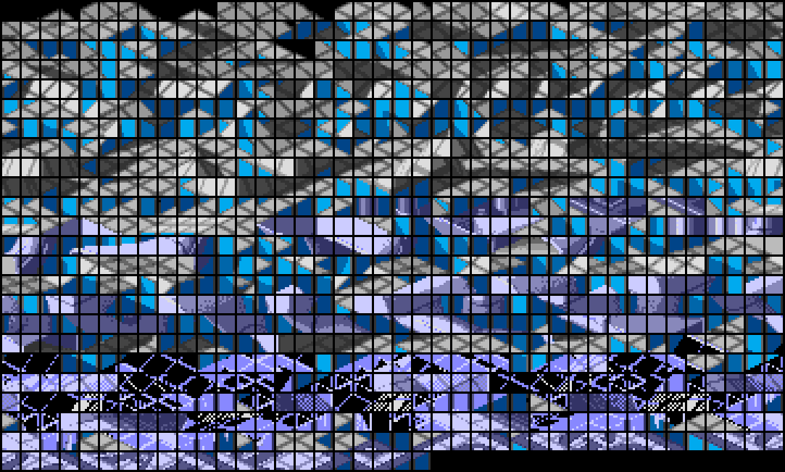
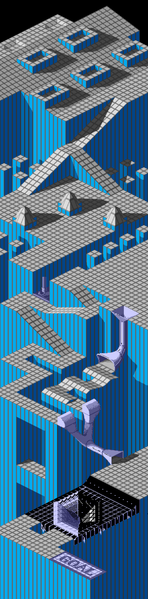
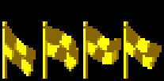
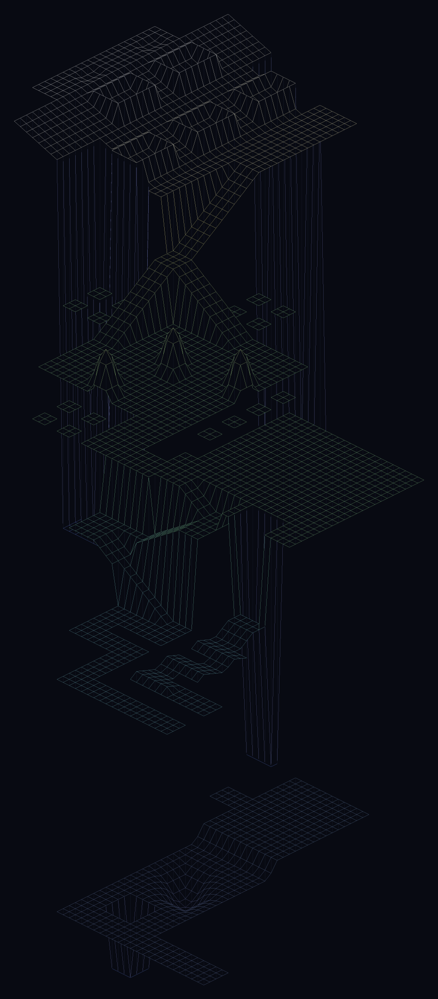

# Marble Madness (Amiga) — disk format and game analysis

A reverse-engineering reference for `Marble_Madness.adf`, the Amiga release of
Marble Madness (disk volume `MarbleMadness!`). This is the first Amiga title in
this repository and the writeup follows the same shape as the C64 games, in
reading order:

* **Part I** — the disk image: the ADF container, the AmigaDOS filesystem on it,
  and the full file inventory — enough to pull every byte off the disk;
* **Part II** — the boot chain: from the boot block through the AmigaDOS
  startup to the game launcher and how the program and its overlays load;
* **Part III** — the game program: the 68000 startup, interrupt/copper setup
  and memory map;
* **Part IV** — graphics and data formats: the per-course level, image, vector
  and audio modules and how they are encoded;
* **Part V** — game mechanics: the marble, the courses, the hazards and enemies,
  scoring and progression.
* **Appendices** — toolchain and reproduction.

Methods: purely static analysis of the disk image, plus the 68000 toolchain
built for it in the shared `tools/` module — the AmigaDOS reader
(`tools/amiga/adf`), the disassemblers (`tools/cmd/dis68k`,
`tools/cmd/codetrace68k`) and an instruction-level 68000 execution core
(`tools/m68k`) for dynamic verification. All addresses are 68000 addresses;
sizes are `.b`/`.w`/`.l` (8/16/32-bit). Parts I–III are complete and Part IV is
under way; Part V is still a stub.

---

## Contents

- [Part I — The disk image](#part-i--the-disk-image)
  - [1. The ADF container](#1-the-adf-container)
  - [2. The AmigaDOS filesystem](#2-the-amigados-filesystem)
  - [3. The disk contents](#3-the-disk-contents)
- [Part II — Boot chain](#part-ii--boot-chain)
  - [1. The boot block](#1-the-boot-block)
  - [2. AmigaDOS startup and the Workbench launch](#2-amigados-startup-and-the-workbench-launch)
  - [3. The launcher](#3-the-launcher)
  - [4. The decryptor (`c/zzz`)](#4-the-decryptor-czzz)
  - [5. The track loader (`c/xxx`)](#5-the-track-loader-cxxx)
- [Part III — Game program architecture](#part-iii--game-program-architecture)
  - [1. The multi-stage load](#1-the-multi-stage-load)
  - [2. The decoder](#2-the-decoder)
  - [3. The copy protection](#3-the-copy-protection)
  - [4. What the static analysis recovers — and where it stops](#4-what-the-static-analysis-recovers--and-where-it-stops)
  - [5. Inside the decrypted program — the code/data split](#5-inside-the-decrypted-program--the-codedata-split)
- [Part IV — Graphics and data formats](#part-iv--graphics-and-data-formats)
  - [1. The splash (boot) screen](#1-the-splash-boot-screen)
  - [2. The Workbench icons](#2-the-workbench-icons)
  - [3. Tile map (`.mlb`)](#3-tile-map-mlb)
  - [4. Obstacles (`.ilb`)](#4-obstacles-ilb)
  - [5. Course layout (`*Track`)](#5-course-layout-track)
- [Part V — Game mechanics](#part-v--game-mechanics)
  - [1. The game loop](#1-the-game-loop)
  - [2. The object/actor system](#2-the-objectactor-system) (hardware sprites, the display list, the occlusion masks)
  - [3. Terrain interaction](#3-terrain-interaction)
  - [4. Physics and controls](#4-physics-and-controls)
- [Part VI — Music and sound](#part-vi--music-and-sound)
  - [1. Where the music lives — the `*Snd` files](#1-where-the-music-lives--the-snd-files)
  - [2. The playback path — `audio.device`](#2-the-playback-path--audiodevice)
  - [3. The sequencer](#3-the-sequencer)
  - [4. The music — a Soundtracker player, reimplemented in Go](#4-the-music--a-soundtracker-player-reimplemented-in-go)
- [Appendix A — Toolchain and reproduction](#appendix-a--toolchain-and-reproduction)

---

# Part I — The disk image

## 1. The ADF container

An ADF is the simplest possible disk image: a flat dump of the floppy's logical
blocks with no header or metadata. Marble Madness ships on one standard
double-density disk — **1760 blocks of 512 bytes = 901,120 bytes** — so block
*N* is simply the 512 bytes at file offset *N* × 512. The exact copy this
analysis is based on is pinned by size and MD5 in the repository
[README](../README.md#image-files).

## 2. The AmigaDOS filesystem

The disk is formatted with the original AmigaDOS filesystem (**OFS**). The boot
block (blocks 0–1) opens with the 4-byte signature `"DOS\0"`; the trailing zero
is the filesystem-flags byte, and zero means OFS (a `1` would be FFS). The same
header points the root block at **block 880** (`numBlocks / 2` for a DD disk),
and the root block carries the volume name, **`MarbleMadness!`**.

The on-disk structures, all decoded by `tools/amiga/adf`, are the standard
AmigaDOS ones:

- **Directories** (the root and the three subdirectories) store their entries in
  a 72-slot hash table; entries that collide in a slot are threaded through a
  hash-chain field in each header block.
- **File headers** list their data blocks in a table filled from the end of the
  block; a file larger than ~72 blocks continues into *file-extension* blocks.
- **Data blocks**, under OFS, are not raw payload: each 512-byte block begins
  with a 24-byte header (the owning file, a sequence number, the next-block
  link, and a valid-byte count) followed by up to 488 bytes of file data. (FFS
  would store 512 raw bytes per block; this disk does not.)

The boot block itself contains the **standard AmigaDOS boot code**, not a custom
loader: its 68000 fragment references the string `dos.library`, opens it through
an Exec library call and returns its base, which is exactly what an ordinary
bootable AmigaDOS disk does.

## 3. The disk contents

The volume holds **50 files across 3 directories** (`c/`, `s/`, `libs/`). Almost
every file begins with the **`HUNK_HEADER`** magic of an Amiga
loadable object — a relocatable code/data segment that AmigaDOS brings in with
`LoadSeg`. So the game is not one monolithic binary but a launcher plus a main
program plus a large set of per-course overlays, each a hunk file loaded on
demand.

A **hunk file** is the Amiga's relocatable program format, produced by the linker
and loaded by `LoadSeg`. It opens with a header (the `$3F3` magic, then the size
of each segment) and is followed by the segments themselves — `CODE`, `DATA` and
zero-filled `BSS` blocks — each optionally trailed by a 32-bit relocation table.
Because a segment may be placed anywhere in memory, that table lists every
longword inside the segment that holds an address, and `LoadSeg` adds the
segment's real load address to each of them as it brings the file in; the program
is therefore position-independent. The shared reader `tools/amiga/hunk` does the
same — it lays the segments out from a chosen base, applies the relocations, and
returns a flat image that `dis68k`/`codetrace68k` can disassemble.

Two files are exceptions. `c/MarbleMadness!.dat` (the main program) and `c/xxx`
are not plain hunks: after a `$0000_03F3 8F01…` header their contents are
near-random (entropy ≈ 7.95 of 8 bits/byte), i.e. **stored encrypted** and
decrypted at load by the small `c/zzz` helper, as described in part II §4.

**System and boot files** — an ordinary AmigaDOS boot setup:

| file | role |
|------|------|
| `s/startup-sequence` | the boot script (21 bytes): `LoadWb` then `endcli` — it boots to Workbench |
| `c/LoadWb`, `c/EndCLI` | the AmigaDOS CLI commands the script runs |
| `c/splash` | the title/splash screen — an IFF ILBM bitmap (Part IV §1) |
| `c/bootscr` | the boot-screen program (a 50-hunk overlay) that displays the splash (Part II §3) |
| `c/zzz` | the decryptor — decrypts the encrypted files at load (Part II §4) |
| `c/xxx` | the disk fast-loader (encrypted, Part II §5) |
| `c/sigfile` | a disk-signature / copy-protection table (`"DOW"`+incrementing bytes) |
| `libs/icon.library` | bundled so the disk shows icons without the user's Workbench disk |
| `MarbleMadness!.info`, `Disk.info`, `.info` | Workbench icons (`$E310` magic, not hunks) |

**The game program:**

| file | size | role |
|------|------|------|
| `MarbleMadness!` | 5,864 | the launcher executable (started from the Workbench icon) |
| `c/MarbleMadness!.dat` | 175,360 | the main game program — stored encrypted, decrypted at load by `c/zzz` |

**Per-course modules.** The bulk of the disk is six parallel families of files,
one per Marble Madness course, keyed by a short prefix and a type suffix:

| prefix | course | tile map | obstacles | `.vlb` | sound | layout |
|--------|--------|-------|-------|--------|-------|-------|
| `prc` / `practy` | Practice | `practy.mlb` | `practy.ilb` | — | `PrcSnd` | `PrcTrack` |
| `beg` / `beginr` | Beginner | `beginr.mlb` | `beginr.ilb` | `begobsc.vlb` | `BegSnd` | `BegTrack` |
| `int` / `interm` | Intermediate | `interm.mlb` | `interm.ilb` | `intobsc.vlb` | `IntSnd` | `IntTrack` |
| `aer` / `aerial` | Aerial | `aerial.mlb` | `aerial.ilb` | `aerobsc.vlb` | `AerSnd` | `aertrack` |
| `sil` / `silly` | Silly | `silly.mlb` | `silly.ilb` | `silobsc.vlb`, `slink.vlb` | `SilSnd` | `SilTrack` |
| `ult` / `ultima` | Ultimate | `ultima.mlb` | `ultima.ilb` | `ultobsc.vlb` | `UltSnd` | `ulttrack` |

Plus shared assets: `marbdat` / `marbdat.vlb` (the marble), and `birdink.vlb`
and `ooze.vlb` (the creatures). The suffix conventions: `.mlb` is the per-course
**tile map** (Part IV §3) and `.ilb` the **obstacle sprites** (Part IV §4); the
`*Track` files are the per-course **course layout** (actor placements and
animation data, `LoadSeg`'d at course init — Part IV §5), **not** music. The rest
stay **provisional** — `.vlb` moving-object graphics and `*Snd` sound effects.

**Compression and encryption.** Several encodings appear on the disk, decoded in
this writeup where possible. The two executables that matter most —
`c/MarbleMadness!.dat` (the main program) and `c/xxx` — are **encrypted** by a
custom scheme (a shared `$0000_03F3 8F01…` header, contents at ≈ 7.95 of 8
bits/byte — high entropy from the cipher, **not** compression: the bodies are
stored at full size) and decrypted at load by `c/zzz`; reaching the main code
therefore means reversing that decryptor (Part III). The title screen `c/splash` is an IFF ILBM
whose pixels are **ByteRun1 (PackBits)** compressed (Part IV §1). The per-course
tile maps (`.mlb`) and obstacle sprites (`.ilb`) carry the same PackBits packing
(Part IV §3–§4).
`c/sigfile` is not compression but a copy-protection signature table. The
remaining per-course formats (`.mlb`, `.vlb`, `Snd`, `Track`) and whatever
encoding they use are still to be decoded. (The on-disk filesystem also frames
every file in OFS data blocks — a storage layout, not compression — which the
`adf` reader undoes when it extracts the files, Part I §2.)

Putting it together, the boot model is: a standard AmigaDOS disk boots to
Workbench via `startup-sequence`; the player launches the game from the
`MarbleMadness!` icon; the launcher pulls in `c/MarbleMadness!.dat` (the main
program) which then loads each course's `.mlb`/`.ilb`/`.vlb`/`Snd`/`Track`
overlays as the game reaches that course. Tracing that startup is Part II.

---

# Part II — Boot chain

Where the C64 tapes hid a custom fastloader that had to be reverse-engineered
before a single byte could be read, the Amiga disk boots through entirely
**stock AmigaDOS**. The chain is: ROM runs the boot block → the boot block
hands off to `dos.library` → AmigaDOS runs `s/startup-sequence` → Workbench
comes up → the player launches the game from its icon → a small compiled
launcher pulls the game in with `LoadSeg`. Each link is a standard mechanism;
the only game-specific code is the launcher.

## 1. The boot block

Blocks 0–1 are the boot block: the `"DOS\0"` signature, a checksum longword, the
root-block pointer (880), and then a short 68000 routine. Disassembled, it is the
**unmodified AmigaDOS 1.x boot code**:

```
0000: 43FA 0018     LEA   dosName(pc),a1     ; a1 -> "dos.library"
0004: 4EAE FFA0     JSR   -$60(a6)           ; FindResident()   (a6 = ExecBase)
0008: 4A80          TST.l d0
000A: 670A          BEQ   fail
000C: 2040          MOVEA.l d0,a0             ; a0 = the Resident node
000E: 2068 0016     MOVEA.l $16(a0),a0        ; a0 = rt_Init  (DOS boot entry)
0012: 7000          MOVEQ #0,d0               ; d0 = 0  -> success
0014: 4E75          RTS
fail:
0016: 70FF          MOVEQ #-1,d0
0018: 60FA          BRA   $0014
001A: "dos.library",0
```

It calls Exec's `FindResident` (LVO `-$60`) to locate the resident `dos.library`,
reads its `rt_Init` field (offset `$16` of the Resident node — the DOS boot
point) into `a0`, and returns success. The ROM then calls that boot point to
bring DOS up. There is no decryption, no custom track format, no game code here
at all — exactly the standard bootstrap, which is why an ADF reader plus stock
AmigaDOS knowledge is enough to get at everything (Part I).

## 2. AmigaDOS startup and the Workbench launch

Once DOS is running it mounts the volume and executes the boot script
`s/startup-sequence`, which is just two lines:

```
LoadWb
endcli > nil:
```

`LoadWb` starts Workbench; `endcli` closes the boot shell. Workbench here is the
Amiga's desktop GUI — and it is not a single program but a service of the
operating system: the windowing, menu and gadget machinery (`intuition.library`,
`graphics.library`, and the kernel `exec`) lives in the Kickstart **ROM**, and
`LoadWb` is just the small command that brings the desktop up on top of those ROM
libraries. The disk itself carries no Workbench binary; the only GUI pieces it
bundles are `libs/icon.library` (which draws icons) and the `.info` files, so that
it can show its own window and icons even on a bare machine without the user's
Workbench floppy. The game is then launched the Workbench way — by double-clicking
the **`MarbleMadness!`** icon, which is a *tool* icon (icon type 3), so Workbench
`LoadSeg`s and runs the `MarbleMadness!` program directly.

## 3. The launcher

`MarbleMadness!` is a small (5,864-byte) compiled program — 23 hunks, with a
`HUNK_SYMBOL` table left in. Its entry point is a standard C-runtime startup that
works out how it was launched:

```
MOVEM.l d3-d7/a0-a6,-(a7)     ; save registers
MOVE.l  a7,$1C.l              ; stash the stack pointer
MOVE.l  d0,$24.l / a0,$28.l   ; CLI argument length / pointer (0 from Workbench)
MOVEA.l $4.l,a6               ; a6 = ExecBase (AbsExecBase at $0000.0004)
SUBA.l  a1,a1
JSR     -$126(a6)             ; FindTask(0) -> our task
MOVEA.l d0,a4
TST.l   $AC(a4)               ; Process.pr_CLI : zero => launched from Workbench
BEQ     wbStartup             ; …which is the path taken here
```

The `pr_CLI` test (`$AC`) is the textbook Workbench-vs-CLI check, and because the
game is started from its icon it takes the Workbench branch and collects the
`WBStartup` message.

What the launcher then does is read off its symbol table and data hunk rather
than guessed: the symbols name the exact library entry points it links against —
from `dos.library` `_LoadSeg` / `_UnLoadSeg` / `_Lock` / `_CurrentDir` /
`_Input` / `_Output`, and from `exec.library` `_AllocMem` / `_FreeMem` /
`_FindTask` / `_CreatePort` / `_DeletePort` / `_PutMsg` / `_GetMsg` — so it
allocates memory, sets up message ports, and brings program segments in with
`LoadSeg`. Its data hunk holds the asset names it pulls from the `c/` directory:

| asset | what it is |
|-------|------------|
| `c/splash` | the title/splash screen — an IFF `FORM…ILBM` image |
| `c/bootscr` | a boot screen (hunk object) |
| `c/xxx` | opaque, high-entropy data (likely packed) |
| `c/zzz` | a second small compiled stage (also links `dos.library`) |

So the launcher displays the splash and then uses `LoadSeg` to load the game
proper. The main program is `c/MarbleMadness!.dat` — the 175 KB hunk from Part I —
with `c/zzz` and `c/xxx` as supporting loader/data pieces. Every loadable element,
the launcher included, is an ordinary Amiga hunk object brought in through
`LoadSeg`, which is the same mechanism the running game later uses to stream its
per-course overlays (Parts III–IV).

Tracing the launcher's own code confirms the shape. Loaded into a flat, relocated
image by `tools/amiga/hunk` (whose symbol-table support labels the library stubs
the linker left in the file) and traced with `codetrace68k`, the C-runtime
startup takes the Workbench branch shown above and calls `main`. `main` then
parses the `WBStartup` message, uses its lock to `CurrentDir` into the program's
own drawer, creates a reply port, and proceeds to bring the game in. Because the
game's main file is *encrypted* (Part I §3), that load does not go through plain
`LoadSeg` — it goes through `c/zzz`, the subject of §4.

The full annotated disassembly is in
[`disasm/MarbleMadness.asm`](disasm/MarbleMadness.asm) (with the names and notes
in [`disasm/MarbleMadness.annotations.txt`](disasm/MarbleMadness.annotations.txt)). The boot-screen path is
worth following concretely, because `c/bootscr` is one of the unencrypted hunks
and so loads the ordinary way:

```
LoadSeg("c/bootscr")            ; -> seglist; bail to exit(1) if it fails
Lock("c/splash", ACCESS_READ)   ; does the splash file exist?
  if present:  run bootscr(seglist, 1, "c/splash")        ; paint the splash
  else:        run bootscr(seglist, 1, "lo-res/paintcan") ; fallback image
…                               ; (decrypt/stream the game meanwhile)
run bootscr(seglist, 0, 0)      ; tear the boot screen back down
UnLoadSeg(bootscr)
```

`c/bootscr` is thus a small overlay that the launcher `LoadSeg`s, *runs* via the
seglist-call thunk `call_seglist` (which converts the `LoadSeg` BPTR to an address
and `JSR`s into the first hunk with `d0`/`a0` arguments) — handing it the image
filename so the overlay loads the IFF and displays it — and then runs once more
with `(0, 0)` to dismiss it before `UnLoadSeg`ing it. The same `call_seglist`
thunk is how `c/zzz` and the decrypted `c/xxx` are entered.

One detail is worth pinning down because it looks suspicious: the launcher binary
**also** carries a complete copy of `c/zzz`'s decrypt engine — the key-table
builder, the keystream generator and the vector-keyed protection of Part III. The
copy is the *same compiled code* (the keystream generator, for instance, is
byte-identical to `c/zzz`'s but for the 15 bytes of its three relocated global
pointers). It is tempting to wonder whether the disk `c/zzz` is leftover junk and
this embedded copy is what runs — but it is the other way round. The embedded
decrypt engine is **dead code**: a scan of the whole binary finds *zero*
control-flow references into it. The launcher does the real decryption by
`LoadSeg`-ing `c/zzz` from disk and `JSR`-ing into it (twice — to decrypt `c/xxx`,
then to bring the game in — before `UnLoadSeg`-ing it). What drags the dead engine
in is one routine main genuinely uses, `checksum_seglist`: it EOR-folds the
decrypted `c/xxx`'s hunks into a 16-bit checksum and feeds that into the key array
for the next decrypt — so tampering with `c/xxx` corrupts the key, a small
integrity chain. That checksum routine sits in the same linker object module as
the decrypt engine, so the linker pulled the whole module in even though only the
checksum is called.

## 4. The decryptor (`c/zzz`)

`c/MarbleMadness!.dat` and `c/xxx` are not plain hunks — they are encrypted
(Part I §3), so AmigaDOS's own `LoadSeg` cannot read them. `c/zzz` is the small
program that can: a custom **decrypting `LoadSeg` replacement**. It
is itself a clean hunk, so the hunk loader and `codetrace68k` read it directly,
and its `HUNK_SYMBOL` table even names the system calls it uses — `_Open`,
`_Read`, `_Close`, `_AllocMem`, `_FreeMem`, `_FindTask`. Its flow, from the
disassembly:

- It `_Open`s the packed file and `_AllocMem`s a 512-byte read buffer (it streams
  the input in `$200`-byte blocks) plus a small work buffer.
- A buffered longword reader feeds a core loop that treats the *decoded* stream as
  an ordinary hunk file: it reads a longword, masks off the top two bits
  (`ANDI.l #$3FFFFFFF`), subtracts `$3E7` (`HUNK_UNIT`, the first hunk-block id),
  range-checks it against the 16 block types, and dispatches through a jump table
  — `JMP $2(pc,d0.l)` at `$3DE`. So each `CODE`/`DATA`/`BSS`/`RELOC32`/…/`END`
  block is handled by its own arm exactly as `LoadSeg` would, producing a normal
  relocated segment list (the `ANDI.l #$3FFFFFFF` on the hunk sizes at `$B62` is
  the header pass).
- The decoding is a **keystream XOR**, not compression — the bodies are stored at
  full size; the high entropy is encryption. A 55-entry table is built from the
  seed `$57319753` by a ×31 hash (`sub_BEC`, `sub_D06`); the stream is then an
  additive lagged-Fibonacci generator over that table (`sub_$EAC`). On top of that
  sits a copy-protection routine (`sub_DAA`) that perturbs the table from the
  host's **CPU exception/TRAP vector table** — so the decryption is bound to
  machine state, not just the disk. Part III §2–3 reverses this in full.

So `c/zzz` is where the real game reaches memory: it reads the encrypted `.dat`,
undoes the keyed XOR, relocates the hunks, and hands the loaded segments back to
the launcher, which runs them. Reproducing it as a standalone unpacker — the
prerequisite for disassembling the main game — is the subject of Part III, which
also explains why the copy protection stops a purely static unpack short. The
full annotated disassembly is in [`disasm/zzz.asm`](disasm/zzz.asm)
([`zzz.annotations.txt`](disasm/zzz.annotations.txt)).

## 5. The track loader (`c/xxx`)

Once `c/zzz` is reproduced (Part III) the second-stage file `c/xxx` can be
decrypted and disassembled. Decrypted it is **a small compiled-C program whose
job is to be a custom floppy *track loader* — a "fast loader"** — and it turns
out to be the most interesting piece of code on the disk.

`c/xxx` does **not** read its data through AmigaDOS or even through
`trackdisk.device`'s normal commands. It opens only `dos.library` (for the
allocation/exit plumbing), `FindTask`s itself, then **drives the floppy hardware
directly**:

* **CIA-B PRB (`$BFD100`)** — the drive control port: motor on/off, `/SEL0`
  drive-select, `/SIDE`, and the `/STEP`/`DIR` lines. `seek_track0` ($6055E)
  pulses `/STEP` here to recalibrate the head.
* **CIA-A PRA (`$BFE001`)** — the drive-status inputs: `/RDY`, `/TK0` (track 0),
  `/WPRO`, `/CHNG`. The loader polls these to know when a seek is done and the
  disk is ready, and CIA-A DDRA (`$BFE201`) is set up for them in `disk_hw_init`
  ($6046E).
* **Paula disk DMA (`$DFF000` base)** — `dma_setup` ($6050C) programs `DMACON`
  (`$DFF09A`) and `ADKCON` (`$DFF09E`) for MFM/word-sync mode, and `read_track`
  ($607CA) points `DSKPT` (`$DFF020`) at a track buffer and writes `DSKLEN`
  (`$DFF024`) `= (len/2)|$8000` **twice** — the canonical Amiga "arm disk DMA"
  sequence — to pull a full **`$36F2` (14 066) byte raw MFM track** in one DMA
  burst (with a 200 000-iteration timeout and a `DSKBLK` clear on `INTREQ`).

So `c/xxx` reads raw MFM straight off the platter and decodes it in the CPU,
bypassing the filesystem entirely. That is a classic fast-loader/streaming
design (and a copy-protection hook: a custom track reader can require
non-standard track formats a file copier won't reproduce). Its `main` first
`AllocMem`s the load area sized from the control block the launcher passes, then
`load_session` ($603A2) allocates the `$38`-byte IO struct plus a 512-byte CHIP
sector buffer and walks the track reads. The full annotated disassembly is in
[`disasm/cxxx.asm`](disasm/cxxx.asm)
([`cxxx.annotations.txt`](disasm/cxxx.annotations.txt)); it is produced by the
pure-Go reimplementation of the `c/zzz` decode in
[`extract/cmd/decode`](extract/cmd/decode), which turns the encrypted `c/xxx`
back into a clean 22-hunk AmigaDOS object — using the `c/zzz` copy-protection
inputs captured live from a Kickstart 1.2 machine (the values that defeated a
purely static unpack in Part III §4; the capture method is noted there).

**It loads by physical position, not by name — and that resolves an apparent
paradox.** `c/MarbleMadness!.dat` shows up as an ordinary 175 KB file in the
disk's directory, yet the loader reads tracks, not files. Following the two
through reconciles them. First, the whole disk is a normal AmigaDOS OFS volume:
all 1760 blocks belong to the 50 catalogued files (1661 are OFS data blocks; the
rest are the boot block, 50 file headers, three directories, the root and the
bitmap). There is **no hidden raw region** — whatever the loader reads, it is
reading the filesystem's own sectors. Second, the `.dat` is genuinely one of
those files: following its OFS data-block chain, its 360 data blocks occupy a
near-contiguous physical band at blocks ~1023–1396, i.e. **physical tracks
~93–126**, each block a standard 512-byte sector (24-byte OFS header + 488 bytes
of the encrypted payload; the first block's payload begins `00 00 03 F3 8F 01`,
the packer signature). Third — the clincher — the launcher's *entire* string
table names only `c/zzz`, `c/xxx`, `c/bootscr`, `c/splash` and
`lo-res/paintcan`: **the string `c/MarbleMadness!.dat` does not appear anywhere
in the launcher.** The main program is never opened by name. It is reached purely
by *physical track and sector position* by `c/xxx`, which reimplements
`trackdisk.device`'s read path from scratch — whole-track Paula DMA, find the
`$4489` sync, MFM-decode, and validate each sector's standard `[$FF, track,
sector<11, sectors-to-gap]` header (it even carries the `"trackdisk.device"`
string and an `IORequest` builder as a fallback path). So the loader is *not*
reading data we haven't seen; it is reading the `.dat`'s own bytes off the
platter by location. The `.dat` exists as a DOS file so the disk stays a valid,
bootable AmigaDOS volume and so those blocks are reserved and laid down
contiguously; it is read by position for speed (whole-track DMA beats per-sector
OS reads) and as a copy-protection hook (a from-scratch reader can demand
non-standard formatting, and reading by position bypasses file-level tampering —
reinforced by the `c/xxx` checksum integrity chain of Part II §3).

---

# Part III — Game program architecture

The main program (`c/MarbleMadness!.dat`) and the second-stage loader (`c/xxx`)
are encrypted, so reaching the game's own 68000 code means getting through
`c/zzz`'s decoder (Part II §4) and the copy protection wrapped around it. This
part reverses both completely. The protection binds the key to machine state that
is not on the disk — and §4 documents exactly where a purely disk-only static
attack stops and why. That wall is then cleared in two steps (§4 updates): the
~25 bytes of copy-protection input are read once off a real Kickstart, and the
`.dat`'s count-20 key array is reverse-engineered from the decrypted `c/xxx`.
**Both `c/xxx` and the 150 KB `c/MarbleMadness!.dat` are now fully decrypted**, so
the game body — and the startup/copper/blitter detail inside it — is open for
Parts IV–V.

## 1. The multi-stage load

The launcher (Part II §3) does not load the game in one step. From its
disassembly the sequence is:

1. `LoadSeg` `c/zzz` (a clean hunk).
2. Call `c/zzz` through the seglist-call thunk at `$50A10` — which converts the
   `LoadSeg` BPTR to an address and jumps in with `d0` = a control block and
   `a0` = a filename — to decrypt **`c/xxx`**. The control block here has its
   key-array count set to **0**.
3. The decrypted `c/xxx` seglist is then *run as code*: it is the real
   second-stage loader — the from-scratch floppy track reader of Part II §5. It
   pulls the 175 KB main program off the disk by **physical position** (the
   `.dat` is never opened by name), into a buffer recorded in the shared control
   block.
4. The launcher mutates that control block's key array — count becomes `$14`
   (20 longwords), each XORed with the `c/xxx` checksum (the integrity chain) —
   and runs **`c/zzz` a second time** to *decrypt* the loaded program with that
   count-20 key. The two stages cooperate through the shared control block:
   `c/xxx` is the fast raw reader, `c/zzz` is the decryptor.

So the chain is launcher → (`c/zzz` decrypts `c/xxx`) → (`c/xxx` reads the main
program by track) → (`c/zzz` decrypts it), with the key array changing between
the two `c/zzz` passes. The first pass — `c/xxx` with an empty key array — is the
one this part can read; the second needs the count-20 key (§4).

## 2. The decoder

`c/zzz`'s `LoadSeg` replacement, fully reversed. Its entry point (hunk 0) saves
`d0`→control block and `a0`→filename, opens a library, and calls `main`
(`$400B4`); `main` calls the key setup (`sub_$D06`), then the decode-and-load
(`sub_$2C8`), then frees the table.

**Key setup** (`sub_$D06`): `_AllocMem` 220 bytes; `sub_BEC` seeds a 55-entry
table — `table[0] = $57319753`, `table[i] = table[i-1] × 31 + i` (mod 2³²) — then
XORs in the caller's key array (the launcher's, `count` longwords), then runs the
protection (§3), and records the pointers (`$40EA0/4/8`) the generator reads.

The on-disk format is the key to reading it: a **standard AmigaDOS hunk with
selective encryption**.

- The first longword (`$000003F3`, `HUNK_HEADER`) and every hunk-block **type**
  marker — `$3E9` `CODE`, `$3EA` `DATA`, `$3EB` `BSS`, `$3EC` `RELOC32`, `$3F0`
  `SYMBOL`, `$3F2` `END` — are stored in **plaintext** (read raw, bypassing the
  keystream).
- `SYMBOL`-block symbol **names** are plaintext too — `_AllocMem`, `_FreeMem`,
  `_FindTask`, … sit there as readable ASCII inside the "encrypted" file.
- Everything else — hunk sizes, the relocation tables, and the `CODE`/`DATA`
  bodies — is XORed with the keystream, one keystream longword per stored
  longword, in file order.

There is **no compression**. The bodies occupy their full size on disk; the
apparent size mismatch with the header's hunk table is simply the `BSS` hunks,
which carry a size but no data. The ≈7.95 bits/byte entropy is the encryption,
not packing — which is why `c/zzz` is a *decryptor*, not a decruncher, despite
the packer-like `$0000_03F3 8F01…` header.

The keystream (`sub_$EAC`) is an **additive lagged-Fibonacci generator** over the
table: two indices `p` (start 0) and `q` (start 27); each call does
`table[p] += table[q]; p += 1; q += 2` (both mod 55) and returns the updated
`table[p]`. Being purely additive, the **low byte of every output is a linear
function (mod 256) of the table's low bytes** — the lever §4 pulls.

`extract/cmd/unpack` runs this real code on the `tools/m68k` core, trapping the
six AmigaDOS/Exec stubs and streaming the packed bytes through `_Read`. It
reproduces the keystream bit-exact (verified against an independent generator)
and decodes the header cleanly: `c/xxx` is a `HUNK_HEADER` with **22 hunks**
(`first_hunk = 0`, `last_hunk = 21`) followed by its size/flags table.

## 3. The copy protection

The teeth are in `sub_DAA`, run during key setup. After `sub_BEC` seeds the
table, `sub_DAA` folds bytes from two pieces of **live machine state** into
specific table entries.

From the host's **CPU exception/TRAP vector table** (absolute low memory, the
68000 vectors at `$0`–`$3FF`):

- `$8,$C,…,$20` → table entries 10–16; `$28`–`$38` → entries 10–14 again;
  `$80`–`$BC`, the 16 `TRAP` vectors → entries 32–47;
- from each vector it extracts `(vector >> 16) & 0xFF` (the byte-extractor
  `sub_D92`: `ASR.l #16` then mask) and XORs it into the table entry.

Then from the **running task** (`_FindTask` is called for exactly this — its
result is *not* unused): it reads the task's `tc_ExceptCode` (`$2A(task)`) and
`tc_TrapCode` (`$32(task)`) handler pointers, takes `(ptr >> 16) & 0xFF` of each
(the second further `ASR.l #4`), and XORs them into **table entries 30 and 31**
(`$78`/`$7C` of the buffer). So 25 of the 55 entries are perturbed — 23 from the
vector table, and entries 30/31 from the task's two handler pointers. Those
pointers are *fields read from the running process*, which only exists once
AmigaDOS has created it — they are not on the disk and not present at ROM
cold-start.

Because those entries feed the lagged-Fibonacci generator, **the keystream past
its first stretch depends on the vector table and the task structure**. The
header and the first hunk decode regardless — their keystream words are drawn
before the perturbed entries propagate — which is exactly why the structure
stays legible while the bodies scramble.

What is in those vectors? Booting `kick12.rom` on the same 68000 core
(`extract/cmd/bootrom`) shows that at Kickstart 1.x **cold-start** every
exception/TRAP vector points at a single ROM handler, `$00FC05B4`, so
`(vector>>16)&0xFF` is a uniform **`$FC`** — the `$FC0000` ROM page. Kickstart
2.0+ moved the ROM to `$F80000` (byte `$F8`), so the protection is implicitly
tied to the 1.x ROM layout. That is both ordinary for a 1986 title and a clean
explanation of why such games are Kickstart-version-locked: the decryption key
*is* the ROM page.

The early guess was that AmigaDOS would have redirected those vectors away from
the ROM by decode time, making the key a piece of deep runtime state. The live
capture in §4 shows it does **not**: AmigaDOS leaves the `$8`–`$BC` CPU
exception/TRAP vectors at their ROM handlers, so at decode time every one of them
still reads page `$FC` — the same uniform value as cold-start. The vector table
is therefore **not** the runtime differentiator; it is simply the ROM page, and
the protection is thereby **Kickstart-1.x-locked** (a 2.0+ ROM at `$F8` would key
differently).

The part that genuinely is not on the disk — and not available from the ROM
alone — is entries 30/31: the launcher process's `tc_ExceptCode`/`tc_TrapCode`,
which exec only fills in when it *creates* the process. For this launcher those
default handlers are themselves ROM addresses (captured pages `$FC` and `$FF`,
§4), so the whole key is ultimately ROM-derived — but reading the task fields
requires a booted AmigaDOS with the process actually constructed, which is the
state a purely static unpack cannot manufacture.

One could hope the launcher closes that gap by *installing* its own handlers
before it invokes `c/zzz` — which would put the key values back on the disk. It
does not. The launcher's full disassembly (Part II §3) shows no write to the
`$8`–`$BC` vector region, no `tc_ExceptCode`/`tc_TrapCode` write, and none of the
calls that would install a handler (`Supervisor`, `SetIntVector`, `AddIntServer`,
`SetFunction`); the only references to those task fields anywhere in the binary
are *reads*, inside the dead embedded copy of the engine. So the launcher inherits
the vector table from booted AmigaDOS and hands it, untouched, to the decoder —
the protection's inputs are produced by the running OS, not the disk.

Running the launcher confirms it dynamically. `extract/cmd/runlauncher` executes
the real `MarbleMadness!` on the m68k core in a faked Workbench environment —
trapping the dos/exec calls, serving files and `LoadSeg` out of the ADF — and it
faithfully walks the load chain: open `dos.library`, take the `WBStartup`
message, `LoadSeg` `c/zzz`, and run it on `c/xxx`. c/zzz streams the whole 6 116-
byte file, decrypts the header, and `AllocMem`s all twenty-two of `c/xxx`'s hunks
at sizes that match the static decode to the byte (3 296 = 822×4+8, 1 016 =
252×4+8, …). Then — with the exception vectors sitting at zero, exactly as the
launcher left them — the body decode loses the stream and the decryptor spins.
The header decodes, the bodies do not: the live OS state is the missing key, and
nothing on the disk supplies it.

## 4. What the static analysis recovers — and where it stops

Recovered from the disk alone:

- the complete decode and protection mechanism above;
- `c/xxx`'s shape — a 22-hunk, exec-heavy second-stage loader. Its plaintext
  `SYMBOL` blocks name the calls it imports: `_AllocMem`, `_FreeMem`,
  `_FindTask`, `_AllocSignal`, `_FreeSignal`, `_AddPort`, `_RemPort`,
  `_OpenDevice`, `_DoIO` — a loader that allocates memory and signals, makes a
  message port, and talks to a device (the disk) to stream the game in;
- the `.dat`'s own `HUNK_HEADER` (hunk count and sizes), which decodes the same
  way once its key array is supplied.

Not recovered *by a disk-only static attack* — the bodies (the updates below
then clear this). Two independent attacks were pushed to their limits:

1. **Known-plaintext linear algebra.** The keystream's low byte is linear
   (mod 256) in the 25 protection-perturbed table bytes; the plaintext structure
   (type markers, symbol names, marker-derived hunk sizes, the `0` that
   terminates every `RELOC32` block) yields known keystream values at indices
   that are themselves computable from the marker layout. But only ~14 of those
   equations fall in the region with reliable indices, against 25 unknowns —
   underdetermined.
2. **The vector table from the ROM alone.** Booting `kick12.rom` on the minimal
   core supplies the `$8`–`$BC` vector pages (uniform `$FC`), which decode
   `c/xxx`'s first few hunks — but the decode then loses the stream, because two
   of the 25 perturbed entries (30/31) come from the launcher process's
   `tc_ExceptCode`/`tc_TrapCode`, and at ROM cold-start no such process exists
   yet to read them from. Reproducing the key means booting all the way to a
   constructed AmigaDOS process, not just running the ROM — which the minimal
   CPU core cannot do (it has no AmigaDOS). (The vectors themselves were never
   the obstacle: they stay `$FC` from cold-start through decode time, §3.)

So the protection meets its goal against a static unpack: the payload's
decryption is bound to machine state the disk does not contain — the Kickstart
1.x ROM (via the exception-vector pages) *and*, the true wall, the launcher
process's `tc_ExceptCode`/`tc_TrapCode`, which only exist once AmigaDOS has
constructed the process. The mechanism is wholly understood; the bytes stay
gated behind a running, booted Amiga of the right vintage.

**Update — the gate, opened.** Rather than emulate the full boot in the minimal
core, the missing machine state was read off a real **Kickstart 1.2** under a
GDB-controllable FS-UAE build (the shared Amiga debugger
[`tools/amiga/fsuae-debug/`](../tools/amiga/fsuae-debug); the game-specific
capture scripts are in [`tools/fsuae-debug/`](tools/fsuae-debug)). A CLI auto-run
disk (`modadf.go` rewrites the `s/startup-sequence` in place and
fixes the OFS block checksum) boots straight to the decrypt, and the launcher
runs as the `Initial CLI` task — so its `FindTask(0)` `tc_ExceptCode`/`tc_TrapCode`
read directly off the live task *are* the values `sub_DAA` folds in. The captured
inputs are uniform: **every CPU exception/TRAP vector page byte `$FC`**, launcher
`tc_ExceptCode` page `$FC`, `tc_TrapCode` page `$FF`. With those baked in, a
**pure-Go reimplementation** ([`extract/cmd/decode`](extract/cmd/decode)) — seed
table → key-array XOR → `sub_DAA` perturbation → lagged-Fibonacci keystream →
structure-aware field/body decrypt — turns `c/xxx` (empty key array) into a clean
22-hunk object, verified by the hunk loader applying every `RELOC32` and by the
key array deriving to all-zeros against the known header plaintext. `c/xxx`
proves to be the disk's fast loader (Part II §5).

**Update — the `.dat` decrypted, statically, no second capture needed.** The
main program uses the *same* decode but with a 20-long key array, and recovering
that key array turned out not to need a debugger at all — only the decrypted
`c/xxx` and a 16-bit brute force. The key array is **built by `c/xxx` itself**:
running as the loader, its `run_loader` fills the 20-longword `ctrl->C` buffer
(which then *becomes* the key array for the second `c/zzz` pass) with
`base[i] = datalen / ((i+1) × 300)` — a multiply (`$61248`) then a divide
(`$61204`) over a load-length the loader clamps to ≈1500, giving the small,
non-uniform vector `[4, 2, 1, 1, 0, 0, …]`. The launcher then mutates it in
place, `key[i] ^= C`, where `C` is the 16-bit `checksum_seglist(c/xxx)` integrity
constant (Part II §3). So the only unknown is that single 16-bit `C`: brute it
against a valid-hunk check (`decode -brute -count 20`) and it falls out as
**`C = $CDDA`**. With `key[i] = base[i] ^ $CDDA` and the same captured protection
bytes, `c/MarbleMadness!.dat` decodes to a clean **347-segment, 150 KB** hunk
object — every `RELOC32` applies, the entry hunk disassembles to the textbook
C-runtime startup (`FindTask`, the `pr_CLI`/`$AC` WB-vs-CLI check), and the body
carries the game's own text: `THE ULTIMATE RACE!`, `SCORE:`, the six
`… RACE:` course banners, `GAME OVER`, `RED PLAYER` / `BLUE PLAYER`. The encrypted
game body is open. (Reproduce with `decode -count 20 -datalen 1200 -keyconst
0xCDDA`; both decrypted hunks are written to `extracted/` for analysis. The
captured copy-protection bytes were still needed — they are shared by both
passes — but the count-20 key array itself was reverse-engineered, not captured.)

## 5. Inside the decrypted program — the code/data split

With the body open, the first question is what 150 KB of program actually
contains, and how to separate code from data for analysis. The answer is built
in: the `.dat` is a **stripped AmigaDOS hunk load file**, and the hunk *tags* are
the split. It is **not** linked down to a few merged hunks — each object module
kept its own `CODE`/`DATA`/`BSS` triple, so the file is **347 hunks** (≈115
modules), with no `SYMBOL` or `DEBUG` blocks (routines are unnamed, as in
`c/xxx`). By kind:

| Kind | Hunks | Bytes | What it is |
|------|------:|------:|------------|
| `CODE` | 133 | ~117 KB | the engine — the overwhelming majority |
| `DATA` | 109 | ~24 KB | tables, text, and zero-initialised globals |
| `BSS`  | 105 | ~5.6 KB | uninitialised working storage (no file bytes) |

So the surprise is that the file really **is** mostly code. That is consistent
with the rest of the disk, not at odds with it: the bitmaps and samples live in
separate files (`.ilb`/`.vlb` sprite banks, `Snd`, `Track` — Part I §3), so the
program carries **no pixel or sample data** — only the engine that drives them.
And it drives them at the metal: the code writes the full **blitter** register
block (`$DFF040`–`$DFF066`) and `DMACON` (`$DFF096`) directly and reads
`JOYxDAT` for the mouse/joystick, so rendering is hand-rolled blitting, not a
library call.

The ~24 KB of `DATA` is smaller than it looks: roughly **16 KB is zero** —
working arrays the compiler emitted into `DATA` rather than `BSS` (one hunk is
7 352 bytes with *two* non-zero bytes; another is 7 188 bytes at 99 % zero). The
remaining ~8 KB is the real payload, and it is exactly what an engine-without-
assets would hold:

- **UI text** — `THE ULTIMATE RACE!`, `SCORE:`, `CONGRATULATIONS!`, `TOTAL`,
  `GO!`, `Difficulty:`, `GAME OVER`, `RED PLAYER` / `BLUE PLAYER`, and the six
  course banners (`PRACTICE`/`BEGINNER`/`INTERMEDIATE`/`AERIAL`/`SILLY`/`ULTIMATE
  RACE:`);
- **the level filenames** — `Practy.mlb`, `Beginr.mlb`, `Interm.mlb`,
  `Aerial.mlb`, `Silly.mlb`, … — i.e. the engine names and loads the per-course
  `.mlb` level modules at run time (the file-vs-track loading of Part II §5);
- **small lookup tables** — offset/coordinate/sine-like runs and a few pointer
  tables, the rest of the `DATA` hunks.

Cleanly splitting it for further work needs no extra tooling: `hunkload` prints
the per-hunk map (kind, address, size) — that *is* the code/data manifest — and
`codetrace68k`, seeded with every `CODE`-hunk base as an entry point, follows the
control flow and classifies reached bytes as code and the rest as data. A first
pass reaches **~91 KB of code in 393 routines**; the remaining ~28 KB of `CODE`
sits behind 11 indirect jump tables that need `-table` hints to resolve — the
starting point for the mechanics analysis of Part V.

```sh
# split + first-pass disassembly of the decrypted engine
go run retroreverse.com/tools/amiga/cmd/hunkload -base 0 \
    extracted/c_MarbleMadness.dat.decrypted.hunk            # the hunk/code-data map
go run retroreverse.com/tools/amiga/cmd/hunkload -base 0 -o /tmp/dat.bin \
    extracted/c_MarbleMadness.dat.decrypted.hunk            # flat relocated image
# -entry = every CODE-hunk base from the map above
go run retroreverse.com/tools/cmd/codetrace68k -base 0 -entry <CODE-hunk bases> /tmp/dat.bin
```

---

# Part IV — Graphics and data formats

The boot-time graphics use standard Amiga formats the toolchain already reads end
to end — the title splash (§1) and the Workbench icons (§2). §3–§5 turn to the
game's own per-course formats: the **tile map** (`.mlb`, §3), the **obstacle
sprites** (`.ilb`, §4) and the **course layout** (`*Track`, §5). The `.mlb` and
`.ilb` pixel data share one **ByteRun1/PackBits** codec, identified from the
decrypted engine; the `*Track` is a plain `LoadSeg`'d hunk module. The remaining
per-course modules — the `.vlb` moving-object banks and the `*Snd` sound — are
still to be decoded.

## 1. The splash (boot) screen

The boot/title screen the player sees is `c/splash`, stored as a standard **IFF
`FORM…ILBM`** bitmap (the Amiga's usual image format). Its `BMHD` describes a
**320×200, 4-bitplane (16-colour)** image; the `BODY` is **ByteRun1 (PackBits)
compressed**; a `CMAP` chunk carries the 16-colour palette; and four `CRNG`
chunks define colour-cycling ranges, so parts of the logo animate on the real
machine. The decoder `tools/amiga/iff` parses those chunks, unpacks the BODY,
de-interleaves the four bitplanes into colour indices and looks them up in the
CMAP:


Decoding it also recovers the on-disk attribution that the screen displays: the
Amiga conversion is credited to **Larry Reed**, under **© 1984, 1986 Atari Games
Corp. & Electronic Arts** — facts read straight out of the image, not from any
outside source.

The image is the *data*; `c/bootscr` is the *code* that puts it on screen. The
launcher (Part II) `LoadSeg`s both, and `c/bootscr` is the overlay that displays
this splash at boot — it is a 50-hunk compiled program (its first hunk is
`HUNK_CODE`), not a second picture, which is why there is one bitmap here, not
two. `c/bootscr` keeps its full `HUNK_SYMBOL` table, so its annotated
disassembly ([`disasm/bootscr.asm`](disasm/bootscr.asm)) reads almost like
source: it is built from the **EA IFF reader** (`_GetFoILBM`, `_GetBODY`,
`_UnPackRow` = ByteRun1), a **trackdisk mini-filesystem** that reads the disk's
sectors directly (`_MFOpen`/`ReadSecs`/`_MGetDir`), and **graphics.library**
display setup (`_MakeVPort`/`_LoadRGB4`/`_LoadView`). (A loose end alongside
them, `c/sigfile`, is not graphics either: it is a short table of
`"DOW"`+incrementing-byte entries, a disk-signature / copy-protection artefact.)

## 2. The Workbench icons

The `.info` files are standard Workbench icons: a `DiskObject` header (`$E310`
magic) followed by one or two planar `Image` structures. Icons carry no palette
of their own — they are drawn in the Workbench screen pens — so `tools/amiga/icon`
renders them with the standard Workbench 1.x four-colour palette (pen 0 blue,
1 white, 2 black, 3 orange). They are also authored for the hi-res Workbench
screen, whose pixels are about twice as tall as wide, so the renders below are
scaled 2× vertically to restore the intended aspect.

`MarbleMadness!.info` (the icon the player double-clicks, Part II) is a **64×29,
2-plane** image — the marble: a dark sphere with a white specular highlight.


`Disk.info` is the **32×16** disk icon — the familiar white floppy with an orange
label.


## 3. Tile map (`.mlb`)

Each course's floor, walls and railings — everything the marble rolls on — are a
**tile map** held in its `.mlb` ("map library") file: `practy.mlb`, `beginr.mlb`,
… one per course. The whole file is a single **ByteRun1 / PackBits** stream (the
same RLE as IFF ILBM bodies; signed control byte *n*: `0..127` copies *n*+1 literal
bytes, `-1..-127` repeats the next byte `1−n` times, `-128` is a no-op). The loader
(`$7F38`) expands the entire file into a work buffer and relocates the plane and
tilemap pointers in its header; the tile blitter (`$9910` → `$99C0`) then paints
the course.

**Memory map** of the unpacked `beginr.mlb` work buffer:

| Offset | Field | Beginner value |
|---|---|---|
| `+0x00` word | **playable** height (tile rows) | `0x0091` (145) |
| `+0x02` long | plane-0 offset | `0x000036` |
| `+0x06` long | plane-1 offset | `0x001DA6` |
| `+0x0A` long | plane-2 offset | `0x003B16` |
| `+0x0E` long | plane-3 offset | `0x005886` |
| `+0x12` long | tilemap offset | `0x0075F6` |
| `+0x16 … +0x36` (32 B) | **palette** | 16 `$0RGB` words |
| `+0x36 … +0x1DA6` | **plane 0** (7536 B) | tile bitplane 0 |
| `+0x1DA6 … +0x3B16` | plane 1 | tile bitplane 1 |
| `+0x3B16 … +0x5886` | plane 2 | tile bitplane 2 |
| `+0x5886 … +0x75F6` | plane 3 | tile bitplane 3 |
| `+0x75F6 … +0x9EBE` | **tilemap** (10440 B) | 145 × 36 tile-index words |

The four plane offsets differ per course, but **plane 0 is always at `$36`** and
the planes are a constant stride apart — that stride is one plane's byte size, so
the **tile count = stride ÷ 8** (Beginner: `$1D70 ÷ 8 = 942` tiles).

**The header height is the *playable* height, not the data height.** The engine
clamps the scroll to `(header rows − 25)·8`, so tilemap rows beyond the header
count can never appear on screen — they are **off-screen storage**. Two courses
use it: **Ultimate** declares 108 rows but stores **198** — the 90 hidden rows are
three extra variants of its final screen for the path-swap animation (Part IV §5);
**Silly** declares 143 and stores 144 — one fully-drawn extra wall row the clamp
crops (authored content the playable height excludes; nothing references it). The
other four courses store exactly their playable height.

**Palette.** The sixteen big-endian `$0RGB` words at `+0x16` are the course's
playfield palette (colours 0–15). The per-course palette lives here, not in the
`.dat` — the engine programs it with `SetRGB4` (`$248FC`), never `LoadRGB4`.
Colours 0–6 are a shared grey ramp (the isometric shading); 7–15 are the course's
accent colours. Beginner's palette is `000 333 444 666 999 BBB DDD 048 06A 0AE 336
558 88B CCF 000 000` — its accents are the blue ramp the course is built from.

**Colour-cycling slots.** Colours 11–14 are driven at runtime by the engine's
colour-cyclers (`colour_cycle_a $B6DE` / `colour_cycle_b $A7A2`), which step a
per-object counter and write each frame's `$0RGB` from a 16-entry table into the copper
colour slot. The four tables form two pairs: colours **11+12 ramp `0F00→0FFF`
(red↔white — the hazard/lava pulse)** and colours **13+14 ramp `000F→0FFF` (blue↔white
— the ice shimmer)**. A course that is fully cycle-driven leaves those slots black
(`000`) in its `.mlb` — Beginner's **ice pit** uses colours 13 and 14, of which 13 is
already a cyan (`CCF`) but 14 is left blank — so a naïve static render shows part of the
pit as black. `extract/cmd/sprites` fills any black cycle slot with a representative
**mid-cycle** frame (colour 14 → `088F`, a cyan, *not* the pure-blue endpoint `000F`),
so the tile sheet and course map show the ice as cyan shades the way it reads in motion:

**Tiles** are **8×8 pixels, 4 bitplanes (16 colours)**. The blitter reads a tile as
eight 1-byte rows from `plane[(i>>1)*16 + (i&1) + 2*r]` — even/odd tiles are
byte-interleaved within 16-byte groups. Tile 0 is the all-black tile.



**Assembling the course.** The **tilemap** at `+0x12` is a row-major stream of
big-endian tile-index words, **36 tiles (288 px) wide** (the blitter's 72-byte row
stride fixes the width). Marble Madness scrolls only vertically, so the width is
constant and the height varies per course — from Practice's 36×75 up to Ultimate's
36×198 (the Beginner course shown is 36×145). Placing each tile by its index
reproduces the complete course — here Beginner, with its maze start, the cone bumps,
the spiral **funnel**, and the **GOAL** at the bottom:



[`extract/cmd/sprites`](extract/cmd/sprites) decodes every `.mlb` and writes the
tile set (`<course>.tiles.png`) and the assembled course (`<course>.png`) to
[`rendered/`](rendered). The `.mlb` tilemap is only the *visual* surface; the physics
rolls the marble on a separate height field (Part V §4).

## 4. Obstacles (`.ilb`)

Each course also carries an `.ilb` ("image library") of **obstacle sprites** — the
objects placed on the course: the goal flag, moving barriers, drawbridges and the
like. Sizes track each course's needs, from Silly's minimal four-cell set (466 B)
up to Aerial's sixty-three cells (35 KB).

**Container.** Like the `.mlb`, the whole `.ilb` is one **ByteRun1 / PackBits**
stream (§3). The loader (`$80B4`) reads the file with plain `dos.library`
`Open(MODE_OLDFILE)`/`Read`/`Close`, expands it through `$9118`, and walks a table
of cell descriptors **in the unpacked buffer**:

```
unpacked buffer:
+0    word              cell count
+2    count × 20 bytes  cell descriptors (walked at stride $14)
...                     contiguous planar pixel data the +8 fields point at
```

**Cell descriptor (20 bytes):**

```
+0  byte   cell type   (1 = stored cell, 0 = engine-composited)
+1  byte   flags       (bit 0 = process)
+2  word   width  in 16-px words
+4  word   height in rows
+6  word   one-plane byte size  (= width*2 * height)
+8  long   source offset into the unpacked buffer
+C  long   dest cell pointer    (filled at load)
+10 long   aux pointer          (filled at load)
```

The cells' pixel data is **contiguous in `+8` order**, so a cell's source span is
the gap to the next `+8` (or the buffer end), and its **plane count = span ÷ the
`+6` one-plane size**, and the descriptor's **`+0` type byte** selects the pixel
encoding. The depth varies per cell: small markers/sprites are 2 bitplanes (4
colours), the larger obstacle blocks 4 bitplanes (16 colours) — `interm.ilb`, for
instance, mixes 16×33×2p markers with 96×64×4p, 80×64×4p and 48×79×4p blocks.

**Each cell is one complete animation frame** (the encoding, once an open question,
is resolved). There are two storage layouts, picked by the type byte:

- **type 1 — "stored" free sprites** (the goal flag, marble, creatures): the planes
  are **row-interleaved** — each pixel row holds all of the cell's bitplanes back to
  back (`row stride = planes·(w/8)`). This is not an arbitrary choice: for a 16-px
  2-plane cell it is **exactly the Amiga hardware-sprite DMA data layout** — these
  cells are `memcpy`'d straight into sprite channel buffers at draw time (Part V §2).
  Each cell is a standalone frame; cells do **not** combine in pairs. `silly.ilb`'s
  four cells are the four wave frames of the checkered goal flag (below). *(An
  earlier guess that a 16-colour object was two stacked 2-plane cells — "the goal
  flag is cells 0+1" — was wrong; confirmed in-game and by the fixed decode.)* Two
  details: the stored heights are `2^n+1` — the last **row is a guard/sentinel**,
  not pixels, so it is dropped; and a type-1 sprite's 2-bit pixels are coloured by a
  **3-colour sprite ramp** its 16-byte draw record points at (`+$C` → three `$0RGB`
  words, loaded into the sprite pair's `COLOR` registers by the copper — Part V §2),
  not by the playfield palette. Where the record is known (the Track overlay pieces)
  the exact ramp is used; the bank-sheet renders approximate with the course accent
  colours.
- **type 0 — "composited" scenery**: sequential `+6`-byte plane blocks; at load
  `$8026` ORs the planes into a 1-plane **silhouette mask** (descriptor `+$C`) — the
  black-and-white level-geometry images the occlusion system punches out of sprites
  (Part V §2).

[`extract/cmd/sprites`](extract/cmd/sprites) branches on the type byte and renders both
layouts correctly, flow-packing the cells into one sheet per bank in
[`rendered/`](rendered):



The moving creatures and the marble live in separate `.vlb` files (16×N×2p type-1
sprites) that share this container: `marbdat.vlb` holds the rolling-marble frames plus
the score/time HUD pop-ups (`250…6000`, `+3 SEC`…), `birdink`/`ooze`/`slink` the
enemies. How the frames sequence into animations is the actor system's job (Part V).

## 5. Course layout (`*Track`)

Where the tiles (§3) are a course's *appearance* and the obstacle cells (§4) are
its *art*, the **`*Track`** file holds everything else a course needs — it is the
container for *all* of its per-course gameplay data, not just object positions.
There is one per course: `PrcTrack`, `BegTrack`, `IntTrack`, `AerTrack`, `SilTrack`,
`UltTrack`. (Despite the name these are **not** music — that is `*Snd`.)

**Loading.** A `*Track` is a plain AmigaDOS hunk module (not encrypted). At course
init (`load_track_data $003176`) the engine indexes the per-course name table
(`$353C`) by the course number and **`LoadSeg`s** the file. Its first segment opens
with a header of **ten relocated pointers** that the engine fans out to the
actor-system globals — each one a different structure:

| Header | Global | What it points to | Detailed in |
|---|---|---|---|
| `+0` | `$9A6` | **static slope field** — the region records baked into the corner-height mesh | Part V §4 |
| `+4` | `$129FC` | **placement table** — `[X][Y][type]` feature list (below) | here |
| `+8` | `$12F74` | **coarse-zone partition** (`$9D4`) — diagonal-boundary records (`terrain_lookup $12B9E`) | Part V §4 |
| `+$C` | `$1ED44` | **per-placement-type records** driving the `obsc.vlb` **wall-cover strips** (`$1E49A` — the static-wall occlusion assist on the marble's own draw; see "One game, eight obstacle systems") | here |
| `+$10` | `$89C2` | display block: per-band copper colour splits (`$F180…` reg encoding) | Part IV §3 |
| `+$14` | `$FD2C` | **animation scripts** + the **dynamic-region** source list; block extensions: `+8` = a loose hazard-script slot (Intermediate's **wave**), `+$23C`/`+$278` = the 3-slot **obstacle-actor** array + its 4 anim variants (Aerial's **pistons**), `+$4C..$58` = the **vacuum hood** trigger scripts | here |
| `+$18` | `$19CD0` | **creature spawn list A** — `[trigX,trigY,animPtr,type]` records (below) | here |
| `+$1C` | `$1ABE0` | **actor list** — the per-course enemies (the state-5 collision scan) | Part V §4 |
| `+$20` | `$1BE48` | **creature spawn list B** — spawns + a shared animation-variant table (below) | here |
| `+$24` | `$1D334` | Silly-only: the baby-creature display defs (fed by `birdink.vlb`, bank 4) | here |

**Placement table** (`+4`). An array of **3-byte records**, terminated by a leading
`$FF`:

```
+0  byte  X     (isometric grid cell; screen seed = X*8+4)
+1  byte  Y     (isometric grid cell; screen seed = Y*8+4)
+2  byte  type  (the region/feature kind; Beginner uses 0..12)
```

Each record marks a respawn point of kind `type` at iso grid cell `(X,Y)`. That `type` is the
**coarse-zone progress region** the point belongs to: the course is partitioned into regions
0–12 by the coarse-zone partition (`$9D4`, `terrain_lookup $12B9E`; the same partition whose
last region is the goal — see *The goal flags are bump obstacles* below). Each frame the
classifier records **which region the marble is currently in** in `marble+$1B`, and
`save_prev_state` keeps the previous value in `+$1D`.

**These are the respawn anchors** (confirmed by tracing the fall path — and visible in the
overlay: the cyan dots line the fall-off edges). When the marble rolls off an edge it goes
airborne and enters state 4 (FALLING/SETTLING); that transition calls the reposition routine
`$1448E → $1279C → $1288C`, which **scans the placement table for the record nearest the
marble's *pre-fall* tile (`obj+$32/$34`) whose `type` equals the zone it fell from
(`obj+$1D`)** — i.e. **only respawn points in the *same* progress region are eligible** — and
drops the marble back at that record's `(X,Y)` (`$690/$694 → obj+$C/$10`, with the surface Z
re-sampled there). Distance is the game's octagonal metric, capped at a threshold; a wider
fallback pass (`$15FC8`, radius `$180`) catches the rest. So you reappear on the **correct
ledge nearest where you fell, never in a different zone across a gap** — the zone tag is what
prevents the respawn from jumping the marble to an unrelated ledge that merely happens to be
near. So one course partition does triple duty: it tracks progress, it gates the respawn, and
its final region (12) is the goal.

**Creature spawns** (`+$18` and `+$20`). Two near-identical systems place the course's
moving creatures as the marble approaches. Each is a list of **8-byte records**:

```
+0  byte  trigX  (iso grid cell — the TRIGGER/home cell, not the spawn position)
+1  byte  trigY
+2  long  animPtr (relocated Track pointer; null on most +$20 records)
+6  byte  type
+7  byte  ·
```

The record `(trigX,trigY)` is **not** where the creature appears — it is a **trigger/home
cell**. The spawner (`$197D2`) stores it in `obj+$80/$82` and takes the actual world
position from the `animPtr` data instead: its first two bytes give `obj+$C = animPtr[0]<<19`,
`obj+$10 = animPtr[1]<<19` (the same `<<19` fixed-point as the marble position). The most
likely role of the home cell is a **scroll trigger** — "the course has scrolled far enough
that `(trigX,trigY)` is on screen, so spawn the enemy." Confirming the trigger semantics is
left for the enemy-AI pass.

**What these spawn (verified in-game): `+$18` = the black "enemy" marble, `+$20` = ooze.**
The two lists are two *different* enemy types, not one. A `+$18` record spawns a **black
marble** that patrols a fixed route until the player gets close, then **switches to hunting
the player**; its `animPtr` data is exactly that patrol route — an `$FF`-terminated list of
6-byte `[X][Y][·4]` entries whose `[X][Y]` waypoints **trace the marble's idle path to the
pixel** (confirmed by overlaying the markers on live play — a perfect match). Entry 0 is the
verified spawn position (`obj+$C/$10`); entries 1..n are the looping patrol waypoints; the
four trailing bytes per entry sit in the `0..8` range and look like per-waypoint
direction/facing codes (the `+$20` records cycle them cleanly `1..8`), to be pinned in the
enemy-AI pass. A `+$20` record spawns **ooze** (confirmed on Intermediate and Ultimate, the
only two courses that use the list); its position/animation come from the RNG definition
table rather than a per-record route. So in the renderer **magenta (`+$18`) = black marble,
orange (`+$20`) = ooze**.

The two lists differ only in how the animation/definition is chosen:

- **`+$18`** (`$19CD0`, spawner `$197D2`) — each record carries its own `animPtr`.
- **`+$20`** (`$1BE48`, spawner `$1B7B0`) — the record's `animPtr` is usually null; the
  spawner instead picks the position and animation from a definition table inside the `+$20`
  block (`+$14/+$18/+$1C/+$34`) by the record's `type` and an RNG variant roll (each def's
  first two bytes are its position, same `<<19` scale).

Both are sparse — Beginner 2 (`+$18`), Intermediate 7 (`+$20`), Aerial 1, Ultimate 1+4;
Practice and Silly use neither. They are distinct from the `+$1C` actor list, which is a
*third* enemy type (the slinkies — below).

Both spawned objects are **collision-checked against the marble** every frame (the marble
update runs scans against the `$19xxx`/`$1Bxxx` clusters that own them) — so they are
hazards. The `+$18` (black-marble) objects run a behaviour state machine (states 32→37) that
switches between patrol and hunt. The *animated terrain* obstacles (seesaws, sliding walls,
moving ramps, drawbridges) are a different system: the **dynamic regions** (`+$14`, the
scripted `$CCA` regions, Part V §4 and below). A `+$18` object spawns in state 32 with a
5-slot sub-object array (the marble's own trail/secondary passes, *not* a group of distinct
creatures: one record = one black marble); a `+$20` (ooze) object spawns in state 0 picking a
random visual variant from the shared table.

**The slinkies (marble munchers): the `+$1C` actor list (`$1ABE0`).** Found. `$1ABE0` is a
**pointer table**; entry[0] points to a record list (entry[1] and [2..13] are the default and
per-type sprite/animation pointers). Each record is **8 bytes** —
`[homeX][homeY][pathPtr:4][type][·]` — and uses the *same* placement scheme as the spawns:
the actor's world position is `pathPtr[0]<<19, pathPtr[1]<<19`, and `pathPtr` points to an
`$FF`-terminated `[X][Y][dir]` waypoint list = the slinky's patrol path. The collision scan
that consumes it (`$1A86C`) only runs on courses `$5D6 ∈ {1,2,5}` = **Beginner, Intermediate,
Ultimate**. Beginner's list has **exactly three records** — the three marble munchers:

| # | home | type | spawn pos | patrol |
|---|---|---|---|---|
| 1 | (8,28) | 3 | (51,45) | 13-waypoint loop |
| 2 | (8,28) | 3 | (45,51) | 13-waypoint loop |
| 3 | (9,30) | 4 | (61,51) | 6-waypoint loop |

They cluster around home `(8–9, 28–30)` and fan out to their patrol loops — matching the
in-game "they spawn close together, then walk their own routes." So the engine has **three**
moving-enemy placement systems sharing one `pathPtr[0/1]<<19` position convention: `+$18`
black marbles, `+$20` ooze, and `+$1C` slinkies.

**Dynamic regions = the named features (drawbridge, funnels, goal).** The animated/active
terrain the marble interacts with lives in the scripted dynamic regions, not in any creature
list. A record is `[x][y][scriptPtr]` (6 bytes) — and, like a creature record, its `[x][y]`
is **only a trigger cell**, not the region's position: it is the grid key `region_activate
$F8FC` matches against the marble's cell to switch the region on (a single-cell
equality/bracket test, not a rectangle). The region's **position is the script's first
keyframe** (`op0`'s `refX,refY` words → `+$C/+$10 = refX<<19,refY<<19`), and its **behaviour
is the keyframe's terrain code** (the `surface_interaction $16900` jump-table index). So a
dynamic region has a **position, not a size** — contrast the *static* `$9A6` slope regions,
which carry an explicit `[xSize][ySize]` rectangle.

Plotting Beginner's 11 regions at their keyframe positions and matching them to live play
(thanks to the human at the controls) **identifies every one**, and confirms the terrain-code
semantics decoded from the jump table:

| Region(s) | keyframe pos | terr | jump-table class | Feature (verified in-game) |
|---|---|---:|---|---|
| 0,1,2 | (61,56) | 3 | (special; `op8/9/10`, longer scripts) | **drawbridge** (3 co-located regions = the raise/lower mechanism) |
| 3 | (64,78) | 18 | hard-edge/**fall** | **funnel** entrance |
| 4 | (67,78) | 21 | wall/edge | **funnel** exit |
| 5 | (81,86) | 19 | hard-edge/**fall** | **double-funnel** entrance 1 |
| 6 | (87,86) | 20 | hard-edge/**fall** | **double-funnel** entrance 2 |
| 7 | (84,94) | 22 | wall/edge | **double-funnel** exit |
| 8 | (105,107) | 16 | directional **sound** trigger | **ice-bowl bottom** (likely the ice/slide sound or friction tweak) |
| 9,10 | (110,109),(114,109) | 5 | proximity trigger | the two **goal flags** |

This is a strong cross-check: the *fall* codes (18,19,20) are exactly the funnel **entrances**
(the marble drops in), the *wall/edge* codes (21,22) are the funnel **exits**, the *proximity
trigger* (5) is the **goal**, and the *directional sound* code (16) sits at the ice bowl — all
consistent with the categories the velocity trace assigned blind. (An earlier note here
claimed regions 3–8 were one "staggered keyframe chain" forming the drawbridge; that was a
mis-parse — the short per-region scripts are stored contiguously and I had read past each
region's end into the next. They are eight *separate* features, as the table shows.)

#### The region-script bytecode

The dynamic regions are driven by a tiny **bytecode interpreter**, `region_script $FD68`: a
stream of word opcodes (0..18, indexing a 19-entry jump table at `$FD96`), each followed by
its operands. The interpreter runs opcodes in a loop until a **STOP** op ends the region's
turn for this tick; `op0` KEYFRAME plants the reference point the marble rolls toward, and a
small **control-flow** set chains scripts together. All 19 are decoded (the disassembler
[`extract/cmd/rgnscript`](extract/cmd/rgnscript) replays this grammar on any course):

| op | name | operands | effect |
|---:|---|---|---|
| 0 | KEYFRAME | `refX,refY,refZ,dur,terr` (+`,_,_,link` if `dur==1`) | plant ref point + duration + terrain code; `dur==1` keyframes also carry a linked-animation ptr; the terrain code self-**registers** the region (terr 3 → the drawbridge `$FD38`, terr 12 → funnel list, terr 11/13 → slope list) |
| 1 | STATE-STOP | `count,state` | wrap count → `+$1C`, state byte → `+$21`, cursor = the op13 list, **stop** |
| 2 | SPRITE | `count,hold` | start the piece's animation: cursor `+$3E` = list base `+$46`; `count` → `+$1C` = list **wraps** before the script resumes (0 = loop forever); `hold` → `+$23` = engine frames per step |
| 3 | STATE0-STOP | `count` | set state 0, store the wrap count, **stop** |
| 4 / 5 | LOOP-A / NEXT-A | `count` / — | `dbra`-style loop (count 0 = infinite) |
| 6 / 7 | LOOP-B / NEXT-B | `count` / — | a second, independent loop |
| 8 | IF-MARBLE-ON | `arg`,`target` | if a marble is within 3 tiles of the region (state 1), JUMP `target` |
| 9 | JUMP | `target` | `PC = target` |
| 10 / 11 | CALL / RETURN | `target` / — | gosub (saves return in `+$32`) / return |
| 12 / 13 | LINK | `ptr` | load a linked sprite-animation / sub-script into `+$46`/`+$4A` |
| 14 | SET-VEL | `vX,vY` | region drift velocity (feeds `op16`) |
| 15 | ACTIVATE-STOP | — | run the activate/transition handler, **stop** |
| 16 | MOVE | — | drift the ref point by `vX/vY` each frame = a moving slope/sliding wall |
| 17 | FALL-STOP | `code` | put the marble in capture-state 4 with `code`, **stop** |
| 18 | IF-MARBLE-TERRAIN | `target` | if the marble's terrain code matches the region's, JUMP `target` |

`op14`/`op16` (moving slopes/seesaws) are *defined* but unused by these six courses' top-level
scripts — only keyframe/loop/link/stop/conditional ops actually appear in the data.

**How the animations tick.** A region with a running animation re-ticks every `+$23`
frames (`region_update` counts `+$22` up to the hold, `$FBE0`); each tick refreshes the
display state (`$103E8`) and **steps the record-list cursor** (`$F778`: `+$3E += 4`, or
`+8` for `[record, data]` pair lists — regions with `+$1E != 0`). At the `$FFFFFFFF`
terminator the cursor wraps to the list base (`+$46`, or the op13 list `+$4A`) and the
wrap count `+$1C` ticks down; when it hits zero the script resumes at the next opcode
(count 0 loops forever). The **goal flags** on every course are exactly
`op2 count=0 hold=5` over a flat 4-record list — the four wave frames at five engine
frames each, looping forever.

**Worked example — the drawbridge** (Beginner region 0, `rgnscript beginr -region 0`):

```
op0   KEYFRAME pos=(61,56) z=16264 dur=1 terr=3  link=$1A4E   ; plant the bridge; terr 3 = "I am the drawbridge"
op4   LOOP-A count=0                                          ; forever:
op2     SPRITE count=1 hold=2                                 ;   play the linked list through once, 2 frames/step
op12    LINK-46 $1A8A                                         ;   select bridge animation A (the raise sequence)
op3     STATE0-STOP count=15                                  ;   hold, then resume
op2     SPRITE count=1 hold=2                                 ;   play through once
op12    LINK-46 $1A4E                                         ;   select bridge animation B (the lower sequence)
op3     STATE0-STOP count=30                                  ;   hold, then resume
op5   NEXT-A                                                  ; loop back
```

So the drawbridge is an **autonomous, timed open/close cycle**: it plants a fixed terrain
keyframe, registers itself as *the* drawbridge, then loops forever between two linked bridge
animations (`$1A8A` and `$1A4E`) holding 15 and 30 ticks respectively. It is **not**
marble-triggered (the earlier guess that it used the marble-conditional `op8` was a mis-parse;
`op8` is actually used by a Practice trigger region — the **auto-start ramp** that grows out of
the floor to nudge an idle marble at the start; its growth frames are in `practy.ilb`.)

**The funnels: the entrance→exit link is in the engine, not the Track data.** Each funnel
region's script is trivial — one `op0` KEYFRAME carrying the funnel's terrain code plus an
`op3` stop. The link lives in the per-terrain-code handlers of `surface_interaction $16900`
(the `$16A00` jump table). When the marble rolls onto an *entrance* region, that code's handler
**teleports it to a hardcoded exit position** — it clears the airborne flag, zeroes velocity
(leaving an emergence kick), writes `obj+$C/$10` = the exit coordinates `<<16` (with a small
collision fallback via `$15FC8`), re-samples the surface height (`$EA10`), sets state 3 and
plays the funnel sound. The *exit* region's own handler (codes 21/22) is just a wall (`$180AC`)
that contains the marble where it lands. Beginner has two funnels, and the **terrain codes are
the pairing**:

| Funnel | entrance code(s) → handler | exit code | teleport dest ≈ cell |
|---|---|---|---|
| top (1 in, 1 out) | 18 → `$17192` | 21 (region at (67,78)) | (65, 76) |
| lower (2 in, 1 out) | 19 **and** 20 → `$172E6` (shared) | 22 (region at (84,94)) | (83, 92) |

So the lower funnel's *two* entrances map to *one* exit precisely because codes 19 and 20
dispatch to the **same handler** with the same baked-in destination, while the top funnel's
code 18 has its own handler. The teleport targets land exactly on the exit regions I plotted —
a clean cross-check. (The link being hardcoded per terrain code, rather than data-driven, is
why these specific codes 18–22 appear only on Beginner: each course's bespoke features get
their own codes and handlers.)

#### One game, eight obstacle systems

Ask "how does Marble Madness place an obstacle?" and the honest answer is: *which
obstacle?* Almost every hazard family got its own bespoke mechanism — the code
mirrors the data, where each course's features also get their own hardcoded
terrain-code handlers. The full map, now that all of them are traced:

| # | System | Data | Examples |
|---|---|---|---|
| 1 | static slope field | header `+0` region records → corner-height mesh | every ramp, wall, pit |
| 2 | dynamic regions | header `+$14` record list → bytecode scripts | drawbridge, flags, funnels, start ramp |
| 3 | **code-spawned region** | `+$14` block`+8` = a loose script slot | **Intermediate's wave** |
| 4 | **obstacle-actor array** | `+$14` block`+$23C` (3 slots + 4 anim variants) | **Aerial's pistons** |
| 5 | **fall-region + trigger scripts** | terr-11/13 regions + block`+$4C..$58` | **Aerial's vacuums** |
| 6 | creature spawners | headers `+$18`/`+$20`/`+$1C` | black marbles, ooze, slinkies |
| 7 | lane spawner | `$1C4E` structs + `$1D344` lanes (course 4 only) | Silly's crushable babies |
| 8 | screen-swap engine | terr-`$19` region + `[row, height-patch]` pairs | Ultimate's flickering finale |

**The wave (Intermediate) — a region spawned by code.** The `+$14` block's `+8`
slot holds a loose, unlisted **region script**. When a marble's placement-zone
type reaches 9 or 10 (`$FCE6` scans the marble objects each tick), `$F6F4`
allocates a free `$CCA` region struct and runs that script on it — so the wave
never appears in the course's dynamic-region list; it exists only while
triggered. The script itself is a beauty: `op0` plants the anchor at tiles
(9, 98) with `terr 6`; `op14` sets a velocity of `(+8, −4)` px; then it plays
`interm.ilb` cells 4–8 at 4 frames each (the wave **rising** out of the
channel), cells 9–10 (the crest), a **19× loop of { cells 11–14 at 1 frame;
op16 MOVE }** — the wave *sweeping* 8 px right and 4 px down the channel per
step — and cells 16–22 (the collapse), then stops until the next trigger. The
other courses keep unrelated data in the `+8` slot (Beginner: one of the
drawbridge's animation lists), which is why the wave is Intermediate-only.

**The pistons (Aerial) — the obstacle-actor array.** Block `+$23C` holds three
`$14`-byte actor records — populated only by AerTrack, and `actor_setup
$1D3EC` is gated on course 3. Each record carries its own base sprite record
(`aerial.ilb` cells 60–62, the walkway sections with piston holes) and a fixed
position (`+$A/+$C` = (0, 486), (64, 538), (96, 610) — **world pixels
directly**, because actors draw through the blitter path `draw_object_wrap`,
not the sprite queue). Per activation the engine rolls the RNG twice: once to
pick one of **four animation variants** (block `+$278..$284` — cells 44–47,
48–51, 52–55, 56–59, each an extend–hold×7–retract list stepped one entry per
frame), and once for an **isometric cell offset** (`(+$10−+$E)·8,
(+$10++$E)·4`) — the piston group pops up at a *random spot along its row*
each time, then idles for an RNG `(0..3)<<4`-frame pause.

**The vacuums (Aerial) — suction is just a slope.** The six hoods are the
terr-11/13 **fall regions** (anchors in a 2×3 grid at tiles (14,30), (6,34),
(14,41), (26,30), (18,34), (26,41)) — and terrain codes 11/13 are the *scripted
slope* codes, whose handlers accelerate the marble toward the region's
reference point. On Beginner that force is a slope; on Aerial the same code
**is the suction**. The hood art hangs off yet another block extension: slots
`+$4C..$58` hold four **trigger scripts** (open the hood — `aerial.ilb` cells
4–7 or 8–13 via 8-byte anim lists — loop an `op18` marble-test that
branches into the close subroutine, hide via an empty list, stop) that the code-11/13
handlers run on the region when the marble is drawn in; the fall itself is the
regions' `op17 FALL-STOP` codes 30–35 (per-hole teleport destinations, exactly
like Beginner's funnels).

Two supporting discoveries round the picture off. First, sprite-record cell
references are **(bank, index) pairs**: `$825E` reads the record's `+$8` long
as a bank word (a 6-slot table at `$8328`) plus a cell word. Bank 0 is the
course `.ilb`; bank 3 loads `ooze.vlb` (Intermediate/Ultimate), bank 4
`birdink.vlb` (Silly), bank 5 the per-course **`<course>obsc.vlb`**. Second,
those `obsc` banks — 45–49 cells of 16×64 wall-face slivers each — are not
obstacles at all: they are **wall-cover strips** (`obsc` = *obscure*) that
`$1E49A` attaches to the marble's own draw record (the `+$38/+$2C/+$26`
sub-slots, up to five 16-px columns) using the per-placement-type records at
header **`+$C`** — the system that hides the marble behind *static* wall edges,
completing the occlusion story from Part V §2.

#### The Ultimate finale — a whole screen on a flip-book

Ultimate's last screen strobes: narrow paths through the goal maze appear and disappear in
sequence. The `.mlb` betrays the trick immediately once you know that the tilemap's leading
word is the **playable row count** (the engine's scroll clamp is `(rows−25)·8`, so rows past
it can never scroll on screen): Ultimate's header says **108 rows, but the file stores 198**
— the 90 hidden rows are **three extra 30-row variants of the final screen**, stacked below
the course (the visible final screen at rows 78–107 is the fourth). The three hidden blocks
and the live block differ exactly in which path segments exist.

The animator is dynamic region 12: `op0 KEYFRAME dur=1 terr=$19` with its tile anchor at
**row 78** and a linked list that is not sprite records but **`[tilemap row, height patch]`
pairs** — `[78, $288E] [108, $2972] [138, $2A56] [168, $2B3A]`. Terrain code `$19` registers
the region with a dedicated engine (`$1DF6C` → `$1E212`), the same double-buffered Painter
machinery the drawbridge's tile animation uses: each cycle it has the Painter repaint the
fixed **30-row band** (the `$1E038` job is hard-coded to `$1E` rows) from the next variant's
tilemap rows into the off-screen buffer, `memcpy`s that variant's **`$798` height patch** in
(so the *collision* mesh switches with the pixels — the vanished path really is gone), and
flips the buffer into the scroll bitmap on the next vblank (`frame_tick $75DA` →
`$1DE10`/`$1DDD8`). Content and order are exact from the data — 78 → 108 → 138 → 168, wrap.
The cadence is the Painter's own repaint time: the tile drawer **yields to the vblank
every 16 tiles** (`mlb_draw_column $99A4`), so one 30×36-tile band takes
`⌈1080/16⌉ = 68` PAL frames — **≈1.36 s per variant**, matching the measured
once-a-second-ish swap in play.

Two smaller corollaries of the header-vs-data row count: **Silly stores 144 rows but plays
143** — its one hidden row is a fully-drawn extra wall row (real art, unique tiles) that the
scroll clamp crops; nothing in the Track or the engine references it, so it reads as authored
map content the playable height simply excludes. The other four courses store exactly their
playable height. The site's course maps show the playable rows, replay the screen-swap as a
tile animation, and play the goal flags' wave (both from this data).

**The goal flags are bump obstacles; the goal *area* is a coarse zone.** (Corrects an earlier
claim here that the goal was radial proximity to the flags — wrong on two counts, as live play
showed.) The two flag regions are `terr 5` triggers (`$16C0C`), but (1) the radius is **tiny**:
the handler's vector `d5/d4 = (ref − marble)·8` is in *eighth-of-a-cell* units, so its `$38`
octagonal threshold is only **~0.44 cells** — a small zone right at each flag, not a 3.5-cell
area; and (2) the handler sets the **wall-bounce flags** (`$6A1/$6A2`) + a sound, i.e. it makes
the marble *bounce off* the flag. So the flags are **solid, animated bump obstacles** at the
two front corners of the goal — not the win detector. Reaching the goal is a **zone** test:
the coarse-zone partition (`$9D4`, `terrain_lookup $12B9E`) divides the course into 13 progress
regions (types 0–12, the same types as the respawn anchors); **type 12 is the final region —
the "GOAL" rectangle** — past which is off-course (`$FF`). Entering that zone is what registers
the goal, which matches the in-game behaviour (it triggers on crossing into the rectangle, not
on nearing a flag). The exact win instruction that fires on entering type 12 is not yet pinned
(a good candidate for a dynamic capture).

**Per-course counts** ([`extract/cmd/tracks`](extract/cmd/tracks) decodes them all):

| Course | Track | Respawn pts | Slope regions | Dynamic regions | Coarse zones | Marbles | Ooze | Slinkies |
|---|---|---:|---:|---:|---:|---:|---:|---:|
| Practice | `PrcTrack` | 59 | 66 | 13 | 10 | 0 | 0 | 0 |
| Beginner | `BegTrack` | 79 | 79 | 11 | 16 | 2 | 0 | 3 |
| Intermediate | `IntTrack` | 87 | 71 | 3 | 15 | 0 | 7 | 2 |
| Aerial | `AerTrack` | 159 | 78 | 12 | 22 | 1 | 0 | 0 |
| Silly | `SilTrack` | 104 | 110 | 5 | 12 | 0 | 0 | 0 |
| Ultimate | `UltTrack` | 144 | 53 | 20 | 17 | 1 | 4 | 4 |

The columns are the Track structures whose record format we've pinned: the **respawn
points** (placement table, `+4` — the fall-off-edge anchors of the previous section), the
**slope regions** (the static height field, `+0` — Silly has the most warped geometry,
Ultimate the least), the **dynamic regions** (the scripted features incl. the drawbridge and
funnels, `+$14`), the **coarse zones** (`+8`), and the three moving-enemy lists — **marbles**
(`+$18`), **ooze** (`+$20`), **slinkies** (`+$1C`). (Practice/Silly have no spawned enemies;
Silly's crushable miniatures are its own `+$24` system.) Respawn-point placement also breaks
down by `type` (`tracks` prints the histogram).

**Visualising the layers.** `extract/cmd/regions` draws the slope field as a 3-D
wireframe (Part V §4) and overlays the other Track layers at their **true** `(X,Y)`,
never snapped:

| Overlay | Marker | Track |
|---|---|---|
| placement objects | cyan dots | `+4` |
| black marble | **magenta** pin + patrol polyline | `+$18` |
| ooze | **orange** pins (one per RNG candidate, no path) | `+$20` |
| slinkies (marble munchers) | **green** pin + patrol polyline | `+$1C` actor list |
| dynamic regions (drawbridge etc.) | **yellow** boxes | `+$14` |

For the path creatures (black marbles, slinkies) the waypoint list is drawn as a
**connecting polyline** through the sequence — `pos[0]` is the start pin — so the patrol
*order* is legible and can be compared against the in-game movement. For Beginner (below)
the 79 placement dots land squarely **on** the course, which doubles as a *calibration*:
features must sit on the course, so their fit confirms the `(X,Y)` grid matches the slope
mesh. The 2 magenta paths are Beginner's two **black enemy marbles** (their polylines match
the marbles' idle paths in live play to the pixel); the 3 green paths clustered mid-course
are the **three slinkies**; the yellow boxes are the **dynamic regions** (drawn at their
keyframe position, not their trigger cell) — every one identified in-game (drawbridge,
funnels, ice-bowl, the two goal flags), see the table above.



The marker positions are the creatures' verified spawn/waypoint positions (from the path
pointer), drawn on the course; the record's trigger/home cell is *not* drawn here — earlier
we mistook that home cell for the spawn position, and the pixel-consistent ~32×8-tile offset
the eye caught was exactly the record→path split that this corrects.

**Still open.** What each placement `type` *means*, the per-type object/animation definitions
(`+$C`; `+$24` is Silly's), the waypoint direction bytes, and the region-script opcode
vocabulary (the drawbridge's `op8/9/10` raise-lower; the funnel scripts) — the enemy-AI /
animation pass. The engine side that consumes all of this is Part V.

---

# Part V — Game mechanics

## 1. The game loop

Marble Madness runs as **two cooperating contexts** that talk over exec messages:
a **main thread** (the Intuition front-end and the game-state machine) and a
separate vblank-synced **"Framer" task** that owns the display refresh. There is no
single linear loop — the gameplay update and the display refresh run in different
contexts, which is why the call graph forks.

**Entry and the front-end.** `cstart` (`$0`) → C runtime → `main` (`$243E8`) →
`game` (`$2B68`). The shell opens `intuition.library`, runs one-time init
(including `sub_00CA14` below), starts gameplay, and then services an IDCMP message
loop:

```
game():                                   # $2B68 — the Intuition front-end
    open intuition.library
    init(); sub_00CA14(); start_gameplay()    # $2F54 / $CA14 / $6FC6
    repeat:
        msg = Wait/GetMsg()
        switch msg.Class (+$14):
            8:  quit = true
            9:  start_course()             # $3410: enable DMA, start_gameplay()
            10: ...                         # $3432
        ReplyMsg(msg)
    until quit

start_gameplay(go):                       # $6FC6 → $6F20
    PutMsg(framer_port, {cmd: go ? 6 : 7}) # tell the Framer task to start/stop
```

**The Framer task — the display loop.** `create_framer` (`$6FDC`) spawns an exec
task named **"Framer"** (entry `framer_task $6DA8`). It is the real-time loop, woken
once per **vertical blank**, and it doubles as a frame-rate meter (it tallies how
many vblanks each frame took into the `$70B8` histogram):

```
framer_task():                            # $6DA8 — the real-time main loop (own task)
    repeat:
        Wait(vblank_signal)               # $24B54
        frame_tick(frame_index)           # $7596
        record vblanks-this-frame into $70B8
        if stop_message: break

frame_tick(f):                            # $7596 — one displayed frame
    redraw  = colour_cycle_A()            # $B6DE — animate one cycling colour range
    redraw |= colour_cycle_B()            # $A7A2 — animate a second range
    if subsystem_flags ($5BCA, $1E20D): ...update those...
    if new_world_frame ($5DB):            # a fresh world update is ready
        $230++                            # frame counter
        $7692 = $D30C                     # latch the vertical scroll position
        redraw = true
    if redraw:
        rebuild_display(scroll=$7692)     # $86B4 — rebuild the copper/display list
```

The two `colour_cycle` passes drive the animated ice/hazard palette entries
(`$0RGB` tables → the copper colour slots `$B954/$B960` and `$B95A/$B966`) — the
cycling that a static `.mlb` palette can't show (Part IV §3).

**The game-state machine and the world update.** The gameplay proper is a state
machine, `sub_00CA14`, dispatched on `$CDAC` (1 = set up the course, 2 = …, 3 =
play). The **play** state runs the per-object world update and the object render:

```
game_state():                             # $CA14 — dispatched on $CDAC
    case 1: setup_course()                # reset scroll ($D30C=0), DMACON, counters
    case 2: ...
    case 3: play_frame()                  # the world update + render (below)

play_frame():
    for each live object:
        object_draw(obj)                  # $14EF0
            obj.pos += obj.velocity       # physics: integrate (x,y,z)
            set_draw_pos(obj)             # $E872 → iso-project $E944 → screen seed
            draw obj's sprite + shadow/secondary passes (by obj.+$1B) via actor_update
```

**The render pipeline** (Part IV §3–§4 for the cell formats):

```
render:
    mlb_draw_column() → draw_tile()       # $9910/$99C0 — .mlb tilemap background
    for each object: object_draw()        # $14EF0 — sprites
        actor_update() → draw_object_wrap() → blit_object()   # $1D3B2/$104C4/$11D1C
            type-0 cell → sequential plane-blocks + cookie-cut mask  (scenery)
            type-1 cell → row-interleaved planes, one frame/cell     (flag/marble/creature)
```

**Still open.** The exact message/signal that ticks the game-state machine once per
world frame — the Framer-vblank ↔ main-thread hand-off (the `$5DB` "new world frame"
flag is its visible half) — is the one link in the loop not yet pinned.

## 2. The object/actor system

The moving things in a course — the goal flag, the enemies and the
marble-munchers — are **actors**, fed by the per-course `*Track` data (Part IV §5).
Each frame `actor_update $01D3B2` walks an array of **20-byte actor records**:

```
+0  long   pointer to the current sprite cell to draw
+4  long   animation-script pointer (8-byte entries: cell ptr + timing,
           $FFFFFFFF-terminated → loop); advanced when the frame timer expires
+8  word   frame timer
+A  word   x position
+C  word   y position (biased by the scroll offset $D30C)
+E/+10     animation / wrap state
```

A cell is grouped into an animation by its **script** (a cell-pointer list in the
Track segment, selected per actor state from `$FD2C`), and the actor carries the
**position**; frame durations are randomised through the engine RNG (`$8F96`).

**Drawing — the marble and the creatures are hardware sprites.** The CPU never
touches `$DFF0A0–$DFF0DC`, which long suggested "everything is blitted" — wrong:
the **copper** writes the sprite registers, so the sprite setup lives in the
copper list as *data*, invisible to a register-write scan. Reading the live
copper list under FS-UAE settles it: eight `SPRxPT` writes into a dedicated
sprite-DMA arena, `COLOR17+`-block writes per object, and the whole moving cast
riding Denise's sprite hardware. The type-1 "stored" cell format — 16 px wide,
2 bitplanes, **row-interleaved** (Part IV §3) — *is* the Amiga sprite-DMA data
layout, byte for byte; each frame the engine `memcpy`s the current cell into a
sprite channel buffer (`draw_sprite_record $122AC` → the per-row channel
allocator `$3BB2`). A piece's 16-byte sprite record points (at `+$C`) to its
**three `$0RGB` sprite colours**, which a copper fragment (`$3558`) loads into
the pair's `COLOR17+4n` slots per scanline band — that is also why the two
players' marbles are just two ramps (`$6750`/`$6756`, red/blue swapped). Eight
sprite channels cover the whole cast by **copper multiplexing**: the `$5B30`
row-band structure re-assigns channels down the screen, patching `SPRxPT`
rewrites and colour fragments into the copper slack. Wide 4-plane pieces use
several 16-px columns. The **blitter** (`blit_object $011D1C`,
`draw_object_wrap $0104C4`) serves the other drawing paths; `mlb_draw_column`
(the "Painter" task, created `$9450`, loop `$91C0`) is the only tilemap drawer
— course paint, scroll rows, and the drawbridge-style **tile animations**.

### How the marble hides behind the level — sprite masks, not draw order

The tiles are plain squares, so a single 8×8 tile can hold background *and*
foreground pixels — no draw order over square tiles could produce the per-pixel
occlusion you see when the marble rolls under the Beginner drawbridge. And the
hardware won't do it either: `BPLCON2` is the constant `$0024` (in the engine's
copper template), which puts **every sprite in front of the playfield**,
always. The engine instead does the most direct thing possible: **it punches
the scenery's silhouette out of the marble's sprite data, every frame.**

After a marble/creature sprite is queued, `$5BE0` runs the per-course occlusion
checks: it compares the object's iso position against the terrain-registered
scenery regions (the drawbridge region pointer `$FD38`, Aerial's hole/fall list
`$FD3C` (course index 3 is Aerial, 4 Silly), the `$FD54`/`$FD58` feature lists — the same self-registration the
region scripts perform through their terrain codes). If the object is
*behind/under* a piece, `$11678` resolves the piece's current on-screen
position (its tile anchor `+$26/+$28` ×8, plus drift, minus scroll) and its
**current animation record** (the `+$3E` list cursor), and `$112DA` does the
punch: for every overlapping sprite row it takes the piece's **mask** — the
cell's OR-of-planes silhouette that `composite_planes $8026` builds at load
into descriptor `+$C`, a 1-bitplane black/white image of that chunk of level
geometry — shifts it to the sub-pixel offset, inverts it, and `AND`s it into
both data words of the sprite row:

```
sprite_plane0 &= ~(mask << dx)
sprite_plane1 &= ~(mask << dx)      ($11500/$11510, per overlapping row)
```

Where the mask covers the sprite, the sprite becomes transparent and the
playfield — including the scenery painted there by the tile animation — shows
through: the marble is pixel-precisely *behind* the level. Sprite-vs-sprite
layering falls out of the hardware (lower channels appear in front), which is
what the engine's **depth-sorted display list** feeds: every drawable owns a
14-byte record (`$41E` table, order `$5F7`) with an iso 3-D bounding box,
rebuilt per frame (`$1085C`), bubble-sorted with a separating-axis comparator
(`$10F4C`, the classic iso sort), and walked in order by `$11704` — the order
in which pieces claim sprite channels.

**The scenery pieces are `.ilb` cells owned by the Track's dynamic regions.**
A 16-byte sprite record describes each piece:

```
+0/+1  dx/dy draw nudge          +4..+7  iso-box extents
+2..3  state bytes               +8      .ilb cell index (long)
                                 +C      colour-ramp pointer (3 × $0RGB words)
```

Records live in `$FFFFFFFF`-terminated pointer lists — flat (the goal flag's 4
wave frames = `beginr.ilb` cells 0–3, ramp `$0000/$008A/$00CF`) or
`[record, composite-list]` pairs (the Beginner drawbridge: cells 4–7 = four
64×63 lift stages, one list forward and one reversed = raise and lower; the
composite element drives the Painter's tile redraw for that stage, while the
record's cell supplies the occlusion mask). The region **script** wires them
up: an `op0` keyframe with `dur==1` carries the piece's **draw anchor in
course-tile coordinates** (region `+$26/+$28`) plus the sprite-list link;
`op12/op13` re-link the list, `op2 SPRITE` starts a play-through of the current list
(wrap count + hold — the animation, not an index). Free-standing pieces like the flags anchor at their
keyframe reference point through the engine's projection (`$6918`:
`screenX = y·8−x·8+$88`, `screenY = z + $9BA + $6C − (x·8+y·8)/2`, with `$9BA`
seeded from the course descriptor's `+$10` word; the `+$12` word — the
final-screen scroll offset — is added only on **Silly** to seed its
bottom-of-course start, and cancels out of the world mapping). The record's
`dy` nudge raises a piece on both anchor paths (`$122AC` flips y up-positive),
and hardware sprites sit 12 px above the raw buffer arithmetic (the
sprite-vs-playfield-band offset, calibrated in play).

The companion site's course maps draw these pieces as a toggleable
**scenery-overlay layer** (`extract/cmd/webexport`, `overlay.go`), placed by
replaying exactly this data chain — type-1 pieces in their record's own sprite
colours; the goal flags land pixel-perfect on the GOAL banners of all six
courses and the drawbridge merges seamlessly into the Beginner plateau,
verifying the record format and both anchor paths.

## 3. Terrain interaction

The `[X][Y][type]` placement table (Part IV §5) is a coarse **feature map**: a proximity
query exposes the nearest feature's `type` to the marble as `+$1B`. It is *not* the
slope/wall terrain — that comes from two other Track structures, both detailed in §4:
the **`$9A6` static slope field** (the ramps, walls and pits, baked into the corner-height
mesh) and a few **scripted `$CCA` regions** (seesaws, holes, triggers).

## 4. Physics and controls

### Controls — the mouse

Input is the **mouse quadrature counters** `JOY0DAT`/`JOY1DAT`
(`$DFF00A`/`$DFF00C`), per player, plus the CIA fire buttons (`$BFE001`).
`trackball_decode $019390` turns the Amiga quadrature (XOR of adjacent counter bits →
direction, `±$20`/step) into an X/Y delta; `control_update $0192EC` accumulates and
scales it into the roll-force accumulators `$195EE`/`$195EA`. It is a relative device —
move faster, push harder — the mouse standing in for the arcade's trackball.

### The marble is a 3-D point mass

The marble (object `$236`) is not a 2-D sprite: it is a point mass with velocity
`(vx,vy,vz)` at `obj+0/+4/+8` and position `(x,y,z)` at `obj+$C/+$10/+$14`. Each frame
`object_draw $14EF0` integrates `pos += velocity`, then `set_draw_pos $E872`
**iso-projects** to the screen (`$E944`) — the iso look is a projection of a real 3-D
simulation. Exactly three things write the velocity:

- **input** — `marble_input $12F8C` adds the scaled mouse force (`$0130DA/$0130E0`);
- **friction / speed cap** — `$14D28` computes the octagonal speed `|vY|+3⁄8·|vX|`,
  drives the roll anim/sound, and clamps each component to a per-surface max (`$40000`
  vs `$50000`, selected by `obj+$1A` via `$14E7E` — that selector *is* the ice/grating
  friction);
- **the surface force** — below.

The terrain comes in **two independent systems**: a **static slope field** (the ramps,
walls and pits of the course itself) and a few **scripted dynamic regions** (seesaws,
the rail-guarded holes, triggers). Different data, different force code.

### The static slope field — `$9A6` → a corner-height mesh

The slopes the marble rolls down live in the **course descriptor at Track header `+0`
(`$9A6`)**: a count (`+$1A`) of **8-byte region records** (table at `+$1C`), over a
world height (`+$18`) and width (`+$24`). Each record:

| Bytes | Field | Meaning |
|---|---|---|
| `[0]`/`[1]` | `x0,y0` (x signed) | iso-**tile** origin (a diamond on screen, not a screen box) |
| `[2]`/`[3]` | `xSize,ySize` | rectangle extent, in iso tiles |
| `[4..5]` | `baseHeight` (word) | the region's reference height |
| `[6]` lo 5 | `edgeShape` | → a height-delta **profile** (table at `+$20`) |
| `[7]` lo 3 / bit 3 | `dir` / `flip` | slope direction (one of the 4 iso diagonals, `$2504`) / negate the profile |

`build_region $E158` rasterises every record into the **`$CCA` corner-height mesh** — a
22-wide grid of 8-byte cells, each holding the **four corner heights** of one iso tile.
It walks the rectangle diagonally along `dir` and writes `value = baseHeight ±
profile[i]`, the profile advanced one byte per cell and restarted on a `$80` marker (so
`00 02 04 06 … 80` is a repeating ramp); shared corners between adjacent cells are
written consistently. So each region is a flat iso-tile rectangle carrying a *base
height + direction + 1-D profile*, and all 66 composite into one continuous **2.5-D
height map**. The **triangular slope faces** the game shows are emergent: a height-map
quad with non-coplanar corners is two triangles (the engine picks one per the
iso-diamond half — see the force below).

The **downhill force** is the gradient of that mesh, taken each frame from `object_draw`:

1. **`surface_sample $EA10`** reads the four mesh cells around the marble (the corner
   blocks `$1EBA/$1EC2/$1ECA/$1ED2`), uses `$6D6` (the iso-diamond half) to pick **which
   of the tile's two triangles** the marble is over, and from its corners computes the
   surface **gradient** `$6D8`/`$6DA` and the interpolated height `Z`.
2. **`apply_slope_force $14A88`** amplifies a steep gradient ×4 and accelerates the marble
   down it: `vX -= gradientX<<11` (`$14AEA`), `vY -= gradientY<<11` (`$14AF6`). The
   **Silly** course (`$5D6==4` — course index 4 is Silly, not Aerial) *adds* instead,
   so the marble accelerates *up* the slopes rather than down.

The **walls** fall out of the same mesh: `surface_sides $EF90` turns a height step
between neighbour cells into a per-side flag `$6A4-$6A7`, and `edge_collision $EB64`
clamps the velocity against it. One height map → both the roll and the walls, with no
per-cell terrain codes.

`extract/cmd/regions` replays the `$E158` height generation and plots each course as an
iso slope-direction map (`rendered/<course>.regions.png`) and a 3-D wireframe of the
mesh (`rendered/<course>.wire.png` — dimetric, hidden-line, 3× supersampled, Go
standard library; **shown with the Track's other layers in Part IV §5**). From the
records alone the renders reproduce each course feature-for-feature — Beginner's maze
start, cone bumps, descending platforms and GOAL (Part IV §5); Practice's checkerboard
of `7×7` slope facets, its two recessed holes and the descending zigzag canyon.

### The scripted dynamic regions — `sub_016900`

A few moving/interactive surfaces are a separate system (the practice course has **13**:
the two rail-guarded holes, the start/finish triggers, the ball-catcher). At load
`region_build_list $F7EA` reads a per-course `[x][y][scriptPtr]` list (Track header
`+$14` → `$FD2C`) into an array of **86-byte region structs** at `$CCA` (`region_clear
$8F42` inits them; `$CCA` is a multi-phase work buffer — also the height mesh and a
particle pool). Each frame `region_activate $F8FC` matches a region's grid key
`+$52/+$54` to the marble's tile and sets its `+$18` valid flag.

A region's **reference point `+$C/+$10`** is not a stored field — it is emitted by a
per-region **bytecode animation script** (`region_script $FD68`): `+$3A` = script base,
`+$36` = PC, `+$1E` = the current keyframe's duration. A word opcode (19-entry table at
`$FD96`) drives it; the key ones:

| Op | Effect |
|---|---|
| **0** keyframe | `+$C/$10` = refX/refY (`word<<19`), `+$14` = refZ (`word<<16`), `+$1E` = duration, `+$1F` = **terrain code** |
| **16** move | `+$C += vX`, `+$10 += vY` each frame — a *moving* slope / seesaw / sliding wall |
| **2** | sets state + plays a sound |

`surface_interaction sub_016900` applies them: it loops the 25 region structs (`a4`,
stride `$56`), and for each valid one takes `(refX−marbleX, refY−marbleY)` and dispatches
on its terrain code `+$1F` (5..59) through a 55-entry jump table at `$016A00`. Slope
codes (11/13) push the marble toward the reference point (`vXY += unit(ref−pos)·4`,
`$017BDE/$017BE8`), gated by a bounds box; trigger codes raise the wall flags
`$6A1/$6A2`, which at the loop tail snap the marble to `$6B8/$6BC` and **negate** its
velocity (the bounce). The table groups as:

| Codes | Behaviour |
|---|---|
| 6–9, 14, 15, 17, 25, 40–44 | flat — no force |
| **11, 13** / 12 | slope toward ref / funnel (set velocity) |
| 5, 16, 26–31, 50–55 | proximity trigger (flag + sound) |
| 21, 22, 33, 35, 36, 38, 39 | wall / edge (→ `$180AC`) |
| 10, 18, 19, 20, 32, 34, 37 | hard edge / fall / goal |

### The marble state machine — `$13E9A`

All of the above runs under a **12-state** machine: `marble_state_machine $13E9A`
dispatches on `obj+$1A` (the marble's state, **0–11**; `CMPI.l #$C` rejects the rest)
through a jump table at `$13F40` (`JMP $2(pc,d0.l)`). Three states are
**player-controllable** — they run input (`$12F8C`) and physics (`$14EF0`); the others
are animation/transition states that only redraw the marble at its current position
(`$E74C`, no input). `obj+$1A` doubles as the per-surface max-speed selector (`$14E7E`),
so the state also sets the friction/speed cap.

| St | Handler | Ctrl? | Role — what the handler does |
|---|---|---|---|
| **0** | `$141DC` | ● | **Rolling** (normal play): input + physics. If the stun flag `+$DD` is set, hands off to **state 8**. |
| 1 | `$1427C` | ● | **Landing**: after the marble drops off a ledge (it goes airborne, `+$36=2`, in the update `$14EF0`), touchdown calls `$14884` with the fall height → plays an impact-scaled bounce (`+$60` eased toward `+$61`), then → 0. |
| 2 | `$1436E` | | Animation frame only — advances an animation cursor (`+$64`); no physics. |
| 3 | `$13FBA` | | **Edge / landing reaction**: plays the sound for the terrain just hit (`+$62`), clears it, → 0. *Entered by the wall/edge handlers (`$16xx/$17xx`).* |
| 4 | `$14072` | | **Falling / settling**: collision-queries the surface (`$15FC8`); on contact runs the "appear" animation and latches the region, then → 0. |
| 5 | `$142FC` | ● | **Object bump**: the collision scan `$1A86C` (the Track actor list `$1ABE0`, only on some courses) drops the marble here on contact → a brief flat `+$60` countdown, then → 0. |
| 6 | `$13F70` | ● | **Course intro**: the entrance run; `+$61` counts down, then velocity is frozen. *Entered at course init (`$3380`).* |
| 7 | `$1435E` | | Transient: save-state + clear `+$1C` (one-shot). |
| **8** | `$143FC` | | **Dizzy (stunned)**: plays the swirl animation (`+$DE`), tallies `+$74`, then → 0. *Entered **only** from state 0 on a hard hit / survivable fall — recoverable, **not** death.* |
| 9 | `$1439A` | | **Spawn / appear**: the marble materialising at start or respawn. *Entered from the spawn routine.* |
| 10 | `$14100` | | **Hole / region capture**: runs the active region's script (`$FD68`) and sound, then → state 4. *Entered from the slope/region handlers (`$17AFA/$17CDA`).* |
| 11 | `$143C8` | | Settle onto a scripted region — like state 4, latches the region on contact. |

### Falling off — death

On **no** terrain (type resolves to `$FF`, `terrain_lookup $012D44`) the off-edge state
(`$5E4`) fires and the marble falls; **falling from too great a height** (the landing
handler `$14884` reads the fall height — above a threshold it kills rather than bounces),
the hazards, and the marble-munchers are the other death paths. A *survivable* hard hit
(by another marble) or a *short* fall is **not** death — it sets the stun flag `+$DD`,
and state 0 drops the marble into the **dizzy** spin (state 8 above), which plays out and
returns to rolling.

### Still open

The full 19-opcode region-script vocabulary (0/2/16 characterised), the exact 86-byte
region-struct layout, and the scoring machine.

---

# Part VI — Music and sound

Each course has its own theme — and, as it turns out, **two** of them per course
(fourteen tunes in all). The interesting finding is *how* they are played. Unlike the
bare-metal C64 drivers (or the Amiga Turrican's hand-written TFMX driver, which bangs
Paula's registers directly), Marble Madness plays its music through the operating
system's **`audio.device`**. The game never touches `$DFF0A0`–`$DFF0DF` for music;
instead it *sequences* the song and, for each voice, hands the OS a sample pointer, a
period (pitch) and a volume, and lets `audio.device` perform the actual Paula DMA. The
consequence is that the "player" is much simpler than a TFMX-class engine: there is no
macro virtual machine, no software mixing — just *"play this sample at this pitch and
volume."*

This part documents the music **container** (§1), the **playback path** (§2), the
sound **engine** (§3 — the SfxTask, its per-voice sequencer and envelope clock), and
finally the **music format and a from-scratch Go reimplementation** (§4 — the
Soundtracker-style order-table/pattern arrangement and the one-waveform ProTracker
synth, rendered straight from the disk image to audio).

> Addresses below are offsets into the **flat, base-0 relocated image** of the
> decrypted game (`hunkload -o` of `extract/c_MarbleMadness.dat.decrypted.hunk`).

## 1. Where the music lives — the `*Snd` files

The six per-course sound banks are `PrcSnd`, `BegSnd`, `IntSnd`, `AerSnd`,
`SilSnd`, `UltSnd`. The engine opens them lower-cased (`prcsnd` … `ultsnd`, the
names sit in a six-pointer table at `$21E00`; AmigaDOS filenames are
case-insensitive). Note that the **`*Track` files are *not* music** — those are
the per-course gameplay data (Part IV §5); the audio is entirely in `*Snd`.

Each `*Snd` is an ordinary AmigaDOS **HUNK module of pure data**: every
`HUNK_CODE` block is zero-length, so there is *no player code in the file* — the
player lives in the main program. The payload is in the `HUNK_DATA` blocks, and
each of those carries the **`MEMF_CHIP`** memory flag — the block type reads
`$400003EA` ( `HUNK_DATA` `$3EA` OR `MEMF_CHIP` `$40000000`) — so AmigaDOS loads
them into chip RAM, the only memory Paula can DMA from. (A generic hunk loader
must mask the type with `& $3FFFFFFF`; the flag is why a naïve loader trips here.)

`PrcSnd` decodes to **sixteen data objects** (48 hunks = 16 × {empty `CODE`,
`DATA`, empty `BSS`}), cross-linked by ~180 `RELOC32` relocations:

| object | bytes | likely role |
|-------:|------:|-------------|
| 0 | 520 | song header / sequence (embedded relocated pointers to the samples) |
| 1 | 560 | table |
| 2–8 | 164, 92, 404, 124, 772, 396, 412 | instrument / envelope / short-sample tables |
| 9 | **3116** | 8-bit PCM sample |
| 10 | **1512** | 8-bit PCM sample |
| 11–13 | 556, 500, **3264** | tables + a large 8-bit PCM sample |
| 14–15 | 316, 244 | tables |

The large objects (≈1.5–3 KB) are **8-bit signed PCM** — one-shot instrument
waveforms (verified by their smooth, full-range −128…127 byte statistics). The
small objects are instrument/envelope parameter tables. Object 0 is the song; its
relocations resolve to the sample objects, so the score names its instruments by
pointer rather than by index.

## 2. The playback path — `audio.device`

**Opening the device — `sound_init` (`$1FF34`).** Run once at startup. It
allocates a 68-byte (`$44`) **`IOAudio`** request from a template at `$2120C`,
calls `OpenDevice("audio.device", …)` (the string is at `$211EA`; the C wrapper is
`$249F0`), builds a reply `MsgPort` (`$214C8`), and initialises a four-entry
**channel array** at `$21250` (one `IOAudio`-style request per voice). `IOAudio`
is the standard Exec layout, which is why the request is exactly `$44` bytes:

```
IOAudio (68 bytes):
  +$1C io_Command   (the audio command)        +$2A ioa_Period  (Paula period = pitch)
  +$20 ioa_AllocKey                            +$2C ioa_Volume  (0..64)
  +$22 ioa_Data     (-> 8-bit sample in chip)  +$2E ioa_Cycles  (repeat count; 0 = loop)
  +$26 ioa_Length   (sample length, bytes)     +$30 ioa_WriteMsg
```

**Grabbing the voices — per course (`$20CAC`).** When a course starts, the engine
issues an **`ADCMD_ALLOCATE`** through `BeginIO` (`$24A10`) on the `$2120C`
request to reserve all four Paula channels, then spins on a reply flag (`TST.w
$211E6 / BEQ`) until `audio.device` replies — the standard allocate handshake. It
sets a default volume (`$21224 = 15`) and primes the channels.

**Playing notes.** Per voice, the sequencer fills that voice's request — sample
(`ioa_Data`/`ioa_Length`), pitch (`ioa_Period`) and `ioa_Volume` — sets
`io_Command` to a write/per-vol command, and submits it with `BeginIO`/`DoIO`
(`$24A10` / the device-I/O wrappers at `$24C1C` `DoIO`, `$24C2C` `SendIO`,
`OpenDevice` at `$24A06`). `audio.device` then streams the sample to Paula at the
requested period and volume. **This `CMD_WRITE` stream — which sample, at what
period and volume, on which frame — *is* the music**; capturing it is exactly the
ground truth a reimplementation must reproduce.

## 3. The sequencer

The interpreter was recovered by static disassembly of the decrypted body, cross-
checked against a dynamic run in the 68000 core (`extract/cmd/sndcapture`, over
`tools/m68k`, with the OS and `audio.device` stubbed). The engine is a general
**sampled-sound driver** — music is just a set of voices it triggers — and it is
**dual-clocked**:

- an **audio-reply clock** advances each voice's event list (note triggers): when
  `audio.device` finishes a voice's sample it replies the request, and the player
  task calls the sequencer to write that voice's *next* note;
- a **timer clock** (`timer.device`, opened alongside the song) ticks the per-voice
  **pitch and volume envelopes** on the sustained notes.

So it is *not* a flat per-frame player, but it is also not purely reply-driven:
faithful reproduction needs both clocks (the timer ticks at 60 Hz —
`tv_micro = $411A` = 16666 µs).

**The command/message protocol.** The player runs as its own Exec **task** and the
rest of the engine talks to it only by message — a clean producer/consumer split:

```
game engine            player task ($20A3C, one GetMsg loop)
-----------            -----------------------------------------
snd_play(eventList,    msg == timer request  -> $21740  (envelope tick, 60 Hz)
   volEnv, periodEnv,  msg == a channel reply -> $2057A  (advance that voice)
   repeat)             else (a command msg)   -> $2098A  dispatch on msg+$1A:
  builds a message M,                            1 -> $2076E  play/trigger a voice
  PutMsg → task port                             2,3,5,6 -> stop / alloc / control
```

The play path (`snd_play`, `$20D96`) first sends `cmd 6` to **allocate a voice**
(carrying a priority and a base pitch) and waits for the reply, then fills the
message — `M+$20 ←` eventList, `M+$24 ←` volume-envelope, `M+$28 ←` period-envelope,
`M+$1E ←` repeat, `M+$1A ← 1` — and PutMsgs it. Those are *exactly* the fields the
task's `$2076E` reads back, which pins the wire format. (The SfxTask itself is
brought up once by `$20CAC`: it sends a `cmd 5` init, `ADCMD_ALLOCATE`s the four
Paula channels, and starts the 60 Hz timer — the `"SfxTask"`/`"timer.device"`
strings sit at `$211FF`.)

**Triggering a sound — `play_sfx(soundID)` (`$21ADC`), and the `*Snd` directory.**
The rest of the engine plays a sound by *number*. A loaded sound bank's directory
pointer lives in the global `$21DD4` (and `$21DD0` is the sfx-enable flag); the six
per-course banks are named at `$21DD8` (`prcsnd`…`ultsnd`, with a pointer table
right after), `LoadSeg`'d, and their first data hunk becomes the directory.
`play_sfx` reads a **count word** then indexes an **8-byte record** per soundID:

```
*Snd directory:  [count:word][ record ×count ]
record (8 bytes): +$0 word  opcode (0..5: kinds of play / stop / one-shot)
                  +$4 long  -> sound descriptor   (opcode-dependent)
sound descriptor: +$0, +$4, +$8 -> eventList, volEnv, periodEnv  (the snd_play args)
                  +$C word, +$E byte, +$10 word    base pitch / priority / repeat
```

It dispatches on the opcode and, for the play kinds, calls `snd_play($20D96)` with
the descriptor's three pointers. **So a course's music is one (or a few) of these
directory entries** — a soundID whose event lists are the long, looping score —
and rendering it means triggering that entry and letting the dual clock run. The
capture oracle therefore loads a course `*Snd`, points `$21DD4` at it, brings up the
SfxTask, calls `play_sfx` for the music entry, and records the emitted `CMD_WRITE` +
envelope stream; the Go port replays the same directory walk. This is more than a
flat event list, but still far simpler than a TFMX macro VM: the OS does the mixing
and there is no software synth.

**The player task.** Song setup (`song_init`, ~`$20BB0`–`$20CAA`) zeroes the state
tables via a `memset` helper `$218C8` — notably `$38` = 4·14 bytes at `$21490` (the
four voice cursors), `$8` at `$21004`, `$4` at `$21010` — primes per-voice defaults
(`$20FEC[ch]=1`, `$2100C[ch]=1`, `$20FD8[ch]=$FF`) and then **spawns a player task**
with entry `$20A3C` through a `CreateProc`/`AddTask` wrapper (`$248D4`). That task
owns the reply port and the two-thread handshake; the game side talks to it by
`PutMsg`. (An earlier note placing the loop at `$20A52` was mistaken — `$20A52` is
inside an unrelated varargs/`printf` helper that is duplicated at several addresses.)

**Triggering a voice — `$2076E`.** A "sound request" struct `S` (the score's voice
descriptor) is handed to `$2076E`, which allocates a free voice (`$020458`), maps
it to a channel `ch` (`$02012C`), and latches `S`'s fields into per-channel state:

```
sound request S:
  +$18 word    base pitch / transpose      -> $20FF4[ch]
  +$1B byte    priority                     -> $21014[ch]
  +$1C word    Paula-voice bitmask          -> $21004[ch]   (which of voices 0..3)
  +$1E word    repeat / note-length count   -> $20FFC[ch]
  +$20 long  -> initial 14-byte event       (copied into the cursor)
  +$24 long  -> volume-envelope descriptor   (bound into $21138[v])
  +$28 long  -> period-envelope descriptor   (bound into $21148[v])
```

For every Paula voice `v` set in the mask it binds the volume/period envelope
descriptors (`$02070A` into `$21138[v]`/`$21148[v]`), defaults `$20FBC[v]=$100`,
clears the voice's done-flag `$20FD4[v]`, **copies the 14-byte initial event from
`S+$20` into that voice's cursor** `$21490 + v·$E`, and kicks `$2057A` to emit the
first note. The `*Snd` score (objects 0/1) is therefore an array of these `S`
descriptors, each naming an event list, two envelopes, a base pitch, a voice mask
and a repeat count — all by relocated pointer into the module's data hunks.

**The sequencer (`$2057A(ch, ioreq, latch)`).** Each voice has a 14-byte **cursor**
at `$21490 + ch·$E` walking a **linked list of note events**, and an instrument
descriptor per event:

```
cursor / event (14 bytes):            instrument descriptor:
  +$0  long  -> next event (link)       +$0  word    sample length (in words; ×2 = bytes)
  +$4  word     duration counter        +$4  word    base period (pitch)   -> $20FAC[ch]
  +$6  long     hold / rest flag        +$6  word    volume-envelope base  -> $20FB4[ch]
  +$A  long  -> instrument descriptor   +$8  long -> 8-bit PCM sample (a *Snd chip-RAM hunk)
```

Per call it decrements the duration counter (`+$4`, signed). While the event is
still active (`counter ≠ −1`): if the hold/rest flag `+$6` is non-zero it just
burns ticks, otherwise it **emits**. When the counter reaches `−1` the event has
expired: if the `+$0` link is null it sets the voice's done-flag and stops;
otherwise it copies the next 14 bytes over the cursor and continues. Emitting fills
the voice's `IOAudio` straight from the instrument — `ioa_Data ← i+$8`,
`ioa_Length ← (i+$0)·2`, `ioa_Period ← $21708(ch)`, `ioa_Volume ← $21850(ch)`,
`ioa_Cycles ←` the duration (a counter of `−2` means Cycles 0 = loop forever),
`io_Command ← CMD_WRITE (3)` — and submits it via `$24A3C`. When `latch` (arg3) is
set it also copies the instrument's `+$6`/`+$4` into the envelope bases
`$20FB4[ch]`/`$20FAC[ch]` and sets `io_Flags=$10`.

**Pitch envelope — `$21708(ch)`.** Base period `$20FAC[ch]`, scaled by a 16.16
ratio held at `+$E` of the bound descriptor `*$21148[ch]`: ratio `$10000` (= 1.0)
leaves the period unchanged, otherwise `period = ((ratio>>8) · base) >> 8` — a
multiplicative pitch slide (portamento / glissando).

**Volume envelope — `$21850(ch)`.** Similar two-stage multiply: an 8.8 ratio at
`+$E` of `*$21138[ch]` combined with `$20FB4[ch]` and `$20FBC[ch]` through
`MULU … >>8` chains, yielding the final 0..64 `ioa_Volume`.

**The envelope clock — `$21740`** (per `timer.device` tick). It loops the four
voices; for each active one it walks the `$21250` voice array (stride `$44`),
recomputes `$21708`/`$21850`, and **only when the period or volume changed** builds
a short update `IOAudio` (`io_Command = $C`) and submits it via `$24A3C` — so the
slides and envelopes are audible between note triggers. `$20FFC[ch]` counts the
note's remaining ticks and releases the voice (`$2015E`) at zero.

§1–§3 describe the *engine* — the OS-driven SfxTask, the per-voice sequencer and the
envelope clock — recovered partly by static disassembly and partly by a single-task
`tools/m68k` harness (`extract/cmd/sndoracle`) that runs the real driver under stubbed
`exec`/`timer.device`/`audio.device`. That harness was a *scaffold for understanding*,
not the deliverable; it proved the control flow but is too slow to record a whole song.
The next section is the payoff: the music format, fully decoded, and a from-scratch Go
reimplementation that renders it.

## 4. The music — a Soundtracker player, reimplemented in Go

Music is just a particular use of the sound engine. A course's theme is a directory
record with **opcode 0** (`play_sfx`'s `op0` arm, `$21B54`): triggering it runs the
bank channel-init `$21D1E` and `$1F6D0`, which stores the song pointer in the global
`$1FA1A`, and from then on a **per-frame music tick `$1F286`** advances it (≈50 Hz),
emitting notes through the same voice path as §3. Every course's `*Snd` actually holds
**two** distinct op0 tunes (`id25` and the main `id30`), and Aerial and Ultimate carry
a third (`id31`/`id32`); Silly's `id33` is a duplicate pointer to its `id30`.

**The song is a Soundtracker-style arrangement.** The structure is the classic
*order-table + patterns* design:

```
song ($1FA1A)        8-byte channel slots; slot+0 -> the order table for that channel
order table          6-byte entries: [repeat: word][pattern: long]
                       play the pattern `repeat` times, then advance; a repeat of 0
                       terminates the table -> loop back to entry 0
pattern              a byte-stream of note commands ($1F162 / $1EE8A):
                       bit7 set, nibble != 0  -> select note-length class (-> $1FA26)
                       $80 (bit7, nibble 0)   -> end of this pattern instance
                       $7F                    -> rest / note-off
                       $00..$6B               -> a note (octave = n/12, semitone = n%12)
```

The **repeat counts** are essential: a course's order table has dozens of entries that
reuse a handful of patterns with repeats of 4/8/24, so ignoring them makes the song
race through its sections and jump around (the symptom that first exposed the
order-table structure).

**The synth — one waveform, ProTracker pitches (`$1EE8A`).** Each note is voiced from
the bank's single shared **`h4` waveform**. The note splits into an octave (`n/12`) and
a semitone (`n%12`); the pitch is the standard Amiga/ProTracker period table
`$1F902` = `428,404,381,360,339,320,302,285,269,254,240,226` indexed by semitone, and
the octave selects the *length* of the looped `h4` slice (`length = base << (8−octave)`)
— the classic one-sample-many-octaves trick. Period gives the fine pitch within the
octave; slice length gives the octave.

**Per-note volume envelope.** The note-on routes through `snd_play` (`$20D96`) carrying
the bank's **volume envelope** (`$1FE82`, at the `*Snd` sub-table `+$8`): a list of
`[rate, target]` 16.16 segments that the `$21954` VM ramps one step per frame. For the
Practice/Beginner bank that is a *pluck* — `+$4000→$10000` (fast attack to full),
`−$1000→$8000` (decay to half), `−$28F→$2000` (slow decay to ⅛), then sustain — which
is what gives each note its shape rather than a flat tone. (The pitch envelope `$1FEA2`
is null for these banks, so there is no vibrato/glide.)

**The reimplementation — `extract/cmd/musicrender`.** This is a pure-Go player: its only
input is the `.adf` (the `*Snd` banks are not encrypted, so they are read straight from
the disk filesystem). It parses the directory → op0 record → song; walks the order
table (honouring repeats and the loop terminator) and the pattern byte-streams; voices
each note from `h4` with the ProTracker period + octave slice; ramps the volume
envelope per frame; mixes the channels and writes a WAV (→ MP3). No emulation and no
captured audio are involved — the only values transcribed from the game code are fixed
*algorithm* constants (the period table, the note-length table `$1FA26`, the frame
delta `$1FA68`, the PAL Paula clock). All fourteen tunes across the six courses are
rendered this way and embedded in the interactive
[course viewer](https://stupidcoder.github.io/RetroReverse/) (pick Marble Madness from the menu).

```sh
# render a course theme straight from the disk image
go run marblemad/extract/cmd/musicrender -id 30 -out beginner.wav \
    "Marble Madness (Amiga)/Marble_Madness.adf" begsnd
```

---

# Appendix A — Toolchain and reproduction

All work is reproducible from the image with the shared `tools/` module. From
the repository root:

```sh
# 1. List the disk's filesystem and files
go run retroreverse.com/tools/amiga/cmd/adfdump "Marble Madness (Amiga)/Marble_Madness.adf"

# 2. Extract every file (preserving the directory tree)
go run retroreverse.com/tools/amiga/cmd/adfdump -x mm-files \
    "Marble Madness (Amiga)/Marble_Madness.adf"

# 3. Disassemble a 68000 code hunk (-skip steps past the HUNK_HEADER to the code)
go run retroreverse.com/tools/cmd/dis68k -skip 36 mm-files/c/EndCLI

# 4. Recursive-descent trace from an entry point
go run retroreverse.com/tools/cmd/codetrace68k -base 0 -skip 36 -entry 0 mm-files/c/EndCLI
```

Dynamic verification uses the instruction-level 68000 core in `tools/m68k`
(`m68k.CPU` over a `Bus`), the same way the C64 games are checked against the
`tools/c64/c64` machine model.

The disk image is not committed (it is a copyrighted game); its size and MD5 are
recorded in the repository [README](../README.md#image-files) so the exact copy
can be verified.
