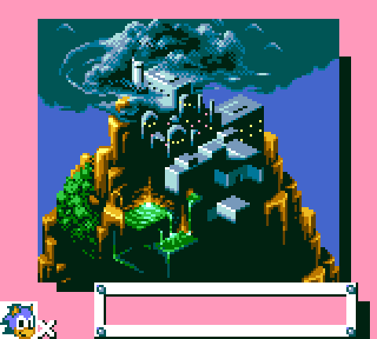
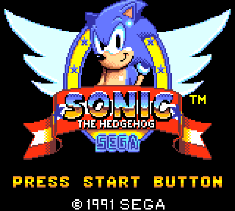

# Sonic the Hedgehog (Game Gear) — cartridge format and game analysis

A reverse-engineering reference for `Sonic The Hedgehog (Japan, USA).gg`, the Sega
Game Gear release of Sonic the Hedgehog. This is the first Z80 / Sega title in this
repository — and the first cartridge ROM rather than a tape or disk — and the
writeup follows the same shape as the C64 and Amiga games, in reading order:

* **Part I** — the cartridge image: the flat ROM dump, the Game Gear's memory map,
  the bank-switching mapper, and the cartridge header;
* **Part II** — boot and initialization: the Z80 reset sequence, the VDP, RAM and
  mapper setup, and the path to the main loop;
* **Part III** — engine architecture: the main loop, interrupt handling, the RAM
  layout and how banked resources are reached;
* **Part IV** — graphics and data formats: the VDP tile/tilemap/palette/sprite
  encodings and the level and object data;
* **Part V** — game mechanics: Sonic's physics, the objects, the zones, scoring
  and progression.
* **Appendix** — toolchain and reproduction.

Methods: purely static analysis of the ROM image, plus the Z80 toolchain built for
it in the shared `tools/` module — the disassemblers (`tools/cmd/disz80`,
`tools/cmd/codetracez80`) over the `tools/z80` decoder. All addresses are Z80
addresses (16-bit, `$0000`–`$FFFF`) unless a *file offset* is called out; bytes are
8-bit. Parts I–III are complete and Part IV is under way; Part V is stubbed.

---

## Contents

- [Part I — The cartridge image](#part-i--the-cartridge-image)
  - [1. The ROM dump](#1-the-rom-dump)
  - [2. The Z80 address space and bank switching](#2-the-z80-address-space-and-bank-switching)
  - [3. The memory map](#3-the-memory-map)
  - [4. The cartridge header (`TMR SEGA`)](#4-the-cartridge-header-tmr-sega)
  - [5. The CPU vectors](#5-the-cpu-vectors)
  - [6. What's in each bank](#6-whats-in-each-bank)
- [Part II — Boot and initialization](#part-ii--boot-and-initialization)
  - [1. Cold-start init (`$0296`)](#1-cold-start-init-0296)
  - [2. Cross-bank calls and the `RST` gateways](#2-cross-bank-calls-and-the-rst-gateways)
  - [3. The frame-interrupt handler (`$0073`)](#3-the-frame-interrupt-handler-0073)
  - [4. The main entry (`$1356`)](#4-the-main-entry-1356)
- [Part III — Engine architecture](#part-iii--engine-architecture)
  - [1. The attract loop and the scene state machine](#1-the-attract-loop-and-the-scene-state-machine)
  - [2. The title, and waiting for Start](#2-the-title-and-waiting-for-start)
  - [3. The world map (decoded by tracing, not the oracle)](#3-the-world-map-decoded-by-tracing-not-the-oracle)
  - [4. How far pure tracing reaches — and the level-load frontier](#4-how-far-pure-tracing-reaches--and-the-level-load-frontier)
- [Part IV — Graphics and data formats](#part-iv--graphics-and-data-formats)
  - [1. The VDP formats](#1-the-vdp-formats)
  - [2. The graphics decompressor](#2-the-graphics-decompressor)
  - [3. The opening screens: how they are built](#3-the-opening-screens-how-they-are-built)
  - [4. Level maps: how a zone is stored and drawn](#4-level-maps-how-a-zone-is-stored-and-drawn)
- [Part V — Game mechanics](#part-v--game-mechanics)
- [Appendix A — Toolchain and reproduction](#appendix-a--toolchain-and-reproduction)

---

# Part I — The cartridge image

A cartridge is the simplest image format in this repository. There is **no
container, no filesystem and no loader** — unlike the C64 tape (a pulse stream you
have to decode) or the Amiga disk (an AmigaDOS filesystem you have to walk). The
`.gg` file is a verbatim copy of the cartridge's mask-ROM chip: byte *N* of the
file is exactly the byte the Z80 reads from the chip at ROM offset *N*. So Part I
is short — there is nothing to *extract*. The only real structure is the **memory
map** the console imposes on those bytes (because the ROM is bigger than the CPU
can address at once) and a small **header** Sega stamps near the front.

## 1. The ROM dump

The image is **262,144 bytes = 256 KB = 2 Mbit**, an exact power of two. It carries
**no 512-byte copier header** (some circulating `.sms`/`.gg` dumps prepend one; this
one does not — the size is a clean power of two and the Sega header lands exactly at
its canonical offset, [§4](#4-the-cartridge-header-tmr-sega)). The exact copy this
analysis is based on is pinned by size and MD5 in the repository
[README](README.md#image-files).

That's the whole "format". Everything else in this part is about how the **console**
sees those 256 KB.

## 2. The Z80 address space and bank switching

The Game Gear's CPU is a Zilog Z80 with a **16-bit address bus**, so it can only
address **64 KB at a time**. The cartridge holds **256 KB**, four times that. The
ROM therefore cannot be mapped flat; it is divided into **16 banks of 16 KB**
(bank *b* = file offset `b × $4000`), and a small mapping circuit — the standard
**Sega memory mapper** — pages a chosen bank into one of three 16 KB *slots* in the
low 48 KB of the Z80's address space. The top 16 KB is the console's work RAM.

Which bank is visible in each slot is selected by writing the bank number to one of
four mapper registers, which live at the very top of the address space:

| Register | Effect |
|---|---|
| `$FFFC` | mapper control — cartridge-RAM enable / which RAM bank maps into slot 2 |
| `$FFFD` | bank number for **slot 0** (`$0000`–`$3FFF`) |
| `$FFFE` | bank number for **slot 1** (`$4000`–`$7FFF`) |
| `$FFFF` | bank number for **slot 2** (`$8000`–`$BFFF`) |

Those registers physically *are* the top four bytes of work RAM (the RAM is mirrored
into `$FFFC`–`$FFFF`), so a write both stores the byte and reprograms the mapper. At
reset the slots default to banks **0 / 1 / 2**, which is why the first 48 KB of the
ROM is the natural place for boot and core code. One important subtlety: the **first
1 KB (`$0000`–`$03FF`) is hard-wired to bank 0** and is *not* affected by `$FFFD`, so
the CPU vectors and the mapper-setup code below them are always reachable no matter
how slot 0 is paged.

For reverse engineering, this means a disassembler has to be told *which bank
configuration* it is looking at. The `tools/cmd/disz80` linear disassembler takes a
file offset and the Z80 address it is mapped to (`-off … -base …`), and
`tools/cmd/codetracez80` traces one ≤64 KB configuration at a time; following calls
*across* a bank switch is a higher-level concern handled when the code is analysed
(Part II onward).

## 3. The memory map

Putting the mapper together with the console's RAM and I/O, the Z80 sees:

| Z80 range | Size | Contents |
|---|---:|---|
| `$0000`–`$03FF` | 1 KB | ROM **bank 0, fixed** (CPU vectors; never paged) |
| `$0400`–`$3FFF` | 15 KB | ROM **slot 0** (bank from `$FFFD`, default bank 0) |
| `$4000`–`$7FFF` | 16 KB | ROM **slot 1** (bank from `$FFFE`, default bank 1) |
| `$8000`–`$BFFF` | 16 KB | ROM **slot 2** (bank from `$FFFF`, default bank 2) — or cartridge RAM |
| `$C000`–`$DFFF` | 8 KB | **work RAM** |
| `$E000`–`$FFFB` | ~8 KB | work-RAM **mirror** of `$C000`–`$DFFF` |
| `$FFFC`–`$FFFF` | 4 B | **mapper registers** (in the RAM mirror; see §2) |

The graphics and sound hardware is *not* in this memory map — the Z80 reaches the
VDP and the PSG through the **I/O ports** (`IN`/`OUT`), which is exactly what the
reset code does (`IN A,($7E)` reads the VDP V-counter; see §5 and Part II). The
ports relevant here:

| Port | Direction | Use |
|---|---|---|
| `$00`–`$06` | write | Game Gear registers (start button, **stereo** sound control, …) |
| `$3E` | write | memory-control (enable/disable I/O, BIOS, RAM, card, …) |
| `$3F` | write | I/O port control (joypad TH lines) |
| `$7E`/`$7F` | read/write | VDP **V-counter / H-counter** (read) and **PSG** (write) |
| `$BE` | read/write | VDP **data** port |
| `$BF` | read/write | VDP **control/status** port |

(The Game Gear's 8 KB of work RAM is the only general-purpose RAM; there are no
hardware sprites' worth of extra RAM — the VDP's 16 KB VRAM and 64-byte CRAM are
addressed indirectly through the VDP data/control ports, covered in Part IV.)

## 4. The cartridge header (`TMR SEGA`)

Sega stamps a 16-byte header into the ROM at **`$7FF0`** — the last 16 bytes of the
first 32 KB, i.e. the tail of bank 1, a region always present in slots 0–1 at boot.
(The hardware also allows it at `$1FF0` or `$3FF0` for smaller ROMs; a 256 KB ROM
uses the canonical `$7FF0`.) Its purpose on the original hardware is the Master
System / export BIOS region+checksum check; the Game Gear has no such BIOS gate, so
the field is informational here. The bytes in this ROM:

```
$7FF0: 54 4D 52 20 53 45 47 41   "TMR SEGA"   8-byte magic
$7FF8: 00 00                      reserved
$7FFA: 00 00                      checksum (LE word) = $0000  (unused on GG)
$7FFC: 08 24 00                   BCD product code + version
$7FFF: 60                         region (hi nibble) + ROM-size code (lo nibble)
```

Decoded:

| Field | Bytes | Value | Meaning |
|---|---|---|---|
| Magic | `$7FF0`–`$7FF7` | `"TMR SEGA"` | identifies a Sega cartridge header |
| Checksum | `$7FFA`–`$7FFB` | `$0000` | left blank — the Game Gear never verifies it |
| Product code | `$7FFC`–`$7FFE` hi | BCD `…2408` | catalogue number (BCD digits, little-endian) |
| Version | `$7FFE` lo nibble | `0` | revision 0 |
| Region | `$7FFF` hi nibble | `6` | **Game Gear, export/international** |
| ROM size | `$7FFF` lo nibble | `0` | size code `$0` = **256 KB** — matches the file |

The region nibble distinguishes the platform/region the same way across all Sega
8-bit carts (`3` = SMS Japan, `4` = SMS Export, `5` = GG Japan, `6` = GG Export,
`7` = GG International); the `6` here is consistent with the "(Japan, USA)" dump
name. The ROM-size nibble (`$0` ⇒ 256 KB) agreeing with the actual 262,144-byte
file is a useful sanity check that the dump is whole and un-padded.

## 5. The CPU vectors

Because the first 1 KB is fixed to bank 0 (§2), the Z80's hard-wired entry points
all live at the bottom of the ROM and are always reachable. The Z80 has a fixed
reset address, eight one-byte `RST` call targets spaced 8 bytes apart, a maskable
interrupt vector and a non-maskable interrupt vector:

| Address | Vector | This ROM |
|---|---|---|
| `$0000` | **reset** (power-on / `RST $00`) | the boot sequence (below) |
| `$0008`–`$0030` | `RST $08`–`RST $30` call targets | the ones Sonic uses (`$18`/`$20`/`$28`) are each a `JP` to a common routine; the rest are unused/overlapped |
| `$0038` | **maskable interrupt** (`IM 1`) / `RST $38` | `JP $0073` (the VDP frame-interrupt handler) |
| `$0066` | **NMI** (the **Start/Pause** button) | the pause handler |

The reset code is the textbook Master System / Game Gear opening — disable
interrupts, select interrupt mode 1, busy-wait on the VDP until the raster reaches a
known line, then jump to the real initialization:

```
$0000  F3        DI               ; mask interrupts
$0001  ED 56     IM 1             ; mode 1 → INT vectors through $0038
$0003  DB 7E     IN A,($7E)       ; read the VDP V-counter
$0005  FE B0     CP $B0           ; reached scanline $B0?
$0007  20 FA     JR NZ,$0003      ; no → keep polling
$0009  C3 96 02  JP $0296         ; → main initialization (Part II)
```

The `RST` slots are a Z80 code-density trick: `RST $nn` is a **one-byte** call to a
fixed page-0 address, so the game routes its hottest common subroutines through them
(each vector is just a `JP` to the real code higher up). Recursive-descent tracing
from the three hardware entry points (`$0000`, `$0038`, `$0066`) confirms this —
`RST $38` alone has dozens of callers — and that is where Part II picks up, following
`JP $0296` into the initialization proper.

## 6. What's in each bank

§2 explained *how* banks are paged; this is *what* they hold, as far as the analysis
has reached. Banks 0, 3 and 8 are **traced** (Parts II / IV); the rest are
characterised here by content and by how the code pages them, and will be pinned down
as later parts trace them. Two cheap signals: the Shannon **entropy** of each 16 KB
bank (compressed data runs ~7 bits/byte, code and tables ~6, sparse data lower), and
whether the bank is paged with an **immediate** `LD A,n / LD ($FFFE/$FFFF),A` (a
fixed resource) or from a **variable** (which signals level-number-driven paging —
there are both in this ROM).

| Bank | File offset | Entropy | Role | Status |
|---:|---|---:|---|---|
| 0 | `$00000` | 6.85 | **main game code** — vectors, init, the VDP / load / maths routines | traced (Part II) |
| 1 | `$04000` | 6.72 | game code (the default slot-1 bank; the most-paged of all) | traced (called) |
| 2 | `$08000` | 6.43 | code / data (the default slot-2 bank) | paged ×9 |
| 3 | `$0C000` | 5.50 | the **`RST` dispatcher** — opens with a `JP` table (`C3 …`) | traced (Part II §2) |
| 4 | `$10000` | 5.96 | the **block → tiles table** (16 B/block = 4×4 tile indices) + block attributes | traced (Part IV §4) |
| 5 | `$14000` | 5.89 | **level data** — the act-descriptor table (`$5600`) + compressed block-index maps | traced (Part IV §4) |
| 6 | `$18000` | 6.18 | a pointer / resource **table** (4-byte records) + data | inferred |
| 7 | `$1C000` | 6.23 | data | inferred |
| 8 | `$20000` | 5.58 | **graphics** — tile patterns + the palette pointer table (`$7400`) | traced (Part IV) |
| 9 | `$24000` | 7.01 | **compressed** graphics / data | inferred (high entropy) |
| 10 | `$28000` | 6.11 | compressed data — likely **zone / level** data | inferred |
| 11–15 | `$2C000`–`$3FFFF` | 6.2–6.5 | **zone / level data and graphics**, paged by level number | inferred |

So your intuition holds: bank 0 is the engine, banks 8–9 hold graphics, and the upper
banks (10–15) carry the bulk, high-entropy data the code reaches through *variable*
bank writes — exactly the shape of level/zone assets spread across the ROM. Tying each
upper bank to a specific zone is a Part IV/V job, once the level loader is traced.

---

# Part II — Boot and initialization

The reset code (Part I §5) ends with `JP $0296`. That is the real cold start: it
programs the cartridge mapper, clears RAM and sets the stack, brings the VDP up in
Mode 4, hides the sprites, runs a setup routine in another bank through the game's
banked-call gateway, and hands off to the main entry at `$1356`. This part walks
that path and the per-frame interrupt the init arms.

## 1. Cold-start init (`$0296`)

**Mapper.** First it re-asserts the default bank layout (Part I §2):

```
$0296  LD A,$80 / LD ($FFFC),A   ; mapper control ($80 = ROM mapping, no cart RAM)
$029B  LD A,$00 / LD ($FFFD),A   ; slot 0 <- bank 0
$02A0  LD A,$01 / LD ($FFFE),A   ; slot 1 <- bank 1
$02A5  LD A,$02 / LD ($FFFF),A   ; slot 2 <- bank 2
```

**RAM clear + stack.** The classic Z80 "fill by overlapping `LDIR`" — write one
zero, then copy it forward through itself:

```
$02AA  LD HL,$C000 / LD DE,$C001 / LD BC,$1FEF
$02B3  LD (HL),L                 ; (HL) = $00  (L is $00)
$02B4  LDIR                      ; propagate $00 across $C000..$DFEF
$02B6  LD SP,HL                  ; SP = $DFEF
```

It clears the 8 KB of work RAM up to `$DFEF`, stopping 16 bytes short of the top so
it does not clobber the mapper-register mirror at `$DFFC`–`$DFFF` (Part I §2), then
parks the stack at the top of the cleared region.

**VDP registers.** Eleven registers are written from a table at `$031C`, with a
shadow copy kept in RAM at `$D219` (the interrupt handler reads it back, §3):

```
$02B7  LD HL,$031C / LD DE,$D219     ; table, RAM shadow
$02BD  LD B,$0B / LD C,$8B           ; 11 registers
$02C1  loop: LD A,(HL) / LD (DE),A / INC HL / INC DE
             OUT ($BF),A             ; the value -> VDP control port $BF
             LD A,C / SUB B / OUT ($BF),A   ; ($8B-B) = $80|reg -> control port
             DJNZ loop
```

A VDP register write is two bytes to control port `$BF`: the value, then
`$80 | regnum`. The table (`26 A2 FF FF FF FF FF 00 00 00 FF`):

| Reg | Value | Meaning |
|---|---|---|
| 0 | `$26` | Mode Control 1: **Mode 4**, hide the left 8-px column |
| 1 | `$A2` | Mode Control 2: display **off** (during init), frame interrupt **on**, 8×16 sprites |
| 2 | `$FF` | name-table base → `$3800` |
| 3, 4 | `$FF` | unused on this VDP |
| 5 | `$FF` | sprite-attribute-table base → `$3F00` |
| 6 | `$FF` | sprite-pattern base → `$2000` |
| 7 | `$00` | backdrop colour = palette entry 0 |
| 8, 9 | `$00` | horizontal / vertical scroll = 0 |
| 10 | `$FF` | line counter (line interrupt off) |

The display stays off here and is turned on later once the first screen is built;
the detailed register semantics are Part IV.

**Hide the sprites.** A VDP fill clears the Sprite Attribute Table:

```
$02CD  LD HL,$3F00 / LD BC,$0040 / LD A,$E0
$02D5  CALL $05F0
```

`$05F0` is the engine's **VDP fill** primitive — `fill(addr=HL, count=BC, byte=A)`:

```
$05F0  LD E,A
       LD A,L / OUT ($BF),A          ; VRAM address, low byte
       LD A,H / OR $40 / OUT ($BF),A ; address high | $40  ($40 = "write VRAM")
       loop: LD A,E / OUT ($BE),A    ; byte -> VDP data port $BE
             DEC BC / LD A,B / OR C / JR NZ
       RET
```

The high address byte is OR'd with the VDP's write-VRAM command (`$00` read VRAM,
`$40` write VRAM, `$80` write register, `$C0` write CRAM). Here it writes `$E0`
across the 64 bytes of the Sprite Attribute Table at `$3F00`, setting every sprite's
Y off-screen — **hiding all 64 sprites** before the display comes on.

**Handoff.**

```
$02D8  CALL $02F8       ; run a setup routine in bank 3 (§2)
$02DB  LD IY,$D200      ; IY = the game-state RAM block
$02DF  JP $1356         ; -> main entry (§4)
```

## 2. Cross-bank calls and the `RST` gateways

`$02F8` is one of three short **banked-call thunks** at the bottom of the home bank,
and they are exactly the `RST $18/$20/$28` vectors (Part I §5: `$0018 JP $02E2`,
`$0020 JP $02F8`, `$0028 JP $0309`). Each pages a fixed bank into slot 1, calls a
fixed entry in it, then restores the previous bank:

```
$02F8  DI
       LD A,$03 / LD ($FFFE),A       ; slot 1 <- bank 3
       CALL $4006                    ; call the bank-3 routine
       LD A,($D22F) / LD ($FFFE),A   ; slot 1 <- previous bank (shadow)
       EI
       RET
```

So a one-byte `RST $20` is a gateway into bank 3 at `$4006` (and `RST $18`→`$4012`,
`RST $28`→`$4015`); bank 3 holds a dispatcher the engine reaches through these
1-byte calls. The "previous bank" is read back from a RAM **shadow** at `$D22F`: the
game keeps `$D22F` = the current slot-1 bank and `$D230` = the current slot-2 bank so
banked calls can nest and restore correctly. (The banking/dispatch system is Part III.)

## 3. The frame-interrupt handler (`$0073`)

The `$0038` maskable-interrupt vector is `JP $0073` — the per-frame (vblank) handler
that drives timing once `EI` runs at the main entry:

```
$0073  DI / PUSH AF / PUSH HL / PUSH DE / PUSH BC
       IN A,($BF)               ; read VDP status — acknowledges the interrupt
       BIT 7,(IY+6) / JR Z,…    ; only do frame work when a game-state flag is set
       … VDP scroll + line-counter (reg 10 / $8A) setup …
       PUSH IX / PUSH IY
       LD HL,($D22F)            ; preserve the banked context across the IRQ
       …
```

Reading the VDP status port `$BF` is the interrupt acknowledge (it clears the
pending-interrupt flag). The handler is gated on a game-state bit (`IY+6` bit 7),
preserves the index registers and the bank shadows, and reprograms the VDP **line
counter** to fire a mid-frame line interrupt — the standard trick for a fixed status
bar above a scrolling playfield.

## 4. The main entry (`$1356`)

```
$1356  SET 0,(IY+0)                       ; arm the main game-state flag
       EI                                 ; interrupts on — the frame handler now runs
       LD A,$01 / LD ($FFFE),A / LD ($D22F),A   ; slot 1 <- bank 1 (+ shadow)
       LD A,$02 / LD ($FFFF),A / LD ($D230),A   ; slot 2 <- bank 2 (+ shadow)
       RES 0,(IY+2) / RES 1,(IY+2)
       CALL $0645 / CALL $1CD7 / CALL $0AA3     ; subsystem init
       LD A,$03 / LD ($D240),A                  ; game mode <- 3
       …
```

The handoff into the game proper: enable interrupts, set the bank shadows to the
running configuration, clear state flags, run the subsystem initializers, and set
the top-level **game-mode** variable `$D240` (the state-machine selector — title,
level, … — the subject of Part III). From here control is in the main loop.

### RAM landmarks established so far

| Address | Use |
|---|---|
| `$D200` | game-state block (the `IY` base; `IY+0/+2/+6` are flag bytes) |
| `$D219`… | shadow copy of VDP registers 0–10 |
| `$D22F` | current **slot-1** bank number (for banked-call restore) |
| `$D230` | current **slot-2** bank number |
| `$D240` | top-level **game mode** |

# Part III — Engine architecture

This part follows the engine *forward* from the opening, **by tracing the code**, to
see how far the title → world map → level chain can be reconstructed without running
the game. The answer turns out to be: the whole control skeleton, and every screen up
to and including the world map, comes out of static disassembly; the level load
itself sits behind a cross-bank dispatcher and is the marked frontier (§4).

## 1. The attract loop and the scene state machine

After init (Part II), `main_entry` (`$1356`) loads the SEGA logo and then enters an
**attract loop**. The loop is driven by a one-byte **scene counter** `$D238`: each
pass loads a screen, fades it in, runs it, and advances; when `$D238` reaches `$13`
the loop jumps back to `$135B` and replays from the logo. The skeleton is:

```
$13C5  LD A,($D238) / CP $13 / JP NC,$135B   ; past the last scene -> restart attract
$13D8  CALL $0BDD                            ; scene dispatcher: load this scene's screen
$13E4  CALL $0AA3                            ; fade the screen in
$13F0  BIT 4,(IY+6) / JR NZ,$1402            ; Start pressed? skip the idle wait
$13F6  (wait ~60 frames via $0327)
$1402  CALL $1414                            ; run the scene; returns 0/1/2 = restart/next/stay
```

Each scene is described by a **~40-byte descriptor** in a table in bank 5 at `$5600`
(18 entries; `$1414` indexes it by `$D238`, and `$185D` copies the descriptor into RAM
at `$D355` to run it). The dispatcher `$0BDD` maps the scene to a **screen type**:
scenes 0–8 are type 1 (the title background, loaded near `$0C1C`), scenes 9–17 are
type 2 (the world map, `$0C7A`). It only *reloads* the background when the type changes
(`$0C0E`: compare the new type with the previous one in `$D217`, skip if equal) — so
the title background stays up across scenes 0–8 while only the foreground animates, and
the map likewise persists across its scenes.

## 2. The title, and waiting for Start

Scenes 0–8 keep the title background (Part IV §3) up while their scripts animate Sonic
(the finger-tapping pose is sprite animation, driven by the per-scene script and the
sprite engine of Part IV §3) and blink `PRESS START BUTTON` via the string blitter
`$0612`. The wait for Start is not a poll loop; it is folded into the attract loop
through two flags:

- `$0602` reads the controller every frame into `(IY+3)` — **Start** is GG port `$00`
  bit 7, the D-pad/buttons are port `$DC`.
- When Start is pressed, a handler raises the **launch flag** `(IY+6) bit 4` and writes
  a **target scene** into `$D2D4` (e.g. `$53C4` in bank 1, or `$017FE`). On the next
  pass the attract loop sees the flag: `$13F0` skips the idle wait, and `$141F` uses
  `$D2D4` instead of the counter — so Start *jumps the sequence* out of the demo and
  into the post-title flow rather than letting it free-run.

This is also why the logo and title are skippable: `$1D47` (`BIT 7,(IY+3)`) checks the
very same Start bit during the logo.

## 3. The world map (decoded by tracing, not the oracle)

The world map is reconstructed here entirely from reading the loader code — no
emulator. A map loader (e.g. `$0C7A`) does three things, each traceable:

- background tiles: `$0406`-decompressed from a `(bank $0C, addr)` block;
- name table: a **stored RLE map** in bank 5, loaded by `$0502` (the codec of Part IV
  §3) — `extract/decomp.LoadRLE` reimplements it;
- palette: `$0AAB` loads a black start (index `$16`) and **fades toward** the real
  targets from the bank-8 table.

[`extract/cmd/scenemap`](extract/cmd/scenemap) replays exactly those steps.

### Two maps, switched by an upcoming-level countdown

There are **two** world-map screens — a different tile set *and* a different stored
map for each — and the engine picks between them by the level you are heading into.
The selector is the byte `$D279`, which is **decremented after each level** (bank 1
`$46F9`: `DEC A / LD ($D279),A`), so it is a *countdown* toward the final stage. Every
map loader branches on it the same way:

```
LD A,($D279) / CP $06 / JR C,zoomed      ; <6 left -> zoom in; >=6 -> wide
```

This exact test appears at `$2006`, bank 1 `$466A`, and bank 2 `$BF0D`. Because
`$D279` counts down, **early** levels (count ≥ 6) show the **wide** island and **late**
levels (count < 6) **zoom in** on the mountain-top goal — which is the progression you
see in play. The two variants compose like this (both rendered statically by `scenemap`):

| variant | branch | tiles | bank-5 map | palette |
|---------|--------|-------|------------|---------|
| wide island | `$D279 ≥ 6` | `(bank $0C,$0000)` | `$6F86` + `$716A` | bg `$0A` / spr `$0B` |
| zoomed peak | `$D279 < 6` | `(bank $0C,$171A)` | `$6C6D` + `$6DC3` | bg `$0C` / spr `$0D` |




It is the same island both times: the castle/ruin on the peak of the wide shot is the
detailed city that fills the zoomed shot. Decoding each from its own tile set and
`$0502` map confirms the switch is a genuine two-asset branch, not a camera move.

### The blinking route

On either map the **route and the zone name** are not in the stored map — they are a
per-scene overlay. A map loader's tail calls the string blitter `$0612` with per-scene
data (the `$1163`/`$0EA8` tables → `$D211`), so each stop lights a different zone. The
blink is that overlay repainted on a timer — the same `$0612` name-table-run mechanism
as the blinking `PRESS START` (Part IV §3), just driven by per-scene position data.

## 4. How far pure tracing reaches — and the level-load frontier

Up to here, **everything was traceable statically**: the attract state machine, the
Start hand-off, and the world map (rendered above from located data, the same way the
opening screens were). The level load is where it gets harder, and following the
launch reveals exactly why.

**Gameplay is launched from inside a scene, not from the loop.** The attract loop
(§1) never exits: its tail (`$1405`) only ever restarts the demo, advances to the next
scene, or re-fades the current one. So pressing Start does not "return into the game" —
it selects a target scene (§2) whose script *itself* loads the level and jumps into the
gameplay engine, never coming back. The scene scripts are the bank-5 data interpreted
by `$185D`, so the trigger is a data table, not a call you can read directly.

**The cross-bank calls go through a dispatcher in bank 3.** The `RST $18/$20/$28`
gateways (Part II §2) land on a jump table at bank 3 `$4000`; `RST $28` (`$46FF`) and
`RST $18` (`$46EB`) are themselves sub-dispatchers that index a function table by the
selector in `A` and call into yet another bank. This is how the engine reaches code
outside the home 64 KB — and it is why a bank-0-only disassembly can't follow the
thread: the function tables point into banks that aren't mapped in this configuration.

**The gameplay engine and the level variables live in bank 1.** Tracing the level
RAM gives concrete coordinates: the tile-stream source `$D289` and count `$D28D` are
set at bank 1 `$4EC4`/`$4EC9`, the camera `$D2AB` at `$502C`, the map base `$D2AF`
around `$5050`/`$73BB`/`$7B78` (and bank 2). The routine at bank 1 `$4EA0` is the
per-frame **scroll/camera update** — each frame it recomputes the tile-stream source
from the camera position, which is what feeds the streamer `$31BC` and `scroll_draw`
`$3282` (the gameplay update `$0130`, which has no `CALL` site in bank 0 because it is
reached by jump from this engine, not called from home code).

So the honest verdict on doing it "without cheating": the opening — logo, title, the
Start wait, and the world map — is **fully** recoverable by tracing, data and all. The
launch *mechanism* is traced too (scene-script trigger → bank-3 dispatcher → the bank-1
gameplay engine). What pure bank-0 tracing could not finish was the **level format**
itself, because the engine that draws it runs from banked code the home disassembly
can't follow. That decode is done in **Part IV §4**, with the Game Gear machine model
as an oracle to pin the banked routines and tables: the compressed block-index map, the
block → tiles table, and the tile graphics — enough to reconstruct a whole zone from the
ROM. (One correction lands there: the terrain is drawn by the column expander `$0760`,
*not* `scroll_draw` `$3282`, which handles objects.) The **object layout** is what is
left for Part V.

# Part IV — Graphics and data formats

Graphics on the Game Gear are two layers of problem: the fixed **VDP hardware
formats** the data ends up in (§1), and the game-specific **compression** it is
stored under in the ROM (§2). With both decoded we can take a routine that loads a
screen and reproduce its pixels exactly — §3 does this for the first screen the
console shows, and §4 does it for a whole scrolling level, both as end-to-end checks.

## 1. The VDP formats

These are standard Mode-4 hardware formats, decoded by the reusable
[`tools/gamegear`](tools/gamegear) package (so they are shared, not Sonic-specific):

- **Tiles** — 8×8 pixels, **4 bitplanes** (16 colours), **32 bytes** each, stored
  *row-interleaved*: each pixel row is 4 bytes (one per bitplane), and pixel *x*'s
  colour index is bit `7-x` of each plane (low plane = bit 0). `DecodeTile`.
- **Palette (CRAM)** — 32 entries of **2 bytes**, **12-bit** colour, 4 bits per
  channel in **BGR** order (`0000 BBBB GGGG RRRR`); a 4-bit channel scales to 8-bit
  by ×17. Indices 0–15 are the **background** palette, 16–31 the **sprite** palette.
  `Palette`.
- **Name table** — the 32×28 background map at VRAM `$3800`; each cell is a 2-byte
  word: the 9-bit tile number plus per-cell horizontal/vertical **flip**, **palette
  select** and **priority** bits. `DecodeNameEntry` / `RenderNameTable`.

## 2. The graphics decompressor

Almost all of Sonic's art is compressed (Part I §6: the upper banks run at ~7
bits/byte). The decompressor is the routine at **`$0406`**; it is a **4-byte-unit
LZ** — a literal/back-reference scheme whose unit is one *tile row* (4 bitplane
bytes), so a repeated row (a blank row, a flat fill) costs a single bit. It is a
game-specific *software* codec, so it lives in the game's
[`extract/decomp`](extract/decomp) module, not in `tools/gamegear`.

A compressed block is addressed as a `(bank, address)` pair; the routine's prologue
**normalises** it (`while addr ≥ $4000: addr -= $4000; bank++`) and maps two
consecutive banks into the slots, so a block may span banks. The block then is:

```
+0  word   (skipped)
+2  word1  offset to the match-info stream
+4  word2  offset to the literal stream (also the back-reference base)
+6  word3  count — number of 4-byte output units
+8  …      control bitmap: one bit per output unit
+word1     match-info stream: variable-length back-reference offsets
+word2     literal stream: 4-byte units
```

Decoding walks `count` units; for unit *i*, control bit *i* (`bitmap[i>>3] &
(1<<(i&7))`) selects:

- **0 — literal:** emit the next 4 bytes of the literal stream and advance it.
- **1 — match:** read an offset from the match-info stream — one byte `b`, but if
  `b ≥ $F0` it is a two-byte big value `((b-$F0)<<8) | next` — and emit the 4 bytes
  at `literal_base + offset×4` (a back-reference to an earlier unit).

So the literal stream is the set of distinct 4-byte tile rows in first-appearance
order, and the bitmap + match offsets reconstruct the full tile data from them.

## 3. The opening screens: how they are built

The two screens the console shows before the menu — the **SEGA logo** and the
**title** — are interesting because they reach the same VRAM by *opposite* routes.
The logo's tile map is **computed in code**; the title's is a **stored, compressed
map** loaded wholesale. Both then get a per-frame sprite layer and, on the title, a
blinking text overlay. This section follows the actual routines.

To do that I let the game run and watched what it did, using the Game Gear machine
model in [`tools/gamegear`](../../tools/gamegear) (the `z80` core wired to RAM, the
Sega mapper and a VDP that captures VRAM/CRAM) as an *oracle*. Two things make it a
tracing tool rather than just a renderer: [`extract/cmd/screentrace`](extract/cmd/screentrace)
fingerprints VRAM every frame (so palette fades don't hide the moments the picture
actually changes), and the VDP carries a **write watchpoint** — arm a VRAM address
range and it records the PC of every routine that writes there. The final images
below are read back from the real VRAM the code produced; the addresses are from the
disassembler. Each confirms the other.

### The SEGA logo — a procedural reveal (`$1CD7`)

`sega_logo` first decompresses its tiles (`$0406` from `(bank $0C,$FA74)`, 96 logo
tiles to VRAM `$0000`; a sprite set to `$2000`) and selects palette index `$12`, the
blue-on-white set. Then it **clears the whole name table to tile `$70`** (`$1D1B`: a
896-entry fill, which the watchpoint sees as 896 writes from `$1D1F`). There is no
stored tile map for the logo at all.

The picture is built by a loop (`$1D3E`–`$1D5C`) that walks a position counter
`$D213` from `$2C` to `$6C` in steps of 4 — sixteen iterations, one per column. Each
iteration calls `$1E8A`, which writes **one vertical 6-tile column** straight into the
name table: it derives the column's VRAM address from `$D213`, then writes tiles
`c, c+16, c+32, … c+80` down the column (stride `$40` = one row), high byte `$00`.
Because the column index is `c` and each row adds 16, cell *(row,col)* ends up holding
tile `col + 16·row` — a plain `0…95` identity grid over a 16×6 rectangle. The logo
tiles are stored in reading order, so the "map" *is* the identity; the cleverness is
that the loop lays it down **one column at a time, left to right**, so the logo wipes
in. (Render it mid-build and you get `SEG` before the `A` — exactly that left-to-right
edge.) In lockstep, `$1EC1`→`$2F07` build a small **sprite** display list in RAM at
`$D000` — three rows of entries, `$FE`=skip / `$FF`=end, offset per row by the
symmetric table at `$1F14` (`00 FD FB F8 … F0 … F8 FB FD`, i.e. an arc) — which the
frame interrupt flushes to the sprite-attribute table at `$3F00`/`$3F80` (`$033F`)
every vblank. That is the moving highlight that sweeps the letters.

So the logo is: an identity background grid revealed column-by-column, plus an
animated sprite shine. Read back from the oracle's VRAM, the finished frame is:


### The title — a stored, compressed map (`$0C20`)

The title takes the other approach. `$0C20` decompresses three tile blocks (`$0406`
from bank `$0C` to VRAM `$0000`, and two blocks from bank 9 to `$2000`/`$3000`), then
**loads the name table from a stored map** with `$0502` — twice:

```
$0C4C  HL=$6962  BC=$019B  DE=$3800  $D20F=$10   ; base layer, 411 entries, priority bit
$0C5F  HL=$6AFD  BC=$0170  DE=$3800  $D20F=$00   ; overlay,    368 entries
```

`$0502` is a tiny **RLE name-table loader**: it streams tile bytes from the source
(in bank 5), expanding runs of a repeated tile, until an `$FF` terminator, and writes
each entry as *(tile byte, `$D20F`)* — so `$D20F` supplies the shared high byte
(palette select and the priority bit) for the whole layer. The two passes compose the
image: a priority base (`$D20F=$10`, drawn in front of sprites) and a plain overlay
(`$00`). 411 + 368 ≈ the 767 non-background cells the screen ends up with — a
full-screen picture loaded in one shot (the watchpoint attributes those ~768 writes to
`$0502`'s literal and run loops at `$052D`/`$054B`). No per-tile code, no reveal: the
map was authored offline and compressed into the ROM.



### `PRESS START BUTTON` — a text overlay (`$0612`)

The prompt is not part of the stored map; it is painted on afterwards and blinks
(the oracle shows it off at frame 620, on at 660, off again at 700). It is drawn by
`$0612`, a **name-table string blitter**: it reads a packed *(row,col)* header,
computes the `$3800` address, then writes a run of tile bytes from a source list
(terminated by `$FF`), again taking the high byte from `$D20F`. Its inner loop
(`$063A`) is the single busiest name-table writer in the whole attract sequence,
because it repaints the prompt every time it toggles. The blink and the "is Start
held?" test share one input byte: `$0602` reads the controller — Start from GG port
`$00` bit 7, the D-pad from port `$DC` — into `(IY+3)`, the same flag the logo checks
(`BIT 7,(IY+3)` at `$1D47`) so the sequence can be skipped.

### A note on the sequence (and a correction)

The progression logo → title → menu is **timed/scripted**, not a single mode switch.
In particular `$D240` — earlier guessed to be the top-level "game mode" — holds `$0A`
unchanged across the whole logo→title transition; the disassembly shows it used as a
name-table scroll index (`$0E35`/`$4969`, ×10) and a frame countdown (`$472E`), not a
screen selector. Mapping the actual attract script is Part III's job; the point here
is the drawing, and the drawing is fully accounted for above.

## 4. Level maps: how a zone is stored and drawn

The opening screens (§3) are single static pictures. A *level* is different: it is far
wider than the screen, it scrolls, and it is built from a small alphabet of reusable
**blocks** rather than per-cell tile numbers. Sonic stores a level as three nested
layers — a compressed **block-index map**, a **block → tiles** table, and the **tile
graphics** — plus a palette. Decoding all three lets us reproduce a whole level from the
ROM alone; the result for Zone 0 (Green Hills Act 1) is the image at the end of this
section, rendered by [`extract/cmd/levelmap`](extract/cmd/levelmap).

This was the one part the oracle could **not** brute-force. The machine model loads and
draws a level, but it is not cycle-accurate enough to play one: holding Right+Jump makes
Sonic run, yet he stalls roughly a quarter of the way in, so no amount of scrolling
reveals the whole map. The only way to the full level was to decode the storage formats
and expand them statically — which is what follows. (Each format was still *checked*
against the oracle: the decompressed map is asserted byte-for-byte against the live
machine's output, and the tiles/palette are the real ones the level loaded.)

### The pipeline

```
bank 5 compressed map ──$0A73 RLE──▶ RAM $C000 window ──$0760 expand──▶ name table ──$0860──▶ VRAM
 (block indices)                      (16×256 block grid)   │ block→16 tiles               (one column
                                                            ▼   (bank 4 table)               at a time)
                                                       tile graphics in VRAM (bank-stored, $0406-decompressed)
```

A level is loaded by the resource loader at **`$199D`**, driven by a 40-byte
**descriptor** for the act (the descriptor table is at bank 5 `$5600`, indexed by act
number; see Part III). The loader reads a chain of `(address, length)` records out of
the descriptor and, for each, pages the right bank and decompresses it: the **map** to
RAM `$C000` (`$0A73`), then it records the **block tile table** address in `$D249`, then
it `$0406`-decompresses the **tile graphics** into VRAM. So everything below is reachable
from one descriptor.

### The block-index map (`$0A73`)

The map itself is a **run-length-compressed list of block indices**. For Zone 0 it lives
in **bank 5, file `$17430`** (z80 `$7430`), is `$0786` = 1926 bytes, and decompresses to
exactly **4096 bytes** — a **16-row × 256-column** grid, row-major with a 256-byte stride
(`block = map[row*256 + col]`; the stride comes from `$D232`). Row is vertical (row 0 =
top of the sky, row 15 = the bottom ground fill), column is horizontal. The decompressor
`$0A73` writes this grid to the RAM window at **`$C000`**, where the engine reads it as it
scrolls.

`$0A73` is a small RLE codec, the same family as the `$0502` name-table loader (§3) but
for a raw byte stream:

- it keeps the previously written byte; a source byte **equal** to it triggers a **run**
  — the duplicate is followed by a **count** byte and the value is emitted *count* more
  times (the count is a `DJNZ` counter, so `$00` means **256**);
- any other byte is a **literal**;
- after a run the "previous byte" is re-armed so the next byte always starts fresh;
- there is **no terminator** — decoding is bounded purely by the length (`BC`).

It is reimplemented as [`extract/decomp.LoadMapRLE`](extract/decomp/nametable.go) and
verified byte-perfect against the live decompressor's `$C000` output. At 1926 → 4096
bytes it is a modest 2.1×, because most of the map is long runs of sky (block 0) and
ground fill (block 1). The **scenery is part of the block map**, though: the hills, palm
trees, flowers and ring graphics in the render below are all drawn from blocks — that
surface detail is exactly what the run-length coding can't collapse, and why the ratio is
2.1× rather than higher. The block map *is* the whole static scene. What it does **not**
contain is the **object** layer — the moving, interactive entities (Sonic, enemies, and
whatever the game tracks for collection and collision); see the note after the render.

### Blocks → tiles (bank 4, `$10000`)

Each block index expands to a **4×4 grid of 8×8 tiles** — a 32×32-pixel chunk — through a
**block tile table** at **bank 4, file `$10000`** (z80 `$4000`, read with bank 4 paged
into slot 1, which the expander's prologue at `$0726` arranges; the loader pointed `$D249`
here). Each block is **16 bytes**, row-major 4 wide, so

```
tile(r, c) = rom[$10000 + index*16 + r*4 + c]      r, c ∈ 0…3
```

For example block `$01` (ground) is `02 03 02 03 / 03 02 03 02 / …` — the checkerboard;
block `$00` (sky) is sixteen `00`s. The expander `$0760` reads one map column, looks up
each block's tiles and writes name-table cells into a column buffer at RAM `$D180`, which
`$0860` uploads to VRAM a column at a time as the camera crosses each 8-pixel boundary.
(The index→offset arithmetic in `$0760` — `RLCA`×4 then `XOR` the high nibble — *looks*
like a scramble but works out to exactly `index*16`.)

A second per-block table, the **attribute** table (`$D211`, found via `$343D[zone]`, also
in bank 4), gives one byte per block, of which only **bit 7** is used — a name-table
**priority** bit. There is no per-block flip or palette select, so all terrain draws from
the **background palette** and the pixels come entirely from the tile indices plus the
loaded tile set.

### The tile graphics and palette

The actual 8×8 tile patterns are compressed with the `$0406` codec (§2) and
`$0406`-decompressed into **VRAM `$0000`** at level load (a second block goes to `$2000`
for sprites). The block tile table indexes them as plain 0…255 tile numbers. The
**palette** is the standard 16-colour background set in CRAM 0–15 (§1) — light blue sky,
greens, the orange/brown ground.

### Where it all lives (Zone 0, Green Hills Act 1)

| Data | Stored at | Runtime | Format |
|---|---|---|---|
| Act descriptor table | bank 5 `$15600` (z80 `$5600`) | — | 18 word-pointers → 40-byte descriptors (Part III) |
| Compressed block-index map | bank 5 `$17430` (z80 `$7430`), 1926 B | → RAM `$C000` | `$0A73` RLE → 4096 B |
| Decompressed map | — | RAM `$C000`, 4096 B | 16 rows × 256 cols, row-major, stride 256 |
| Block tile table | bank 4 `$10000` (z80 `$4000`) | base in `$D249` | 16 B/block = 4×4 tile indices, row-major |
| Block attribute table | bank 4, via `$343D[zone]` | base in `$D211` | 1 B/block, bit 7 = priority |
| BG tile graphics | compressed in a level bank | VRAM `$0000` | 4-byte-unit LZ, `$0406` (§2) |
| BG palette | a palette bank | CRAM 0–15 | 12-bit BGR (§1) |

A block is 32×32 px (4×4 tiles), so the full **256×16-block** map is **1024×64 tiles =
8192×512 pixels**. Expanding every block through the table above, with the real tile set
and palette, reproduces the entire level:


*(Scaled to fit; the full-resolution 8192×512 render is
[`rendered/level_greenhills_full.png`](rendered/level_greenhills_full.png).)*

*Still open.* The **object** layer. The scenery above (trees, flowers, rings) is baked
into the block map, but the *interactive* world is not: Sonic, the enemies, and whatever
the game tracks for ring collection and collision are sprites/objects with their own tile
format and per-act data (the `$3282` `scroll_draw` path and the descriptor's per-act
pointers). A ring's graphic is in the blocks; whether a collectible ring is *also* an
object placed at the same spot is part of decoding that layer. That, and the other zones'
descriptors, are Part V.

# Part V — Game mechanics

*Stub.* Sonic's movement and physics, the object/enemy system, the zones and act
structure, rings, scoring and progression.

---

# Appendix A — Toolchain and reproduction

Static analysis only, with the Z80 toolchain in the shared `tools/` module:

- [`tools/z80`](../../tools/z80) — a Z80 decoder (`Decode`/`Disassemble`) built on
  the CPU's regular x/y/z/p/q opcode bit-fields, covering the `CB`/`ED`/`DD`/`FD`
  prefix pages, plus an **execution core** (`cpu.go`) for running real code.
- [`tools/gamegear`](../../tools/gamegear) — the Game Gear hardware: the VDP tile,
  palette and name-table decoders, and a minimal `Machine` (RAM + Sega mapper + VDP
  ports) that drives the Z80 core as an emulation oracle, with a per-region write
  counter and a **VRAM write watchpoint** (record the PC of whatever draws a given
  address range) used to attribute each part of a screen to its routine (Part IV §3).
- [`tools/cmd/disz80`](../../tools/cmd/disz80) — linear disassembler over a file slice
  mapped at a Z80 address: `disz80 -off FILEOFF -len N -base ADDR rom.gg`.
- [`tools/cmd/codetracez80`](../../tools/cmd/codetracez80) — recursive-descent
  disassembler from given entry points: `codetracez80 -load 0 -entry 0000,0038,0066 rom.gg`.
- [`extract/cmd/segascreen`](extract/cmd/segascreen) — runs the boot on the oracle and
  composes an exact opening screen from the live VRAM: `segascreen rom.gg out [frames]
  [name]` (the SEGA logo by default, the title screen at `650 title`; Part IV §3).
- [`extract/cmd/screentrace`](extract/cmd/screentrace) — fingerprints VRAM each frame
  to time the discrete screen loads and reports, via the watchpoint, which routines
  drew the name table (Part IV §3).
- [`extract/decomp`](extract/decomp) — standalone Go reimplementations of the two
  located codecs: the `$0406` tile decompressor (Part IV §2) and the `$0502` RLE
  name-table loader (`LoadRLE`, Part III §3).
- [`extract/cmd/titlegfx`](extract/cmd/titlegfx) — runs the `$0406` reimplementation on
  the logo tile block, cross-checking it against the game's own decompressor.
- [`extract/cmd/scenemap`](extract/cmd/scenemap) — statically decodes and renders the
  world map from the traced `$0C7A` loader (tiles + the `$0502` RLE map + palette
  `$0C`/`$0D`), with no emulation (Part III §3).

Reproduce the boot listing in Part I §5:

```sh
go run stupidcoder.com/tools/cmd/disz80 -off 0 -len 0x0C -base 0 \
    "Sonic (GG)/Sonic The Hedgehog (Japan, USA).gg"
```
