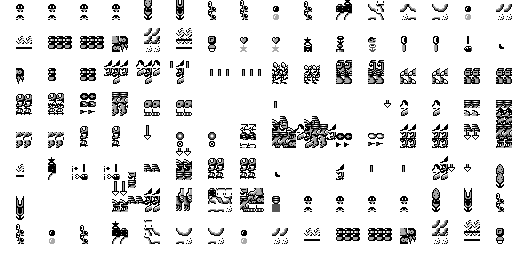
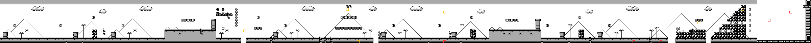

# Super Mario Land (Game Boy) — cartridge format and game analysis

A reverse-engineering reference for `Super Mario Land (World).gb`, the 1989 Game
Boy launch title. This is the first **Game Boy** title in this repository, and the
first **Sharp LR35902** ("GBZ80" / SM83) CPU — a relative of the Z80 but, as Part I
shows, *not* the same chip. The writeup follows the same shape as the C64, Amiga and
Game Gear games, in reading order:

* **Part I** — the cartridge image: the flat ROM dump, the Game Boy memory map, the
  MBC1 bank-switching mapper, the cartridge header, and the CPU vectors;
* **Part II** — boot and initialization: the LR35902 reset sequence, the LCD/audio
  and RAM setup, and the path to the main loop;
* **Part III** — engine architecture: the main loop, the VBlank/timer interrupt
  handlers, the RAM layout and how banked resources are reached;
* **Part IV** — graphics and data formats: the 2bpp tile, tilemap, OAM-sprite and
  palette encodings, and the level and object data;
* **Part V** — game mechanics: Mario's physics, the objects, the worlds, scoring
  and progression.
* **Appendix** — toolchain and reproduction.

Methods: purely static analysis of the ROM image. **Note the toolchain gap:** the
shared `tools/z80` decoder does *not* apply here — the Game Boy CPU is the Sharp
LR35902, which shares the Z80's register names and much of its opcode map but drops
the `IX`/`IY` index registers, the alternate register set and the `IN`/`OUT` ports,
and adds Game-Boy-specific opcodes (`LDH`, `LD (C),A`, `LD (a16),A`, `STOP`, `SWAP`,
`ADD SP,e`, `LD HL,SP+e`). A new LR35902 disassembler — **`tools/sm83`** with the
**`cmd/dissm83`** CLI — has been built for this game (mirroring `tools/z80`); the
hand decodes below were confirmed against it. All addresses are CPU addresses
(16-bit, `$0000`–`$FFFF`) unless a *file offset* is called out; bytes are 8-bit.
Parts I–IV are complete; Part V covers the game mechanics (objects, sprites, scripts,
pipes, collision and Mario's physics) — only scoring/progression bookkeeping is left.

---

## Contents

- [Part I — The cartridge image](#part-i--the-cartridge-image)
  - [1. The ROM dump](#1-the-rom-dump)
  - [2. The LR35902 address space and MBC1 bank switching](#2-the-lr35902-address-space-and-mbc1-bank-switching)
  - [3. The memory map](#3-the-memory-map)
  - [4. The cartridge header (`$0100`–`$014F`)](#4-the-cartridge-header-0100014f)
  - [5. The CPU vectors](#5-the-cpu-vectors)
  - [6. What's in each bank](#6-whats-in-each-bank)
- [Part II — Boot and initialization](#part-ii--boot-and-initialization)
  - [1. Entry and cold start (`$0100` → `$0150` → `$0185`)](#1-entry-and-cold-start-0100--0150--0185)
  - [2. Bringing up the hardware](#2-bringing-up-the-hardware)
  - [3. Clearing memory and the HRAM DMA routine](#3-clearing-memory-and-the-hram-dma-routine)
  - [4. The sound engine and the bank shadows](#4-the-sound-engine-and-the-bank-shadows)
  - [5. The interrupt handlers](#5-the-interrupt-handlers)
  - [6. The main loop (`$0226` → `$0296`)](#6-the-main-loop-0226--0296)
- [Part III — Engine architecture](#part-iii--engine-architecture)
  - [1. Two halves of a frame](#1-two-halves-of-a-frame)
  - [2. The state dispatcher (`RST $28` over `$FFB3`)](#2-the-state-dispatcher-rst-28-over-ffb3)
  - [3. The observed state flow](#3-the-observed-state-flow)
  - [4. Input](#4-input)
  - [5. The VBlank update chain](#5-the-vblank-update-chain)
  - [6. RAM, HRAM and the bank shadows](#6-ram-hram-and-the-bank-shadows)
- [Part IV — Graphics and data formats](#part-iv--graphics-and-data-formats)
  - [1. The 2bpp tile](#1-the-2bpp-tile)
  - [2. Tile addressing and the background maps](#2-tile-addressing-and-the-background-maps)
  - [3. Palettes](#3-palettes)
  - [4. Sprites (OAM)](#4-sprites-oam)
  - [5. How a level is drawn](#5-how-a-level-is-drawn)
  - [6. The level data format (frontier)](#6-the-level-data-format-frontier)
- [Part V — Game mechanics](#part-v--game-mechanics)
- [Part VI — Music and sound](#part-vi--music-and-sound)
- [Appendix A — Toolchain and reproduction](#appendix-a--toolchain-and-reproduction)

---

# Part I — The cartridge image

A cartridge is the simplest image format in this repository: there is **no
container, no filesystem and no loader** — unlike a C64 tape (a pulse stream you have
to decode) or an Amiga disk (an AmigaDOS filesystem you have to walk). The `.gb`
file is a verbatim copy of the cartridge's mask-ROM chip: byte *N* of the file is
exactly the byte the CPU reads from the chip at ROM offset *N*. So there is nothing
to *extract*. The structure that matters is the **memory map** the console imposes
(the ROM is bigger than the CPU can address at once), a small **header** Nintendo
stamps near the front, and the fixed **CPU vectors** at the very bottom.

## 1. The ROM dump

The image is **65,536 bytes = 64 KB = 512 Kbit**, an exact power of two. It carries
**no copier header** (some circulating dumps prepend a few hundred bytes of metadata;
this one does not — the size is a clean power of two and the header lands exactly at
its canonical offset `$0100`). The exact copy this analysis is based on is pinned by
size and MD5 in the repository [README](../README.md#image-files).

Two integrity fields in the header confirm the dump is intact and untampered, and
both **verify** for this file:

- the **header checksum** at `$014D` = `$9E`. The Game Boy boot ROM computes
  `x = 0; for a in $0134..$014C: x = x − ROM[a] − 1` and refuses to run the cartridge
  unless the low byte of `x` equals `ROM[$014D]`. Computed `$9E`, stored `$9E` ✓.
- the **global checksum** at `$014E`–`$014F` = `$416B` (big-endian) = the 16-bit sum
  of every ROM byte except those two. Computed `$416B`, stored `$416B` ✓. (The boot
  ROM does *not* check this one; it is informational.)

The 48-byte **Nintendo logo** at `$0104`–`$0133` is also byte-for-byte the canonical
bitmap (`CE ED 66 66 …  BB B9 33 3E`). This is not decoration: the boot ROM scrolls
it down the screen and compares it against its own internal copy, and **locks up if
it differs** — the original anti-piracy / trademark gate. Its presence here, exact,
is a second confirmation the front of the image is genuine and unshifted.

That is the whole "format". Everything else in this part is about how the **console**
sees those 64 KB.

## 2. The LR35902 address space and MBC1 bank switching

The Game Boy's CPU is a **Sharp LR35902** with a **16-bit address bus**, so it can
only address **64 KB at a time**. This cartridge holds exactly 64 KB — so, unusually,
the whole ROM *could* fit in the address space at once. It does not: Nintendo still
fitted a **mapper chip** so the cartridge layout matches the larger games to come.

The chip is the **MBC1** (Memory Bank Controller 1; cartridge type `$01` in the
header, [§4](#4-the-cartridge-header-0100014f)). It divides the ROM into **4 banks of
16 KB** (bank *b* = file offset `b × $4000`) and maps two of them into the CPU's low
32 KB:

| CPU range | Size | Contents |
|---|---:|---|
| `$0000`–`$3FFF` | 16 KB | ROM **bank 0** — fixed, never paged |
| `$4000`–`$7FFF` | 16 KB | ROM **bank 1–3** — switchable |

The lower bank is hard-wired to bank 0 (so the header, vectors and the mapper-setup
code are always reachable); the upper window is whatever bank the program last
selected. Unlike the Game Gear's mapper (whose registers live in RAM), the MBC1 is
programmed by **writing to the ROM address space itself** — the writes never reach the
mask ROM, they are intercepted by the mapper. The control regions are:

| Write range | Register | Effect |
|---|---|---|
| `$0000`–`$1FFF` | RAM enable | `$0A` enables cartridge RAM (this cart has none) |
| `$2000`–`$3FFF` | ROM bank | low 5 bits select the bank in `$4000`–`$7FFF` |
| `$4000`–`$5FFF` | RAM bank / hi ROM | upper 2 bank bits, or RAM bank (unused here) |
| `$6000`–`$7FFF` | mode select | ROM-mode vs RAM-mode banking (unused here) |

With only four banks, just the low **two** bits of the bank register matter, and the
classic **MBC1 quirk** applies: writing `$00` to `$2000`–`$3FFF` selects bank **1**,
not bank 0 (the mapper translates a requested bank 0 to 1 for the upper window), so
the switchable window reaches banks **1, 2 and 3** and bank 0 is only ever the fixed
lower window. The game uses this constantly; for example the timer interrupt
([§5](#5-the-cpu-vectors)) does `LD A,$03 ; LD ($2000),A` to page **bank 3** into
`$4000`–`$7FFF`, runs a routine there, then restores the previous bank.

For reverse engineering this means a disassembler must be told *which bank* occupies
`$4000`–`$7FFF` — exactly what `cmd/dissm83`'s bank mode does (`-bank N`); following a
call *across* a bank switch is a higher-level concern for Part II onward.

## 3. The memory map

Putting the mapper together with the console's RAM, video and I/O, the LR35902 sees a
single flat 64 KB space (there are **no** I/O ports — everything is memory-mapped,
which is one of the LR35902's departures from the Z80):

| CPU range | Size | Contents |
|---|---:|---|
| `$0000`–`$3FFF` | 16 KB | ROM **bank 0** (fixed; header + vectors + core code) |
| `$4000`–`$7FFF` | 16 KB | ROM **bank 1–3** (switchable; see §2) |
| `$8000`–`$9FFF` | 8 KB | **VRAM** — tile data (`$8000`–`$97FF`) + two BG maps (`$9800`/`$9C00`) |
| `$A000`–`$BFFF` | 8 KB | cartridge RAM — **absent** on this cart (open bus) |
| `$C000`–`$DFFF` | 8 KB | **work RAM** (WRAM) |
| `$E000`–`$FDFF` | ~7.5 KB | **echo** of `$C000`–`$DDFF` (a hardware mirror) |
| `$FE00`–`$FE9F` | 160 B | **OAM** — 40 sprite entries × 4 bytes |
| `$FEA0`–`$FEFF` | 96 B | unusable |
| `$FF00`–`$FF7F` | 128 B | **I/O registers** (LCD, timer, audio, joypad, DMA, …) |
| `$FF80`–`$FFFE` | 127 B | **HRAM** (high RAM; usable while OAM-DMA runs) |
| `$FFFF` | 1 B | **IE** — interrupt-enable register |

The I/O block at `$FF00`–`$FF7F` is where the LCD controller (`$FF40` `LCDC`, `$FF41`
`STAT`, `$FF42/43` scroll, `$FF47` BG palette), the timer (`$FF05`–`$FF07`), the four
sound channels (`$FF10`–`$FF26`), the joypad (`$FF00`) and the OAM-DMA trigger
(`$FF46`) live; the reset code writes these directly (Part II). The two interrupt
latches `IF` (`$FF0F`) and `IE` (`$FFFF`) gate the five interrupt sources whose
vectors are described in §5.

## 4. The cartridge header (`$0100`–`$014F`)

Every Game Boy ROM carries an 80-byte header at a fixed offset. Decoded for this
cartridge:

```
$0100  00 C3 50 01                                  entry point: NOP ; JP $0150
$0104  CE ED 66 66 … BB B9 33 3E   (48 bytes)       Nintendo logo (canonical)
$0134  53 55 50 45 52 20 4D 41 52 49 4F 4C 41 4E 44 00   title "SUPER MARIOLAND"
$0144  00 00                                        new licensee code (unused; see $014B)
$0146  00                                           SGB flag — not Super Game Boy enhanced
$0147  01                                           cartridge type — MBC1
$0148  01                                           ROM size — 64 KiB (4 banks)
$0149  00                                           RAM size — none
$014A  00                                           destination — Japanese
$014B  01                                           old licensee — Nintendo
$014C  00                                           mask-ROM version
$014D  9E                                           header checksum (verified)
$014E  41 6B                                        global checksum (verified)
```

A few observations:

- The **entry point** `$0100` is the only code the boot ROM jumps to. It is the
  near-universal `NOP ; JP $0150` — it steps over its own four bytes (the header
  begins at `$0104`) and lands at the real init at `$0150`, which immediately
  `JP $0185` into the cold-start sequence (Part II).
- The **title** field is the older 16-byte form, `"SUPER MARIOLAND"` padded with a
  `$00`. (Later carts shortened this field to make room for the manufacturer and CGB
  flags; this 1989 ROM uses the full 16 bytes.)
- The **cartridge type** `$01` is MBC1 with **no** RAM and **no** battery — so there
  is no save memory; Super Mario Land keeps no high scores across power cycles.
- **Destination** `$00` is *Japanese* even though this dump is the "World" image: the
  same mask was sold internationally, with region only in the box and manual.
- Because the **old licensee** byte `$014B` is `$01` (not the `$33` sentinel), the
  two-byte *new* licensee field at `$0144` is unused and reads `00 00`. `$01` is
  Nintendo.

## 5. The CPU vectors

The bottom of bank 0 is fixed hardware-defined entry points. Two groups:

- **`RST` vectors** at `$00, $08, $10, $18, $20, $28, $30, $38`, 8 bytes apart — the
  single-byte `RST n` call instructions jump here.
- **Interrupt vectors** at `$40` (VBlank), `$48` (LCD STAT), `$50` (Timer), `$58`
  (Serial) and `$60` (Joypad) — the CPU pushes `PC` and jumps here when the
  corresponding enabled interrupt fires.

The bytes at those addresses (decoded with `cmd/dissm83`, the new LR35902
disassembler):

| Address | Bytes | Decoded | Role |
|---|---|---|---|
| `$0000` | `C3 85 01` | `JP $0185` | `RST $00` → cold start |
| `$0008` | `C3 85 01` | `JP $0185` | `RST $08` → cold start |
| `$0020` | `87 E1 5F 16 00 19 5E 23 56 D5 E1 E9` | jump-table dispatch | `RST $20` |
| `$0040` | `C3 60 00` | `JP $0060` | VBlank → handler at `$0060` |
| `$0048` | `C3 95 00` | `JP $0095` | LCD STAT → `$0095` |
| `$0050` | `F5 3E 03 EA 00 20 CD F0 7F …` | inline timer ISR | Timer |
| `$0060` | `F5 C5 D5 E5 CD 4F 22 …` | inline VBlank body | (the VBlank handler) |

Three of these are worth calling out now:

- **`RST $20` is a jump-table dispatcher.** Its body is `ADD A,A ; POP HL ; LD E,A ;
  LD D,$00 ; ADD HL,DE ; LD E,(HL) ; INC HL ; LD D,(HL) ; PUSH DE ; POP HL ; JP (HL)`.
  It pops the return address (which points at an inline table of 16-bit targets that
  follows the `RST $20` call), indexes it by `A × 2`, and jumps to the selected
  target — the compact "call one of N routines by index" idiom. Several `RST` slots
  are used this way as one-byte gateways rather than as eight separate hooks.
- **The timer ISR (`$0050`)** is `PUSH AF ; LD A,$03 ; LD ($2000),A ; CALL $7FF0 ;
  LDH A,($FD) ; LD ($2000),A ; POP AF ; RETI`. It pages **bank 3** in, calls a routine
  at `$7FF0` (high in that bank — the sound engine), then restores the previous bank
  number it had stashed in HRAM at `$FFFD`. The audio is thus driven from the timer,
  decoupled from the frame rate.
- **The VBlank handler lives at `$0060`** — the *joypad* vector address. Each
  interrupt vector is only 8 bytes, too small for a real handler, so `$0040` jumps to
  a body placed at `$0060`; and because that body (and the timer ISR at `$0050`,
  which overruns into `$0058`) occupy the later vector slots, **Super Mario Land does
  not use the serial or joypad interrupts** — it polls the joypad instead, as most
  Game Boy games do. The VBlank body pushes all registers and `CALL`s a chain of
  per-frame routines (`$224F`, `$1B7D`, `$1C2A`, `$FFB6`, …) detailed in Part III.

## 6. What's in each bank

The four 16 KB banks are all a dense mix of code and data (2bpp tile graphics, level
maps, tables) — none is a pure-graphics or pure-code bank, and none is padding (all
sit at 6.4–7.1 bits/byte entropy, only 3–6 % `$FF` fill):

| Bank | File offset | Notes |
|---|---|---|
| **0** | `$00000`–`$03FFF` | Fixed lower window. Header + vectors, the cold-start/init, the main loop and the per-frame interrupt handlers, plus core engine code and tables. |
| **1** | `$04000`–`$07FFF` | Switchable. Engine code + data. |
| **2** | `$08000`–`$0BFFF` | Switchable. Engine code + data. |
| **3** | `$0C000`–`$0FFFF` | Switchable. Highest entropy (≈7.1 bits) — graphics/data heavy; the **sound engine** entry the timer ISR calls (`$7FF0`, i.e. file offset `$0FFF0`) lives at the top of this bank. |

A plaintext-string scan finds essentially nothing but the header title — there is no
ASCII copyright or level-name text in the image, because the Game Boy has no text
ROM: all on-screen text is drawn from the same 2bpp tile set as the graphics, so
"strings" are tile-index sequences in the map data, not bytes you can read directly.
Pinning exactly which routines and assets sit where in banks 1–3 is the work of
Parts II–IV, using the new `cmd/dissm83` disassembler.

---

# Part II — Boot and initialization

When the Game Boy's internal boot ROM finishes scrolling the Nintendo logo it jumps
to the cartridge entry at `$0100`. From there Super Mario Land runs a single linear
cold-start routine, sets up the hardware and clears memory, then drops into a tight
**frame loop** synchronised to the LCD's vertical blank. This part follows that path
end to end. It was traced statically with `cmd/dissm83`/`cmd/codetracesm83` and the
control-flow facts that the `RST`-table dispatch hides from a static trace (where the
LCD is switched on, where interrupts are enabled) were pinned by running the ROM on
the `tools/gameboy` oracle.

## 1. Entry and cold start (`$0100` → `$0150` → `$0185`)

The header entry is the usual two-step shim — `$0100: NOP ; JP $0150`, and `$0150: JP
$0185` — that hops over the header bytes into the real routine. Cold start opens by
disabling interrupts and seeding the interrupt registers:

```
0185  3E 03      LD A,$03
0187  F3         DI
0188  E0 0F      LDH ($FF0F),A    ; IF  = $03
018A  E0 FF      LDH ($FFFF),A    ; IE  = $03  -> VBlank (bit0) + LCD STAT (bit1)
```

`IE = $03` is the interrupt set the game runs with: **VBlank and STAT only**. The
timer interrupt (bit 2), whose handler sits at `$0050`, is *not* enabled at boot.

## 2. Bringing up the hardware

Next the LCD, the palettes and the sound chip are configured. The LCD is handled with
the standard "turn it off safely" dance — you may only disable the LCD during vertical
blank, so the code switches it on, waits for the raster to reach a VBlank line, and
only then switches it off so VRAM can be cleared and loaded:

```
018C  3E 40 / E0 41          STAT ($FF41) = $40   ; LYC=LY interrupt source
0190  AF / E0 42 / E0 43     SCY=0, SCX=0
0197  3E 80 / E0 40          LCDC = $80           ; LCD on, everything else off
019B  F0 44 / FE 94 / 20 FA  wait until LY ($FF44) == $94 (in VBlank)
01A1  3E 03 / E0 40          LCDC = $03           ; LCD OFF (bit7=0), BG+OBJ enabled
01A5  3E E4 / E0 47 / E0 48  BGP = OBP0 = $E4     ; the classic 11-10-01-00 ramp
01AB  3E 54 / E0 49          OBP1 = $54
01AF  …                      NR52=$80, NR51=$FF, NR50=$77  ; sound on, full volume, both sides
01BA  31 FF CF               LD SP,$CFFF          ; the stack lives at the top of WRAM
```

## 3. Clearing memory and the HRAM DMA routine

Four short fill loops then zero the working memory — WRAM, VRAM, OAM and HRAM — each a
`LD (HL-),A` countdown:

| From → to | Region |
|---|---|
| `$DFFF` ↓ `$C000` | work RAM (and the unmapped cart-RAM window above it) |
| `$9FFF` ↓ `$8000` | VRAM (tiles + maps) |
| `$FEFF` ↓ `$FE00` | OAM (and the unusable bytes above it) |
| `$FFFE` ↓ `$FF80` | HRAM |

Immediately after, a 12-byte routine is copied from `$3F7D` into HRAM at `$FFB6`:

```
01ED  0E B6 / 06 0C / 21 7D 3F      LD C,$B6 ; LD B,$0C ; LD HL,$3F7D
01F4  2A / E2 / 0C / 05 / 20 FA     loop: LD A,(HL+) ; LDH (C),A ; INC C ; DEC B ; JR NZ
```

The copied routine is the **OAM DMA trigger**, and it lives in HRAM for a hardware
reason: during an OAM DMA the CPU can only reach HRAM, so the routine that kicks the
DMA and waits for it must itself execute from there.

```
FFB6  3E C0 / E0 46     LD A,$C0 ; LDH ($FF46),A   ; DMA OAM from $C000-$C09F
FFBA  3E 28 / 3D / 20 FD / C9   LD A,$28 ; (loop) DEC A ; JR NZ ; RET   ; ~160-cycle wait
```

The VBlank handler `CALL`s `$FFB6` every frame ([§5](#5-the-interrupt-handlers)), so
the sprite table is uploaded from a `$C000` shadow buffer once per frame.

## 4. The sound engine and the bank shadows

With memory clear, the cold start initialises the audio driver, which lives in bank 3:

```
020D  3E 03 / EA 00 20    LD A,$03 ; LD ($2000),A     ; page bank 3 into $4000-$7FFF
0212  EA A4 C0            LD ($C0A4),A                ; remember the current bank
021C  CD F3 7F            CALL $7FF3                  ; -> the bank-3 sound init (JP $6B26)
021F  3E 02 / EA 00 20    LD A,$02 ; LD ($2000),A     ; page bank 2
0224  E0 FD               LDH ($FFFD),A               ; shadow the current bank in HRAM
```

Two details worth noting for the rest of the analysis. First, the active ROM bank is
**shadowed** in `$FFFD` (HRAM) and `$C0A4` (WRAM): because the `$4000`–`$7FFF` window
is constantly re-paged to reach code and data in different banks, routines save the
current bank, switch, do their work, and restore it from the shadow — the same pattern
the timer ISR uses ([§5](#5-the-interrupt-handlers)). Second, the cold start makes a
few cross-bank calls this way (a save-data check around `$DA1D`, then `CALL $47F2` in
bank 3) before falling through into the main loop at `$0226`.

## 5. The interrupt handlers

The CPU's fixed interrupt vectors hold short jumps to the handler bodies (which are
placed in the later, unused vector slots — see Part I §5). With `IE = $03` only two
fire in normal play:

**VBlank (`$0040` → `$0060`).** The per-frame heartbeat. It saves all registers, runs
a fixed chain of update routines, uploads the sprites, bumps the frame counter, resets
the scroll, and raises the flag the main loop waits on:

```
0060  PUSH AF/BC/DE/HL
0064  CALL $224F ; CALL $1B7D ; CALL $1C2A   ; graphics / scroll / table updates
006D  CALL $FFB6                              ; OAM DMA (from HRAM)
0070  CALL $3F24 ; CALL $3D61 ; CALL $23F8    ; more per-frame work
0079  21 AC FF / 34                           ; INC ($FFAC)  — the frame counter
…     (state-dependent work on $FFB3)
0088  AF / E0 43 / E0 42                      ; SCX=0, SCY=0
008D  3C / E0 85                              ; LD A,1 ; LDH ($FF85),A  — "frame done" flag
0090  POP HL/DE/BC/AF ; RETI
```

**LCD STAT (`$0048` → `$0095`).** A mid-frame raster split. It spins until the LCD
enters H-blank (`STAT & 3`), then reloads `SCX` from `$FFA4`:

```
0095  PUSH AF/HL
0097  F0 41 / E6 03 / 20 FA   wait for H-blank
009D  …                       reload SCX = $FFA4 (and related state)
```

That is how the **fixed status bar** coexists with the scrolling playfield: the screen
is drawn with one horizontal scroll, and the STAT interrupt switches the scroll part
way down the frame. (The `STAT = $40` written at boot armed the LYC=LY source.)

**Timer (`$0050`).** Present but not enabled at boot. As shown in Part I, it pages in
bank 3, calls the sound engine at `$7FF0`, and restores the bank — a second, finer
clock for the audio. In normal play the music is also serviced from the VBlank chain.

## 6. The main loop (`$0226` → `$0296`)

The cold start falls into a loop whose body (`$0226`–`$0292`) does the per-frame
bank/​save housekeeping and reads input, then dispatches the current **game state** and
parks the CPU until the next frame:

```
0293  CD A3 02     CALL $02A3        ; run the current state
0296  76           HALT              ; sleep until an interrupt
0297  F0 85        LDH A,($FF85)     ; the VBlank "frame done" flag
0299  A7 / 28 FA   AND A ; JR Z,$0296 ; not a real frame end? keep sleeping
029C  AF / E0 85   clear $FF85
029F  18 85        JR $0226          ; next frame
```

`$02A3` is the **state dispatcher**: it reads the state index from `$FFB3` and does
`RST $28`, the jump-table gateway from Part I — the inline word table right after the
`RST` (`$02A6`) selects one top-level handler per state (title, demo, gameplay, …).

The dispatcher is also where the last piece of initialisation happens, which a static
trace can't see because it can't follow the `RST $28` table. Running the ROM on the
oracle pins it: on the first frames the state handler reaches `$0420`, which finishes
the boot by clearing pending interrupts, **switching the LCD on**, and **enabling
interrupts**:

```
0425  AF / E0 0F        IF = 0           ; drop anything pending
0428  3E C3 / E0 40     LCDC = $C3       ; LCD on; BG+OBJ on; BG tiles $8000, map $9800
042C  FB                EI               ; interrupts live from here
042D  3E 0F / E0 B3     $FFB3 = $0F      ; advance the game state
```

From this point the machine is in steady state: each loop iteration is exactly one
displayed frame — game logic runs in the body and the state handler, **all rendering
and the sprite DMA happen inside the VBlank interrupt**, and the `HALT`/`$FF85`
handshake keeps the two in lock-step. After one emulated second the oracle is sitting
in this loop with `IE = $03`, `LCDC = $C3` and 2 KB of tile data in VRAM. The state
machine the dispatcher drives is the subject of Part III.

# Part III — Engine architecture

Super Mario Land is a **frame-synchronised state machine**. Every video frame the main
loop runs the game logic for one top-level *state*, the VBlank interrupt flushes the
results to the screen, and a single byte decides which logic runs. This part describes
that architecture — the loop's division of labour, the `RST $28` state dispatcher and
the states it selects, how input reaches them, and the RAM and banking conventions the
whole engine rests on. The control flow that the `RST $28` jump table hides from a
static trace was recovered by running the ROM on the `tools/gameboy` oracle.

## 1. Two halves of a frame

The work of a frame is split between two contexts that the `$FF85` flag interlocks
(Part II §6):

- the **main-loop body** (`$0226`–`$0293`) runs while the screen is being drawn — it
  reads input, advances game logic, and runs the current state handler;
- the **VBlank interrupt** (`$0060`) runs in the ~1 ms vertical-blank window, which is
  the only time VRAM and OAM may be touched, so *all drawing* — tile and map updates,
  the scroll registers, and the sprite DMA — is deferred to it.

So the logic may take up to a whole frame, and the rendering is always atomic: the body
queues changes into RAM, `HALT`s, and the interrupt commits them. This is the standard
Game Boy shape, and everything below hangs off it.

## 2. The state dispatcher (`RST $28` over `$FFB3`)

The current state is a single byte at **`$FFB3`**. Each frame the body calls `$02A3`:

```
02A3  F0 B3      LDH A,($FFB3)
02A5  EF         RST $28
02A6  < 62-entry word table >
```

`RST $28` is the jump-table gateway from Part I §5: it takes the index in `A`, reads the
word at `table + A×2`, and jumps there — a compact **62-way switch with the table built
into the call site**. The table occupies `$02A6`–`$0321` (62 little-endian addresses);
the first handler (`$0322`) begins immediately after it. A handful of entries point into
bank 1 (`$58xx`); the rest are bank-0 routines. The states span the whole game — boot
completion, the title, the demo, per-level intros, gameplay, bonus rooms, game-over and
the ending — selected by writing `$FFB3` and letting the next frame dispatch it.

## 3. The observed state flow

Because the dispatch is a computed jump, a static trace stops at it. Running the ROM on
the oracle and logging `$FFB3` recovers the real progression — here booting to the
title, then injecting a Start press to enter the game:

| Frame | `$FFB3` | Handler | State |
|---:|:---:|:---:|---|
| 0–8 | `$00`→… | — | boot settling |
| 9 | `$0E` | `$0322` | finish init — turn the LCD on, `EI` (Part II §6) |
| 14 | `$0F` | `$04C3` | **title screen**, waiting for input |
| 200 | `$11` | `$055F` | Start pressed — leave the title |
| 211 | `$02` | `$06C5` | level load / fade-in |
| 214 | `$00` | `$0610` | **gameplay** |

The title handler `$04C3` reads the newly-pressed buttons from `$FF81` and branches on
them (`BIT 3,B` is Start → start the game; it also ticks a demo-timer in `$FFB4` so the
attract demo eventually starts on its own). The gameplay handler `$0610` is the
in-level per-frame logic; it opens by calling subroutines and then pages in bank 3 for
banked work — the bank-shadow pattern of §6.

## 4. Input

Once per frame the body calls a bank-1 routine that reads the joypad register `$FF00`
with the usual two-pass scan (strobe the direction line, read the low nibble; strobe the
button line, read again) and writes two HRAM bytes:

- **`$FF80`** — the buttons **currently held** (active-high after the read inverts the
  hardware's active-low lines);
- **`$FF81`** — the buttons **newly pressed** this frame (held AND-NOT the previous
  held state).

State handlers test these flags rather than the hardware register, which is why the
title polls `$FF81` (a Start *edge*, not a level) and why holding a button doesn't
re-trigger one-shot actions. The bit order matches the joypad nibbles (A, B, Select,
Start, then the d-pad).

## 5. The VBlank update chain

The VBlank handler (`$0060`) is the render half of the frame. After saving the
registers it runs a **fixed chain** of update routines and the sprite upload:

| Call | Role |
|---|---|
| `$224F`, `$1B7D`, `$1C2A` | commit queued tile / map / scroll updates to VRAM |
| `$FFB6` (HRAM) | OAM DMA — upload the 40 sprites from the `$C000` shadow |
| `$3F24`, `$3D61`, `$23F8` | further per-frame work (incl. the sound tick) |

It then increments the frame counter `$FFAC`, does **state-dependent** work (for
example, when `$FFB3 == $3A` it enables the window layer with `SET 5,($FF40)` — used for
overlays such as the `PAUSE` screen, not the in-level HUD), resets the scroll to `0,0`,
sets the `$FF85` frame-done flag the body waits on, and `RETI`s. The mid-frame `STAT`
interrupt (`$0095`) then re-introduces the playfield's horizontal scroll partway down
the screen (Part II §5), so the status bar — which is just the top rows of the
background map (Part IV §2) — stays fixed while the level scrolls beneath it.

## 6. RAM, HRAM and the bank shadows

The engine keeps its hot state in HRAM (one-byte `LDH` access) and its buffers in WRAM.
The locations this analysis pinned:

| Location | Role |
|---|---|
| `$FFB3` | **game state** index (the `RST $28` selector) |
| `$FFAC` | frame counter (incremented in VBlank) |
| `$FF85` | VBlank "frame done" handshake flag |
| `$FF80` / `$FF81` | joypad: buttons held / newly pressed |
| `$FFA4` | playfield horizontal scroll (used by the `STAT` split) |
| `$FFB4` | title/demo timer |
| `$FFFD` | **current ROM bank** shadow (HRAM copy) |
| `$FFE1` | scratch save of the bank across a cross-bank call |
| `$C000` | 160-byte **OAM shadow** buffer — the DMA source |
| `$C0A4` | current ROM bank shadow (WRAM copy) |
| `$DA1D` | save / continue flag (checked at boot) |

The last point is the engine's most pervasive convention. The `$4000`–`$7FFF` window is
re-paged constantly to reach code and data scattered across banks 1–3, so the **current
bank is shadowed** in `$FFFD` (and `$C0A4`). A routine that needs another bank saves the
shadow, switches (`LD A,N ; LD ($2000),A ; LDH ($FFFD),A`), does its work, and restores —
exactly the sequence the cold start, the gameplay handler `$0610` and the timer ISR all
use. The bank-3 sound engine and the per-level data are always reached through it, which
is why the disassembler's `-bank` option (and tracing one bank at a time) is the right
model for the parts to come.

# Part IV — Graphics and data formats

The Game Boy's graphics are **fixed hardware formats** — the game fills VRAM and OAM,
and the LCD controller composes the picture from them. So Part IV has two halves: the
hardware encodings (the same for every DMG game, and decoded once in `tools/gameboy`),
and how Super Mario Land arranges its data on top of them. Everything below was
verified by **decoding the bytes the game itself wrote** — the images here are
rendered straight from the VRAM/OAM of a real run on the `tools/gameboy` oracle, not
from a reference.

## 1. The 2bpp tile

Every Game Boy graphic is built from 8×8 **tiles**. A tile is **16 bytes** — two per
row — and is *2 bits per pixel* (four shades). The two bytes of a row are the **low
and high bitplane**: pixel *x*'s value is bit `7−x` of the first byte plus bit `7−x` of
the second byte shifted up one. Tile memory is `$8000`–`$97FF` = **384 tiles** in three
128-tile blocks. Decoding all of SML's loaded tiles gives its font, HUD and logo:


## 2. Tile addressing and the background maps

The background is a **32×32 grid of one-byte tile indices** — a *tile map*. There are
two maps, at `$9800` and `$9C00`, and `LCDC` (`$FF40`) chooses how they are read:

- **bit 3** selects which map the background uses (`$9800` or `$9C00`); **bit 6** does
  the same for the window layer;
- **bit 4** selects tile-data addressing: `1` = unsigned indices from `$8000`
  (`0`–`255` → `$8000`–`$8FFF`); `0` = **signed** indices from `$9000` (`−128`–`127`,
  i.e. the window `$8800`–`$97FF`).

Super Mario Land runs with `LCDC = $C3`: background map `$9800`, **signed `$8800`
addressing**, OBJ on. Composing the `$9800` map with that addressing reproduces the
title screen exactly:


The **status bar / HUD** (`MARIO×02`, score, `WORLD`, `TIME`, `1-1`) is *not* a
separate layer — it is the **top rows of the background map** itself. Decoding the
first row of `$9800` reads back `M A R I O × 0 2 … W O R L D … T I M E`. It is held
fixed while the level scrolls by the **`STAT` raster split** (Part II §5): the VBlank
handler resets `SCX` to 0 (so the bar draws unscrolled), and the `STAT` interrupt
re-applies the playfield's `SCX` (from `$FFA4`) on the scanline just below the bar. The
**window** map (`$9C00`) is something else entirely — it holds SML's `PAUSE` overlay
and is switched off (`LCDC` bit 5 = 0) during normal play.

## 3. Palettes

The DMG is monochrome: four shades, no colour. Three registers map a pixel's 2-bit
value to a shade — **`BGP` (`$FF47`)** for the background, **`OBP0`/`OBP1`
(`$FF48`/`$FF49`)** for sprites — each packing four 2-bit shade numbers (value 0 in
bits 1-0, value 1 in bits 3-2, …). SML sets `BGP = $E4` (`11 10 01 00` — the identity
ramp, darkest value = darkest shade). Sprite value 0 is always *transparent*, so the
object palettes only define three visible shades.

## 4. Sprites (OAM)

Moving objects are **sprites**, described by the 160-byte **OAM** table at `$FE00` —
**40 entries of 4 bytes**: Y (screen Y + 16), X (screen X + 8), tile number, and an
attribute byte (bit 7 priority-behind-BG, bit 6 Y-flip, bit 5 X-flip, bit 4 OBP0/OBP1
select). SML uses 8×8 sprites (`LCDC` bit 2 = 0). The table is not written directly
during the frame; the game maintains a **shadow copy at `$C000`** and the VBlank
handler DMA-copies it into OAM through the HRAM routine (Parts II–III). Compositing the
scrolled background with the decoded OAM reproduces an in-level frame — World 1-1,
with Mario and the HUD:


## 5. How a level is drawn

A level is far wider than the 32-tile map, so it is **streamed a column at a time** as
the screen scrolls. The column builder at **`$2260`** copies a 16-tile column from a
WRAM **column buffer at `$C0B0`** into the background map (`LD H,$98` / `LD DE,$C0B0` /
`LD (HL),A` at `$2270`), and as it copies each tile it dispatches on **special block
IDs** — `$70`, `$80`, `$5F`, `$81` — to per-block handlers (`$22F4`, `$235A`) that set
up question blocks, coins and breakables. The split is the usual one: the data names
*blocks*, and a small interpreter turns the on-screen block into tiles plus behaviour.

This is the on-screen end of the pipeline; the column buffer is filled from the level
data each time the screen advances.

## 6. The level data format

The level decoder is the routine at **`$218F`**. Reimplementing it (`extract/level`)
decodes a level's whole map directly from the cartridge — the format, all pointers
bank-relative into the `$4000`–`$7FFF` window:

```
$4000[ffe4]          -> P1   a level's screen-ORDER table
P1[screen]           -> the RLE column data of one 20-column screen
P1 ends at an entry whose low byte is $FF.
```

A level is a horizontal run of **20-column screens**, and `P1` is the **order table**:
it lists a screen-data pointer per position, and the *same screen is reused at several
positions* (a flat-ground screen is pointed to many times) — that is how the level
repeats geometry compactly. The screen index `ffe5` walks `P1`; crucially it does **not
start at 0**. SML reserves the low indices: screen 0 is a start lead-in, and **screens
1 and 2 are the pipe-accessed bonus rooms**, so the *main* horizontal map begins at
**index 3** (the level start code sets `$FFE5 = 3` at `$0DD4`). Decoding `P1[0..]`
blindly — the first mistake here — splices the bonus coin-rooms into the middle of the
level; the main map is `P1[3..]` up to the `$FF` terminator.

Which bank and which `ffe4` is **not guessed — it is traced through the ROM's own
lookup**. A level has an id with the world in the high nibble and the level in the low
(`$11` = 1‑1 … `$43` = 4‑3). The table at **`$0470`** turns that id into a flat index
`ffe4` = `(world−1)*3 + (level−1)` (0–11), the master loader **`$0D64`** maps the world
to its data bank, and `$4000[ffe4]` in that bank is the screen-order table:

| World | Bank | Order tables (`$4000[ffe4]`) |
|---|---|---|
| 1 | 2 | `$6192` / `$61B7` / `$61DA` |
| 2 | 1 | `$55BB` / `$55E2` / `$5605` |
| 3 | 3 | `$503F` / `$5074` / `$509B` |
| 4 | 1 | `$5630` / `$5665` / `$5694` |

Worlds 2 and 4 share bank 1 (at `ffe4` 3–5 and 9–11). Each world also loads its own
**tile set** — `$0D64` copies it from per-world pointers (`$0DE4`→`$8A00`, `$0DEA`→
`$9310`; World 1 is special at `$0D30`/`$05D0`→`$9000`). `DecodeLevelByID` does the whole
chain from a level id; all twelve maps decode from the ROM and render in their own world's
graphics (the tiles come from a short oracle run nudged to that world by forcing `$FFB4`,
used only to draw the picture).

A **column** is 16 tiles tall and built from runs, starting blank (the `$2C` space
tile):

```
run byte  rrrr cccc : start at row r (high nibble); the next `cccc` bytes (count, 0 = 16)
                       are tiles placed in consecutive rows downward, EXCEPT
$FD <tile>          : fill the rest of this run with one tile
$FE                 : end of the column
```

The tiles are 8×8 background indices; ids like `$70`/`$80` are normal tiles that the
engine *also* hangs metadata on, in two bank-3 tables indexed by `ffe4` and read by the
column decoder as it lays the tile down: `$70` (`$22A0`) → the **warp/pipe** table `$651C`
(Part V §4), `$80`/`$5F` (`$2318`) → the **breakable/`?`-block** table `$6536`.
These are tiles, not moving enemies — the enemy/object placement list is a different
table entirely (Part V §1). Decoding World 1‑1's main path (`P1[3..]`) yields **300
columns** (15 screens) that match the game's own decoded columns; rendered with the
world's tiles it is the level start-to-flag:


`extract/cmd/levelmap -id 11` (… `43`) decodes any of the twelve levels via the master
lookup and renders it. All four worlds' maps are committed under `rendered/`. Still to
do: the **bonus rooms** (screens 1 and 2 of each level) — Part V.

## 7. Animated background tiles

The flickering 1‑3 wall torches, the world‑2 water ripple and the 3‑2/3‑3 waterfall
are all one mechanism: **`$23F8`**, the last call in the VBlank chain (Part III §5),
animates **a single BG tile — `$5D`** — by rewriting its **high bitplane** (the 8 odd
bytes `$95D1`, `$95D3` … `$95DF`; the low plane never changes):

```
$23F8: only if $D014 (per-level enable) and game state $FFB3 < $0D
$2402: act every 8th frame ($FFAC & 7 == 0)
$2409: $FFAC bit 3 chooses the source:
         0 -> $3FAF + (world-1)*8   the per-world 8-byte "accent"  (phase A)
         1 -> $C600                 the tile's resting high plane  (phase B)
$2420: copy 8 bytes to $95D1, stride 2
```

Each phase is shown for 8 frames — a **16-frame full cycle** (~3.75 Hz). The enable
flag `$D014` is loaded at level init (`$2445`) from the table at **`$242D`**`[ffe4]` =
`00 00 01 01 01 00 00 01 01 00 01 00`: the animation runs in **1‑3, 2‑1, 2‑2, 3‑2,
3‑3 and 4‑2** only. `$C600` is filled at tile-load time with the odd bytes of tile
`$5D` as it sits in the world's BG tileset (world 1: `$05E8` reads bank2:`$5603`;
worlds 2‑4: `$0DBE` reads source+`$2C1` from the `$0DEA` overlay table — w2
bank1:`$4402`, w3 bank3:`$4402`, w4 bank1:`$4BC2`, tile `$5D` at +`$2C0`). So phase B
is the tile as drawn in the map, and phase A is a per-world variant: world 1's torch
flips between tall and short flame, world 3's waterfall pattern is the same bit
pattern shifted four rows — a scrolling stream.

`level.DecodeTileAnim` reimplements the chain from the cartridge;
`extract/cmd/tileanimverify -id NN` boots the level and asserts the live VRAM
patterns and the 8-frame phase period match the decode (all twelve levels pass —
six animated, six static). The Studio exports the two frames as atlas tiles and the
viewer flips them at the game's cadence; the enemies' walk cycles come from their
behaviour scripts (Part V §3).

# Part V — Game mechanics

## 1. Object and enemy placement

Moving objects — enemies, fireballs, moving platforms, the level-end fixtures — are
*not* in the column RLE (that holds only background tiles and the static block markers
above). They come from a separate per-level **placement list**, walked by the spawner at
`$2492` (set up by `$2453`). The chain, traced from the code rather than guessed:

```
$401A[ffe4]   (in the world's data bank) -> L, the level's placement list
each entry is 3 bytes, sorted ascending by trigger column:
  byte0  col   : the scroll column ($C0AB) at which the object spawns. $C0AB advances
                 once per 16 px of scroll (the column decoder counts the camera's bit 3
                 going 0->1, i.e. at camera = 8 mod 16), so the object's map column
                 (8 px tiles) is col*2.
  byte1  pos   : bits 0-4 -> the object's screen tile-row (Y=((pos&$1F)<<3)+$10, drawn as
                 OAM Y, so screen row = pos&$1F). The level columns are blitted to BG rows
                 2-17 (rows 0-1 are the HUD), so the matching row in the 16-row map is
                 (pos&$1F)-2. bits 6-7 -> a fine X nudge of 4 px per unit (the spawner
                 adds (pos&$C0)>>4 = 0/4/8/12 to the spawn X).
  byte2  type  : bits 0-6 -> object type id (indexes the $336C init table); bit 7 is a
                 "second quest" flag — those objects are gated by $FF9A.
L is terminated by an entry whose col byte is $FF.
```

At level load `$2453` points `$D010/$D011` at `L`, skipping any entries already behind the
camera; each frame `$2492` spawns every entry whose trigger column has scrolled in, off the
right edge (screen X `$D0`), and advances the pointer. The pointer table sits at `$401A`
in each world's own data bank (W1→2, W2→1, W3→3, W4→1 — the same banking as the map), so a
global `ffe4` of 0–11 selects the list. All twelve lists decode cleanly (37–81 objects;
World 4's levels are the longest). The Goombas that open 1‑1 are the first two entries
(`type $00` at columns `$0C`/`$0F`); the level-end fixtures are the last (`type $0A`/`$0B`).

The exact world X works out neatly: an entry spawns the frame `$C0AB` passes its `col`, at
screen X `$D0` (minus 16 px per column already scrolled past — the `SWAP C` catch-up in
`$2492`). `$C0AB` is initialised to **12** at level load (`$2439`) and ticks when the
camera crosses 8 (mod 16) (`$2194`–`$21A7`), so the camera at spawn is `(col-12)*16 + 8`
and every constant cancels: **world X = col·16 + fine·4, exactly** — the placement grid is
16 px with a 4 px fine adjust. `extract/cmd/spawnverify` proves this live: it hooks the
spawner's own X/Y writes (`$24B9`/`$24AF`), reads the camera at that instant, and compares
each spawn against the decoded list — every entry reached in 1‑1 and 1‑3 (fine values
0–3, including the fine=3 piranha plants) matches with zero error. Note some entries
place an enemy in mid-air on purpose: the engine spawns it there and gravity drops it
onto its platform within a few frames (the 1‑1 plateau Goombas spawn at row 2 and settle
two tiles lower), so the Studio's placement layer shows spawn points, not resting spots.

`level.DecodeObjects`/`DecodeObjectsByID` reimplements this; `extract/cmd/levelmap -id NN`
overlays the placements on the rendered map (red boxes; amber = second-quest), and they
ride into the Studio viewer as the **Objects & enemies** layer. The list was located with
the `extract/cmd/spawntrace` oracle harness — it watches the object slots `$D100`–`$D19F`
for an `$FF`→type write and dumps a ring buffer of recent banked-ROM reads, which pointed
straight at the `$401A` table; the data itself is then decoded from the cartridge.

## 2. Object sprites and the metasprite format

Each object draws its graphics through a shared **metasprite** engine. The object sprite
routine `$25B7` takes the slot's frame field (`slot+6`, seen as `$FFC6`) as an index into
a metasprite pointer table (bank-0 fixed). There are **two** tables — `$2FD9` and `$30AB` —
mirror layouts chosen by the object's facing flag (`$FFC5` bit 0); `$30AB` is the natural,
unflipped one (columns left-to-right like the tile sheet), so the extractor uses it. The
pointed-at stream is *turtle graphics*:

```
byte, bit7 = 0 : control — low nibble moves the cursor (bit3 up / bit2 down /
                 bit1 left / bit0 right, 8 px each); the byte also carries the OAM attribute
byte, bit7 = 1 : stamp an 8x8 OBJ sprite of this tile id (the byte itself) at the cursor
$FF            : end of the metasprite
```

Objects run in **8x8 sprite mode** (LCDC bit 2 = 0): each stamped byte is one 8x8 tile, so
e.g. the Goomba (frame `$01`) is the single tile `$90`, while Mario is a 2×2 of 8x8 tiles.
The stamped tile id is the byte verbatim (bit 7 stays set — object tiles live at `$80`+).

The object tile art itself is bulk-loaded per world to VRAM `$8A00` from the `$0DE4` source
table (World 1 via `$0D30`/`$05D0`), so the same frame id renders the world's own creatures.
`level.DecodeMetasprite` reimplements the stream; `extract/cmd/spritesheet` dumps the raw OBJ
tile block and `extract/cmd/metasprites` composites the frame table — both show recognizable
enemies, Mario poses and HUD glyphs:



Object **behaviour** is script-driven: the runner `$263F` looks up each object's per-type
script through the table at **`$3495`** (indexed by type id) and interprets it (`$26AC`).
The script bytecode includes movement, waits, child spawns — and command **`$F8 xx` sets the
animation frame**. So a type's base frame is simply the first `$F8` in its script, and every
object type can be mapped without guessing: `level.TypeBaseFrame` reimplements that scan.
This covers all 99 object types (§5) and matches the frames observed by playing the game
(`extract/cmd/objsprites`, which tallies `slot+0`→`slot+6` in the oracle — a cross-check,
not the source). `cmd/levelmap -id NN` overlays each placement with its real metasprite, and
the Studio viewer does the same from a per-world object-icon atlas:



## 3. The object-script language

Every object type runs a little bytecode program — its **script** — found through the
table at `$3495` and interpreted by `$26AC`. The script PC is `$FFC4`; the interpreter
reads one byte, acts on it, and (for most opcodes) advances. A byte's *high nibble*
decides what it is: `$00`–`$DF` are movement, `$E0`–`$EF` set a duration, and `$F0`–`$FF`
are explicit commands (each `$F0`–`$FE` takes one argument byte).

The two opening Goombas of 1‑1 (type `$00`) are the whole language in miniature:

```
$F8 $00   set frame $00
$F4 $02   set the sub-pixel step
$01       move (velocity $01) for…
$E2       …2 more frames
$F8 $01   set frame $01  (the second walk pose)
$E3       coast 3 frames
$FF       restart  ->  a two-frame walk cycle, forever
```

The full opcode set:

| Opcode | Arg | Meaning |
|---|---|---|
| `$00`–`$DF` | — | **Move**: set velocity to this byte (low nibble = X speed, high nibble = Y/step), applied in the object's current facing; runs one frame (then a `$Ex` can extend it). |
| `$E0`–`$EF` | — | **Coast**: keep the current velocity for `op & $0F` more frames before the next script byte is read (`$FFC8` duration counter). |
| `$F0` | xx | **Facing/flip** (`$FFC5`): per the bits of xx — bit7 auto-face the player horizontally, bit6 vertically, bits 2-3 toggle flip, bits 4-5 force H/V flip. |
| `$F1` | tt | **Spawn** a child object of type `tt`. |
| `$F2` | xx | Set the object's **behaviour flags** (`$FFC7` — e.g. gravity/solidity bits read by `$266D`). |
| `$F3` | tt | **Become type `tt`**: replace own type, re-init, and reload that type's script (`tt = $FF` despawns the object). |
| `$F4` | xx | Set the **sub-pixel movement accumulator** (`$FFC9`). |
| `$F5` | tt | **Random spawn**: 1-in-4 (DIV `$FF04 & 3 == 0`) spawn a child of type `tt`, else continue. |
| `$F6` | xx | **Wait for the player**: re-run this command (stall) until the player is within/past a horizontal window; `xx` picks the side. |
| `$F7` | — | Spawn the fixed **projectile object** (type `$27`) in slot 0, then end this frame. |
| `$F8` | ff | **Set animation frame** (`$FFC6 = ff`) — the metasprite §2 draws. |
| `$F9` | xx | Queue a **sound effect** (`$DFF8 = xx`). |
| `$FA` | xx | Queue a **sound effect** (`$DFE0 = xx`). |
| `$FB` | xx | **Proximity loop**: if the player is closer than `xx` px horizontally, restart the script. |
| `$FC` | yy | **Reposition**: set Y = `yy`, X = `$70` (screen centre). |
| `$FD` | xx | Queue a **sound effect** (`$DFE8 = xx`). |
| `$FE` | — | No-op (continue). |
| `$FF` | — | **Restart** the script from the top (the animation loop). |

`extract/cmd/objscript -type NN` disassembles any type's script with these mnemonics. With
the language understood, the moving platforms and lifts read naturally too — type `$0A` (the
1‑1 end lift) is `set frame $12; face right; move; coast ~60 frames; face left; coast ~60;
restart` — a slow shuttle back and forth.

Because the interpreter runs once per 60 Hz frame, a script is also its own **animation
timeline**: a move opcode is one frame, a coast is `op&$0F` more, `$F8` switches the pose,
and `$FF` closes the loop. `level.TypeTimeline` extracts that cycle per type (the Goomba is
`frame $00 ×3, frame $01 ×3` — the two-frame waddle), skipping the side-effect commands.
Types that *become* another type (`$F3`) are transients and stay static; for player-gated
types (`$F6` wait / `$FB` proximity) the timeline keeps only the action segment after the
gate — the piranha plant's exported cycle is its chomp. The Studio's webexport composites
each pose's metasprite into a strip and ships the durations, so the **Objects & enemies**
layer plays the games' own gaits (31 of the 99 types have a real cycle).

## 4. Pipes and the bonus rooms

Part IV §6 left one loose end: the **bonus rooms** are screens 1 and 2 of a level's
screen-order table, reached "via pipes" — but how? The answer ties together the screen
indirection, a parallel metadata map, and a per-level pipe table.

**A parallel metadata map.** Alongside the visible background map at VRAM `$9800` the engine
keeps a second 32×32 map at `$C800` (VRAM + `$3000`), one byte per cell. As the column
builder `$2260` draws each tile it clears the matching `$C800` cell, so the map is blank by
default. Special tiles fill it in: the `$70`-tile handler `$22A0` looks the column up in the
**pipe table `$651C[ffe4]`** (a pointer table in bank 3 — the handler pages bank 3 to read
it) whose entries are `[screen, col, dest, returnScreen, returnX, returnY]` (6 bytes,
`$FF`-terminated), and `$22F4` stamps the four destination bytes into the `$C800` cells just
above the pipe tile.

**Entering.** Each frame `$17B3` reads the BG tile under Mario's feet (`$0153`, an HBlank-safe
VRAM read returning the tile id and its `$9800` address). Tile `$70` is a pipe mouth; if
**Down** is held (`$FF80` bit 7), `$175C` reads the four bytes back out of the `$C800` map
(at the tile and the three cells above it, stride `$20`) into `$FFF4`–`$FFF7` =
{dest screen, return screen, return X, return Y}. Mario then slides into the pipe (`$1612`
animates his position to the target) and the state machine advances to `$0A`.

**The warp.** State `$0A` (`$1626`) is the screen swap. It clears the maps and calls the same
screen loader the main path uses, but with **`$FFE5 = $FFF4`** — the destination screen
index. Since the bonus rooms are screens 1 and 2 of the order table, a `dest` of `$01`/`$02`
*is* the bonus room. It reloads that screen's columns and its object list (`$2453`) and drops
Mario at a fixed spot. Leaving the room runs `$1679`: **`$FFE5 = $FFF5`** (the return screen
on the main path), Mario is repositioned from `$FFF6`/`$FFF7`, and the camera column `$C0AB`
is recomputed from the screen index. So a pipe is nothing more exotic than *temporarily
pointing `$FFE5` at a different entry of the order table and back* — the indirection Part IV
already set up.

`level.DecodePipes` reimplements the `$651C` decode; `extract/cmd/pipes` lists every level's
pipes. 1‑1's two pipes match the game exactly:

```
1-1: on screen $05 col $01 -> bonus screen 1, return to screen $05 at (24,136)
     on screen $0A col $01 -> bonus screen 2, return to screen $0A at (24,136)
```

Ten of the twelve levels carry two pipes (to bonus rooms 1 and 2); the auto-scroll/boss
stages 1‑2, 2‑3 and 4‑3 have none. (The sibling table `$6536`, read by the `$80`/`$5F`-tile
handler `$2318`, is the same idea for the breakable/`?`-block contents — not pipes; an earlier
note here had `$651C` and `$6536` mislabelled.)

## 5. The object cast

With the script language (§3) decoded, every object's behaviour falls out of its program.
The table at `$3495` holds **99 types** (`$00`–`$62`); `extract/cmd/objscript -type NN`
prints any one. The descriptions below are *read off the scripts* — their animation frames,
movement, and `spawn`/`become` links — cross-referenced with the worlds each type is actually
placed in (its `$401A` appearances). Exact retail enemy names aren't all certain, so these
describe behaviour; **Frame** is the base metasprite (§2), **Worlds** lists where the type is
placed directly (blank = only spawned by another object — a projectile, item, or sub-state).

| Type | Frame | Worlds | Behaviour |
|---|---|---|---|
| `$00` | `$00` | 1 2 4 | Goomba-like walker — waddles forward, two-frame gait. |
| `$01` | `$02` | — | Brief pop/poof, then despawns (a defeated-enemy puff). |
| `$02` | `$04` | 1-4 | Ambusher — waits for Mario (`$F6`), lunges out and back. |
| `$03` | `$1F` | 3 | Stationary thrower — periodically lobs a `$47` arcing shot. |
| `$04` | `$06` | 1-4 | Walker — forward, two-frame (a beetle/second basic enemy). |
| `$05` | `$08` | 1 | Bomb — pulses, then detonates into explosion `$46`. |
| `$06` | `$65` | 4 | Small hopper — shuffles back and forth. |
| `$07` | `$68` | — | Launch state; settles into `$13`. |
| `$08` | `$48` | 1 | Spitter — fixed, fires `$1B` projectiles (sfx). |
| `$09` | `$56` | 4 | Flyer/bomber — hovers, drops `$51` (sfx). |
| `$0A` | `$12` | 1-4 | Moving platform — vertical (up/down). |
| `$0B` | `$12` | 1-4 | Moving platform — horizontal (left/right). |
| `$0C` | `$13` | 1 4 | Sliding/sinking platform — sits, then drifts a long way. |
| `$0D` | `$03` | — | Toss arc — the up-and-over path items take out of a block. |
| `$0E` | `$28` | 1 3 | Leaper — bounces in an arc (frames `$28`/`$29`). |
| `$0F` | `$2C` | — | Spawn-in → `$15`. |
| `$10` | `$42` | 2 | Hopper — jumps around (frames `$42`/`$43`). |
| `$11` | `$03` | — | Item out of a block (frame `$03`) → arcs via `$0D`. |
| `$12` | `$09` | — | Item out of a block (frame `$09`) → arcs via `$0D`. |
| `$13` | `$68` | — | Stationary object/hazard. |
| `$14` | `$68` | — | Projectile — travels, stops, vanishes. |
| `$15` | `$2D` | — | Item (sfx, frame `$2D`) → arc `$0D`. |
| `$16` | `$32` | 2 | Shooter — walks, fires `$17`, cools down as `$18`. |
| `$17` | `$3E` | — | Projectile — bounces around, then despawns. |
| `$18` | `$40` | — | Cooldown of `$16` — pauses, then back to `$16`. |
| `$19` | `$37` | — | Item (sfx) → arc `$0D`. |
| `$1A` | `$4F` | 2 | Spitter — moves, fires `$1F` (a fire-spitting swimmer). |
| `$1B` | `$1F` | — | Launched shot → flight form `$1E`. |
| `$1C` | `$36` | — | Spawn-in → `$19`. |
| `$1D` | `$2A` | 2 | Drifter/swimmer — bobs along (frames `$2A`/`$2B`). |
| `$1E` | `$4A` | — | Fireball/missile cruise (the `$1B` flight form). |
| `$1F` | `$1F` | — | Fast shot → `$58`. |
| `$20` | `$28` | 2 | Bobbing enemy — rises and falls (frames `$28`/`$29`). |
| `$21` | `$14` | — | Thrower — tosses two `$22`, then despawns. |
| `$22` | `$45` | — | Small projectile/creature — drifts (frames `$45`/`$46`). |
| `$23` | `$45` | — | Falling projectile — sinks, then vanishes. |
| `$24` | `$2A` | 2 | Hopping shooter — hops, fires `$23` (octopus-like). |
| `$25` | `$32` | 3 | Charger — waits for Mario, then runs a long distance. |
| `$26` | `$1F` | — | Null object — despawns immediately. |
| `$27` | `$14` | — | Blast/spark — flickers, then vanishes (the `$F7` shot). |
| `$28` | `$16` | — | Hopper launch (leap) → walk state `$29`. |
| `$29` | `$16` | — | Walker — forward (walk form of `$28`). |
| `$2A` | `$17` | — | Hopper launch → walk state `$2B`. |
| `$2B` | `$17` | — | Walker — forward (walk form of `$2A`). |
| `$2C` | `$19` | — | Leaper launch (up) → `$34`. |
| `$2D` | `$1A` | — | Launch (frames `$1A`/`$1B`) → `$2E`. |
| `$2E` | `$1A` | — | Hoverer/swimmer — bobs (frames `$1A`/`$1B`). |
| `$2F` | `$2C` | 2 | Segment-layer — crawls, lays `$30` segments → `$30`. |
| `$30` | `$2C` | — | Crawler body — long slither (frames `$2C`/`$2E`), then gone. |
| `$31` | `$2A` | 3 | Fast skitterer — zips along (a spider-like). |
| `$32` | `$54` | 3 | Cannon/plant — fires `$33` (frames `$54`/`$55`). |
| `$33` | `$1F` | — | Fast shot → arc `$47`. |
| `$34` | `$19` | 2 | Leaper in flight — arcs forward (airborne `$2C`). |
| `$35` | `$20` | 3 | Drop hazard — waits for Mario, then descends/rises. |
| `$36` | `$21` | 1-4 | Stationary hazard/decoration. |
| `$37` | `$21` | — | Slow mover — waits, then creeps horizontally. |
| `$38` | `$12` | 3 4 | Diagonal bouncer (frames `$12`). |
| `$39` | `$12` | 3 4 | Diagonal bouncer — mirror of `$38`. |
| `$3A` | `$22` | 3 4 | Vertical patroller (frame `$22`). |
| `$3B` | `$22` | 3 | Horizontal patroller (frame `$22`). |
| `$3C` | `$23` | 3 | Complex hopper/flapper (frames `$23`–`$25`). |
| `$3D` | `$26` | — | Spawn-in → `$3E`. |
| `$3E` | `$27` | — | Item (sfx) → arc `$0D`. |
| `$3F` | `$2A` | 1 4 | Spitter — fixed, fires `$23` (sfx). |
| `$40` | `$2E` | — | Spawn-in → `$41`. |
| `$41` | `$2F` | — | Item (sfx) → arc `$0D`. |
| `$42` | `$30` | 1 | Flyer — flaps (frames `$30`/`$31`), drops `$45`. |
| `$43` | `$34` | — | Spawn-in → `$44`. |
| `$44` | `$35` | — | Item (sfx) → arc `$0D`. |
| `$45` | `$44` | — | Dropped projectile — falls (the thing `$42` drops). |
| `$46` | `$0F` | — | Explosion — flickers (sfx), then vanishes. |
| `$47` | `$31` | 3 | Lobbed projectile — arcs through the air. |
| `$48` | `$4C` | 2 | Diagonal flyer/drifter (frames `$4C`/`$4D`). |
| `$49` | `$51` | 3 4 | Slow floater — bobs along. |
| `$4A` | `$1F` | — | Fast shot → `$4B`. |
| `$4B` | `$52` | 4 | Projectile cruise (frames `$52`/`$53`). |
| `$4C` | `$21` | — | Stationary hazard (frame `$21`). |
| `$4D` | `$21` | — | Slow advancer → `$4E`. |
| `$4E` | `$21` | — | Drifting hazard (frame `$21`). |
| `$4F` | `$14` | — | Blast (sfx) that spawns a `$27`. |
| `$50` | `$1F` | — | Fast shot → `$5A`. |
| `$51` | `$46` | — | Arcing bomb/shot (dropped by `$09`). |
| `$52` | `$31` | 4 | Shooter — creeps, then fires `$50` (sfx). |
| `$53` | `$33` | 4 | Bouncer/charger — approaches and bounds along (boss bullet). |
| `$54` | `$45` | 4 | Parabola flyer (frame `$45`) — a missile/shot. |
| `$55` | `$5F` | 4 | Flyer — hovers and drifts (frames `$5F`/`$60`). |
| `$56` | `$28` | 4 | Leaper — arcs (variant of `$0E`). |
| `$57` | `$2C` | — | Spawn-in → `$56`. |
| `$58` | `$45` | — | Projectile cruise (frames `$45`/`$46`). |
| `$59` | `$61` | 4 | Spinner — cycles frames `$61`/`$62` while moving. |
| `$5A` | `$52` | — | Diagonal projectile (frames `$52`/`$53`). |
| `$5B` | `$1F` | — | Launch → `$60` (boss-fight object). |
| `$5C` | `$45` | — | Multi-shot — fires `$5F` and `$5E`, then `$5D` (boss fan). |
| `$5D` | `$45` | — | Boss projectile (angled cruise). |
| `$5E` | `$45` | — | Boss projectile (straight). |
| `$5F` | `$45` | — | Boss projectile (angled). |
| `$60` | `$63` | 4 | Boss spawner — repeatedly emits `$5C`. |
| `$61` | `$66` | 4 | Boss launcher (Tatanga-like) — animates, spawns `$53`. |
| `$62` | `$14` | — | Blast/explosion (the `$F7`-style projectile). |

The world-4 cluster `$50`–`$62` is the **Tatanga boss fight**: `$61` animates and spits `$53`
bullets, while `$60` fans `$5C` → `$5E`/`$5F`/`$5D` spreads. Note how heavily the engine reuses
small parts — the `become`/`spawn` chains build big enemies from a launch state, a walk state
and a projectile, and the eight item types all share the one `$0D` toss arc.

## 6. Tile collision

What can Mario (and the enemies) stand on? The answer is pleasingly simple: **solidity is a
property of the background tile id alone** — there is no separate collision map for the
terrain. Every frame, the actor's collision routine reads the BG tile under it with the
HBlank-safe `$0153` (which returns the tile id stored in the `$9800` map) and compares it to
a threshold:

- **Mario** (`$17B3`, his foot check): the tile under each foot is read and tested with
  `CP $60 / JR NC` — **id ≥ `$60` is floor** (`$1815` snaps him onto it; otherwise he falls).
  Two ids are intercepted first for special behaviour: `$70` (a pipe mouth → §4) and `$E1`.
- **Enemies** (`$2B7B`, `$2B91`, `$2BB2`, `$2BDB`, `$2BF5` — feet, sides, slopes): each reads
  its tile and returns solid for the range **`[$5F, $F0)`** (`CP $5F; RET C` then
  `CP $F0; CCF`). Tiles `≥ $F0` are special metadata tiles, never floor.

So the tileset is laid out by convention: ids `$00`–`$5F` are passable scenery (sky, clouds,
palms, the decorative Birabuto pyramids, Easton's stone statues…) and `$60`–`$EF` are solid
(ground, blocks, pipes, climbable step-pyramids). `level.SolidTile` uses the shared range
`[$60, $F0)`, and `extract/cmd/levelmap -id NN -collision` tints the solid tiles to verify
it — the decorative pyramids stay clear while the ground and blocks light up:


The Studio viewer exposes this as a **Collision layer** toggle: it fills every solid cell
(computed from the tile id in the level JSON) semi-transparent red, merging horizontal runs.
The `?`/brick blocks and pipes carry extra per-tile behaviour through the `$C800` metadata
map (§4 / the `$651C`/`$6536` tables), but for *standing on* it is purely the id threshold.

## 7. Mario's physics and movement

Mario is, structurally, a *special object*. His state lives in the **player block at
`$C200`** and he is moved by the very same velocity→position integrator as the enemies
(`$2870` horizontal, `$296C` vertical — §2/§3): velocity low-nibble = X speed, high-nibble
= Y speed, direction from the facing flags. The one twist is the `$FFCB` flag — when it is
set the integrator also moves the camera and writes `$C201`/`$C202`, which is how *Mario*
(rather than an enemy) drags the world with him. Everything specific to Mario is input + a
small vertical state machine layered on that shared core.

Player block fields that matter here: `$C201` = screen Y, `$C202` = screen X, `$C203` =
state/facing, `$C205` = facing flags, **`$C207` = vertical state** (0 grounded, 1 rising,
2 falling), `$C20A` = on-ground flag, `$C20C` = jump-hold timer, `$C20E` = move speed.

**Horizontal.** Holding Left/Right accelerates Mario over a few frames to a top speed of
about **1 px/frame**; holding **B runs** (~**1.5 px/frame**; the speed field `$C20E` goes
2 → 4). His screen X (`$C202`) advances until he reaches the camera's push line, past which
the world scrolls (SCX `$FFA4`) instead — the integrator advances `$C202` and the camera
together (`$FFF3` keeps the last scroll). Walls stop him through the side collision
`$2B7B` (the `[$5F,$F0)` solid rule of §6).

**Jump — variable height.** Pressing A while grounded starts a jump (`$498B`: `$C207`=1,
hold timer `$C20C`=`$30`). While A stays held Mario keeps thrusting upward (~3 px the first
frame, then ~2 px/frame); the moment A is released — or the timer runs out — gravity takes
over, decelerating the rise and then accelerating the fall (**1 → 2 → 3 px/frame**, terminal
~3–4). Measured live: a *tap* peaks at ~10 px (1¼ tiles), *holding* at ~24 px (3 tiles). At
the apex `$C207` flips 1 → 2.

```
hold A:  Y 134 →110 (peak), dY -3 -3 -2 -2 … then +1 +2 +2 … +3 → land   (24 px)
tap  A:  Y 134 →124 (peak), rise decelerates as gravity resumes          (10 px)
```

**Vertical collision.** *Rising*, the head check `$1983` reads the tile above Mario; a solid
tile ends the jump (`$C207`→2) and, for `?`-blocks (`$82`) and bricks (`$80`/`$81`), bumps
the block — popping its contents or breaking it via the `$C800` metadata (§4/§6) — with a
bonk. *Falling*, the foot check `$17B3` reads the tile under each foot; a solid one snaps
Mario onto it (`$1815`, `$C207`→0) and otherwise he keeps falling. Dropping onto an enemy
from above (`$0AE1`, only while not rising) stomps it.

**Start position.** Mario always spawns at the same place: screen **(50, 134)** with the
camera unscrolled (SCX 0), identical in every level (confirmed by reading the oracle on all
twelve). So he stands at the left edge of the map (≈ column 6) on the ground; his idle
sprite is the 2×2 of tiles `$00`/`$01`/`$10`/`$11`. The Studio viewer draws him there as
part of the **Objects & enemies** layer.

**Death.** Falling into a pit — Mario's Y passing **`$B4`** (below the playfield) — triggers
the death state (`$4B6F`: `$FFB3`=1, death jingle); time-up and enemy contact reach the same
state from elsewhere.

So "Mario physics" reuses the engine pieces Parts V §2–§6 already established (the velocity
integrator, the tile-id collision rule, the block metadata); what's genuinely Mario-specific
is the A-button jump state machine and the camera coupling. The numbers above come from
both the disassembly and a live capture in the oracle (`tools/gameboy`).

*Still stubbed for Part V:* the fine sub-pixel accel/friction constants, scoring, and level
progression — the remaining bookkeeping rather than new mechanisms.

---

# Part VI — Music and sound

Super Mario Land's audio runs on the Game Boy's four-channel sound hardware (the **APU**:
two square-wave channels — channel 1 with a frequency sweep — one 32-sample wave channel,
and a noise channel) driven by a compact sound engine in **bank 3**.

## 1. The sound engine

The engine is **timer-driven, not frame-driven**: the timer interrupt (`$0050`) pages in
bank 3 and jumps through the fixed table at `$7FF0` to the tick at **`$6762`** (`$7FF3` →
`$6B26` is the init). Running off the timer keeps the tempo steady regardless of frame rate.

Each tick reads a set of **request slots** in WRAM and services the channels:

| Slot | Channel(s) | Pointer table | Role |
|---|---|---|---|
| `$DFE0`/`$DFE1` | square 1 / square 2 | `$6700` / `$6716` | tone sound effects |
| `$DFF0`/`$DFF1` | wave (ch 3) | — (`$67F4`) | wave sound effects |
| `$DFF8`/`$DFF9` | noise (ch 4) | `$672C` / `$6734` | noise/percussion effects |
| **`$DFE8`/`$DFE9`** | **all** | **`$673C`** | **the music/BGM selector** |

A non-zero id in a slot selects an entry from that slot's pointer table (`$6AFD`: `id-1`,
×2, into the table → a pointer to that sound's byte-stream), and the tick advances each
active stream, writing the APU registers (`$FF10`–`$FF26`, plus wave RAM `$FF30`–`$FF3F`
loaded by `$6B19`). Writing a **song id to `$DFE8`** starts a piece of background music
(`$673C` holds the song headers — tempo at `$6C2B`, channel data pointers); sound effects on
`$DFE0`/`$DFF0`/`$DFF8` temporarily steal their channel from the music. `$FF` in a slot
silences/stops it.

## 2. Rendering to MP3

### The song-data format

A song header (from `$673C[id-1]`) is a master byte, a pointer to the song's **duration
table**, then four 16-bit channel pointers (square 1, square 2, wave, noise). Each channel
pointer is an **order list** of 2-byte pattern pointers, ending in an `$FF` entry followed by
a **loop-target address** back into the list — patterns before the target are a one-shot
intro, the rest is the looping body. A pattern is a byte stream:

```
$9D a b c : set the channel's voice — on the squares (a,b,c) are the NRx2 envelope, NRx1
            duty/length and a 3rd byte; on the WAVE channel (a|b<<8) is a pointer to 16 bytes
            of wave-RAM data and c is the NR32 volume.
$A0-$AF   : set the note duration to durtable[low nibble]  (ticks; 1 tick = 1/64 s)
note N    : play a note — pitch is the GB frequency freqtable[$6F70 + N] (2 bytes/semitone;
            e.g. $52 = E5). The NOISE channel has no $9D; its note N indexes the table at
            $7002 for the envelope and polynomial-counter (NR42/NR43) of a drum hit.
$01       : note-off / rest — the engine retriggers with a DAC-off envelope ($01, volume 0)
            to cut the channel, which is what articulates each part (without it every voice
            is a continuous drone and the channels blur into one).
$00       : end of pattern (advance to the next order entry)
```

### A Go port of the player

Rather than run the engine, `extract/cmd/musicrom` is a **Go reimplementation** of it (like
the Sonic and Elite music tools): it decodes the four channels straight from the ROM bytes
into note events and renders them through a small **DMG APU emulator** (`tools/gameboy/apu.go`
— two squares + wave + noise with length/envelope/sweep off a 512 Hz frame sequencer). The
decode is checked against ground truth with **`musicrom -verify <id>`**, which boots the real
engine and prints its note *and envelope* stream beside the port's, channel by channel — the
indispensable debugging tool here. (Two bugs it caught: the wave instrument is a *pointer* to
wave-RAM data the port wasn't loading, leaving a DC drone; and note `$01` is a *note-off*, not
a sustained note — without honouring it every channel droned and they blurred into one voice.)

Each track is rendered as its **intro plus two loop iterations with a 2.5 s fade-out**: the
intro plays once, then the body repeats (channels of unequal loop length tile to their least
common multiple). ffmpeg (libmp3lame) encodes the MP3.

### Naming the tracks

The music isn't an "overworld/underground" set — it is chosen **per level** by the table at
**`$07B7`** (indexed by `ffe4`): `07 07 03 08 08 05 07 03 03 06 06 05`. So:

| Music id | Levels that use it | File |
|---|---|---|
| `$07` | 1-1, 1-2, 3-1 | `level-1-1.mp3` |
| `$03` | 1-3, 3-2, 3-3 | `level-1-3.mp3` |
| `$08` | 2-1, 2-2 (Muda) | `level-2-1.mp3` |
| `$06` | 4-1, 4-2 (Chai) | `level-4-1.mp3` |
| `$05` | 2-3, 4-3 (the boss/vehicle stages) | `level-2-3.mp3` |
| `$04` | the pipe bonus rooms | `bonus.mp3` |

(Other ids drive the title, level-clear, game-over and ending jingles, triggered outside the
level table.) The six tracks render under `rendered/music/`; the same player renders the
sound effects from the `$DFE0`/`$DFF0`/`$DFF8` tables.

---

# Appendix A — Toolchain and reproduction

Verify the image before reusing it:

```sh
md5 "Super Mario Land (GB)/Super Mario Land (World).gb"   # md5sum on Linux
# b48161623f12f86fec88320166a21fce
```

Everything in Part I was derived by static inspection of the 64 KB image (header
fields, checksum recomputation, the Nintendo-logo comparison, per-bank entropy and a
decode of the vectors). Because the Game Boy's Sharp LR35902 is not a Z80, the
existing `tools/z80` could not be reused; a dedicated **`tools/sm83`** disassembler
was built for it, with the **`cmd/dissm83`** CLI:

```sh
# flat: a file slice mapped at a CPU address
go run retroreverse.com/tools/cmd/dissm83 -off 0x185 -len 0x14 -base 0x185 \
    "Super Mario Land (GB)/Super Mario Land (World).gb"

# MBC1 bank view: bank 0 fixed at $0000-$3FFF, bank N in $4000-$7FFF
go run retroreverse.com/tools/cmd/dissm83 -bank 3 -start 0x7FF0 -end 0x8000 \
    "Super Mario Land (GB)/Super Mario Land (World).gb"
```

The full Game Boy toolchain now exists, mirroring the Game Gear set:

- **`tools/sm83`** — the `Decode`/`Disassemble` disassembler **and** an instruction-level
  `CPU` execution core (the LR35902's four-flag behaviour and Game-Boy-specific ops;
  `Step` returns T-cycles), unit-tested against the opcode pages, the GB-only and
  illegal opcodes, flags, interrupts, and Super Mario Land's vectors.
- **`cmd/dissm83`** — linear disassembler (flat or MBC1-bank mode).
- **`cmd/codetracesm83`** — recursive-descent disassembler over a 32 KB bank view.
- **`tools/gameboy`** — a DMG machine model (MBC1 + the memory map + the timer and LCD
  scanline interrupts) that drives the `sm83` core as an **emulation oracle**: it boots
  the real ROM and runs its per-frame loop, after which VRAM/OAM can be read back to see
  exactly what the game drew (the same technique as the Game Gear oracle). Its `gb.go`
  also holds the fixed DMG **graphics decoders** (2bpp tile, `BGP`/`OBP` palettes, tile
  sheet, background-map and full-screen/​sprite composition).
- **`Super Mario Land (GB)/extract`** — the per-game module. `cmd/render` boots the ROM
  on the oracle and writes the PNGs used in Part IV (`rendered/title-tiles.png`,
  `title-bg.png`, and, with `-play`, `level-1-1.png`):

  ```sh
  cd "Super Mario Land (GB)/extract"
  go run ./cmd/render          # title-screen tiles + background
  go run ./cmd/render -play    # also a captured in-level frame
  ```

So the analysis proceeds with static tracing, a live oracle, and graphics read straight
back from a run.
