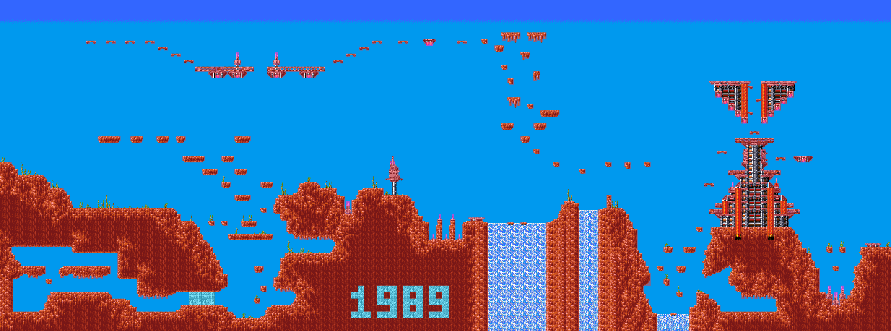
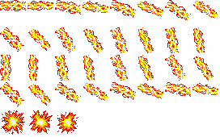
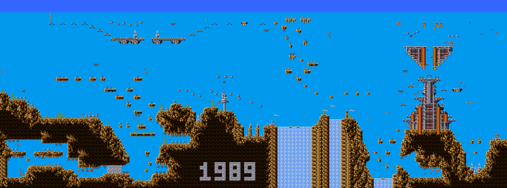

# Turrican (Amiga) — disk format and game analysis

A reverse-engineering reference for `Turrican.adf`, the Amiga release of
Turrican (Rainbow Arts / Factor 5, 1990). This is the second Amiga title in this
repository and the writeup follows the same shape as the others, in reading
order:

* **Part I** — the disk image: the ADF container and the disk's *custom* layout.
  Unlike Marble Madness, this is **not** an AmigaDOS volume — it is a bootable
  non-DOS disk whose boot block is a hand-written sector loader, so Part I is
  about mapping the raw disk rather than walking a filesystem;
* **Part II** — the boot chain: the boot block's multi-stage load and the
  unpacking / decryption of the main program from the packed track data;
* **Part III** — the game program: the 68000 startup, the interrupt/copper
  setup and the memory map;
* **Part IV** — graphics and data formats: the tile, sprite, level and audio
  encodings;
* **Part V** — game mechanics: the player, weapons, enemies, the levels and
  progression.
* **Appendices** — toolchain and reproduction.

Methods: purely static analysis of the disk image, plus the 68000 toolchain in
the shared `tools/` module — the AmigaDOS reader (`tools/amiga/adf`), the
disassemblers (`tools/cmd/dis68k`, `tools/cmd/codetrace68k`) and the 68000
execution core (`tools/m68k`) for dynamic verification. All addresses are 68000
addresses; sizes are `.b`/`.w`/`.l` (8/16/32-bit). **Parts I–II are complete;
Parts III–V are stubs.**

---

## Contents

- [Part I — The disk image](#part-i--the-disk-image)
  - [1. The ADF container](#1-the-adf-container)
  - [2. A custom boot disk, not an AmigaDOS volume](#2-a-custom-boot-disk-not-an-amigados-volume)
  - [3. The boot block: a raw-sector loader](#3-the-boot-block-a-raw-sector-loader)
  - [4. The disk map](#4-the-disk-map)
- [Part II — Boot chain](#part-ii--boot-chain)
  - [1. A cracked release — Tristar & Red Sector](#1-a-cracked-release--tristar--red-sector)
  - [2. The boot chain at a glance](#2-the-boot-chain-at-a-glance)
  - [3. The first-stage intro (`$30000`)](#3-the-first-stage-intro-30000)
  - [4. The hand-off (`$7F800`) and the decruncher (`$50008`)](#4-the-hand-off-7f800-and-the-decruncher-50008)
  - [5. The trainer and the game entry](#5-the-trainer-and-the-game-entry)
- [Part III — Game program architecture](#part-iii--game-program-architecture)
- [Part IV — Graphics and data formats](#part-iv--graphics-and-data-formats)
- [Part V — Game mechanics](#part-v--game-mechanics)
- [Appendix A — Toolchain and reproduction](#appendix-a--toolchain-and-reproduction)

---

# Part I — The disk image

## 1. The ADF container

An ADF is the simplest possible disk image: a flat dump of the floppy's logical
blocks with no header or metadata. Turrican ships on one standard
double-density disk — **1760 blocks of 512 bytes = 901,120 bytes** — so block
*N* is simply the 512 bytes at file offset *N* × 512. The exact copy this
analysis is based on is pinned by size and MD5 in the repository
[README](../README.md#image-files).

## 2. A custom boot disk, not an AmigaDOS volume

The first four bytes are `44 4F 53 00` — the `"DOS\0"` boot-block signature — so
the Kickstart ROM will accept the disk and run its boot code. But that is as far
as AmigaDOS goes: there is **no filesystem on the disk**. The boot block's
block-8 field still carries the conventional root-block pointer (`$00000370` =
880, the standard value for a DD disk), yet block 880 is not a valid root block,
and the AmigaDOS reader rejects it:

```
$ adfdump Turrican.adf
adfdump: adf: root block is not a valid root header
```

This is the usual shape of a commercial Amiga game disk: the `"DOS\0"` signature
and a valid boot-block checksum are the *only* AmigaDOS-conformant things on it.
Everything else — the program, the graphics, the levels — is laid out in a
private format and pulled off the disk by the game's own loader, addressing the
medium by absolute byte offset through `trackdisk.device`, never through files.
(Contrast Marble Madness, whose disk is a real OFS volume — see that writeup's
Part I.)

This particular image is not the original Rainbow Arts release but a **cracked
one-disk version by Tristar & Red Sector (TRSI)** — the boot block and its loader
are the cracker's, and the game's "main part" rides the disk **crunched**
(compressed), decrunched on boot (Part II). So this Part maps the raw disk;
decoding what the loader fetches is Part II.

## 3. The boot block: a raw-sector loader

The boot block is blocks 0–1 (1024 bytes): the `"DOS\0"` tag, a checksum
(`$090B08A1` at `+4`, which the ROM verifies before it will boot), the vestigial
root pointer at `+8`, and from `+12` the boot code the ROM jumps to with the
boot device's I/O request in `A1`. That code is a complete sector loader.

It begins with a first read (`BSR $2C0`) that loads the first-stage loader and
runs it (the IOStdReq fields are `io_Length` at `+$24`, `io_Data` at `+$28`,
`io_Offset` at `+$2C`):

```
$2C2  MOVE.w #$2,$1C(a1)        ; io_Command = CMD_READ
$2C8  MOVE.l #$30000,$28(a1)    ; io_Data    = $30000
$2D0  MOVE.l #$1000,$24(a1)     ; io_Length  = $1000 (4 KB = 8 blocks)
$2D8  MOVE.l #$400,$2C(a1)      ; io_Offset  = $400  (block 2)
$2E0  JSR  -$1C8(a6)            ; DoIO  (a6 = ExecBase, -456 = DoIO)
$2E4  JSR  $30000               ; run the first stage just loaded
$2EA  MOVE.w #$1A0,$DFF096      ; DMACON: clear bitplane/copper/sprite DMA
```

So blocks 2–9 (4 KB) are read to `$30000` and `JSR $30000` runs the first-stage
loader — cleartext 68000 code (it is the crack's intro/decruncher; see Part II).
Control then returns to the main boot code, which:

1. blanks the border (`CLR.w $DFF180`) and takes `A6 = ExecBase` (`$4.w`);
2. sizes and grabs a work buffer — `AvailMem`/`AllocMem` (`-$D8`/`-$C6` on
   `ExecBase`) for the **largest FAST chunk** (`MEMF_FAST|MEMF_LARGEST`,
   `$20004`), or, on a 512 KB chip-only machine, the chip region `$80000`…
   `$100000`;
3. issues the **main read** — `io_Offset $2C00` (block 22), `io_Length $22E00`
   (143 KB = 280 blocks), `io_Data $50000` — pulling the crunched main part into
   RAM at `$50000`, then stops the drive motor (`io_Command = 9`, `TD_MOTOR`);
4. adapts to the CPU: on a 68010 or better (`BTST #1,AttnFlags`) it installs a
   `TRAP #0` handler that executes a `MOVEC` — the standard fixup so the rest of
   the loader can keep treating the machine like a bare 68000;
5. seizes the machine: `MOVE #$2000,SR` (supervisor, no interrupts), stack at
   `$80000`, copies a 512-byte tail routine to **`$7F800`** and `JMP $7F800` to
   carry on the load/decrypt.

The boot block never touches `dos.library`; it reads the disk by absolute byte
offset and drives the hardware directly. Following the `$7F800` stage and the
unpacking is Part II.

## 4. The disk map

Reading the boot block's offsets back onto the image, and confirming it with a
byte-entropy sweep, the disk falls into three regions:

| blocks | offset | entropy | contents |
|--------|--------|---------|----------|
| 0–1 | `$0`–`$400` | ~3.7 | **boot block** — the sector loader (§3) |
| 2–21 | `$400`–`$2C00` | ~3.7 | **first-stage loader** — plain 68000 (opens `MOVEM.l d0-d7/a0-a6,-(a7)`, drives `DMACON`); blocks 2–9 are loaded to `$30000`, and it carries the crack-intro text and `graphics.library`/`topaz.font` strings (Part II) |
| 22–1759 | `$2C00`–end | ~7.99 | **crunched main part** — the game program, graphics and level data, compressed; the `$22E00` main read pulls blocks 22–301 of it to `$50000` |

The low two regions are recognizable 68000 code (entropy well under 4 bits/byte);
from block 22 on the image is essentially incompressible (entropy ~7.99 of a
possible 8) — the signature of crunched (compressed) data, not a filesystem or
raw bitplanes. There is no directory to enumerate — the boot block's two reads
(§3) are the disk's entire "table of contents." Decrunching that main part back
into program is the work of Part II.

---

# Part II — Boot chain

The boot block (Part I §3) is the disk's entire bootstrap: it loads a first
stage, reads the crunched main part, seizes the machine and jumps into a tail
routine. This part follows that chain to the point where the decrunched game
runs.

## 1. A cracked release — Tristar & Red Sector

The first thing the disassembly turns up is that this is **not** the original
Rainbow Arts disk. The first-stage loader (blocks 2–9, loaded to `$30000`)
carries the crack's intro text in clear ASCII:

```
TRISTAR & RED SECTOR PRESENT:  T U R R I C A N
The 100% - One Disk - Version. !!
For The TRAINER Press Joystickbutton After DeCrunching The Mainpart.
Now You Will Have 99 Lives !!
HiScores Will Be Saved On Track 0 !
Intro Made By TRANSFORMER.   Back To The Roots !!
```

So the disk is a **TRSI** "one-disk" crack with a **trainer** (99 lives), the
high-score save redirected to track 0, and a loader/intro of the cracker's own.
Everything in this part — the intro, the decruncher, the trainer patches — is
the crack's wrapper around Turrican; the game itself only appears once the main
part is decrunched (§4). The loader also names the libraries and font it uses
for the intro display: `graphics.library` and `topaz.font`.

## 2. The boot chain at a glance

```
ROM strap
  └─ boot block ($C)                                       Part I §3
       ├─ read blocks 2–9  → $30000 ; JSR $30000           → first-stage intro (§3)
       ├─ read blocks 22–301 ($22E00) → $50000             the crunched main part
       ├─ take over (SR=$2000, sp=$80000), copy tail→$7F800
       └─ JMP $7F800                                       the hand-off (§4)
            ├─ JSR $50008                                  decrunch the main part (§4)
            ├─ patch $600CA/$600CE with BSR.W              the trainer (§6)
            └─ JMP $5F500                                  enter the decrunched game (§6)
```

## 3. The first-stage intro (`$30000`)

`JSR $30000` runs the crack intro. It is ordinary cleartext 68000:

```
$30000  MOVEM.l d0-d7/a0-a6,-(a7)
$30004  MOVE.w  #$8100,$DFF096        ; DMACON: enable bitplane DMA
$3000C  MOVE.l  $4.l,$304F4           ; stash ExecBase
$3001A  MOVE.l  #$10002,d1            ; MEMF_CHIP|MEMF_CLEAR
$30020  MOVE.l  #$2EE0,d0
$30026  JSR     -$C6(a6)              ; AllocMem $2EE0 chip  (the intro bitplanes)
        … carve the buffer into screen/scroll planes at +$7D0/+$1F40/+$2710 …
$3005A  LEA     graphics.library(pc),a1
$3005E  JSR     -$198(a6)             ; OldOpenLibrary("graphics.library")
        … set up topaz.font, a copper list and the scrolling-text display …
```

It allocates a ~12 KB chip buffer for its bitplanes, opens `graphics.library`,
puts up the scrolling TRSI greetings and the trainer prompt, and returns. (This
is decoration; the analysis does not trace the scroller instruction by
instruction.) The boot block then clears DMA (`$DFF096 = $1A0`) and proceeds to
read the main part and hand off.

## 4. The hand-off (`$7F800`) and the decruncher (`$50008`)

The 512-byte tail the boot block relocated to `$7F800` is the bridge from loader
to game:

```
$7F800  JSR  $50008                   ; decrunch the main part (returns when done)
$7F806  CLR.w $DFF180                  ; border black
$7F80C  MOVE.l #$610003DE,$600CA       ; trainer patch  (BSR.w into cheat code)
$7F816  MOVE.l #$6100F630,$600CE       ; trainer patch
$7F820  …build a small stub at $5F700…
$7F846  JMP  $5F500                    ; enter the decrunched game
```

`$50008` is the head of the crunched blob at `$50000`. The blob begins with a
length longword (`$00022C98`) and the decruncher proper:

```
$50008  MOVE.w #$7FFF,$DFF09A          ; INTENA: all interrupts off
$50010  MOVE.w #$7FFF,$DFF096          ; DMACON:  all DMA off
$50018  MOVE.l $50000(pc),d7           ; d7 = $22C98 (packed length)
$5001C  LEA    $50000(pc),a0
$50020  ADD.l  a0,d7                   ; d7 = $72C98  = end of packed data
$50022  …relocate the $34C-byte decrunch core $50040–$5038C → $7F000…
$5003A  JMP    $7F000
```

The relocated core is **three decoders chained back-to-back**, not one. The
driver at `$50050` runs them in sequence — a canonical **Huffman** bit-reader
(`$502C2`), then an **LZ77** copier (`$5019A`), then an **RLE** expander
(`$500CA`) — relocating the intermediate result to the top of memory before each
pass and decoding it back down into low memory. Two of the three (LZ and RLE) are
**byte-dispatched**: each builds a 256-entry jump table at `$90` whose default
handler is a literal copier and whose few escape control values are overridden to
the match/run handlers, then the main loop reads a control byte, **writes it to
`$DFF180`** (the flashing border bars you see while a cracked game "decrunches"),
and `JMP`s through the table:

```
$50110  CMPA.l a1,a0
$50116  BCS    done
$5011E  MOVE.b (a0)+,d0                ; next control byte
$50120  MOVE.w d0,$DFF180.l            ; show it on the border
$50126  LSL.l  #2,d0                   ; ×4 → longword table index
$50128  MOVEA.l $0(a6,d0.w),a5
$5012C  JMP    (a5)                    ; dispatch
```

The Huffman pass is the exception — a 32-bit MSB-first bit-reader, no jump table.
Section 5 documents all three passes and the pure-Go reimplementation that
reproduces the decrunched image exactly. When the last pass finishes the core
`RTS`es back to `$7F806`.

## 5. The three passes, reimplemented

The crunched main part is not a single packed stream — it is the output of three
compressors applied in series. Decompression therefore runs the three decoders in
the opposite order: **Huffman → LZ77 → RLE**. Reading the disassembly of the
relocated core (`$50040`–`$5038C`) gives the whole algorithm; it is reimplemented
verbatim in Go in `Turrican (Amiga)/extract/decrunch`, and the result is verified
against the FS-UAE oracle (below) — **not** scraped from it.

### The blob and the parameter block

The boot loader's main read places this blob at `$50000` (disk `$2C00`):

| offset | bytes | meaning |
|--------|-------|---------|
| `$000` | long | `packedLen` = `$22C98` (whole blob length) |
| `$004` | long | `0` |
| `$008` | `$38` | bootstrap: disable DMA/INT, relocate the core to `$7F000`, `JMP` |
| `$040` | `$34C` | the decruncher core (relocated to `$7F000` at runtime) |
| `$38C` | `$12` | parameter block (below) |
| `$39E` | … | the packed stream, up to `packedLen` |

The 18-byte parameter block at `$38C` is copied to zero-page `$A4`:

```
+$00 word  $0000      unused
+$02 long  $00043880  output base   — where the final image loads
+$06 long  $0005F500  entry point   — where the game is entered
+$0A long  $00034580  (scratch: overwritten by escape-byte reads; also = final size)
+$0E long  $000228FA  (scratch)
```

The `$43880` base and `$5F500` entry drive the loader; the `$34580` at `+$0A` is a
neat cross-check — it is exactly the size of the fully decoded image (see below).

### The driver

`$50050` lays out five scratch pointers in zero page (`$90`…`$A0`), copies the
packed stream **backward** to end at `$7EB00`, then calls the three passes,
each writing into the output buffer at `$43880` and then being relocated back up
to `$7EB00` to feed the next pass:

```
$5008C  BSR $502C2     ; pass 1 — Huffman   (packed stream → LZ stream)
$5009E  BSR $5019A     ; pass 2 — LZ77      (LZ stream     → RLE stream)
$500B0  BSR $500CA     ; pass 3 — RLE       (RLE stream    → final image)
$500B2  MOVEA.l $AA.w,a0 ; a0 = $5F500 (entry), then RTS
```

### Pass 1 — Huffman (`$502C2`)

A canonical, threshold-table Huffman decoder over a **32-bit MSB-first**
bitstream. The pass header is, in order:

```
long            decodedLen          ; output length (= LZ-stream length)
256 bytes       symVal[256]         ; the byte values codes resolve to
long            levels              ; number of code-length classes
levels × long   thr[levels]         ; first-codeword thresholds, left-justified to 32 bits
levels × byte   symBase[levels]     ; base index into symVal for each class
levels × byte   codeLen[levels]     ; codeword bit length for each class
… bitstream …
```

For each output byte the decoder takes the 32-bit window at the current bit
position, finds the **smallest class `L` with `window ≥ thr[L]`** (the thresholds
decrease, so short/frequent codes sit in class 0 — the code special-cases it for
speed at `$50332`), then:

```
rem    = window − thr[L]
value  = rem >> (32 − codeLen[L])          ; the top codeLen[L] bits
emit     symVal[(symBase[L] + value) & 0xFF]
bitpos += codeLen[L]
```

This is the textbook "compare against left-justified first codewords" scheme; the
low bits of the window beyond the current codeword are the next code and never
affect class selection. Decoding stops after exactly `decodedLen` bytes.

### Pass 2 — LZ77 (`$5019A`)

Six **escape bytes** head the stream. The pass builds a 256-entry dispatch table:
every byte is a literal except the six escapes, each of which introduces a
back-reference (`copy length bytes from offset behind the cursor`). A `0` directly
after an escape emits that escape byte as a literal (the escape-the-escape case).
Later escapes overwrite earlier ones in the table, matching the 68000.

| escape | following bytes | offset | length |
|--------|-----------------|--------|--------|
| `esc0` `$5021A` | len, off-hi, off-lo | 16-bit | `len` |
| `esc1` `$50232` | len, off | 8-bit | `len` |
| `esc2` `$50248` | off | 8-bit | `3` |
| `esc3` `$5025C` | off-hi, off-lo | 16-bit | `4` |
| `esc4` `$50274` | `b` | `(b & $F) + 1` | `(b >> 4) + 3` |
| `esc5` `$50296` | `b`, `c` | `((b & $F) << 8) \| c` | `(b >> 4) + 4` |

Copies are byte-by-byte, so an offset smaller than the length produces a repeating
run (true LZ77 overlap).

### Pass 3 — RLE (`$500CA`)

Three escape bytes, same dispatch idea, expanding runs:

| escape | first byte `n`/`b` | emits |
|--------|--------------------|-------|
| `esc0` `$50134` | `n == 0` | 16-bit count + fill byte → count copies of fill |
| | `n == 1` | literal `esc0` |
| | `n ≥ 2` | fill byte → `n` copies of fill |
| `esc1` `$5014E` | `n == 0` | 16-bit count → that many `$00` |
| | `n == 1` | literal `esc1` |
| | `n ≥ 2` | `n` × `$00` |
| `esc2` `$50170` | `b == 0` | literal `esc2` |
| | `b ≠ 0` | three copies of `b` |

After RLE the image is complete: **`$34580` bytes (214,400) at `$43880`**,
ending at `$77E00`, with the game entered `$1BC80` into it at `$5F500`.

### The Go reimplementation and verification

`extract/decrunch` is a dependency-free package implementing the three passes
exactly as above; `extract/cmd/decrunch` runs it on the disk image:

```sh
cd "Turrican (Amiga)"
go run turrican/extract/cmd/decrunch -o /tmp/turrican.bin Turrican.adf
# base  = $43880
# entry = $5F500 (offset $1BC80 into image)
# size  = $34580 (214400 bytes), ends at $77E00
# md5   = 94327d996cc03f8d9039d81ba880642e
```

Per the project rule, the oracle confirms — it does not supply — the result. The
real `$50008` decruncher was run in isolation under FS-UAE/GDB: write the crunched
blob to `$50000`, set `PC = $50008` and `SP = $80000`, breakpoint the core's final
`RTS` (relocated to `$7F076`), and read `$43880`…`$77E00`. The emulator's output
is **byte-identical** to the Go decoder — same `$34580` bytes, same MD5
`94327d996cc03f8d9039d81ba880642e`. That `$34580` also equals the size field the
compressor left at parameter-block `+$0A`, an independent confirmation that all
three passes consume and produce the right counts.

## 6. The trainer and the game entry

With the main part decrunched into low memory, the tail applies the trainer by
overwriting two longwords of the game with `BSR.w` instructions
(`$600CA`/`$600CE`) that divert into the cheat code (the "99 lives"), builds a
small launch stub at `$5F700`, and `JMP $5F500` to start the game. The patch and
entry addresses (`$5F500`, `$5F700`, `$600CA`) place the decrunched program in
roughly `$400`…`$60000+` of chip RAM.

That decrunched image — the actual Turrican program, base `$43880`, entry
`$5F500` — is what Part III analyses. It is produced by the `extract/decrunch`
decoder above (verified byte-identical against the oracle), so the rest of the
work needs no emulator: a flat binary at a known load address.

# Part III — Game program architecture

The decruncher hands control to `$5F500` in the flat `$43880` image. This part
documents that program; it grows as the disassembly is annotated.

## 1. Disassembly and the `disasm/` annotation store

Following the repo's per-game convention (see Marble Madness's `disasm/`), the
unpacked program is disassembled into a committed, annotated source that is the
long-term home for everything learned about the code. Two files live in
`Turrican (Amiga)/disasm/`:

* `turrican.asm` — the generated 68000 disassembly of the `$43880` image;
* `turrican.annotations.txt` — the hand-maintained annotations (`ADDR  name
  description`, `#` comments), consumed by `codetrace68k -annotate` to label
  routines and inject notes. This is where analysis accumulates; the `.asm` is
  regenerated from it.

Regeneration (from the repo root):

```sh
# decode the main part to a flat image (base $43880, entry $5F500)
go run turrican/extract/cmd/decrunch -o /tmp/turrican.bin "Turrican (Amiga)/Turrican.adf"

# recursive-descent trace from the game's in-place segment, applying the annotations
go run retroreverse.com/tools/cmd/codetrace68k -base 0x43880 \
  -entry 0x5F500,0x60000,0x602D0 \
  -annotate "Turrican (Amiga)/disasm/turrican.annotations.txt" \
  -o "Turrican (Amiga)/disasm/turrican.asm" /tmp/turrican.bin
```

## 2. Two segments: the relocation at `$5F500`

The flat image is not loaded where it runs. The very first thing `$5F500` does is
split itself in two:

```
05F500  game_entry:
        LEA  $43890,a0 ; LEA $10,a1
        MOVE.l (a0)+,(a1)+ … until a0 = $5F000   ; copy $43890..$5F000 → $10
        … fire-button option select, wait for fire …
        BRA  $60000                              ; game_init
```

So the image has **two segments**:

* **The resident game engine** — image `$43890…$5F000` — copied down to
  **`$10…$1B780`** and run there (subtract `$43880` for runtime addresses).
  `$10…$FF` is the 68000 exception vector table; `$100` is the engine's internal
  BRA jump table, entered at `game_start` (`$CB4`). This ~112 KB segment is the
  bulk of the game. It is disassembled (runtime-based) in
  `disasm/resident_core.{asm,annotations.txt}` — see §4.
* **The setup / init / ISR + data** — image `$5F500…$77E00` — runs **in place**
  (the image sits at `$43880`, so image address = run address). `turrican.asm`
  covers this segment (§3).

The engine then pulls in more code as streamed modules (§5): the music driver,
a loader-sound player, and a PowerPacker block.

## 3. The in-place setup segment

What runs before the game proper takes over, all from `turrican.asm`:

* **`game_entry` (`$5F500`)** — relocates the game proper (above); pokes the
  reset/illegal vectors at `$8`/`$C`; reads the CIA-A fire buttons
  (`$BFE001` bits 6/7) to pick **trainer/option** settings (poking game vars
  `$E0E`/`$D04`); waits for a fire press+release; `BRA game_init`.
* **`game_init` (`$60000`)** — the hardware bring-up: supervisor mode, stack at
  `$602CC`, all INTENA/DMACON/INTREQ off, then it unpacks and runs several
  sub-modules — `pp20_decrunch $6C186 → $30000` (a **PowerPacker "PP20"** block)
  and `JSR $30002`, a raw block-copy to `$50000` and `JSR $50000`, and
  `load_block_1BB00` — installs the level-3 (vblank) vector and enables the
  display via `setup_display`. The two `NOP`s at **`$600CA`** are the TRSI
  trainer hook (Part II §6), patched to `BSR` the 99-lives code at boot.
* **`vblank_isr` (`$602D0`)** — the level-3 interrupt: checks the VERTB bit in
  `INTREQR`, bumps a frame counter, runs `palette_cycle`, and `JSR $1BB24` (the
  per-frame **game tick**, in the overlay — §4).
* **Decompressors / loader** — the game reuses the **same Huffman decoder** as the
  `$50008` decruncher (`huff_decode $5F000`) to unpack graphics/level blocks at
  runtime, alongside `pp20_decrunch` and a floppy **trackloader**
  (`disk_read $604FA` / `disk_setup_sync $6056E`, `DSKSYNC = $4489`) that streams
  level data off the disk during play.

## 4. The resident game engine (`$100…$1B780`)

`game_init`'s last act is `JMP $100`, into the relocated segment. `$100` is the
engine's internal **BRA jump table**; slot 0 is `game_start` (`$CB4`):

```
000CB4  game_start:
        MOVE #$2000,sr ; LEA $89DC,a7 ; LEA $DFF000,a6
        … stash trainer-option regs ($CAA/$CAC) ; BSR init_early …
        JSR  $30000                 ; run the PowerPacker engine module
        BSR  init_object_table ; BSR init_map_grid ; BSR init_54BC ; BSR setup_irq_display
        BRA  main_loop ($D4C)
```

`main_loop` (`$D4C`) drives the **blitter** (writes `BLTSIZE`, spins on `BBUSY`)
to build the playfield, primes the level/game state, and runs the game. The
engine is disassembled — runtime-based — in
`disasm/resident_core.{asm,annotations.txt}` (`game_start`, `main_loop`, the init
routines, `setup_irq_display`). Coverage is still partial: most per-frame logic is
reached through object/state dispatch tables not yet seeded, so this is where the
analysis continues.

## 5. The streamed modules

The engine doesn't ship complete in the resident image — `game_init` and
`game_start` stream three more modules in:

* **the music driver** at `$1BB00` (below);
* **a loader-sound player** at `$50000` — `game_init` copies image `$703EA…$77DF0`
  there (raw, unpacked) and `JSR $50000`s it; it installs its own vblank handler
  and plays a sample on AUD0/1 (the disk-access sound) during loading;
* **a PowerPacker module** at `$30000` — `game_init` `pp20_decrunch`s image
  `$6C186…$703EA` there, and both `game_init` (`JSR $30002`) and `game_start`
  (`JSR $30000`) call into it. It is the game's **OS-interface module**: it
  `OldOpenLibrary`s `graphics.library` and `dos.library`, installs a `TRAP #0`
  handler and saves/replaces CPU vectors — the engine's bridge to the OS for the
  display and disk.

  Its decruncher (`pp20_decrunch $6078C`) is the **standard PowerPacker "PP20"**
  format, reimplemented as a reusable Go package
  (`tools/amiga/powerpacker`) since PP20 is one of the most common Amiga
  crunchers. The module is recovered and **verified byte-identical against the
  FS-UAE oracle**:

  ```sh
  go run turrican/extract/cmd/decrunch -o /tmp/turrican.bin "Turrican (Amiga)/Turrican.adf"
  # the PP20 block sits at image $6C186..$703EA = file offset $28906, length $42E4
  go run retroreverse.com/tools/amiga/cmd/ppdecrunch \
    -off 0x28906 -len 0x42E4 -o /tmp/mod_30000.bin /tmp/turrican.bin
  # decrunched 31272 bytes, md5 3c249c100bb1a00792e6fa92016e9900
  ```

### The music driver at `$1BB00`

`load_block_1BB00` reads the packed block at
**ADF `$26000`** (length `$C268`) to `$1BB00` and `huff_decode`s it; the numbers
are self-consistent (`huff_decode`'s source window is `$1BB00…$27D68` = exactly
`$C268` bytes). Because the in-game decoder is the *same three passes* as the
`$50008` decruncher, the overlay is recovered with the same Go code —
`extract/cmd/block` reads the disk slice and calls `decrunch.DecrunchBlock` (which
skips the 18-byte block header and runs Huffman → LZ77 → RLE):

```sh
go run turrican/extract/cmd/block -off 0x26000 -len 0xC268 -base 0x1BB00 \
  -o /tmp/block_1BB00.bin "Turrican (Amiga)/Turrican.adf"
# base $1BB00, size $11964 (72036 bytes), ends $2D464
```

The decoded overlay is an **AmigaDOS HUNK blob** (`$000003F3` header, one
`HUNK_CODE` at `$1BB18`, body from `$1BB20`). It is loaded — not relocated — at a
fixed `$1BB00`, so its absolute `$1Cxxxx` addresses are baked to that base. Its
body opens with a **BRA dispatch table** — its public API, which the resident
code jumps into at fixed addresses.

This overlay is the **music / sound driver**. Its `vblank_isr` entry runs the
player once per frame, and internally it processes three voices, each with a
period LFO (vibrato), a pitch slide (portamento) and a volume envelope, writing
the Amiga `AUDxPER`/`AUDxVOL` registers — while `audio_silence` zeros all four
volumes. The API:

| call | slot | does |
|------|------|------|
| `vblank_isr` | `$1BB24` → `sound_tick $1BB78` | advance the player one frame; `a6` = `player_state $1CC22`, `a5` walks `voice_table $1CC7C` |
| `game_init` | `$1BB2C` | start playback (song index, clear pause) |
| `game_init` | `$1BB34` | init the player from song + sample data pointers (`$1CFF4`, `$20E90`) |
| `game_init` | `$1BB48` | set a config byte — master volume / channel mask (`$40`) |

It is disassembled into its own pair, `disasm/overlay_1bb00.{asm,annotations.txt}`
(`player_state $1CC22`, `update_voices`, `voice_vibrato/portamento/envelope`).
This matches the cabinet credit — the music is a **Chris Hülsbeck** score.

> **Next.** Grow `resident_core` outward from `main_loop` by seeding the
> object/state dispatch tables, toward the player, enemies and level handling
> (Parts IV–V). All three streamed modules are now recovered (the `$1BB00` sound
> driver, the `$50000` loader-sound player, and the `$30000` OS-interface module
> via the new `tools/amiga/powerpacker`).

## 6. The game loop

`game_start` falls into `level_setup` (`$D4C`), which clears the playfield with
the blitter, installs the three triple-buffered display buffers
(`$17A/$192/$1AA` = `$5BCE0/$67CE0/$73CE0`), primes the level state and runs a
long chain of subsystem-init `BSR`s — then drops into `game_loop` (`$EBC`):

```
EBC  game_loop:
        … blit_playfield ; blit_objects ; $2F56 …
        MOVEA.l $1942,a0 ; JSR (a0)        ; the current game-MODE handler
        … $1710 (x2) ; $3A56 ; $5576 ; $68AC ; $64B8 ; $1B94 ; $1C0C …
        ST   $1E1                          ; raise the frame-sync flag
        … $1850 ; $18BA ; $189E …
   F08: TST.b $1E1 ; BNE F08               ; spin until the vblank ISR clears it
        … exit checks ($26D/$15D) …
        BRA  game_loop
```

Two things define the engine's shape:

* **Mode dispatch.** `$1942` holds a pointer to the current game-mode/state
  handler, called once per frame via `JSR (a0)`. Swapping it switches state
  (title, play, …) without touching the surrounding pipeline — the classic
  function-pointer state machine. It is driven by a small **scene system**:
  `select_scene` (`$160E`) reads a scene id (`$193A`), indexes a descriptor
  pointer table (`$1B996`) to the active descriptor (`$193E`), and installs that
  descriptor's `+$18` field as the primary handler (`$1942`) and `+$2E` as a
  secondary handler (`$1946`) — each defaulting to a null `RTS` (`$16DC`) when
  zero. The descriptors are not in the resident image — they are **streamed off
  the disk per world** (Part IV), so the states (and their handler code) change
  with the level.
* **Frame sync.** The loop raises `$1E1` and spins until the level-3 ISR (Part III
  §3) clears it, locking the pipeline to the vertical blank.

The fixed pipeline around the mode call is the renderer/updaters: `blit_playfield`
and `blit_objects` (`$1BB4`/`$5E40`) are blitter copies (`BLTCON0 = $9F0`) that
draw the playfield and object layers from the draw-list at `$1C2`, alongside a
dozen further per-frame subsystems.

The engine also carries its **own copy of the sound driver** (`sound_update`
`$1A2F8`, state at `$1B2D8`, API table at `$1A2A8`) — byte-for-byte the same
Hülsbeck player as the `$1BB00` overlay, on resident state. With two player
instances the game runs music and sound effects independently; `level_setup`
sets up this resident one through the `$1A2A8` API. All of this is disassembled
(~128 routines so far) in `disasm/resident_core.{asm,annotations.txt}`.

# Part IV — Disk streaming and the level format

## 1. The disk streamer

The resident engine and its `$30000`/`$50000`/`$1BB00` modules are only the
*loader and runtime*; the actual **worlds are streamed off the floppy** as the
game runs. `load_level` (`$4A0`) does it: it reads the level number (`$1938`),
looks up a per-world table, pulls the packed block off the disk into the buffer
just past the resident image (`$1B780`), and decompresses it.

The decompressor is the **same three-pass decoder yet again**. `load_scene_block`
(`$BF4`) first calls `load_decoder` (`$C12`), which loads `huff_decode` *itself*
from **ADF `$25C00`** (`$400` bytes) to `$74000` — the first longwords there are
`48 E7 FF FE 43 F8 00 A4 …`, byte-identical to `$5F000` — then runs it at `$74000`
to unpack the world block from `$1B780` into the scene buffer at `$1B980`.

## 2. The world table and the scene blocks

`load_level` indexes a table at **`$46A`** by `level << 3`: five `(ADF offset,
packed length)` pairs, one per world. Each block decodes — with the very same Go
decoder (`extract/cmd/block`, which skips the 18-byte header and runs
Huffman → LZ77 → RLE) — to a fixed **`$3F700` bytes** loaded at `$1B980`:

| world | ADF offset | packed | recovered |
|------:|-----------:|-------:|----------:|
| 0 | `$3F000` | `$1EAAC` | `$3F700` |
| 1 | `$5DC00` | `$1FCB0` | `$3F700` |
| 2 | `$7DA00` | `$1BEA0` | `$3F700` |
| 3 | `$99A00` | `$24504` | `$3F700` |
| 4 | `$BE000` | `$1DE2A` | `$3F700` |

```sh
# decode any world block straight off the disk (here world 0)
go run turrican/extract/cmd/block -off 0x3F000 -len 0x1EAAC -base 0x1B980 \
  -o /tmp/world0.bin "Turrican (Amiga)/Turrican.adf"
```

The block's own header even carries the load address (`$0001B980`) and the
recovered length (`$0003F700`), matching the decode exactly.

## 3. The scene descriptors, extracted statically

A decoded world block *is* the `scene_manager` (Part III §6): it loads at `$1B980`,
its `+$16` field is the **scene-descriptor pointer table**, and — crucially — the
descriptors and their per-frame **handler code live inside the block**, so each
world brings its own state logic. Reading world 0's table out of the decoded bytes
gives three scenes:

| scene | descriptor | `+$18` handler | `+$2E` handler |
|------:|-----------:|---------------:|---------------:|
| 0 | `$1B9A2` | `$1D0AC` | `$1D704` |
| 1 | `$1B9D4` | `$1D15E` | `$1D704` |
| 2 | `$1BA06` | `$1D28E` | `$1D704` |

The `$1D0AC` handler disassembles as clean gameplay code (it reads a game variable
at `$15A`, clamps it to `0…$1F` and indexes a jump table at `$1D29A`). So the
scene state machine, its handlers and the level data are all recovered **purely
by reimplementing the decoder** — the FS-UAE oracle was used only to confirm the
boot reaches the streamer, never to read the data out.

## 4. Tiles and palette

The decoded block is a small **section directory** followed by its data. The
scene_manager header doubles as that directory:

| header | points at | section |
|--------|-----------|---------|
| `+$00` | `$21C80` | tile offset table |
| `+$04` | `$3C1C4` | a 1-bit map (collision / tile-type) |
| `+$08` | `$1BA38` | **palette** — 16 big-endian 12-bit RGB words |
| `+$0C` | `$51F80` | sprite/object graphics |
| `+$10` | `$58076` | **`"TFMX-SONG"`** — the world's TFMX music module |

The **tile offset table** is `N` longwords, each a byte offset (from the table
base) to a tile; entry 0 equals the table's own size, so `N = entry[0] / 4` and
the pixels begin right after it. Each tile is **32×32, four bitplanes, interleaved
per row** (4 bytes per plane per row → 512 bytes), drawn through the 16-colour
palette. World 0 has 209 tiles, world 1 has 215, etc.

`extract/cmd/tiles` parses this directory generically and renders a world's tile
sheet — no hard-coded offsets, just the header:

```sh
go run turrican/extract/cmd/tiles -world 0 -o rendered/world0_tiles.png Turrican.adf
# world 0: 209 tiles (32x32x4), palette @ block+$B8 -> rendered/world0_tiles.png
```

The five sheets (`rendered/world0_tiles.png` … `world4_tiles.png`) come out as the
recognisable Turrican worlds — the cave/planet surface, the machine/factory world,
and so on — confirming the tile format, the palette and the per-world block layout
end to end.

## 5. The tile map

Each **scene descriptor** (the `+$16` pointer table, Part III §6) describes one
sub-map of the world. Its fields give the map directly:

| descriptor | meaning |
|------------|---------|
| `+$00` | pointer to the map data |
| `+$04` | map width in tiles (word) |
| `+$06` | map height in tiles (word) |
| `+$18` / `+$2E` | the scene's per-frame handlers |

The map is a **column-major array of one byte per cell** (`map[col*height + row]`):
a value `< nTiles` is a tile index, and a value `>= nTiles` is a **horizontally
flipped** tile (index `value − 128`). World 0 has three scenes laid out back to
back in the section — `137×51`, `153×51`, `115×51` — the chunks of Turrican's
first world; other worlds are shaped very differently (world 2 scene 0 is a
`12×269` vertical shaft). `extract/cmd/map` renders any of them:

```sh
go run turrican/extract/cmd/map -world 0 -scene 0 -o rendered/world0_map0.png Turrican.adf
# world 0 scene 0: 137x51 tiles -> rendered/world0_map0.png
```

The output is the real playfield — world 1's opening with its floating platforms,
the central waterfall, the red tower and the **"1989"** spelled out in the rock —
recovered end to end from the disk image through the reimplemented decoder, the
tile format and this map. The committed `rendered/world*_map*.png` cover every
world.

## 6. The collision map

Solidity isn't per-tile or a parallel grid — it's a **per-tile-type collision shape**.
The block header's `+$04` section (`$3C1C4`) is an array of **16 bytes per tile**: a
**4×4 grid of 8×8-pixel-block solidity**, so a 32×32 tile carries sub-tile collision.
The byte values aren't just solid/empty — the player and shot handlers decode four:

| value | meaning | how it's read |
|------:|---------|---------------|
| `$00` | passable | empty |
| `$01` | solid wall/ground | blocks movement |
| `$7F` | solid, reacts to shots | a shot sparks (`$63AE`) and stops, snapped to a 16px grid |
| `$80` | breakable / trigger | contact spawns an effect + sound, then the cell clears |
| `$D3` | hazard | contact calls `$7728`, which drains the player's energy (`$7B0B`) |

At scene
load `select_scene` (`$160E`) calls the playfield builder (`$2994`) which, for each map
tile, copies `section + tileIndex*16` into a screen-sized collision buffer (`$212`) as
4 rows of 4 bytes; the player check (`$35AE`) then reads one byte at the player's
position at 8-pixel granularity (`x/8` column, 48-byte row stride). h-flipped map cells
mirror their 4 columns. Overlaying the decoded shapes on the map, the solid mask hugs
the terrain surface exactly — sky and the decorative grass tips passable, ground solid:



`extract/scene`'s `TileCollision` reads this off the disk; `webexport` ships it per
scene (the viewer's **Collision** toggle expands it over the tiles).

> **Next.** The object/enemy data (Part V), the sprite sheet at `$51F80`, and the
> per-world scene handlers.

# Part V — Game mechanics

## 1. Objects, sprites and collision — the code-driven layers

The tiles, palette and map (Part IV) fell out cleanly because they are
*self-describing*: a directory of section pointers, offset tables, and width/height
fields. The remaining level data — enemy graphics, where they spawn, and the
collision layer — is **driven by code**, so the byte formats are only meaningful
through the routines that read them. This section records what is *located* so far;
fully decoding each needs the corresponding engine routine disassembled.

* **Enemy / BOB graphics.** The scene block's `+$0C` section (`$51F80`, ~24 KB) and
  the region right after the three maps in the `+$00`-area section are **bitplane
  BOB graphics** — the byte histogram is dominated by mask edges (`$F8`, `$07`,
  `$FC`, `$03`), the signature of planar sprite data rather than the PCM of the
  adjacent TFMX samples.

  Disassembling the **object renderer** (`draw_object_bob $603A`, in
  `disasm/resident_core`) gives the format. Enemies are **BOBs cookie-cut** into the
  back buffer: `BLTCON0 = (x&15)<<12 | $FCA` (minterm `$CA` — `A`=mask, `B`=bitmap,
  `C`/`D`=destination), the object position transformed by the camera (`$172`/`$174`)
  and the destination word looked up through a per-row screen-offset table. Each BOB
  is described by a small **descriptor**:

  | off | field |
  |-----|-------|
  | `+$0` | bitmap data pointer → `BLTBPT` (the pixel planes) |
  | `+$4` | mask pointer → `BLTAPT` (the 1-plane cookie-cut mask) |
  | `+$8` | modulo → `BLTCMOD`/`BLTDMOD` |
  | `+$A` | `BLTSIZE` = `height<<6 \| width-in-words` (the BOB's pixel size) |
  | `+$C` | y adjust  ·  `+$D` flag (selects a clipped variant) |

  So a BOB's *dimensions* come from `+$A`, and its pixels + mask are at `+$0`/`+$4`
  into the BOB graphics. `draw_objects` (`$5E9C`) walks the active objects (`$20E`,
  up to `$5452 & 7` of them) drawing each, and queues every rectangle it touches so
  `blit_obj_restore` (`$5E40`) can copy the saved background back next frame.

  The **animation table** is `bob_frame_table` at `$4CCA`: a flat array of BOB
  descriptor pointers. Each object type's draw routine (there are many, in
  `$5642…$5B80`) does `LEA $4CCA,a5 ; ADDA.w d3,a5` to pick its frame group, then
  `MOVEA.l $0(a5,d6.w),a0` to select the current frame (`d6`, usually toggled
  `EORI.w #$4,d6` for a two-frame loop), then falls into `draw_object_bob`. So the
  full chain is **object type → frame group (`d3`) → frame (`d6`) → 14-byte BOB
  descriptor → bitmap + mask + size**. The descriptor records start at `$5156`
  (stride `$E`); the player/shot/effect bitmaps are resident (`~$12xxx`),
  world-enemy ones point into the scene block. The pixel format is in §2.

* **Object behaviour.** Each scene descriptor's `+$20` field points at a small
  **table of object-AI handler routines** (world 0 scene 0: nine handlers from
  `$1BA58`), each updating an `a5`-relative object instance struct. The scene's own
  per-frame handler (`$1D0AC`) drives the parallax background (camera x `$15A` →
  a per-column table at `$1D29A`) and **scripted events** — e.g. it triggers a
  sound (`JSR $1A2AC`) once the scroll reaches a set position. Enemy *placement* is
  scroll-triggered by the resident engine's spawn subsystem, not a flat list in the
  block.

* **The `$3C1C4` layer.** The `+$04` section (4000 bytes, values `{0, 1, 127, 211}`
  after a 16-byte lead-in, in a repeating `0 1 1 1` pattern) is a per-cell attribute
  layer — most likely collision. It renders as a coherent platform silhouette at a
  ~137-wide stride (scene 0's map width), but it is **not** a 1:1 solid/empty mask
  over the tile map (correlating it against tile solidity is chance-level), so its
  exact cell mapping awaits the collision-check routine.

## 2. The BOB pixel format, and extracting the sprites

`draw_object_bob` runs the cookie-cut blit **four times** (once per bitplane),
each advancing the destination by one plane while `BLTBPT` (the source) carries on
through memory — so a BOB's pixels are **four bitplanes stored plane-major**
(plane 0's rows, then plane 1's, …). The data is one word narrower than `BLTSIZE`'s
width (the shifted blit reads an extra word, with `BLTBMOD = -2` rewinding it), so:

```
frame = 4 planes × height × (width-1) words ,   plane-major
```

The frame strides confirm it exactly: successive descriptors' bitmaps differ by
`$E0`/`$120`/`$160`/`$190` = `4 × height × 4 bytes` for heights `14/18/22/25`.
Plane 3 is also the cookie-cut mask, so opaque pixels carry bit 3 (colours 8–15);
colour 0 is transparent. The BOBs draw through the playfield's 16-colour palette.

`extract/cmd/sprites` finds frame tables (runs of pointers that all resolve to a
valid descriptor) and writes **one PNG sheet per sprite**, all its frames in a
grid. It does this both for the resident engine (the shared weapon/effect sprites)
and for **each of the five worlds' scene blocks** (that world's enemies, drawn in
the world's own palette):

```sh
go run turrican/extract/cmd/sprites -o rendered/sprites Turrican.adf
# sprite_04CCA.png        — the spinning weapon (resident, shared)
# world0_sprite_1E23E.png — world 1's rotating eye, … (14 sprites)
# world4_sprite_1DE36.png — world 5's red-eyed mech, …
```

`$04CCA` is Turrican's signature **spinning energy weapon** — 32 frames of a full
rotation, then a three-frame burst:



Each world yields its own enemy set (the rotating eyeball, saucers, turrets,
mechs, …) — 45 sprite sheets across the five worlds plus the five shared resident
ones, all in `rendered/sprites/`.

The **player** is *not* in any of these tables (the auto-scan only finds the
flat-pointer frame tables). He is drawn by a dedicated routine, `$56AC`, inside the
player update (`$5576`): it indexes per-animation-state tables (`$4D56` hot-spot
offsets, `$4E56` part dimensions, `$4FD6` part lists) by the player's animation
state (`$594B & $1F`) and draws him as a **multi-part composite** (three body parts
at `$5950/$5954/$5958`) plus the orbiting spinning weapon (`$4CCA`). So extracting
the player means following that composite — the param tables, not a simple sprite
sheet — which is a separate task from the BOB tables above.

## 3. The object system

Active enemies and effects are a **doubly-linked list** (`object_list $236`) of
58-byte nodes drawn from a 39-node pool at `$9184` (`obj_pool_init $1A68`); spare
nodes sit on the free list `object_free $23A`. A spawn is `obj_alloc` (pop a free
node) → fill its fields → `obj_link` (`$1AEC`, into the active list); a kill is
`obj_unlink` (`$1B14`, back to the pool). Each node is:

```
+$0 next   +$4 prev   +$C frame index   +$12 frame table (a bob_frame_table)
+$18 x     +$1A y     +$1C active        +$22 AI handler
```

Every frame, `object_update` (`$1B94`) walks the list and `JSR`s each node's AI
handler (`+$22`), then `object_draw` (`$1C0C`) walks it again and cookie-cuts each
node through its frame table (`+$12`) at frame (`+$C`) and position (`+$18/$1A`) —
**this is exactly what puts the sprites of §2 on screen.** So the engine ↔ sprite
link is complete: a spawn just sets a node's `+$12` to one of the frame tables the
extractor reads.

## 4. Per-world code

Each world's scene block carries its own game code in two parts (see
`disasm/scenes/README.md`):

* **Scene handlers** (descriptor `+$18`, 2–3 per world) run the **animated parallax
  backdrop** and trigger **ambient sounds** — they call only the resident sound API
  (`$1A2AC`/`$1A2DC`/…), never the spawn routines. World 1's drives the waterfall
  blit (`$1D2DA`); worlds differ here only in which backdrop they animate.
* **Enemy AI handlers** (descriptor `+$20`, 6–18 per world) are the enemy roster:
  each is a complete behaviour on an object node, e.g. `$1DE68` sets its frame
  table `+$12 = $1DF80` (one of the extracted world-0 sprites) and health `+$26`,
  animates an 8-frame loop, applies damage (`+$1D → +$26`) and on death `JSR $130`.

So the per-world differences are the **enemies and the backdrop**, not new
mechanics — every world uses the same engine, object system and sound interface
(code sizes 3.5–8.8 KB). The handlers wire each enemy to a sprite from
`rendered/sprites/world<N>_sprite_*.png`.

## 5. Enemy placement

The **placement** — which object is seeded where — is read by the scroll-triggered
spawner `enemy_spawner` (`$1710`, called twice per frame). It builds a spawn window
from the camera (the visible screen plus a margin) and spawns any entry inside it —
which is why things appear *just* as the screen reaches them. The layout in the scene
block is a **2D bucket grid**, not a flat list: the descriptor holds a per-camera-row
offset table (`+$24`) and the grid itself (`+$28`); for a given camera row/column the
grid yields a pointer into the entry data. Many grid cells share a pointer, and each
distinct pointer heads a **per-column run of 6-byte entries** — `type.w, x.w, y.w`
(x/y in 8-pixel units) — terminated by a `$00D3` word (a `$0000` word is a skipped
hole). Walking every distinct column pointer to its terminator yields each entry
exactly once; `extract/scene` does this off the disk, and the grid bounds itself (no
heuristics), so narrow/tall scenes extract as cleanly as wide ones.

Two details matter for getting it right. First, **the type is the high byte** of the
type word, and it selects the handler in two tiers: `type < 3` indexes the *resident*
handler table `$1A60` (`type-1` — engine-wide objects like the little rotating mine),
and `type >= 3` indexes the scene descriptor's `+$20` table (`type-3`). Second, the
spawner writes the object's world position as `entry.x*8 - 32` / `entry.y*8` (the
camera terms cancel out), and that pixel is the BOB's **top-left** — so once the type
and grid walk are right, objects land exactly where the game puts them. Overlaying
world 1's scene-0 objects on the decoded map, drawn with each one's real sprite,
confirms it — mines and turrets seated on the floating ledges, flyers in the diagonal
wave-lines across the sky, ground enemies on the terrain:



The spawner was *located* with help from the FS-UAE oracle, but every byte of the
placement data is extracted from the ADF. This same data drives the companion
[site](https://stupidcoder.github.io/RetroReverse/)'s object
layer, which also frames each scene on the **player spawn**: `select_scene`
(`$160E`) reads the descriptor's initial camera tile (`+$08/+$0A`, ×32 → the
viewport's world-pixel origin) and the player's on-screen offset (`+$0C/+$0E`,
copied via `$45A4` to the player position `$104/$106`), so the spawn in world
pixels is `camera + offset` — the same start the Amiga shows.

## 6. The object → AI → sprite table

An entry's type resolves to an AI handler (resident `$1A60[type-1]` for `type < 3`,
the scene's `+$20[type-3]` otherwise), and the handler installs the object's sprite by
writing a frame table into the node — `MOVE.l #frametable,$12(a5)` (`2B 7C <imm32> 00
12`). So the lookup a viewer needs is **`type → handler → sprite sheet`**, fully
static: `extract/scene` resolves it per object (the JSON carries each object's `sprite`
frame table and a `resident` flag), and `extract/cmd/sprites` is *driven* by the same
set, so every used frame table has a matching sheet — `world<N>_sprite_<addr>.png` for
scene objects, `sprite_<addr>.png` for resident ones.

The table below lists, per scene, each object type that occurs and the handler/sheet
it resolves to (resident sprites are flagged). Many types recur across scenes, and
each scene's `+$20` table is its own, so the `(world, scene, type)` key is what
disambiguates a sprite.

| World | Scene | Type | AI handler | Sprite sheet |
|------:|------:|-----:|------------|--------------|
| 0 | 0 | 1 | `$07D0E` | `sprite_07E7E.png` (resident) |
| 0 | 0 | 2 | `$07EFC` | `sprite_080E8.png` (resident) |
| 0 | 0 | 3 | `$1E042` | `world0_sprite_1E23E.png` |
| 0 | 0 | 4 | `$1F152` | `world0_sprite_1F30C.png` |
| 0 | 0 | 5 | `$206AA` | `world0_sprite_20884.png` |
| 0 | 0 | 6 | `$1EB54` | `world0_sprite_1ED90.png` |
| 0 | 0 | 7 | `$1DE68` | `world0_sprite_1DF80.png` |
| 0 | 0 | 8 | `$1EEB4` | `world0_sprite_1F0D0.png` |
| 0 | 0 | 9 | `$1E6FC` | `world0_sprite_1E8D0.png` |
| 0 | 0 | 10 | `$1E356` | `world0_sprite_1E694.png` |
| 0 | 0 | 11 | `$1E8EA` | `world0_sprite_1EAEE.png` |
| 0 | 0 | 12 | `$00000` | — |
| 0 | 1 | 1 | `$07D0E` | `sprite_07E7E.png` (resident) |
| 0 | 1 | 2 | `$07EFC` | `sprite_080E8.png` (resident) |
| 0 | 1 | 3 | `$1E042` | `world0_sprite_1E23E.png` |
| 0 | 1 | 4 | `$1F374` | `world0_sprite_1F4C8.png` |
| 0 | 1 | 5 | `$1FECA` | `world0_sprite_1FFD6.png` |
| 0 | 1 | 6 | `$1E8EA` | `world0_sprite_1EAEE.png` |
| 0 | 1 | 7 | `$1F564` | `world0_sprite_1F754.png` |
| 0 | 1 | 8 | `$1FD88` | `world0_sprite_1FEB0.png` |
| 0 | 1 | 9 | `$1F89C` | `world0_sprite_1FB22.png` |
| 0 | 1 | 10 | `$1EEB4` | `world0_sprite_1F0D0.png` |
| 0 | 1 | 11 | `$20102` | `world0_sprite_201F4.png` |
| 0 | 1 | 12 | `$1E356` | `world0_sprite_1E694.png` |
| 0 | 1 | 15 | `$2020E` | — |
| 0 | 2 | 1 | `$07D0E` | `sprite_07E7E.png` (resident) |
| 0 | 2 | 2 | `$07EFC` | `sprite_080E8.png` (resident) |
| 0 | 2 | 3 | `$1E042` | `world0_sprite_1E23E.png` |
| 0 | 2 | 4 | `$1DE68` | `world0_sprite_1DF80.png` |
| 0 | 2 | 5 | `$1F564` | `world0_sprite_1F754.png` |
| 0 | 2 | 6 | `$1E8EA` | `world0_sprite_1EAEE.png` |
| 0 | 2 | 7 | `$20102` | `world0_sprite_201F4.png` |
| 0 | 2 | 8 | `$2094A` | `world0_sprite_20BC4.png` |
| 0 | 2 | 9 | `$20EA8` | `world0_sprite_20FBA.png` |
| 0 | 2 | 10 | `$1FECA` | `world0_sprite_1FFD6.png` |
| 0 | 2 | 11 | `$21474` | `world0_sprite_21524.png` |
| 0 | 2 | 15 | `$20FD4` | — |
| 1 | 0 | 1 | `$07D0E` | `sprite_07E7E.png` (resident) |
| 1 | 0 | 2 | `$07EFC` | `sprite_080E8.png` (resident) |
| 1 | 0 | 3 | `$1D3EA` | `world1_sprite_1D682.png` |
| 1 | 0 | 4 | `$1D79A` | `world1_sprite_1D926.png` |
| 1 | 0 | 5 | `$1D98E` | `world1_sprite_1DB3E.png` |
| 1 | 0 | 7 | `$1E188` | `world1_sprite_1E3CC.png` |
| 1 | 0 | 8 | `$1E3F8` | `world1_sprite_1E6D8.png` |
| 1 | 0 | 9 | `$1DCF0` | `world1_sprite_1DF76.png` |
| 1 | 0 | 10 | `$1E75A` | `world1_sprite_1E8E0.png` |
| 1 | 0 | 15 | `$1E93A` | — |
| 1 | 1 | 1 | `$07D0E` | `sprite_07E7E.png` (resident) |
| 1 | 1 | 2 | `$07EFC` | `sprite_080E8.png` (resident) |
| 1 | 1 | 3 | `$1E07A` | `world1_sprite_1E16E.png` |
| 1 | 1 | 4 | `$1E586` | `world1_sprite_1E6D8.png` |
| 1 | 1 | 5 | `$1E188` | `world1_sprite_1E3CC.png` |
| 1 | 1 | 6 | `$1F3F4` | `world1_sprite_1F548.png` |
| 1 | 1 | 7 | `$1F618` | `world1_sprite_1F736.png` |
| 1 | 1 | 8 | `$1D79A` | `world1_sprite_1D926.png` |
| 1 | 1 | 9 | `$1D98E` | `world1_sprite_1DB3E.png` |
| 1 | 1 | 10 | `$1E75A` | `world1_sprite_1E8E0.png` |
| 2 | 0 | 1 | `$07D0E` | `sprite_07E7E.png` (resident) |
| 2 | 0 | 4 | `$1E598` | `world2_sprite_1E726.png` |
| 2 | 0 | 5 | `$1E740` | `world2_sprite_1E8F6.png` |
| 2 | 0 | 6 | `$1EAE0` | `world2_sprite_1EC38.png` |
| 2 | 0 | 7 | `$1EE66` | `world2_sprite_1EF92.png` |
| 2 | 0 | 8 | `$207A6` | `world2_sprite_20A7A.png` |
| 2 | 0 | 9 | `$1EA82` | `world2_sprite_1E8F6.png` |
| 2 | 0 | 14 | `$1DA36` | `world2_sprite_1DD3A.png` |
| 2 | 1 | 1 | `$07D0E` | `sprite_07E7E.png` (resident) |
| 2 | 1 | 3 | `$1EFAC` | `world2_sprite_1F1F2.png` |
| 2 | 1 | 4 | `$1EADA` | `world2_sprite_1EC38.png` |
| 2 | 1 | 5 | `$1FB56` | `world2_sprite_1FC6A.png` |
| 2 | 1 | 6 | `$2005E` | `world2_sprite_202A6.png` |
| 2 | 1 | 7 | `$1F21E` | `world2_sprite_1F47C.png` |
| 2 | 1 | 8 | `$1FC84` | `world2_sprite_1FF5A.png` |
| 2 | 1 | 9 | `$1F6F2` | `world2_sprite_1F7E0.png` |
| 2 | 1 | 10 | `$1F4FE` | `world2_sprite_1F68A.png` |
| 2 | 1 | 11 | `$1F7FA` | `world2_sprite_1F9A4.png` |
| 2 | 1 | 14 | `$00000` | — |
| 2 | 2 | 1 | `$07D0E` | `sprite_07E7E.png` (resident) |
| 2 | 2 | 3 | `$1EA82` | `world2_sprite_1E8F6.png` |
| 2 | 2 | 4 | `$1E598` | `world2_sprite_1E726.png` |
| 2 | 2 | 5 | `$1E740` | `world2_sprite_1E8F6.png` |
| 2 | 2 | 6 | `$1EAE0` | `world2_sprite_1EC38.png` |
| 2 | 2 | 8 | `$207A6` | `world2_sprite_20A7A.png` |
| 2 | 2 | 14 | `$1DA36` | `world2_sprite_1DD3A.png` |
| 3 | 0 | 1 | `$07D0E` | `sprite_07E7E.png` (resident) |
| 3 | 0 | 2 | `$07EFC` | `sprite_080E8.png` (resident) |
| 3 | 0 | 3 | `$1DCBC` | `world3_sprite_1DE3A.png` |
| 3 | 0 | 4 | `$1E86E` | `world3_sprite_1EA26.png` |
| 3 | 0 | 5 | `$1DF40` | `world3_sprite_1E26A.png` |
| 3 | 0 | 6 | `$1E5D8` | `world3_sprite_1E7D2.png` |
| 3 | 0 | 7 | `$1E36E` | `world3_sprite_1E572.png` |
| 3 | 0 | 8 | `$1EC34` | `world3_sprite_1EDCE.png` |
| 3 | 0 | 14 | `$00000` | — |
| 3 | 0 | 15 | `$1EEB4` | — |
| 3 | 1 | 1 | `$07D0E` | `sprite_07E7E.png` (resident) |
| 3 | 1 | 2 | `$07EFC` | `sprite_080E8.png` (resident) |
| 3 | 1 | 3 | `$1DCBC` | `world3_sprite_1DE3A.png` |
| 3 | 1 | 4 | `$1EC34` | `world3_sprite_1EDCE.png` |
| 3 | 1 | 5 | `$1E36E` | `world3_sprite_1E572.png` |
| 3 | 1 | 6 | `$1E5D8` | `world3_sprite_1E7D2.png` |
| 3 | 1 | 7 | `$1F4DE` | `world3_sprite_1F728.png` |
| 3 | 2 | 0 | `$00000` | — |
| 3 | 2 | 1 | `$07D0E` | `sprite_07E7E.png` (resident) |
| 3 | 2 | 2 | `$07EFC` | `sprite_080E8.png` (resident) |
| 3 | 2 | 3 | `$1DCBC` | `world3_sprite_1DE3A.png` |
| 3 | 2 | 4 | `$1F4DE` | `world3_sprite_1F728.png` |
| 3 | 2 | 5 | `$00000` | — |
| 3 | 2 | 6 | `$00000` | — |
| 3 | 2 | 7 | `$00000` | — |
| 3 | 2 | 8 | `$00000` | — |
| 3 | 2 | 9 | `$00000` | — |
| 3 | 2 | 10 | `$00000` | — |
| 3 | 2 | 14 | `$00000` | — |
| 3 | 2 | 15 | `$1F860` | — |
| 3 | 2 | 16 | `$00000` | — |
| 3 | 2 | 48 | `$00000` | — |
| 3 | 2 | 56 | `$00000` | — |
| 3 | 2 | 60 | `$00000` | — |
| 3 | 2 | 64 | `$00000` | — |
| 3 | 2 | 128 | `$00000` | — |
| 3 | 2 | 135 | `$00000` | — |
| 3 | 2 | 144 | `$00000` | — |
| 3 | 2 | 160 | `$00000` | — |
| 3 | 2 | 186 | `$00000` | — |
| 3 | 2 | 191 | `$00000` | — |
| 3 | 2 | 192 | `$00000` | — |
| 3 | 2 | 195 | `$00000` | — |
| 3 | 2 | 206 | `$00000` | — |
| 3 | 2 | 208 | `$00000` | — |
| 3 | 2 | 236 | `$00000` | — |
| 3 | 2 | 240 | `$00000` | — |
| 3 | 2 | 248 | `$00000` | — |
| 3 | 2 | 252 | `$00000` | — |
| 3 | 2 | 255 | `$00000` | — |
| 4 | 0 | 1 | `$07D0E` | `sprite_07E7E.png` (resident) |
| 4 | 0 | 2 | `$07EFC` | `sprite_080E8.png` (resident) |
| 4 | 0 | 3 | `$1CD24` | `world4_sprite_1CFB6.png` |
| 4 | 0 | 4 | `$1D0CE` | `world4_sprite_1D278.png` |
| 4 | 0 | 5 | `$1D988` | `world4_sprite_1DB8C.png` |
| 4 | 0 | 6 | `$1D42A` | `world4_sprite_1D6A4.png` |
| 4 | 0 | 7 | `$1DBF2` | `world4_sprite_1DE36.png` |
| 4 | 0 | 8 | `$1E4EC` | `world4_sprite_1E63E.png` |
| 4 | 1 | 1 | `$07D0E` | `sprite_07E7E.png` (resident) |
| 4 | 1 | 2 | `$07EFC` | `sprite_080E8.png` (resident) |
| 4 | 1 | 3 | `$1D988` | `world4_sprite_1DB8C.png` |
| 4 | 1 | 15 | `$1E6C0` | — |
| 4 | 1 | 16 | `$1EFE2` | `world4_sprite_1F282.png` |

## 7. The music — TFMX, located

The score is Chris Hülsbeck's, in his own **TFMX** format (Turrican is *the*
canonical TFMX game). It is **not** played from the scene block — that block's `+$10`
"`TFMX-SONG`" slot (`$58076`) is an empty stub. The real music lives in the **`$1BB00`
sound overlay** (streamed off ADF `$26000` at `game_init` and three-pass-decoded like
every other module). The overlay carries Hülsbeck's in-game player and, handed to its
`api_init` (`$1CB62`), two data pointers:

* **mdat** `$1CFF4` — the `TFMX-SONG` data; **smpl** `$20E90` — 50 644 bytes of raw
  signed 8-bit PCM, the instruments.

The mdat layout was pinned exactly from the driver's trackstep processor (`$1BED6`),
since the standard TFMX header pointers (`+$1D0`) are zeroed in this build:

| offset | table |
|--------|-------|
| `+$100/+$140/+$180` | song table — `start`/`end`/`tempo` word per sub-song (3 real) |
| `+$400` | **pattern** pointer table — 128 longs (offset from mdat to a pattern) |
| `+$600` | **macro** pointer table — 128 longs |
| `+$800` | **trackstep** table — 16 bytes/entry = 8 channel words; a word's bit 15 = off, else pattern `= (w>>8)&$7F`, transpose `= w&$FF`; first word `$EFFE` = a command step |

A pattern is a stream of 4-byte entries (a note + macro number, or an `$F0`–`$FF`
command); a macro is a stream of 4-byte instrument commands (`$00`–`$22`: set sample,
volume, period, vibrato/portamento/envelope, DMA, wait, loop…). `extract/cmd/music`
pulls mdat + smpl off the disk and reports the song table. The whole player chain is
disassembled in `disasm/overlay_1bb00.asm`: `sound_tick` (`$1BB78`) → song sequencer
(`$1C868`) / trackstep processor (`$1BED6`) / pattern reader (`$1BC54`) → per-voice
`update_voice` (`$1C118`) with the macro VM (jump table `$1C5B2`) and
`voice_vibrato`/`voice_portamento`/`voice_envelope` (`$1C646`/`$1C684`/`$1C6D2`),
driving Paula (`AUDxPER`/`AUDxVOL`).

> **Next.** The format is fully mapped; the remaining work is the **synthesis engine**
> — reimplement the macro VM + pattern/sequencer + Paula 4-channel mixing (PAL rate,
> period-pitched 8-bit samples), render to PCM and encode an MP3 to the loop point.
> Also: the player composite (`$56AC` and its part tables).

## 8. Object orientation — the placement low byte, resolved by running the code

The `type → handler → sprite` table of §6 gives each object its frame *table*, but not
its **facing**. That is the placement entry's other half. Each entry is `type.w, x.w,
y.w`; the spawner (`enemy_spawner $1710`) uses only the type word's **high** byte for the
handler and writes its **low** byte into the object node at **`+$1E`**:

```
0017CC  MOVE.b (a4),d4        ; d4 = handler index  (HIGH byte of the type word)
00182C  MOVE.b $1(a4),$1E(a5) ; node+$1E            (LOW byte)  <- the orientation selector
```

The low byte is `$80 | index` — bit 7 is the "just spawned" flag the handler tests, the
low bits are an orientation/direction index. On its first run each AI handler reads `+$1E`
and, for that orientation, chooses the **frame index** (`node+$C`), the movement direction
(velocity `+$2E`/`+$30`) and small position adjustments. The Amiga's BOB blit
(`draw_object_bob $603A` / `object_draw $1C0C`) is a plain cookie-cut copy with **no flip**,
so every facing — including a vertical flip — is a *separate pre-drawn frame* in the one
frame table. Two shaft examples (internal world 2):

| sprite | type | AI | orient → frame |
| --- | --- | --- | --- |
| `$1F68A` four-way cannon | 10 | `$1F4FE` | `$80`→0 up, `$81`→1 down, `$82`→2 right, `$83`→3 left |
| `$1F9A4` block turret | 11 | `$1F7FA` | `$80`→0 up, `$81`→**7** (pre-drawn upside-down) |

e.g. type-4 handler `$1E598`: `TST.b $1E; ... ANDI.b #$7F,$1E; BNE ...` → index 0 sets
velocity `+2`, index 1 sets `$FFFE` (−2). Movers select the facing frame from velocity in
their per-frame path; static emplacements set it directly in init.

**Resolution — run the handler, don't reimplement it.** Rather than parse each handler
statically, `extract/scene/sim.go` runs every object's spawn-init in a small 68000
interpreter (`extract/m68k`, the CPU core lifted from the music-driver interpreter of §7)
and reads back the resolved `node+$12/$C/$18/$1A` — the same "run the code" method that
made the music byte-exact. Per object it restores a clean engine+block image, runs the
engine's own `obj_pool_init $1A68` so an init that allocs a sub-object (`$108 → $1ABA`)
gets valid scratch, seeds `node+$1E`, and calls the handler with `a5` = node. A fault, a
runaway or an implausible frame falls back to the static frame-0/raw-position result; a
position that jumps far (a handful of flyers hard-code a *screen* position, e.g.
`node.x=$150`) keeps the raw placement but takes the resolved sprite. `webexport` packs
each `(frame table, frame)` into the object atlas and the JSON carries each object's
`orient` and `frame`, so the viewer shows the facing the Amiga does — cannons pointing
every way around a shaft, turrets flipped — instead of every object at frame 0 (which had
them all pointing up).

# Appendix A — Toolchain and reproduction

The disk facts above reproduce with the shared tools:

```sh
# size + hash (must match the README image table)
md5 "Turrican (Amiga)/Turrican.adf"

# confirm it is not an AmigaDOS volume
go run retroreverse.com/tools/amiga/cmd/adfdump "Turrican (Amiga)/Turrican.adf"

# disassemble the boot block (code starts at +12)
go run retroreverse.com/tools/cmd/dis68k -skip 12 -base 0xc "Turrican (Amiga)/Turrican.adf"

# the loader stages on the disk (skip = disk byte, base = the address it runs at)
A=Turrican.adf
go run retroreverse.com/tools/cmd/dis68k -skip 0x400  -base 0x30000 "$A"   # first-stage intro -> $30000
go run retroreverse.com/tools/cmd/dis68k -skip 0xf8   -base 0x7f800 "$A"   # tail/hand-off       -> $7F800
go run retroreverse.com/tools/cmd/dis68k -skip 0x2c08 -base 0x50008 "$A"   # decruncher          -> $50008
```

The `$50008` decruncher's input is the crunched main part at disk `$2C00`
(`$22C98` bytes, blocks 22–301). The Go re-implementation (Part II §5, verified
byte-identical against the FS-UAE oracle) produces the decrunched program:

```sh
# decode the main part to a flat image ($43880 base, $5F500 entry)
go run turrican/extract/cmd/decrunch -o /tmp/turrican.bin "Turrican (Amiga)/Turrican.adf"

# then disassemble the unpacked game from its load address
go run retroreverse.com/tools/cmd/dis68k -base 0x43880 /tmp/turrican.bin
```
