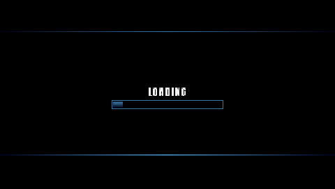
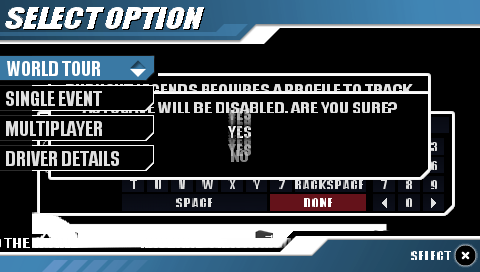
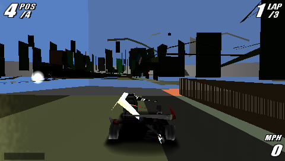
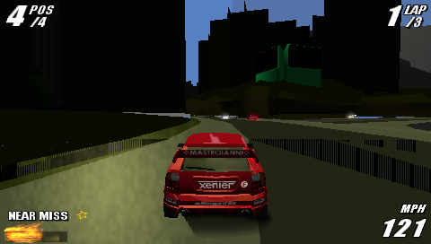
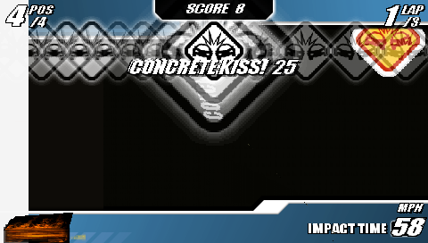
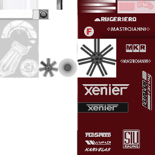
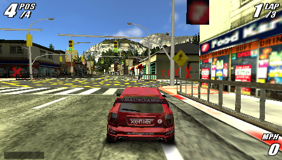
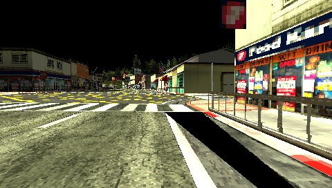
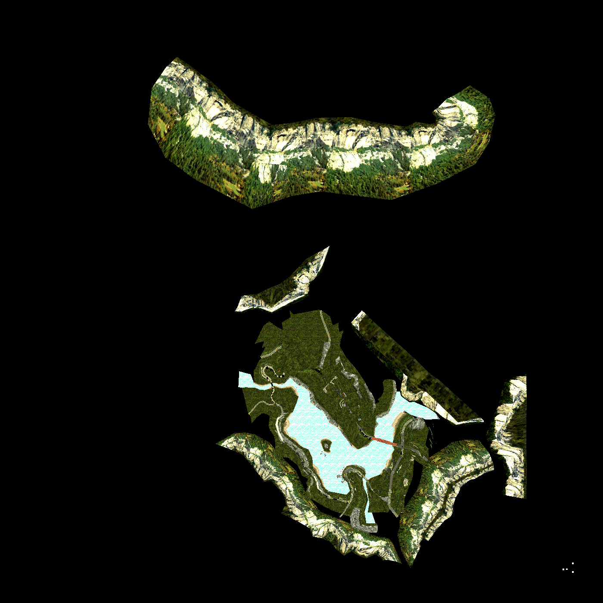
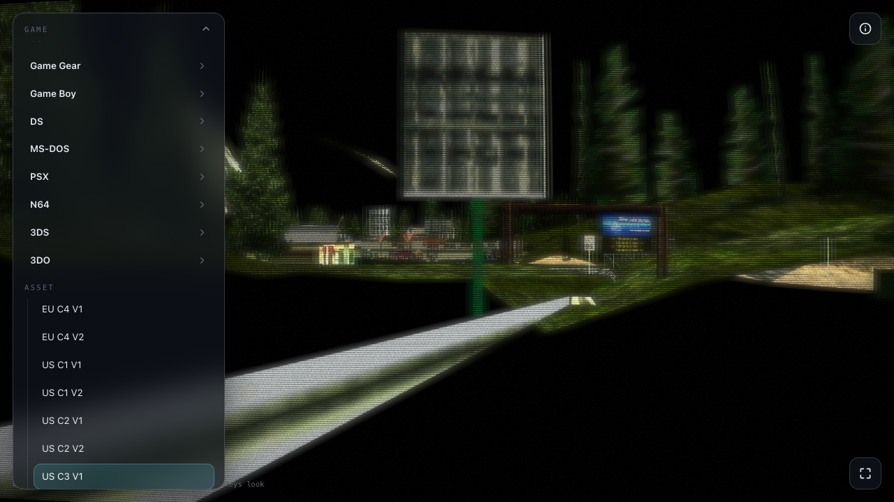

# Burnout Legends (PSP) — technical reference

**Image.** `Burnout Legends.cso` — 260,157,913 bytes, MD5
`eaa446ea6d4847bdf486eb114441ddfd`. A CISO-compressed dump of a UMD
(`DISC_ID` ULUS10025, `PSP_SYSTEM_VER` 1.52). The image is not committed
(see the repository copyright policy); supply a dump with the MD5 above.

Burnout Legends is a 3-D arcade racer; it shares the PSP toolchain with the
other PSP target — the Allegrex CPU core (`tools/cpu/allegrex`), the machine
oracle and its format libraries (`tools/platform/psp`), and the
`pspinfo`/`bootoracle` front-ends. This document records what is specific to
this disc.

## Contents

- **Part I — The image.** The CISO/ISO layers, PARAM.SFO, and the `~PSP`
  KIRK-encrypted executable — a 1.xx-firmware EBOOT with a distinct
  decryption tag.
- **Part II — Boot chain.** Module relocation (multi-segment, segment-index
  aware), the async IO the file manager runs on, and the boot to the first
  rendered frame.
- **Part III — To the main menu.** The directory-scan file catalogue
  (`sceIoDread`), the by-value thread argument, the movie player
  (sceMpeg/sceAtrac3plus HLE), and the scripted walk from the title screen
  through profile creation to the main menu.
- **Part IV — Into the race.** The streaming wall (a half-answered
  `sceKernelVolatileMemLock` left the track streamer with no memory); the
  rasterizer gaps a 3-D scene exposes that a 2-D one never does, found by
  censusing the game's own display lists against what we handled; and the one
  that mattered most — the GE *consumes* vertices, so a mesh behind a single
  `VADDR` was drawing its first strip over and over. Ends with the race
  rendering and driving.
- **Part V — The vehicle format.** `.bgv`, the cars: a self-contained,
  GPU-ready model container, decoded and exported — all 89 vehicles, with
  their texture atlases and their wheels in the right places.
- **Part VI — The track format.** `static.dat` and `streamed.dat`: a
  position-independent, GPU-native world whose every offset is relative to
  whatever owns it. The transform read out of the engine's own command words
  rather than guessed from a 4x4 that turns out to be a bounding box. All 34
  tracks decoded, verified against the running game, and shipped to the Studio
  with all 89 cars.

---

## Part I — The image

### 1. Container and filesystem

The CISO container and the ISO 9660 UMD filesystem decode with the shared
readers (`cso.go`, `iso.go`); no format differences from the other PSP disc.
PARAM.SFO reports `TITLE` Burnout Legends, `DISC_ID` ULUS10025, `CATEGORY`
UG, `PSP_SYSTEM_VER` 1.52. The boot tree holds the encrypted
`PSP_GAME/SYSDIR/EBOOT.BIN` (5,075,472 bytes; `BOOT.BIN` is blanked), a
`SYSDIR/UPDATE` firmware-updater payload, and `USRDIR` — the game's
`data/*.txd` texture dictionaries (`Frontend.txd`, `Global.txd`, …),
`*.kfs`/`*.bin` asset packs, per-language `Global*.bin`, and the media PRXs
under `amodule/` (`libatrac3plus`, `mpeg`, `sc_sascore`, the `pspnet`
adhoc-multiplayer stack).

### 2. The boot executable: `~PSP` / KIRK, tag `0x08000000`

`EBOOT.BIN` is a `~PSP` container whose header tag at `+0xD0` is
**`0x08000000`** — the 1.xx-firmware retail EBOOT tag, distinct from the
2.xx tag `0xC0CB167C` the other disc uses. The KIRK decryption algorithm
(`prx.go`/`kirk.go`) is unchanged; the tag selects a different XOR seed and
kirk7 key: `g_keyEBOOT1xx` (0x90 bytes) with key id `0x4B`. The seed is a
documented platform constant (`kirk_keys.go`), transcribed as the
little-endian bytes of the reference's u32 array and verified against ground
truth: the SHA-1 header check holds and the body decrypts to `\x7fELF`,
exactly `0x4D70BD` = 5,075,133 bytes.

The plaintext is an ELF32-LE MIPS PRX (`e_type` `0xFFA0`) with **two**
`PT_LOAD` segments: segment 0 (file = mem = `0x3B9B7C`, the code and
read-only data, `p_paddr` `0x29B6C4` locating the `sceModuleInfo`) and
segment 1 (file `0x1730`, mem `0x31A270` — a small initialized-data block
over a large BSS). The module names itself `Burnout` and imports **31
libraries**: `sceGe_user`, `sceDisplay`, `sceCtrl`, `sceMpeg`, `sceSasCore`,
`sceAtrac3plus`, `sceNet`/`sceNetAdhoc*`, `sceUtility`, `sceRtc`,
`ThreadManForUser`, and the rest.

`pspinfo -image "…/Burnout Legends.cso" -exe PSP_GAME/SYSDIR/EBOOT.BIN`
decrypts and describes it.

---

## Part II — Boot chain

### 1. Multi-segment PRX relocation

The module is relocatable and is loaded and relocated at `0x08804000`
(`elf.go`, `Relocate`). Its `SHT_PRXRELOC` sections (type `0x700000A0`) carry
144,831 MIPS relocations, and — unlike a single-segment module — their
`r_info` fields matter beyond the type byte: bits 8-15 name the **segment the
offset is relative to** and bits 16-23 the **segment whose load address is
added**. The same offset appears twice in this module — once as a segment-0
`HI16` (the first instruction, `lui $a0, 0x2B`) and once as a segment-1
`R_MIPS_32` — so applying every relocation to segment 0 (correct for a
single-segment module) overwrites segment-0 code with a segment-1 fixup and
corrupts the image at load. The relocator honours both indices: it reads and
writes within the segment named by the offset-base index and adds
`base + segment[addr-base].vaddr`, so segment-1 data fixups and segment-1
pointers land correctly and segment-0 code is left intact. `HI16`
relocations defer, carrying their segment, until the paired `LO16` resolves
the split immediate.

### 2. Async file IO

Burnout drives its assets through the PSP's asynchronous IO: a file-manager
thread issues `sceIoOpenAsync`/`sceIoReadAsync` and retrieves the results
with `sceIoWaitAsync`/`sceIoWaitAsyncCB`/`sceIoPollAsync`, guarded by a
"Filesystem lock" semaphore. The oracle's volume reads complete instantly,
so each async call performs its operation immediately and stores the 64-bit
result on the descriptor; the wait and poll calls hand that result back and
report completion (`io.go`). Without this the boot parks forever on the
filesystem lock; with it the game streams `data/Global.txd` and its other
packs and proceeds.

### 3. To the first frame

With the relocation and async IO correct, the boot brings up the game's
threads — `user_main`, `Callback_Handler`, `SystemControl` — and its kernel
objects (the system-control, display-list, UMD and filesystem semaphores,
the `SceGuSignal` event flag), loads and starts its **14 media modules**
(`sceKernelLoadModule`/`StartModule`), reads the pad
(`sceCtrlReadBufferPositive`), waits on VBlank (`sceDisplayWaitVblankCB`),
and submits GE display lists (`sceGeListEnQueue`) that the software
rasterizer draws — reaching the game's **LOADING screen**, its own rendered
frame.



---

## Part III — To the main menu

### 1. The directory-scan file catalogue

Past the loading screen the boot walked into a corrupt object and `jalr`'d
into the exception vector. The trail (`-bp`/`-watch` on the pointer the
crashing code loads, at `0x08C2C18C`) led back through the boot state machine
at `0x0880E0xx`: the pointer is the loaded image of `Data/PrgData.bin`, a
pointer-patched data file the game relocates in place (`0x089BB850` adds the
load base to a table of offsets — the same trick LocoRoco's `.clv` levels
use). The file "loaded" — but every one of the game's reads was **zero bytes
long**: `sceIoRead(..., 0) -> 0`.

The zero comes from the game's file catalogue. Burnout Legends does not ask
for file sizes with `sceIoGetstat` or `sceIoLseek(END)`; at boot it walks the
whole disc with **`sceIoDopen`/`sceIoDread`/`sceIoDclose`** (124 directories)
and builds its file table — names *and sizes* — from the returned
`SceIoDirent` entries. With those calls stubbed, every catalogued size was
zero. The oracle now serves the scan from the ISO directory tree (`io.go`):
each `sceIoDread` fills a dirent (a `SceIoStat` with the umd9660 driver's
start-LBN in `st_private[0]`, plus the name), returning the number of entries
still to read. After the fix the game streams every asset by raw sector
extent — `disc0:/sce_lbn0x%X_size0x%X` paths, the same umd9660 contract the
other disc uses — with correct sizes, and `PrgData.bin` relocates correctly.

### 2. The by-value thread argument

Next wall: the game's "SND ATRAC PACKET DECODER" thread dereferenced its
argument into garbage and crashed. The thread is started with a **112-byte
argument block** (`sceKernelStartThread(uid, 0x70, ptr)`) that lives on the
*creator's* stack. The real kernel copies the block onto the new thread's
stack before it first runs; the oracle's scheduler passed the original
pointer, and by the time the thread was scheduled the creator's frame was
long dead. `startThread` (`sched.go`) now copies the block below the thread's
`$k0` context area and points `$a1` at the copy — the kernel contract.

### 3. The movie player: sceMpeg + sceAtrac3plus

The boot then reached the intro movies (`ovid/englis30.pmf` + its `.at3`
audio) and parked: the game pumps its player loop off `sceMpegGetAvcAu`, and
the ATRAC packet-decoder thread spun millions of calls into stubbed
`sceAtracDecodeData`. The oracle now carries a **minimal, honest movie-player
HLE** (`mpeg.go`) — no video or audio codec, but the real streaming contract:

- **PSMF header** (big-endian): `sceMpegQueryStreamOffset`/`QueryStreamSize`
  parse the magic and the offset/size fields of the header the game hands in,
  and reject a buffer without the `PSMF` magic.
- **Ringbuffer accounting**: `sceMpegRingbufferConstruct` records (and writes
  into the guest struct) the packet capacity and the game's own packet-read
  callback; `sceMpegRingbufferPut` *runs that callback* in a nested guest
  frame (`callGuest`), so the movie data really is streamed by the game's
  file manager; `sceMpegGetAvcAu` consumes buffered packets into access units
  and reports `SCE_MPEG_ERROR_NO_DATA` when the stream drains — the signal
  the player's end-of-movie logic runs on.
- **Frames without pixels**: `sceMpegAvcDecodeYCbCr`/`sceMpegAvcCsc` report
  every frame produced but write no pixels (there is no H.264 decoder here) —
  a movie "plays" black, at the pace of the game's own pump, and terminates.
- **ATRAC3+ as silence with real accounting** (`sceAtracSetDataAndGetID`,
  `DecodeData`, `GetStreamDataInfo`, …): the RIFF header the game hands over
  names the block align and data size, so the decode loop serves the true
  number of frames — as silent PCM — sets the end flag on the last one, and
  returns `SCE_ATRAC_ERROR_ALL_DATA_DECODED` past it.

One more CPU op surfaced on the way: the sound mixer converts samples with
the VFPU's packed-integer conversions — `vi2s.q` and family (`vi2s`/`vi2us`/
`vi2c`/`vi2uc`, `vs2i`/`vus2i`) are now in `tools/cpu/allegrex/vfpu.go`.

### 4. Title screen to main menu

With movies completing, the attract sequence lands on the game's title screen
— its own rendered "PRESS START BUTTON TO CONTINUE" frame:


From there a `-keys` pad script (VBlank-scheduled, the same mechanism the
other PSP disc plays with) walks the front end: START → the profile dialog →
NEW PROFILE → the on-screen keyboard's default name → save-to-memory-stick
declined (the modelled savedata utility reports no memory stick data) →
autosave-off confirmed → the **main menu**: WORLD TOUR, SINGLE EVENT,
MULTIPLAYER, DRIVER DETAILS.



### 5. Into the race: the idle-descriptor poll

Continuing the script — SINGLE EVENT → RACE → the race options (region, track,
rivals) → **SELECT CAR**, whose 3-D car model the software rasterizer renders
— the boot then deadlocked on the "Filesystem lock" semaphore: `user_main`
took it, and took it again without releasing.

The cause was a wrong answer from the oracle, not a missing one.
Burnout's stream code **polls a descriptor before it queues work on it**, to
ask "is an operation already running?" The oracle's `sceIoPollAsync` returned
`1` — *still in progress* — for a descriptor with nothing outstanding. The
game therefore believed a read it had never issued was in flight, waited for
it, and `sceIoWaitAsync` handed back a stale zero, which failed the game's
check against the byte count it expected; the error path then tore the stream
down and re-entered the lock-holding close. One value, four symptoms.

Both calls now report `SCE_KERNEL_ERROR_NOASYNC` (`0x80020321`) when no
operation is outstanding, which is the honest answer: *nothing is running
here*. The game then issues its reads, and the race load runs — `enviro.dat`,
`Gamedata.bgd`, `static.dat`, the track texture packs — onto the pre-race
loading screen, a full-colour rendered frame:


Two diagnostics came out of the hunt and stay in the platform:
`PSP_SEMA_TRACE=<name>` logs every take and release of a named semaphore with
the thread, count and PC — the tool for a semaphore deadlock — and
`PSP_SYSCALL_TRACE=<substring>` logs matching syscalls with their arguments,
return value and caller.

---

## Part IV — Into the race

### 1. The streaming wall: a lock that answered without answering

On the pre-race loading screen the game opened the track's `streamed.dat`
(3.9 MB) and then polled that descriptor every frame forever. The read was
never issued: the stream object's `Read` method (vtable + 24, `0x08A44280`)
was never called, while the frame loop called only the poll method
(vtable + 48, `0x08A449F8`). Nothing was blocked — no semaphore held, no
thread waiting — so the game was waiting on a completion its own producer
never started.

Tracing up from the poll gives the chain. The frame loop calls a status
wrapper (`0x08A42D30`), which dispatches through the stream vtable — whose
slots are 8-byte `{s16 this-adjust, pointer}` pairs, the object's vtable
pointer at `+40` — and returns the object's state word. Above it sits the
loader state machine (its object at `0x08D5A8C8`; outer state at `+16`,
dispatched at `0x08A1C2E0`; phase at `+56`). Its block-fetch routine,
`0x08A1D014`, is the producer, and its first act is to bail out if
`this+76` is zero.

`+76` is the streamer's read-ahead ring, allocated at `0x08A1BE8C` out of a
claim-once memory map. The front-end ring is planned from the ordinary heap.
The two in-race rings — 2 MB each — are planned at `0x0883AC8C` from a block
the game asks the OS for:

```
sceKernelVolatileMemLock(0, &ptr, &size)   // NID 0x3E0271D3, sceSuspendForUser
```

This is the PSP's 4 MiB *volatile* block at `0x08400000` — memory the OS
lends out of its suspend buffer. Our oracle stubbed the call: it returned
success and wrote nothing. So the planner read a null pointer, planned no
memory at all, the ring allocation "succeeded" with nothing behind it, and
the producer bailed at its first instruction forever after.

It is the same lesson as the `NOASYNC` fix one part earlier, in a new
costume: **a stub that half-answers is worse than one that fails.** The
oracle now hands out the block honestly (with `TryLock`/`Unlock`, and the
lock state carried in savestates), and the race load streams.

Two smaller things fell out of the same run. Allegrex opcode `0x3F` is the
VFPU pipeline-hint group (`vnop` = `0xFFFF0000`, `vsync`, `vflush`); Burnout
parks `vnop` in the delay slots of its track-geometry loops, and the CPU
halted on it. And a savestate now re-resolves syscall NIDs that have become
known since it was written, and clears a saved halt on restore — so a state
captured *at* an unimplemented instruction resumes once that instruction
exists, instead of re-halting on the same word.

### 2. Four things a 3-D scene needs that a 2-D one never asks for

The race then loaded, started, and rendered — a mess. The HUD was live and
correct (`POS 4/4`, `LAP 1/3`, `MPH 0`), and behind it the screen was filled
with enormous flat polygons. Everything our rasterizer had learned from
LocoRoco and from Burnout's own 2-D front end was intact; everything a 3-D
scene additionally requires was missing.

**The vertex layout.** A PSP vertex is a packed record in a fixed order —
weights, texture coordinates, colour, normal, position — with each component
aligned to its own element size and the whole vertex padded to the largest of
them. Our decoder knew only texcoord, colour and position. Burnout's
post-process quads (`vtype 0x122`) carry an 8-bit **normal**, three bytes we
never skipped, so every vertex after the first in each such primitive was
read from the wrong offset. That is what projected vertices to coordinates
like `(17065, 350)` and painted the frame with giant polygons. Fixing the
layout is what turned the mess into a scene; the other three fixes below make
that scene correct.

**A depth buffer.** The front end could rely on the painter's algorithm; a
racer draws its world in no useful order. The commands are `ZBP`/`ZBW`
(`0x9E`/`0x9F`), `ZTE` (`0x23`), `ZTST` (`0xE2`), `ZMSK` (`0xE7`), plus
`CLEAR`'s depth bit. The test function had to be *derived* rather than read:
the game programs `ZTST` once at engine init, so no list captured mid-race
carries it. Its viewport does carry the answer — z scale `-32767.5`, z centre
`+32767.5`, which maps the near plane to 65535 and the far plane to 0. With
depth reversed like that, the nearer fragment is the one with the **larger**
value, so the test is `GEQUAL`.

**Backface culling** (`0x1D` enable, `0x9B` face). The game toggles it
thousands of times per frame; ignoring it drew the inside of every closed
object over the scene. The tell was a start-line banner whose text rendered
mirror-reversed — we were looking at the back of it. The winding sign was
settled the same way the depth function was: not assumed, but read off a
frame rendered with culling disabled (`PSP_GE_NOCULL`), which showed the
ground plane and horizon that the wrong sign had been culling away.

**Near-plane clipping.** A vertex behind the eye has `w <= 0` and no
meaningful projection — it wraps to a huge screen coordinate. Triangles
crossing the eye plane are now clipped in clip space, with colour and
texcoords interpolated there, before the perspective divide.

A fifth thing was needed just to *see* what was happening: the game renders
into five VRAM buffers — two display buffers, the depth buffer, and two
off-screen targets it composites for its blur and streak effects — and the
only way to judge an off-screen pass is to look at it. `bootoracle -shotat
ADDR[:STRIDE]:FILE.png` dumps any of them.

With those in place, the oracle renders a recognisable frame of gameplay — but
not yet a correct one; two more findings (below) stood between it and the real
thing.

### 3. What the game actually asks the GE for

The first race frames were legible but wrong: the car's panels came and went,
triangles slashed across it, the road's texture swam, and everything sat too
dark. Guessing at each artifact was getting nowhere, so instead: **dump the
race's own display lists, census every command in them, and diff that against
what the rasterizer handles.** Sixty-seven command types came back that we
were ignoring. That list, not intuition, set the work.

One of them was not a missing feature but a corruption. `BASE` supplies the
high bits of the 24-bit addresses in `VADDR`/`IADDR`/`JUMP`/`CALL` — but the
GE only implements **bits 16-19** of its argument. Burnout sends
`BASE 0x480000` for the geometry it streams into the volatile block; we took
the `0x40` literally and read vertices from `0x484038FC`, which is nowhere at
all. Masked correctly it is `0x084038FC` — inside the streaming buffers. Every
primitive drawn out of streamed memory, which is to say *the track*, had been
decoding garbage.

The rest were pipeline stages, each of them something a 2-D scene never asks
for:

| What was missing | What it cost |
| --- | --- |
| Alpha test (`ATE`/`ATST`) | 4,644 primitives a frame; transparent texels painted solid — the triangles across the car |
| Real blend factors (`ALPHA`, `FIXA`/`FIXB`) | we hardcoded src-alpha; `0x50`, which we had labelled "blend", is shade mode |
| Depth function at `0xDE` | we listened on `0xE2` — the dither table — so the game's GEQUAL/ALWAYS switches never arrived |
| Perspective-correct texcoords | affine interpolation is what made the road swim |
| `TEXFUNC` modes + colour-double | everything modulated at half brightness |
| Texture-matrix projection from the **normal** | the car's reflection vertices all carry one dummy UV; reading it sampled a single bright texel and drew white ribbons over the car |
| Stencil (`0xDC`/`0xDD`) | the PSP's stencil buffer *is* the framebuffer alpha, and the game writes a mask there for its post-process to read back |
| Bilinear filtering, texture wrap/clamp, scissor, fog, GE block transfer | filtering, tiling, the blur target |

Two values were *derived* rather than assumed, because the game programs them
once at engine init and no mid-race list re-sends them: the depth function
(GEQUAL, read off the viewport's reversed z) and the cull winding (settled
against a frame rendered with culling disabled).

Lighting turned out to matter less than it looked: most of the world is drawn
**unlit**, with its light baked into the vertex colours. Only the cars enable
it, under a single directional sun.

### 4. The GE consumes vertices

Even with all of that, the car was still wrong — half its geometry missing, and
triangles slashing diagonally across what remained. Isolating it (drawing *only*
the primitives that read from the car's vertex buffer, and nothing else) made
the pattern obvious: the same small strip, over and over, at different angles.

The census had the answer sitting in it. Ten thousand four hundred and sixteen
primitives in one frame, **all reading from the same vertex address**, with
nothing but the `PRIM` word between them — no `VADDR` in sight.

The GE *consumes* vertices. Its vertex pointer advances by however many vertices
a primitive reads, so a mesh submitted as a run of `PRIM`s sets `VADDR` once and
every following primitive continues where the last one stopped. We re-read from
the same address every time: the car's first strip drawn hundreds of times over,
each with whatever state had accumulated — those were the diagonal slashes — and
the rest of the mesh never drawn at all. The track was doing the same thing.
LocoRoco never showed the bug because it re-emits `VADDR` per primitive.

Indexed primitives advance the *index* pointer instead; the vertex base stays.

With the pointer advancing, the car is a car — bodywork, sponsor decals, the
rear-window text legible, taillights — and the street arrives with it: lamp
posts, traffic lights, the rival ahead on the grid, the overpass.

### 5. A savestate can outlive the bug that made it

The road stayed wrong after all of that: a flat olive surface where the asphalt
and its markings should be. The geometry was right, the vertex colours were pure
white, the texture coordinates varied correctly across the surface — and the
texture the road binds, a CLUT4 image at VRAM `0x04180E80`, was **all zeros**.
We were sampling an empty texture through a perfectly good palette, and index
zero is olive.

Textures reach VRAM by **GE block transfer** — the 2-D blit (`TRANSFERSTART`,
`0xEA`) — and the game runs 210 of them while the LOADING screen is up. We only
implemented that blit today. Every in-race savestate in the scratchpad had been
captured *after* the loading screen by a build that dropped those transfers on
the floor, so each one carried a VRAM with no track textures in it — and no
amount of fixing the renderer afterwards could put them back. A savestate
outlives the bug that made it.

Replaying from **car select**, upstream of the uploads, is what fixed it. The
evidence that it had to be upstream: a write-watch on the texture's address
across the entire post-brief load fired zero times, while `PSP_GE_XFER=1` showed
the transfers running earlier and elsewhere.

The lesson generalises past this disc: **when you fix a path that fills GPU
memory, regenerate the savestate chain from a checkpoint before the fill.**



### 6. The race is really running

A rendered frame could still be a still life. It is not: with the throttle
held down from the countdown (a `-keys` script pressing cross every 20
vblanks and nothing else), the car pulls away and reaches speed — 121 mph,
traffic sliding past, the boost streaks stretching from the edges of the
screen, the HUD calling a `NEAR MISS`.



And then, with nobody steering it, the car drives into a wall. The game
answers with its crash mode: `CONCRETE KISS! 25`, a running score, and the
impact-time counter of Burnout's aftertouch.



That is the honest end of the boot chain: the oracle now boots the disc from
cold, walks the front end, streams a track, starts a race, drives a car, and
crashes it.

---

## Part V — The vehicle format

The disc keeps its cars under `PSP_GAME/USRDIR/pveh`, grouped into the six
classes the SELECT CAR screen offers — `COMP`, `CUPE`, `HEVY`, `MSCL`, `SPRT`,
`SUPR` — with the numbering restarting inside each. Every vehicle brings a
`.bgv` (the model), `.hdt`/`.ldt` (detail data), and `.hwd`/`.lwd`, which the
filenames tempt you to read as *wheel* data and which are in fact **wave**
banks: sample rates and running indices, sound rather than geometry.

### 1. The file is the vertex buffer

The decisive question about any model format is whether the game transforms the
data at load or hands it to the hardware as-is. This one is answered without
guessing: dump the exact vertex bytes the GE fetched while the game was running,
then search the file for them. They are there, **byte-identical**, at
`0x33ED0` of `Car1.bgv`.

So a `.bgv` is not a container to be unpacked — it *is* the thing the hardware
reads. The engine loads the file verbatim at some base, patches about twenty
pointer slots (each stored as a plain file offset, fixed up to `base + offset`),
and points the GE at it. The vertex data in the file is the vertex buffer; the
strip lists in the file are display-list fragments, each ending in a GE `RET`
so the engine can simply *call* them.

That also explains the renderer bug from Part IV: the file gives one `VADDR` and
then a run of bare `PRIM` words, because the hardware's vertex pointer advances
as primitives consume vertices. The format and the hardware behaviour are two
views of the same fact.

### 2. Layout

```
header  +0x08  file size
        +0x4C  \
        +0x50   >  three mesh tables — the three detail levels
        +0x54  /
        +0x60  the texture region
        0x0B80 four 4x4 wheel placements

mesh table   u32 offsets relative to the table, zero-terminated,
             one per mesh record

mesh record  its own offsets are relative to record + 0x10:
        +0x00  a type id
        +0x30  the model scale (three floats)
        +0x44  vertex stream       +0x48  vertex count
        +0x54  strip list          +0x58  strip list length

strip list   GE PRIM words — 0x04<<24 | type<<16 | vertexCount —
             terminated by RET (0x0B000000)

vertices     GE-native, 14 bytes: u16 texcoords, an 8-bit normal,
             16-bit positions. The fixed-point fields are fractional
             exactly as the hardware reads them (u16/32768, s8/128,
             s16/32768); the model scale then puts the mesh in world
             units.
```

The record's vertex count and the strips agree exactly — the strips consume
precisely the vertices the record declares, in all 30 records of Car1 and in
every other car on the disc.

### 3. The texture

The texture region (header `+0x60`) is a small descriptor followed by the
pixels: the palette offset at `+0x08`, the width and height at `+0x0C`/`+0x10`,
the depth at `+0x14`, and the image itself at `+0x110`. The cars use one
256×256 CLUT8 atlas apiece, stored **swizzled** in the GE's 16-byte by 8-row
block order, with a 256-entry RGBA palette.

Decoded, it is unmistakably the car's own skin — the same sponsor decals that
are legible on the rendered car in the race:



### 4. Where the wheels go

The mesh records carry no transform, and for six of a car's seven body parts
that is because none is needed: they already hold their position in their
vertices. The wheel is the exception. It is modelled about the origin, and the
file carries **four 4×4 matrices** — row-major, translation in the last row,
the right-hand pair mirrored through a `-1` X basis — that place it at the
corners.

Two things establish that this is the real placement data rather than a lucky
read of some plausible floats. It is **structural**: the same offset in every
car, and the values track each car's own geometry — the heavy class is wider at
±0.835, the supercar has the longer wheelbase. And the **running game confirms
the binding**: replaying the race and pairing every drawn primitive with the
world matrix the engine handed it shows the body drawn once at the car's origin
and the wheel mesh drawn at exactly these four corners.

### 5. Exported

`bgvdump -all` parses every vehicle on the disc — **89 models, no failures,
178,715 triangles** — and `bgvexport` writes them as GLBs with the atlas
embedded.

The check that matters is not that the parser is self-consistent but that the
result is a car. Rendering an exported GLB back to an image gives one:


That readback earned its place. An earlier export passed every internal
consistency test — all 89 files, strips consuming exactly the declared vertices
— while being geometrically wrong twice over: the wheels were stacked at the
origin, and a Y-flip that assumed the PSP's screen-down convention had the car
standing on its roof. The models are already Y-up; it is the handedness that
needs flipping, not the up-axis. Only looking at the thing caught either.

---

## Part VI — The track format

A track lives in `PSP_GAME/USRDIR/Tracks/<REGION>/<TRACK>/`, and the race we
replay is `US/C3_V1` — identified not by name but by tracing `sceIoOpen`'s LBAs
against the ISO listing, because the game opens its files by raw `sce_lbn`
extent and never by path. Four files sit there: `static.dat`, `streamed.dat`,
`Gamedata.bgd`, and `enviro.dat`.

Scanning for runs of GE `PRIM` words ending in a `RET` finds geometry in the
first two and none at all in `Gamedata.bgd`, so the tracks are the same
GPU-native family as the cars. Everything after that was harder than it looked.

### 1. Why the car's playbook failed

Two things that worked on `.bgv` fail here, and both fail in a way that looks
like something else.

The first: **searching the file for the vertex bytes the GE fetched**. For a car
that is decisive — the bytes are right there. For a track it finds nothing, and
the reason is a trap. The GE is drawing the track out of the PSP's 4 MiB
volatile block at `0x08400000`, and that block also holds the display list, so
RAM at the address you land on decodes as `FBPIXFMT`/`FBP`/`FBW`/`ZBP` rather
than as vertices. It looks exactly like a compressed file whose bytes never
appear on disc. It is not: `streamed.dat`'s entropy is 4.0–6.4 bits per byte and
the geometry is raw in the file.

The second: **the car's record layout**. Zero of the track's strip runs sit at
the `.bgv` offsets, and — the real tell — none of the strip lists are referenced
by an absolute `u32` anywhere in the file. Nothing points at them.

That is the whole shape of the format, stated backwards. **Every offset in a
track is relative — to the record, to the slot, or to the section that owns
it.** A structure built that way is position independent, which is exactly what
you need if you are going to stream a block into whatever memory is free. The
cars can afford plain file offsets because a car is loaded once, at a base, and
patched. A track cannot.

The way in was the same one that cracked `.bgv`: find where the file lands in
RAM and diff the loaded image against it. `static.dat` sits at `0x09549E80` in
the in-race savestate, and 227 words differ by exactly that base — the pointer
slots, in plain sight.

### 2. static.dat

```
header  +0x04  file size
        +0x08  material table
        +0x16  texture count (u16)
        +0x18  texture table — one u32 record offset per texture
        +0x24  \
        +0x28   >  geometry section lists
        +0x2C  /

texture record   +0x08  palette, from the record   +0x0C/+0x10  w, h
                 +0x14  bits per texel: 4, 8 or 32
                 +0x38  the mip chain — four level offsets, 8 bytes apart
                 mip 0 always lands at +0x110, and the levels tile exactly up
                 to the palette (2^bpp RGBA8888 entries). Texels are SWIZZLED
                 in the GE's 16-byte by 8-row blocks, as the hardware reads them.

material (0x28)  +0x08  a parameter   +0x0C  a slot, from the record
                 the slot holds a SIGNED offset, from the material record, to a
                 texture record — so the binding resolves from the file alone

section list     {u32 groupCount, u32 nodeArray} entries, each offset taken from
                 the entry; the list ends where its first node array begins

node (0x50)      +0x00  a bounding box: three axis rows and a centre row
                 +0x40  mesh record array (offset from this slot)
                 +0x44  mesh count
                 +0x48  a u16 material index per mesh — offset from the section
                        list ENTRY that owns the node, not from the section

mesh (0xA0)      +0x44  vertex count   +0x48  vertex stream (from the record)
                 +0x50  world centre   +0x60  half-extent
                 +0x8C  strip list (from the record)   +0x90  word count
```

Vertices are GE-native vertex type `0x116` — u16 texcoords, a 5551 colour, s16
positions, twelve bytes to a vertex — and the strip lists are display-list
fragments ending in `RET`, exactly as the cars' are. The arithmetic closes
without slack: the `PRIM` words of `US/C3_V1` consume 15,019 vertices and the
records declare 15,019.

### 3. The transform, and the 4x4 that is not one

Every mesh record opens with sixteen floats laid out like a row-major matrix
with a translation in the last row — the same convention the cars' wheel
placements use. Decoding through it produces vertices that land inside the
mesh's own bounding box, in a plausible part of the world, on a decode that
passes every consistency check in the format.

It is wrong. That 4x4 is a tight **oriented bounding box** — three orthogonal
half-axis vectors and a centre, for culling — and the axes being nearly
world-aligned is what makes the results look sane.

The engine settles it, because the engine writes the matrix down. Dumping the
GE command words that condition one road primitive gives its world matrix
directly:

```
world:  473  0    0     0
        0    353  0     0
        0    0    1761  0
        2713 99  -2083  1
```

`diag(473, 353, 1761)` is the record's `+0x60` half-extent to the unit, and the
translation is the record's `+0x50` centre less a constant. So:

> **world = centre + (position / 32768) × halfExtent**

with the s16 positions fractional, as everything else on this hardware is. The
constant is a **world-origin rebase**: the engine draws each cell relative to a
nearby origin to keep float precision up near the car, and folds the difference
into the view matrix. Take `centre − engineTranslation` across every drawn mesh
and the values collapse onto a handful of origins, one per cell — which is why a
single view matrix reproduces the frame from absolute coordinates.

### 4. streamed.dat

`streamed.dat` is the bulk of the world and it is a plain chain of blocks:

```
block  +0x04  cell index   +0x08  block size (the chain step)
       +0x10  four points at ground level, with a radius
       +0x50  mesh record array (from this slot)   +0x54  mesh count
```

Two blocks per cell, one of which carries the geometry and one of which carries
none. The mesh records are the same 0xA0 bytes as static's, with no node layer
above them; they name their material directly at `+0x88`, indexing `static.dat`'s
table. The blocks need no fixing up at all, which is the point of all those
relative offsets — the resident copies in RAM are byte-identical to the file.

### 5. Verified against the game, not against itself

A decode can satisfy every internal check and still be geometrically wrong; it
happened twice with the cars. So each claim above was put to the running game.

- **Placement.** 3,864 of 3,962 `static.dat` primitives are drawn at exactly
  `centre − origin`. The 98 that are not are all one mesh, drawn repeatedly at
  transforms the record does not give — an instanced prop whose placements live
  somewhere we have not looked.
- **The road.** Its centre and extent equal the world matrix the GE was handed,
  to the unit. Its four texcoords match the engine's decoded UVs exactly. Its
  texture bytes are byte-identical to the VRAM the GE sampled, and its palette
  is at the address the GE bound its CLUT from.
- **Materials.** 16 of 16 streamed meshes resolve, through the slot indirection,
  to the textures the engine actually bound.
- **All 34 tracks** parse, every strip list ending in a `RET` and consuming
  exactly the vertices its record declares.

And then the check that no amount of arithmetic substitutes for: render the
decode through the camera the oracle was using, and put the two frames side by
side. The game's own frame, and ours:





Same street, same shopfronts, same signage, same crosswalk, same barrier
chevrons, same mountain. (Ours has no car and no HUD — those come from
elsewhere — and no fog or sky.)

### 6. Two worlds, and the one the engine hides

The two files are not two halves of one scene; they are two **layers**, and the
engine swaps between them. `streamed.dat` is the city you drive through.
`static.dat` is the environment it sits in — terrain, cliffs, forest, a lake,
the mountain backdrop:



But `static.dat` *also* carries a coarse stand-in for the ground the streamed
cells cover, and the engine draws a static group only where its cell is not
resident. Of 142 static meshes in `US/C3_V1`, 37 are drawn in our reference
frame and 105 are not — and the ones that are not include a slab that sits above
the real road. Draw both layers at once and that slab wins the depth test over
the tarmac.

Which groups the engine suppresses is a runtime decision we have not reversed —
the cell data lives in `Gamedata.bgd`, the file with no geometry in it. The
obvious rule, *drop a static mesh wherever streamed geometry covers it*, is
**wrong**: tested against the engine's own draw list it would discard 20 meshes
the game does draw. So the export ships the two layers as separate GLBs and the
viewer keeps them apart, which is honest about what is known and what is not.

### 7. Shipped

`extract/bgt` decodes both files; `bgtdump -verify` runs every track on the disc
and `-preview` renders one from above. `webexport` writes the Studio's assets:
34 tracks (each a streamed world plus an environment layer) and all 89 cars.



Two things the Studio taught us that the decode never would have. The shared GLB
writer had **never emitted a `buffers` array** — a glTF loader resolves every
bufferView through `buffers[0]`, so every file it wrote was unloadable, and one
was already shipped broken. Our verification renders had always drawn the decoded
structs, never opened the file we wrote. And the world came out nearly black
until the alpha was taken from the engine rather than from glTF's default: these
palettes are full of middling alphas (the road's run 76 to 153) that mean nothing
to a draw with blending off, and a 0.5 mask cutoff throws a fifth of the world
away. The GE's own alpha test cuts at 16.
