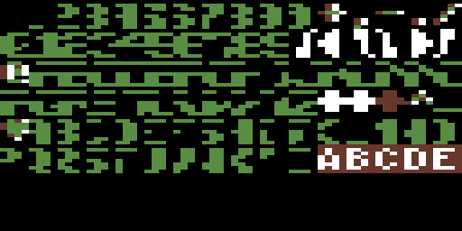
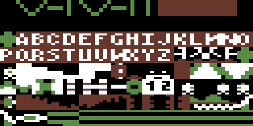
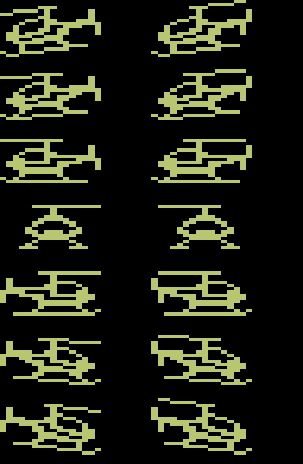
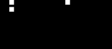
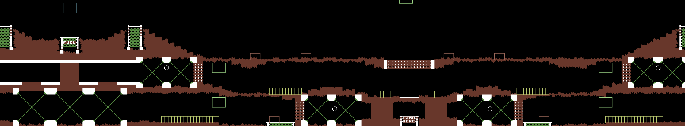
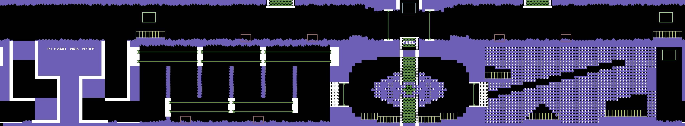

# Fort Apocalypse (C64) — tape format, loader, and game analysis

**Image:** `Fort_Apocalypse.tap` — 225,817 bytes, MD5 `bec7409816865f3ad160af9984f127cd`. Not committed (copyright); supply your own copy.

A complete reverse-engineering reference for `Fort_Apocalypse.tap`
("FORT APOCALYPSE — BY STEVE HALES — COMMODORE VERSION BY JOE VIERRA —
COPYRIGHT SYNSOFT", U.S. Gold tape release). It covers everything
learned in this analysis session, in reading order:

* **Part I** — the TAP container and both tape encodings (standard
  KERNAL and the custom fastloader), enough to extract every byte
  from the raw image;
* **Part II** — the boot chain from `LOAD` to the game's first
  instruction, including the loading screen and the copy-protection
  tricks;
* **Part III** — the game program: initialization, interrupt
  architecture, memory map;
* **Part IV** — all graphics data: character sets, sprites, the level
  maps and their compression, the scanner (with the extracted images
  inline);
* **Part V** — game mechanics: every object type, its movement,
  collision and spawn behavior, plus difficulty and progression —
  enough to reimplement the game.
* **Appendices** — toolchain and reproduction commands, all text
  strings and easter eggs, key routine/table reference.

Methods: a Go extraction toolchain (`extract/` plus the shared
`tools/`), a table-driven 6502 disassembler (`tools/cmd/dis6502`),
a graphics renderer (`extract/cmd/gfxrender`), and dynamic verification
that ran the real init/title/game path under the shared `tools/platform/c64/c64`
machine model, logging all reads/writes to confirm the static analysis.
All addresses are C64 memory addresses; "frame" means one PAL frame.

---

## Contents

- [Part I — The tape image](#part-i--the-tape-image)
  - [1. TAP container](#1-tap-container)
    - [Layout of this image](#layout-of-this-image)
  - [2. Standard KERNAL encoding (bootstrap part)](#2-standard-kernal-encoding-bootstrap-part)
    - [Records on this tape](#records-on-this-tape)
  - [3. The fastloader encoding](#3-the-fastloader-encoding)
    - [Stream layout](#stream-layout)
- [Part II — Boot chain and loader internals](#part-ii--boot-chain-and-loader-internals)
  - [1. Overview](#1-overview)
  - [2. Loader setup ($080D, run by SYS 2061)](#2-loader-setup-080d-run-by-sys-2061)
  - [3. The IRQ handler in the tape buffer ($0351)](#3-the-irq-handler-in-the-tape-buffer-0351)
  - [4. Stage 2 — the loading screen ($E000–$E6FF, $EE00–$F1FF)](#4-stage-2--the-loading-screen-e000e6ff-ee00f1ff)
  - [5. The music stream is a program — and hides the game start](#5-the-music-stream-is-a-program--and-hides-the-game-start)
  - [6. End of loading, and the error path](#6-end-of-loading-and-the-error-path)
- [Part III — Game program architecture](#part-iii--game-program-architecture)
  - [1. Initialization ($8600 → $8927)](#1-initialization-8600--8927)
  - [2. Interrupt architecture](#2-interrupt-architecture)
  - [3. Memory map (during play)](#3-memory-map-during-play)
    - [Game file layout ($7000–$B8FF)](#game-file-layout-7000b8ff)
- [Part IV — Graphics and data formats](#part-iv--graphics-and-data-formats)
  - [1. Compression: table-selective RLE](#1-compression-table-selective-rle)
  - [2. Character sets](#2-character-sets)
    - [HUD charset, $5000 (screen rows 0–6, $D018=$14)](#hud-charset-5000-screen-rows-06-d01814)
    - [Playfield charset, $5800 (screen rows 7–24, $D018=$16)](#playfield-charset-5800-screen-rows-724-d01816)
  - [3. Sprites — packed column format](#3-sprites--packed-column-format)
  - [4. The level maps](#4-the-level-maps)
    - [Actual width: 215 columns + wrap seam](#actual-width-215-columns--wrap-seam)
    - [Scrolling: brute-force window copy ($A72C)](#scrolling-brute-force-window-copy-a72c)
  - [5. The scanner (radar)](#5-the-scanner-radar)
  - [6. HUD](#6-hud)
- [Part V — Game mechanics and objects](#part-v--game-mechanics-and-objects)
  - [0. The collision architecture](#0-the-collision-architecture)
  - [1. The player — Rocket Copter (sprite 0)](#1-the-player--rocket-copter-sprite-0)
  - [2. Player bullets (sprites 2–3)](#2-player-bullets-sprites-23)
  - [3. Enemy helicopter (sprite 1)](#3-enemy-helicopter-sprite-1)
  - [4. Tanks (6 per level, char-based)](#4-tanks-6-per-level-char-based)
  - [5. Homing missiles (one per tank, chars $71/$72)](#5-homing-missiles-one-per-tank-chars-7172)
  - [6. SPMs — Self-Propelled Mines (13/26/39 by difficulty)](#6-spms--self-propelled-mines-132639-by-difficulty)
  - [7. Prisoners — "MEN TO RESCUE" (8 per level)](#7-prisoners--men-to-rescue-8-per-level)
  - [8. Gates, moving walls, barriers and laser grids](#8-gates-moving-walls-barriers-and-laser-grids)
    - [The reactor gate walls (chars $59/$5A)](#the-reactor-gate-walls-chars-595a)
    - [Sweeping walls (chars $0E–$11)](#sweeping-walls-chars-0e11)
    - [Laser grids (chars $0A–$0D)](#laser-grids-chars-0a0d)
    - [Energy barriers (chars $01–$08, emitter caps $09)](#energy-barriers-chars-0108-emitter-caps-09)
    - [Cosmetic wall animation (chars $4C–$4F, $47)](#cosmetic-wall-animation-chars-4c4f-47)
  - [9. Collision matrix](#9-collision-matrix)
  - [10. Difficulty variants](#10-difficulty-variants)
  - [11. Level progression and victory](#11-level-progression-and-victory)
    - [Pilot ranks](#pilot-ranks)
- [Appendix A — Toolchain and reproduction](#appendix-a--toolchain-and-reproduction)
- [Appendix B — Strings and easter eggs](#appendix-b--strings-and-easter-eggs)
- [Appendix C — Key routines and tables](#appendix-c--key-routines-and-tables)

---

# Part I — The tape image

## 1. TAP container

A TAP file records the signal a C64 sees on the cassette read line as
a sequence of pulse lengths, one byte each.

```
offset  size  content
0       12    magic "C64-TAPE-RAW"
12      1     version (this image: $01)
13      3     reserved
16      4     data length, little-endian
20      ...   pulse data
```

Header of this image:

```
43 36 34 2D 54 41 50 45 2D 52 41 57   "C64-TAPE-RAW"
01                                    version 1
00 00 00                              reserved
05 72 03 00                           data length $00037205 = 225,797
```

Each data byte `n > 0` is one pulse (falling edge to falling edge) of
`n * 8` clock cycles (PAL: 985,248 Hz). A `$00` byte is a pause
marker:

* version 0: pulse longer than $FF*8 cycles (no length given);
* version 1 (this image): followed by a 24-bit little-endian pause
  length **in cycles**, e.g. `00 00 10 00` = 4,096 cycles.

### Layout of this image

| TAP offset      | content                                          |
|-----------------|--------------------------------------------------|
| 20 – 35,396     | KERNAL: header block "FORT" + repeat copy        |
| 35,397          | pause `00 00 10 00` (4,096 cycles)               |
| 35,401 – 48,336 | KERNAL: data block (BASIC stub) + repeat copy    |
| 48,337          | pause `00 FC 23 12` (1,188,860 cycles ≈ 1.2 s)   |
| 48,341 – 225,812| fastloader stream, 177,472 pulses                |
| 225,813         | pause `00 15 74 70` (7,369,749 cycles ≈ 7.5 s)   |

Only four distinct pulse widths carry data:

| byte | cycles | used by                |
|------|--------|------------------------|
| $25  | 296    | fastloader, bit 0      |
| $2F  | 376    | KERNAL, short pulse    |
| $42  | 528    | KERNAL, medium pulse   |
| $54  | 672    | fastloader, bit 1      |
| $57  | 696    | KERNAL, long pulse     |

## 2. Standard KERNAL encoding (bootstrap part)

The ROM loader encodes each bit as a *pair* of pulses:

```
bit 0        = short  + medium     (2F 42)
bit 1        = medium + short      (42 2F)
byte marker  = long   + medium     (57 42)
end-of-data  = long   + short      (57 2F)
```

A byte frame is the marker, 8 data bits LSB first, and an odd-parity
bit. Example from this tape — the byte `$01` (header type):

```
57 42   byte marker
42 2F   bit0 = 1
2F 42   bit1 = 0
2F 42   bit2 = 0      value = $01 (LSB first)
2F 42   bit3 = 0
2F 42   bit4 = 0
2F 42   bit5 = 0
2F 42   bit6 = 0
2F 42   bit7 = 0
2F 42   parity = 0    (odd parity: 1 ^ XOR of data bits)
```

Each record is: a pilot of short pulses, a 9-byte countdown sync —
`89 88 87 86 85 84 83 82 81` for the first copy, `09 08 ... 01` for
the repeat copy — the payload, and one XOR checksum byte. Every record
is recorded twice.

### Records on this tape

**Header block** (192 bytes payload + checksum):

```
01          type 1 = relocatable (BASIC) program
49 CC       "start" $CC49      (ignored: type 1 relocates to $0801)
F8 CC       "end"   $CCF8      (end-start = 175 = real program length)
46 4F 52 54 20 ... 20          name "FORT" padded to 16 chars
48 98 48 AD 05 DC ...          171 extra bytes: loader IRQ handler code!
```

The KERNAL loads the whole header into the cassette buffer at $033C,
so the "unused" 171 bytes after the filename plant code at
**$0351–$03F5** for free. That code is the fastloader's IRQ handler
(Part II).

**Data block** (175 bytes + checksum), loaded to $0801:

```
0B 08       BASIC link pointer
00 00       line number 0
9E 32 30 36 31 00            SYS 2061
00 00
A9 93 20 D2 FF ...           machine code at $080D (loader setup)
```

## 3. The fastloader encoding

The custom loader (it identifies itself on screen as **NOVALOAD**,
serial "D100701") reads **one bit per pulse**, measured with CIA1
timer A latched to $03F4 and force-reloaded on every cassette FLAG
edge. The IRQ handler reads the timer high byte:

* pulse ≤ ~500 cycles → bit 0      (on tape: $25 = 296 cycles)
* pulse > ~500 cycles → bit 1      (on tape: $54 = 672 cycles)

(The exact threshold is $03F4 − $0200 = 500 cycles plus IRQ latency;
the discrimination is the `EOR #$02 / LSR / LSR` trick on the timer
high byte.)

Bits are shifted into a register with `ROR`, so the **first pulse of
a byte carries the least significant bit**. The register is
pre-loaded with $7F; the 0 that falls out of bit 0 after eight shifts
marks byte completion. During pilot search the register is *not*
reset on a mismatch, so a run of ≥8 zero bits followed by a single
one bit reads as the pilot byte $80 — that's how the decoder
self-synchronises.

### Stream layout

```
pilot      2,055 short pulses (0-bits), then one long pulse (1-bit)
sync       $AA
key        $55      (checked against the checksum seed, initialised $55)
records    [page#] [256 data bytes] [checksum]   repeated 84 times
end        $00 page number (only valid after the $F0 record)
trailer    252 bytes of $00 (filler, ignored)
```

* each record's 256 bytes load at `page# << 8` — pages may arrive in
  **any order** and gaps are fine;
* checksum = `(page# + sum of the 256 data bytes) mod 256`
  (`CLC ADC` per byte, carry dropped);
* the record with page# == **$F0** arms "end mode"; after it, a page#
  byte of **$00** terminates the load (other page numbers continue
  loading, and a 3-digit on-screen counter is decremented per page).

Example from this tape (TAP offset 48,341):

```
... 25 25 25 25 25 25 25 25      pilot: 0-bits
    54                           pilot terminator: 1-bit  (reads as $80)
    25 54 25 54 25 54 25 54      $AA   (LSB first: 0,1,0,1,0,1,0,1)
    54 25 54 25 54 25 54 25      $55   (1,0,1,0,1,0,1,0)
    25 25 25 25 25 54 54 54      $E0   first page number
    25 25 54 54 25 25 54 25      $4C   first data byte: JMP ...
```

Pages on this tape, in tape order:

```
E0 E1 E2 E3 E4 E5 E6 EF F0 EE F1        stage-2 loading screen
                                        ($E000-$E6FF, $EE00-$F1FF;
                                        $F0 arms end mode and releases
                                        the main thread's JSR $E000)
70 71 72 ... B8                         main game ($7000-$B8FF),
                                        loaded while stage 2 runs
00                                      end marker
```

All 84 record checksums on this image verify. Extracted program
files: `FORT.prg` ($0801, stub+loader), `FORT-fast-7000.prg`
($7000–$B8FF, the game), `FORT-fast-E000.prg`, `FORT-fast-EE00.prg`
(loading screen).

---

# Part II — Boot chain and loader internals

## 1. Overview

```
LOAD"",1 + RUN
SYS 2061 ($080D)                    KERNAL-loaded stub
  └─ banks ROMs out, vectors IRQ to $0351 (the code hidden in the
     tape *header*), arms a CIA FLAG interrupt per tape pulse,
     busy-waits at $03E5 until page $F0 arrives
     └─ JSR $E000                   stage 2: loading screen
          ├─ paints the U.S. Gold screen from a display script ($E364)
          ├─ runs scroller + 3-voice music while the game loads
          ├─ the music stream secretly patches $03F5: RTS -> JMP $8600
          ├─ on load error: wipe all RAM, JMP ($FFFC)   [reset]
          └─ on success: fade music, RTS
             └─ $03EE: ROMs back in, JSR $FF84 (IOINIT)
                └─ $03F5: JMP $8600   (was RTS until patched!)
                   └─ $8600: JMP $8927   game initialisation (Part III)
```

## 2. Loader setup ($080D, run by SYS 2061)

1. Clears the screen, copies the filename and `NOVALOAD D100701`
   (screen codes at $08A0) onto it.
2. `SEI`, `$01 = $05`: **banks out BASIC and KERNAL ROM**. The CPU IRQ
   vector is now the RAM vector $FFFE/$FFFF → pointed at $0351.
3. SID set up for the loading noise (each loaded byte is also written
   to $D401).
4. Zero-page loader state: `$FB/$FC` store pointer (low byte always 0,
   pages are aligned), `$FD` offset in page, `$AA = $55` checksum
   seed, `$AB` status ( $0F loading / $00 done / $80 error).
5. CIA1 timer A latch = $03F4; `$DC0D = $90` enables the FLAG (tape
   read line) interrupt only.
6. BASIC text pointer $7A/$7B → $03F6, which holds `3A 8A` (":" +
   `RUN` token) — a decoy, see below.
7. Busy-waits until `$FC == $F0` (the $F0 page has started loading),
   then `JSR $E000` while the IRQ keeps loading in the background.

## 3. The IRQ handler in the tape buffer ($0351)

Runs once per tape pulse. After the timer trick demodulates the bit
and `ROR $A9` assembles bytes (Part I §3), a **self-modifying branch
offset at $0365** dispatches a state machine:

```
PILOT  wait for byte $80 (no register reset on mismatch)
SYNC   expect $AA, else back to PILOT
CKSUM  byte must equal running checksum, else $AB=$80 and stop
PAGE   byte = page number; $F0 arms end mode
PAGE'  (end mode) $00 = load complete ($AB=0, FLAG IRQ off)
DATA   store 256 bytes at page*256+Y, checksum += byte
```

## 4. Stage 2 — the loading screen ($E000–$E6FF, $EE00–$F1FF)

| range        | content                                              |
|--------------|------------------------------------------------------|
| $E000–$E002  | `JMP $E008`                                          |
| $E003–$E007  | variables: 3 voice waveforms, music tempo, scroll speed |
| $E008–$E2AC  | code: screen painter, main loop, music player        |
| $E2AD–$E33F  | note frequency table                                 |
| $E340–$E363  | state variables                                      |
| $E364–$E6FF  | display script (the loading screen)                  |
| $EE6A–$EF7F  | scrolltext, stored **reversed**, 278 chars           |
| $EF80–$F1FF  | music command stream                                 |

The display script paints the U.S. Gold frame (`ALL AMERICAN
SOFTWARE`, `BLOCKS TO LOAD 075` — the three digits at $07D8–$07DA are
the cells the tape IRQ decrements per page). Script format: a
2-byte counter pointer, border+background colours, then runs of
screen codes with `$60` as escape (`60 0D` newline, `60 0n` colour n,
`60 04` end).

The scroller reads its text *backwards* from $EF7F with a
self-modified decrementing operand (byte `$60` wraps it):

> U.S.GOLD - THE ULTIMATE IN AMERICAN SOFTWARE - FROM THE BEST
> SOFTWARE PRODUCERS IN THE STATES, U.S. GOLD SELECTS THE MOST
> EXCITING TOP QUALITY PRODUCTS TO BRING YOU REAL ENTERTAINMENT
> VALUE. LOOK FOR THE U.S.GOLD SEAL. THESE ARE THE TITLES FOR YOU
> AND YOUR 64

## 5. The music stream is a program — and hides the game start

The music player's command stream ($EF80) has three command types:

```
nn dd        nn < $FE: play note nn for duration dd
FF lo hi     set stream read pointer (loop)
FE lo hi n   copy the next n stream bytes to address hi/lo
b1..bn
```

`$FE` is implemented by patching the operand of a `STA $nnnn,X`, so
the music data can **write anywhere in memory**. The first four
commands of the tune, executed on its first tick — long before
loading finishes:

```
EF80: FE 18 03 01  C1             ; $0318 <- $C1
EF85: FE 03 E0 05  41 41 41 0D 02 ; player variables re-init
EF8E: FE 00 D4 19  00 00 00 04 40 09 D0 (x3) 00 00 00 0F ; SID init
EFAB: FE F5 03 03  4C 00 86       ; $03F5 <- JMP $8600   *** game start
EFB2: ...notes...
F1C6: FF B2 EF                    ; loop the tune (patches run once)
```

* **`$0318 ← $C1`** redirects the KERNAL NMI indirection vector from
  $FE47 to $FEC1 — the `RTI` at the end of the ROM NMI exit sequence
  (`PLA TAY PLA TAX PLA RTI` at $FEBC). RUN/STOP–RESTORE becomes a
  clean no-op in the game.
* **`$03F5 ← 4C 00 86`** rewrites the loader epilogue: as loaded it
  ends `JSR $FF84 / RTS` followed by planted `:RUN` bytes — a decoy
  that static analysis (or a memory snapshot taken before the music
  played) sees as a harmless return to BASIC. The real entry address
  exists nowhere in code; it is data inside the tune.

## 6. End of loading, and the error path

On success ($AB=0) stage 2 fades the volume ~3 s, clears the SID, and
returns: ROMs in, IOINIT, then the patched `JMP $8600`. On a tape
error the loader IRQ freezes; stage 2 detects the stalled byte
counter and responds at $E220 by **wiping all RAM except its own page
$E2 and jumping through the reset vector** — anti-tamper as much as
error handling.

---

# Part III — Game program architecture

## 1. Initialization ($8600 → $8927)

$8600 holds `JMP $8927` followed by data tables. The init:

1. `SEI CLD`, clear zero page, `$01 = $2E` — **BASIC ROM out, KERNAL
   in** ($A000–$B8FF of the file is game code, called directly).
2. VIC bank 1 ($4000–$7FFF) via CIA2; screen $4400; `JSR $B11A` (SID
   reset; **voice 3 noise = the game's RNG, read at $D41B**).
3. `JSR $AFDB`: zero $0380–$6FFF.
4. Build both charsets and expand all sprites (Part IV).
5. Draw the HUD frame and title texts (double-width font renderer
   $9B56: each glyph drawn as char `n` plus char `n+$20`).
6. Install the title IRQ at raster line $F9 ($B0FF sets $0314/$0315 —
   the KERNAL dispatches IRQs through it) and end with
   **`$8A9F: JMP $8A9F`** — everything from here on is IRQ-driven.

## 2. Interrupt architecture

Two raster splits per frame:

```
line $F9 -> $9BD4: HUD part. $D018=$14 (charset $5000), scroll regs,
            read collision latches $D01E/$D01F into $68/$73,
            INC $15 (frame counter), keyboard/joystick, player sprite
            + bullets + enemy sprite updates, sound; next IRQ line $76
line $76 -> $AE19: playfield part. $D018=$16 (charset $5800),
            fine-scroll $D016/$D011, per-level colours $D022/$D023,
            charset animations, playfield window copy, SID effects;
            next IRQ line $F9
```

So screen rows 0–6 (HUD + scanner) and rows 7–24 (playfield) use
*different character sets*, switched mid-frame.

The **main game loop** at $8BB1 (entered from the title IRQ by a
stack-reset `JMP` when fire is pressed) calls the game-logic chain
(object engines, zone checks, state dispatch) and loops. It waits for
the frame counter to change **only outside gameplay** — the mode-2
check at $8BB3 branches *past* the wait, so during play the loop
free-runs, paced purely by how long a pass through the engines plus
the interleaved IRQs takes. Running the real code under emulation
(`extract/cmd/paceprobe`: the mos6502 core with a PAL raster-IRQ
model, joysticked from the title into play) measures **≈2.3 frames
per pass** (median; ≈2.5 on real hardware once the VIC's badline and
sprite DMA, which the model omits, slow the CPU) — so every enemy
cadence counted in "loop passes" runs ~2½× slower than a naive
passes-are-frames reading suggests. Game state lives in `$9D`:
1 title/attract, 9 demo-game, 3 new game, 4 get ready ("GET READY
PILOT", "PILOTS LEFT"), 5 life lost, 2 playing, 6 game over/debrief,
7 transition lock, $0A cavern teleport.

## 3. Memory map (during play)

| range        | content                                                  |
|--------------|----------------------------------------------------------|
| $0002–$00FF  | zero page: game state ($9D), frame ($15), camera ($56–$59), player ($64–$6A), pointers |
| $0100–$01FF  | stack                                                    |
| $0314/$0315  | IRQ vector: $9BD4 / $AE19 / $8AA2 (title), swapped per split |
| $0503–$2D02  | **decompressed level map**, 40 rows of 1 page each (215 content columns + empty pad + wrap-seam column 255) |
| $2E00–$343F  | **scanner soft bitmap**, 40×5 chars (320×40 px)          |
| $3500–$354D  | char-object X / row coordinate tables (39 slots)         |
| $3600–$361F  | prisoner tables (state, X, row, direction/phase)         |
| $3700–$374D  | SPM state machine bytes                                  |
| $4000–$43FF  | VIC sprite blocks; **blocks 1–14 = helicopter shapes**   |
| $4400–$47E7  | screen: rows 0–5 HUD image, row 6 frame/messages, rows 9–24 = map window |
| $47F8–$47FF  | sprite pointers (0 player, 1 enemy, 2–4 bullets)         |
| $4800–$487F  | sprite blocks $20/$21: bullet dots                       |
| $5000–$57FF  | HUD charset; $52E0–$53FF = scanner window soft chars     |
| $5800–$5FFF  | playfield charset; chars $00–$20 animated in place       |
| $7000–$B8FF  | the game file (below)                                    |
| $E000–$F1FF  | dead loader stage-2 remnants (never referenced)          |

### Game file layout ($7000–$B8FF)

| range        | content                                                  |
|--------------|----------------------------------------------------------|
| $7000–$762A  | level 0 map, RLE                                         |
| $762B–$7D36  | level 1 map, RLE                                         |
| $7D37–$7FFF  | unreferenced slack                                       |
| $8000–$81E8  | level 0 scanner bitmap, RLE (mode 1)                     |
| $81E9–$84EE  | level 1 scanner bitmap, RLE (mode 1)                     |
| $84EF–$8602  | unreferenced slack                                       |
| $8603–$86F2  | HUD screen image (rows 0–5, 240 bytes, literal)          |
| $86F3–$870E  | sprite shape pointer table (14 words)                    |
| $870F–$8906  | 14 packed sprite shapes (36 bytes each)                  |
| $8907–$8926  | energy-barrier char patterns                             |
| $8927–$B297  | code + small tables (run tables $8D2B/$8D42, level sources $8D46/$9116, solid-tile $A45D, heli anim $A320, masks $ADB5/$B0F7, difficulty $8DFC–$8E0F) |
| $B298–$B560  | HUD charset data (raw)                                   |
| $B561–$B8FF  | playfield charset data (raw)                             |

---

# Part IV — Graphics and data formats

## 1. Compression: table-selective RLE

One decompressor at **$8CDB** serves all level data:

```
read byte B
if B is in the run-table: count = next byte (0 means 256)
                          emit B & $7F, count times
else:                     emit B & $7F once (literal)
until the destination reaches its end address
```

Two run-tables select which byte values may be run-length encoded:

```
mode 0 (terrain), table $8D2B, 23 entries:
  00 61 0E 0F 10 11 0A 0B 0C 0D 03 07 1F 73 74 41 44 48 58 59 5A D8 C7
mode 1 (scanner bitmap), table $8D42:  00 55 AA FF
```

Any other byte is its own literal — no escape codes, at the cost of
fixing which values can repeat. Example from $7000:

```
1F D7  00 28  1F 01  00 00  00 00 ...
= 215×$1F | 40×$00 | 1×$1F | 256×$00 | ...   (the map's first rows:
  215 columns of rock border, 40 bytes of row padding, the wrap-seam
  copy of column 0 — see §4 — then an empty sky row)
```

There is **no encryption** anywhere in the game data — the only
transformations are this RLE, the sprite column packing (§3), and the
`AND #$7F` masking on decompressed bytes (map codes stay below $80).

## 2. Character sets

### HUD charset, $5000 (screen rows 0–6, $D018=$14)

Built at init ($899C) from **uncompressed** data: one continuous
stream copied in overlapping 256-byte strips, net effect
**$B298–$B588 → $500F–$52FF** (note the odd $0F start offset; the
rest of the charset stays zero). Contains the score font and HUD
furniture.
Chars $5C–$7F ($52E0–$53FF) are **soft characters**: the radar window
is rendered into them at runtime (§5).



### Playfield charset, $5800 (screen rows 7–24, $D018=$16)

Copied the same way, net effect **$B561–$B858 → $5908–$5BFF** (chars
$21–$7F: all terrain glyphs, 8×8 multicolor dither patterns — chars
$55/$56 are the mountain slopes, $57 flat dither, $58 solid block).
Chars $00–$20 are left for
**soft chars animated in place** by the playfield IRQ:

| chars       | routine | animation                                      |
|-------------|---------|------------------------------------------------|
| $01–$04,$09 | $A7ED   | energy barrier 1: pattern from $8907/$891F or blanked (timer $3D) |
| $05–$08,$09 | $A830   | energy barrier 2 (timer $3E, cap pattern $8917) |
| $0A–$0D     | $A86B   | laser-grid segments: each independently on/off, re-rolled every 128 frames (Part V §8) |
| $0E–$11     | $A8B8   | 4-phase rotation: one of four chars lit per phase |
| $20,$3F     | $A8F3   | every frame: `pattern($A927) AND $D41B` — noise flicker: **$20 is the explosion char, $3F the fort core** |
| $4C–$4F,$47 | $AF54   | two dither patterns alternated every 8 frames (cosmetic shimmer, Part V §8) |
| $59,$5A     | $8DD3   | reactor gate walls: one randomly solid per life (Part V §8) |
| $71,$72     | $A904   | missile exhaust rows noise-flickered every frame |



(Both charset sheets are rendered in multicolor interpretation:
00=black, 01=$D022, 10=$D023=white, 11=colour-RAM green. The letter
glyphs $21–$3A/$41–$5A double as the double-width HUD font *and* as
object graphics: $3B–$3E/$49–$4A are the prisoner, $40/$5B–$5F the
SPM (Self-Propelled Mine), $6C–$72 tank and missiles.)

## 3. Sprites — packed column format

The 14 shapes live at **$870F–$8906**: **36 bytes per shape = two
18-byte pixel columns** (left rows 0–17, then right rows 0–17),
located by the pointer table at $86F3. Init code $B044 expands each
into a 64-byte VIC block at $4040+ (blocks 1–14): per row
`[left][right][$00]`. Sprites are hires (no sprite multicolor);
sprites 0/1 are X-expanded ($D01D=$03), colours: player $D027=7
(yellow), enemy $D028 from $9C4F per level, bullets white.

**Both helicopters share one animation table** at $A320 (18 entries,
indexed by bank/tilt 0–$11):

```
01 02 03 04 05 06 07 08 07 08 07 08 09 0A 0B 0C 0D 0E
```

= **7 banking poses × 2 rotor frames** (even/odd index = rotor
phase; the head-on level-flight pose 7/8 covers three tilt steps).
The player toggles the rotor bit every frame ($67 bit 0); the enemy
every 4 frames ($A313). Animation sheet, one row per pose
(full-left → level → full-right), the two rotor frames side by side:



The two bullet sprites are built at runtime ($B0B0) from a 9-byte dot
pattern at $B0C2 into blocks $20 (pattern twice: angled shots) and
$21 (once: straight-down shots):



## 4. The level maps

Per level (index $5C), $8F8F decompresses the terrain from the source
table at $8D46 — level 0 ("VAULTS OF DRACONIS"): **$7000**, level 1
("CRYSTALLINE CAVES"): **$762B**, then repeats — into the buffer at
**$0503**, one 256-byte page per map row, 40 rows.

**Map bytes are screen character codes** — no tile indirection. Two
placeholder codes are post-processed after decompression ($8FC2):
every `$73` becomes a random char $62–$64 and every `$74` a random
$65–$67 ($D41B noise) — the mottled cave-rock texture.

### Actual width: 215 columns + wrap seam

The 256-byte rows are wider than the playfield. Verified against the
decompressed data of both levels:

* columns **0–214** hold the level content (215 columns);
* columns **215–254** are always $00 — padding to a full page;
* column **255** is a near-duplicate of column 0 (34/40 identical
  rows on level 0, 33/40 on level 1) — the **wrap seam**.

The world is a horizontal cylinder: the camera column wraps between
$02 and $D9 ($A666 scrolling right, $A688 left), and the window
source is `$0502 + camCol` (left edge shows byte `camCol-1`). At the
wrap position camCol=$D9 the screen's right edge displays byte 255 —
the artist stored a copy of the leftmost column there so the world's
left edge appears at the right edge of the screen as the camera wraps.

Address arithmetic for game coordinates ($A7D8):

```
map address = $04FE + X + (row << 8)     ; i.e. $0503 + (X-5) + row*256
```

The rendered maps (wrap-seam column first, then columns 0–214).
Markers: player spawn framed **cyan** (the helicopter's 4×3-character
footprint — centered above the surface fuel depot on level 0,
centered in the entry shaft on level 1); prisoner spawn candidates
(the $48/$48-floor-under-rock pattern the level builder samples 8
prisoners from, $90A4) **yellow**; the six fixed tank homes per level
(body + turret row, tables $911C/$9128) **light red**; the enemy
helicopter's patrol/spawn points (tables $9CBA/$9CCA, sized to its
4×3-character footprint like the player marker) **light green** —
note the fort-top point on level 0, half above the map edge, dead
center over the entry shaft; the four cavern teleport drop points
($98DA presets, level 0 only) as **white circles**:

**Level 0 — Vaults of Draconis** (surface with FUEL depots and the
LAND HERE pad, cavern levels below):



**Level 1 — Crystalline Caves** (the Kralthan fortress: central
shaft, the fort core chamber, and a large destructible-rock field —
plus a hidden "PLEXAR WAS HERE" graffito):



### Scrolling: brute-force window copy ($A72C)

When the camera moves a full character (or every 8 frames, so
map-embedded objects animate), $A72C rewrites the source operands of
an unrolled copy loop and block-copies **16 rows × 40 columns**
straight from the map buffer to screen rows 9–24. Pixel-fine movement
between copies is hardware scroll ($D016/$D011). Because moving
objects write themselves *into the map buffer*, the periodic re-copy
doubles as their screen update.

## 5. The scanner (radar)

A second RLE stream (mode 1) decompresses per level from
$8000 / $81E9 (table $9116) into **$2E00: a 1600-byte soft bitmap** —
the whole map as a 320×40-pixel image (40 chars × 5 rows). The HUD
rows 0–5 are a prebuilt 240-byte screen image at $8603 whose scanner
window consists of soft chars; each frame $ADD3 copies a 12×3-char
window of the bitmap (following the camera, $AD2E) into those chars'
definitions. Blips are XOR-plotted ($ADAB/$A488) with the pixel-pair
mask table at $ADB5 (`80 80 20 20 08 08 02 02`): the player every
frame, the enemy helicopter and the tank bases blinking.

## 6. HUD

Score $91–$93 (6 BCD digits, row 0), bonus $97/$98 (counts down 1 per
8 frames during play; set to 9999 when the fort blows), fuel $9B/$9C
(4 BCD digits), "MEN TO RESCUE" count, and the message row (screen
row 6) for flashing texts ("LOW ON FUEL", "MEN TO RESCUE n"). Digits
are drawn with leading-zero blanking ($A9D3).

---

# Part V — Game mechanics and objects

## 0. The collision architecture

1. **"Solid" is defined by pixels, not tables.** The central test
   ($98F2 / $A031) takes the char under an actor and scans its 8
   charset bytes: any non-zero byte = collision. A blanked
   energy-barrier char is genuinely non-solid for everything at once.
2. **Char-based actors carry their own collision**: they draw
   themselves into the map buffer (saving the background) and react
   to the character codes they find (see the code table in Part IV
   §2 / the matrix below).
3. **Sprites use the VIC latches**, read once per frame: $D01E
   (sprite-sprite) → $68, $D01F (sprite-background) → $73.
4. **Bullets bridge the two worlds**: they fly as sprites but stamp
   the explosion char $20 into the map on impact; char actors die
   from touching it.

Engine scheduling per **main-loop pass** (≈2.3–2.5 frames each — the
loop free-runs in mode 2, Part III §2): SPM engine 15 of 39 slots
($94D2), one prisoner slot ($AABA), tank and missile engines on
difficulty countdowns ($992A/$9644), zone/fuel checks — all from the
main loop; player control, bullets, enemy chopper, camera and HUD run
in the IRQ chain, which really is per-frame.

## 1. The player — Rocket Copter (sprite 0)

State: `$64` mode (2/3 flying, 4 crashing, 6 landed, $0B prisoner
boarding, 1 inactive), `$65/$66` sprite x/y, `$69/$6A` map col/row
(col=(x−$24)/4+camera, row=(y−$58)/8+camRow), `$67` bank 0–$10
(8=level, bit 0 = rotor), `$99` engine (8 ok, 9 out of fuel,
$0A refueling).

**Movement ($A4CE, every frame):**
- Left/right accelerate the bank: $67 ±2 every 4th frame; sprite
  moves 1px per 2 frames, every frame once banked ≥ ~75%. The bank
  value indexes the sprite-shape table — the copter visibly tilts.
- Up/down move 1px/frame; bank auto-centers every 8 frames when
  moving vertically or hovering ($A62F).
- Gravity: sinks 1px every 16 / 8 / 4 frames for the WEAK / NORMAL /
  STRONG gravity options (mask $F5 = $0F/$07/$03, see §10).
- The camera keeps the sprite between x $6E–$82 and scrolls
  2px/frame; the world wraps (Part IV §4).
- Title attract mode replays 108 recorded joystick values from $AA4F.

**Terrain contact ($A066):** on the sprite-background latch,
boarding is offered to prisoners first (§7); then the player's map
cell and the two cells below it are probed ($A193):
- if any of the three holds a **landing char** — the pad/depot char
  $44, walkway floor $48, or the prisoner glyphs $3B–$3E — it is a
  landing: gentle 1px bounce, mode 6, and the position is saved as
  the **respawn checkpoint** ($A176; not on $48 floor or while
  refueling). Everything legal to land on in the game is built from
  exactly these chars.
- any other contact is fatal — **unless** it qualifies as a
  barrier-gate teleport: level 0, a barrier group currently in its
  flash window, barrier chars $01/$02/$05/$06 within the 5 cells
  above the player's cell ($B230), and columns $28–$D7 → state $0A:
  **teleported to one of 4 random cavern drop points** ($9892), with
  a crash-grace flag. In practice: touching a lit scissor-gate
  barrier in the caverns teleports, touching rock kills (§8 has the
  full barrier rules).

**Crash ($A128):** enemy-sprite or enemy-bullet contact (latch $68),
or empty-tank landing deep (row ≥ 14). Grace timers: $4D (just
teleported), $9C4E (~15 frames post spawn). Crashing: falls 1px/2
frames for 30 frames with colour flashing → state 5, life lost
($F9 BCD, 3/5/7 by variant), respawn at checkpoint; 0 lives → state 6.

**Fuel:** BCD $9B/$9C, starts 0100, −1 per 16 frames flying; at 0 the
engine sputters ("LOW ON FUEL"). Refuel landed at a FUEL depot
(rows 9–12): +4 per 8 frames, cap 2000, with a 5-stage draining
depot graphic ($ACF8).

## 2. Player bullets (sprites 2–3)

Three slots ($78/$7B/$7E); 0–1 player, 2 enemy. Fire is
edge-triggered, spawns at the nose with a small spread. **Trajectory
follows the bank angle** (tables $A472/$A477, per-step px): full-left
(−4,+2), left (−4,0), level (0,+2) **straight down**, right (+4,0),
full-right (+4,+2). On impact (pixel test) the special cases come
first:
- fort core $3F on level 1 → `$ED=5` → **fort destruction sequence**
  ($97B0: expanding $20-char explosion, 16 colour flashes, bonus 9999);
- destructible rock $47 → permanently cleared.

Every other impact **stamps the explosion char $20 into the hit
cell** ($A3B7 — unconditionally, in both of the following paths).
The object-char table $A45D only selects the bullet's afterlife:
- hit char *not* in the table (plain terrain): bullet state 7 — the
  explosion stays 7 frames, then the saved char is restored;
- hit char *in* the table (SPM, tank, missile, prisoner glyphs): the
  bullet slot is freed immediately and **no restore happens — the
  object's own engine finds the $20 in its cell, dies, and restores
  its saved background itself.** So direct hits *do* kill SPMs,
  tanks, missiles and even prisoners; the table merely hands cleanup
  over to the victim.

Bullets die at the playfield edges; the enemy helicopter is the one
target killed by sprite-sprite contact instead of the $20 mechanism.

## 3. Enemy helicopter (sprite 1)

One at a time, all state in zero page:

| var     | content                                                |
|---------|--------------------------------------------------------|
| $6E     | state: 1 idle, 3 hunting, 4 dying                      |
| $76/$77 | map column / row                                       |
| $71     | bank/tilt 0–$10 (selects sprite shape), bit 0 = rotor phase (toggled every 4 frames) |
| $6D     | sprite flag: 1 = hidden/off-screen, 2 = sprite shown   |
| $6F/$70 | sprite x / y (when on camera)                          |
| $74/$75 | position wobble offsets (masked & 3 / & 7)             |
| $43     | spawn delay / 20-frame explosion timer                 |
| $44     | fire-rate counter (reloaded with 5)                    |
| $7A     | its bullet: slot 2 of the $78 bullet arrays            |

Its logic ($9C52) runs once per playing frame from the playfield IRQ.

**Idle (state 1):** invisible; the only activity is `DEC $43` once
per frame. $43 is $FF (≈5.1 s) after a death, and the state is also
forced back to idle whenever the *player* crashes ($A290). When $43
reaches 0, a spawn is attempted ($9C6B): bank is reset to 8 (level),
the sprite colour set from $9C4F, and a **random patrol point** is
drawn — `$D41B & 7`, +8 on level 1, indexing $9CBA/$9CCA (level 0:
the fort top-center — weighted 4 of 8 entries — and the four cavern
corridor ends; level 1: the upper corridors and the pocket in the
destructible-rock field; all marked light green on the map renders
in Part IV §4). The point is accepted only if it is
**≥ $22 (34) columns or ≥ 8 rows away from the player** — it never
materialises next to you. Accepted → state 3, sub-cell counters
cleared, fire counter = 1, scanner blip plotted. Rejected → the next
frame's `DEC` wraps $43 to $FF, re-arming a full ~5 s wait.

**Hunting (state 3):** a movement tick runs every frame in which
`($15 AND $72) == 0` — every 4th/2nd/every frame for NOVICE/PRO/
EXPERT. Each tick ($9CDA):

1. erase its scanner blip (XOR), strip the rotor bit from $71;
2. **fire check**: every 5th tick ($44), only while the sprite is on
   camera ($6D=2) and bullet slot 2 is free — direction derived from
   its own bank $71 with the *same* bank→trajectory mapping as the
   player's gun, bullet spawned at its nose;
3. **steering is pure per-axis pursuit**: if the player's column
   differs, move one step toward it (left/right helper); then the
   same for the row (up/down helper). No pathfinding;
4. the horizontal helpers ($9DB9/$9DE9) pixel-test its own cell and
   the next *two* cells in the movement direction — it only advances
   into clear corridor. A step advances the sub-cell counter $74
   (4 sub-steps per character, i.e. 2 hardware pixels per tick), and
   every 4th frame banks $71 by ±2 — it visibly tilts into its
   motion, which in turn aims its shots;
5. the down helper ($9E19) likewise probes two cells below and steps
   $75 (8 sub-steps per character = 1 pixel per tick);
6. the up helper ($A000) probes three rows above — but this routine
   is **broken by the "JOE VIERMON" signature** (Appendix B): its
   first opcode byte, $A5 (`LDA $76`), was overwritten by the
   signature's final 'U' ($55), making it `EOR $76,X` — the column
   used for the upward probes is garbage. Climbing is therefore
   erratic: spuriously blocked or clipping into ceilings (where the
   sprite-background latch then kills it, see below). Above row 3 the
   probes are skipped entirely;
7. plot the blip at the new position, clamp the bank to 0–$10,
   restore the rotor bit (toggled every 4 frames, $A313).

At the map edge columns $30/$D8 it levels its bank and, while
off-screen, is clamped to columns $31/$D7 — it cannot chase you
around the cylinder wrap. Visibility is decided per frame ($A1B0):
within $30 columns and $13 rows of the camera the sprite is shown at
the computed position; otherwise it is hidden but **keeps hunting in
map coordinates** — only the sprite and its gun go live on camera.

A watchdog ($B268) keeps it relevant: while the player is
underground (level 0 row ≥ 16, or anywhere on later levels) and the
enemy has been continuously off-camera, a counter runs down (~6.8 s);
when it expires the enemy is silently reset to idle with a short
10-frame delay — i.e. it abandons an unreachable approach and
re-spawns at a fresh patrol point near the action.

**Hunting never times out on its own otherwise.** The exits are death — terrain
contact (sprite-background latch $73 bit 1) or being touched by a
player bullet sprite ($68: bit 1 together with bit 2/3) — giving
state 4: 20 frames of colour-cycling explosion ($A2FB), then idle
with the full $FF respawn delay.

## 4. Tanks (6 per level, char-based)

Six slots X=0–5, held in zero-page arrays (each tank shares its slot
index with one homing missile, §5):

| array      | content                                              |
|------------|------------------------------------------------------|
| $BE,X      | state: 1 dead, 2 active, 4 exploding, 7 respawn      |
| $C4,X      | map column (game coordinate, leftmost body cell)     |
| $CA,X      | map row                                              |
| $D0,X      | direction: $01 right / $FF left (toggled `EOR #$FE`) |
| $D6+3X     | saved background chars, 3 cells                      |
| $31,X/$37,X| home column / row (fixed per level, $911C+/$9128+ — marked light red on the map renders in Part IV §4) |
| $41        | shared explosion timer (10 ticks)                    |
| $F0/$F1    | engine step countdown / reload (4/3/2 by variant)    |

A tank is **3 cells $6C $6D $6E plus a turret char
one row up: $6F/$70 always aiming at the player** ($99F7: the turret
char is picked per step by comparing the player's column). Patrols
horizontally — and in lockstep: the step countdown $F0 is **global**,
so all six tanks step together, one cell every 4/3/2 main-loop passes
by variant ≈ every 10 frames at base difficulty (the loop free-runs
at ≈2.5 frames per pass, Part III §2). Before a step the engine probes the two end cells of the
destination footprint — (newCol, row) and (newCol+2, row) — against
the **22-entry obstacle table at $A45D** ($9A8F loops `LDX #$15`;
$99DF/$99E6 probe both ends); a hit reverses ($D0,X `EOR #$FE`) and
the move retries the other way in the same step. The table is

```
$A45D: 40 5B 5C 5D 5E 5F 3B 3C 3D 3E 49 4A 6C 6D 6E 6F 70 71 72 61 00 20
```

— the movers (mines, prisoners, other tanks, missiles) plus,
notably, **$00 and $20**: a tank reverses at empty air and water,
and drives *through* every other background char (fences, pads,
rubble), saving the 3 cells it covers in $D6+3X and restoring them
behind itself. Dies (→ three $20 cells for 10 ticks) when a
cell it occupies/enters contains $20/$71/$72 — i.e. explosions and
missiles — and direct bullet hits, which stamp $20 onto a body
cell (§2). Respawns at home once no tank-body
chars remain within 13 cells. Blinks on the scanner.

## 5. Homing missiles (one per tank, chars $71/$72)

Six slots X=0–5, indexed by the owning tank's slot number:

| array   | content                                                  |
|---------|----------------------------------------------------------|
| $A0,X   | state: 1 idle, 7 launch, 4 flying left, 8 flying right   |
| $A6,X   | map column (game coordinate)                             |
| $AC,X   | map row                                                  |
| $B2,X   | fuel: starts $14 (20 steps); negative = falling          |
| $B8,X   | saved background char (1 cell)                           |
| $F2/$F3 | engine step countdown / reload (3/2/1 by variant)        |

Launch when the player is within ±9 columns and 0–14 rows above the
tank; spawn above the tank with 20 fuel. Per step (every 3/2/1
main-loop passes by variant): one cell horizontally in facing direction ($71 left /
$72 right), vertically steered toward the player's row; if the player
gets behind it, or it leaves columns $2D–$D7, or fuel runs out, it
stops homing and falls. Detonates on any solid char (pixel test of
the cell it enters) without damaging the map; dies on explosions. Its
char kills SPMs, tanks and prisoners it passes through — it
can be lured into them.

## 6. SPMs — Self-Propelled Mines (13/26/39 by difficulty)

The manual's name for the small drones patrolling the corridors. The
engine at $94D2 keeps **39 slots**, stepping 15 per main-loop pass
round-robin (slot cursor $E8); the armed count $FC is the difficulty
dial. Slot
data is held in parallel 39-byte arrays:

| array         | content                                          |
|---------------|--------------------------------------------------|
| $3500–$3526,X | map column (game coordinate, buffer col = X−5)   |
| $3527–$354D,X | map row                                          |
| $354E–$3574,X | saved background char, left cell                 |
| $3575–$359B,X | saved background char, right cell                |
| $3700–$3726,X | state: low nibble = type (1 dormant, 2 active, 7 respawn), bits 4–5 = animation phase |
| $3727–$374D,X | direction: $01 right / $FF left (toggled `EOR #$FE`) |

**Spawn** (type 7, $9545): random position from SID noise — column
$32–$CD, **row $00–$27 (any of the 40 map rows)** — re-rolled until
the two cells at that position are both empty; in practice that
limits them to open corridor/sky cells. **No respawn** after death
until the next level start.

**Behavior:** a 2-cell craft that flies horizontally, animating
through 4 phases per cell of travel (state += $10 mod $40, char pairs
from $963C: `$40 —`, `$5B $5C`, `$5D $5E`, `— $5F`); the column
advances one cell when the phase wraps ($9603/$9607). The four pairs
are **the same 26-pixel mine drawn at four sub-cell positions** (blob
centres 4.5/6.5/8.5/10.5 px within the pair) — the phase counter *is*
the mine's position in 2px micro-steps, walking down again when it
flies left. So mines glide in 2px increments while every other char
actor moves whole cells, and a reversal simply turns the phase walk
around — no jump. With 15 of the
39 slots serviced per main-loop pass, each mine updates every 39/15 =
**2.6 passes ≈ 6.5 frames** — a phase change per update, a cell of
travel per 4 updates ≈ 26 frames (the loop free-runs at ≈2.5 frames
per pass, Part III §2). The initial direction is always right ($9573
`LDA #$01`). Per update the 2 destination cells must be exactly $00
and the new column inside $32–$CD ($9617–$9629), or it reverses
($3727,X `EOR #$FE`) and retries the other way in the same update.

**Death** ($957B): its own cells containing $20/$71/$72 — i.e.
explosions (including those stamped by a direct bullet hit, see §2)
and homing missiles passing through.

## 7. Prisoners — "MEN TO RESCUE" (8 per level)

Eight slots X=0–7 in parallel 8-byte arrays (engine $AABA, one slot
per main-loop pass via cursor $EA):

| array   | content                                                  |
|---------|----------------------------------------------------------|
| $3600,X | state: 1 gone (dead or rescued), 2 alive, $0B boarding   |
| $3608,X | map column (game coordinate)                             |
| $3610,X | map row (of the lower/leg cell)                          |
| $3618,X | direction + animation: $1x running right / $Fx running left (flipped `EOR #$E0`), bit 0 = leg phase |
| $EB     | "MEN TO RESCUE" count (alive prisoners)                  |
| $EC     | rescued count (scored at the debrief)                    |

Placed at level build by scanning the map for **floor $48 with rock
$1F directly above**; up to 8 random pattern cells ($90A4 — all
candidate cells are marked yellow on the map renders in Part IV §4). A
prisoner is 2 chars tall and **runs back and forth along the $48
walkway**: with one of the 8 slots serviced per main-loop pass he
moves one cell every **8 passes ≈ 20 frames** (the loop free-runs at
≈2.5 frames per pass, Part III §2), the leg phase (bit 0 of $3618,X)
toggling each step. The draw tables at $AC12 pair the art per facing — torso
**$49 running right, $4A running left**, legs $3B/$3C (right) and
$3E/$3D (left) alternating on the leg phase. After each move the new
cell at his leg row must be $48 ($AB9A), or the direction flips
(`EOR #$E0`) and the move retries the other way in the same update —
he replaces the walkway char and restores $48 (and the $1F above)
behind himself ($AB62).
Rescue: terrain contact within ±3 cells → he boards (player held in
mode $0B), rescued count $EC++, "MEN TO RESCUE n" reprinted. Death:
his cell becomes $00 (floor shot away), $20, or $71/$72 — note that
a direct bullet hit stamps $20 (§2), so prisoners can be shot, by the
player as well as by the enemy helicopter. Dead or
rescued, he leaves $EB — and **both level exits require $EB = 0**.

## 8. Gates, moving walls, barriers and laser grids

The fortress architecture itself is dynamic — and none of it uses
object slots. The map cells never change; their **character glyphs**
are redefined at runtime (Part IV §2), and because collision is
pixel-based (§0), redefining one char opens or closes every cell that
uses it, everywhere on the map, at once.

### The reactor gate walls (chars $59/$5A)

The reactor chamber on level 1 has two 3×8-cell gate walls (char $59
left, columns 103–105; char $5A right, columns 150–152, rows 26–33).
At every level/life start ($8DD3) both glyph definitions are cleared
and **one of the two, chosen by the SID-noise sign bit, is filled
with solid $55 rows** — so each life, one gate is a solid wall and
the other is invisible and passable, at random. The fort-destruction
sequence blanks both ($97E7): once the core is hit, both gates stand
open for the escape. (In the rendered maps these walls show as "1"
and "2" digit blocks — the game file's glyphs for $59/$5A are
leftover right-half font digits, which is also why they are never
seen in the running game: they are overwritten before play begins.)

### Sweeping walls (chars $0E–$11)

Corridor bands are tiled with repeating 6-column runs of chars
$0F,$10,$11,$0E (level 0: the rows 20–25 band below the surface;
level 1: the maze region at columns 3–38). $A8B8 keeps **exactly one
of the four chars solid** ($55 rows) and the other three blank,
advancing the phase `$8D = ($8D + $8E) & 3` every $90 frames (62/47/37
by PILOT SKILL). The effect is a 6-column wall section marching
through the corridor, jumping one run per phase step. The direction
$8E (+1/−1) is toggled by — of all things — **every press of the
fire button** ($A5E2): each shot anywhere on the map reverses the
sweep.

### Laser grids (chars $0A–$0D)

Laser segments tile the deep-cavern corridors on level 0 (rows
26–37) and the lattice **around the reactor core itself** on level 1
(columns 118–137). Every 128 frames ($A86B) all four chars are
blanked and each is independently re-lit with 50% probability
($D41B sign bit per char). Adjacent map cells alternate between the
four chars, so the segments of one grid flicker independently: a lit
segment is solid/lethal, a dark one is open air. There is no pattern
to learn — passage through a grid is probabilistic.

### Energy barriers (chars $01–$08, emitter caps $09)

Two independent barrier groups: chars $01–$04 (timer $3D, handler
$A7ED) and $05–$08 (timer $3E, $A830), used for the cave entry
shafts on level 0 and the corridor gates of the fortress — including
one barrier column flanking each reactor gate (char $04 beside the
left gate, $08 beside the right, with emitter caps $46/$51/$43/$50).
Every 8 frames the group's timer advances by $EF (4/8/16 by variant);
the barrier glyphs are **blank except during the single 8-frame
window in which the timer wraps to zero**, when the patterns from
$8907/$891F/$8917 are drawn — a brief, periodic lethal flash rather
than a standing wall (cycle ≈ 10.2/5.1/2.6 s by variant). The two
groups start half a cycle apart ($3D=0, $3E=$80), so their flashes
alternate. The fort's destruction sets $EE=1, forcing both groups
permanently blank for the escape.

**Geometry.** On level 0 the two groups are interleaved as six
diagonal **scissor gates** across the cavern passages (the X-shaped
crosshatches on the map render): cols 5–24 and 29–36 (rows 30–37,
the bottom-left chambers), 44–58 and 199–213 (rows 20–25, the upper
passages), 96–110 and 145–159 (rows 32–37, the lower passages). Each
gate is two crossing diagonals — one per group — so its two halves
flash alternately. On level 1 the barriers are rails along the
pillar hall (rows 16/19 and 32/35, cols 43–102), two columns
flanking the entry shaft (cols 121/134, rows 4–11), and the columns
beside the reactor gates (cols 107/148, rows 27–32).

**Kill or teleport?** A dark barrier has no pixels and no effect at
all. A lit one triggers the background latch, and the contact
handler ($A0A1, see §1) then decides:

* on **level 1**, barrier contact always crashes the player — the
  teleport path requires $5C = 0;
* on **level 0**, contact while *under or inside* a gate (barrier
  chars $01/$02/$05/$06 somewhere in the 5 cells above the player's
  position cell, $B230) is converted into the **teleport**: state
  $0A → $9892 picks one of the four cavern drop points at random
  (camera presets $98DA+: two in the upper cavern band, two in the
  deep band — each lands you at another scissor gate; marked as
  white circles on the level-0 map render) and sets the $4D grace flag
  so the arrival cannot
  crash. Since a barrier can only be touched while it is lit, and
  lit means its timer is in the wrap window, the $A0CE timer check
  ($3D or $3E == 0) passes automatically in this case — its real job
  is to stop *ordinary terrain* contact from ever taking the
  teleport branch outside a flash window;
* contact at a gate's top end or from a position where no barrier
  chars sit above the reference cell fails the $B230 test and
  crashes like ordinary terrain.

So the cavern gates are the level-0 transport system: fly into a
funnel, hover, and let the flash take you — the danger there is the
surrounding rock, not the barrier itself.

### Cosmetic wall animation (chars $4C–$4F, $47)

$AF54 alternates chars $4C–$4F between two dense dither patterns
($AF80 vs the original data at $B6B9) every 8 frames, and toggles two
middle rows of the destructible-rock char $47 in step — a shimmering
"energy field" texture on 44 wall cells of level 0. Both patterns
have pixels everywhere, so unlike everything above this never changes
collision; it is pure dressing. (Similarly cosmetic: the missile
chars $71/$72 get their exhaust-flame rows noise-flickered every
frame at $A904.)

## 9. Collision matrix

| agent ↓ hits →   | terrain pixels | barrier (lit) | explosion $20 | missile $71/$72 | SPM | tank chars | prisoner | enemy heli (sprite) | player (sprite) |
|------------------|----------------|---------------|---------------|-----------------|--------------|------------|----------|--------------------|-----------------|
| player copter    | land/bounce or crash | crash (solid) | — | — | solid | solid | board (±3 cells) | crash | n/a |
| player bullet    | 7-frame $20 splash; $47 destroyed; $3F = fort | splash | dies | **stamps $20 → kills it** | **stamps $20 → kills it** | **stamps $20 → kills it** | **stamps $20 → kills it** | **kills** (sprite latch) | n/a |
| enemy bullet     | same mechanics as player bullets, $20 stamps included | splash | dies | stamps $20 → kills | stamps $20 → kills | stamps $20 → kills | stamps $20 → kills | n/a | **crash** (latch) |
| homing missile   | detonates | detonates | dies | diverts down | **kills it** (overlap) | **kills it** (overlap) | **kills it** | — | solid to the player (pixels: background-latch contact) |
| SPM              | reverses | reverses | **dies** | **dies** | reverses | reverses | reverses | — | solid to player |
| tank             | reverses | reverses | **dies** | **dies** | reverses | reverses | reverses | — | solid to player |

(“stamps $20 → kills it” = the bullet writes the explosion char over
the object's cell and is freed; the object's engine detects the $20,
dies, and restores its own saved background — see §2.)

## 10. Difficulty variants

Three options on the title/options screen (their labels are in the
string table at $9452+):

* **GRAVITY SKILL** — WEAK / NORMAL / STRONG ($F4)
* **PILOT SKILL** — NOVICE / PRO / EXPERT ($F6)
* **ROBO PILOTS** — THREE / FIVE / SEVEN ($F8, lives)

| table | variable | values (easy→hard) | effect |
|-------|----------|--------------------|--------|
| $8DFC | $F5 gravity mask | $0F,$07,$03 | sink every 16 / 8 / 4 frames |
| $8E01 | $F9 lives | 3, 5, 7 | pilots |
| $8E04 | $EF barrier rate | +4, +8, +16 | barrier blink speed |
| $8DFE | $72 enemy-heli mask | 3, 1, 0 | moves every 4th/2nd/every frame |
| $8E07 | $FC SPM count | 13, 26, 39 | active Self-Propelled Mines |
| $8E0A | $F1 tank period | 4, 3, 2 frames | tank speed |
| $8E0B | $F3 missile period | 3, 2, 1 frames | missile speed |

## 11. Level progression and victory

```
Level 0 "VAULTS OF DRACONIS" (surface + caverns)
  rescue all 8 men -> land on the bottom-center pad (row>=35, cols
  $7E-$88) -> floor-shift animation ($8C7D): the copter sinks through
  the floor ->
Level 1 "CRYSTALLINE CAVES" (the fortress)
  rescue the men, shoot the fort core ($3F) -> fort explodes
  (bonus 9999) -> fly out the top-center opening (row<2, cols
  $7E-$86) ->
Level 2 = the surface again, harder; landing back on the base deck
  ends the mission -> debrief (state 6, $916E): rescued men, fort
  bonus and variant bonuses tally into a 0-15 pilot rank ($4F),
  high-score check.
```

### Pilot ranks

The debrief screen shows "MISSION ABORTED" (or "MISSION COMPLETED"
when the full loop was flown, $5C=3) and "YOUR RANK IS" followed by
the rank name. The 16 rank values combine four bird names (strings at
$92BC–$92D5) with a class number ($924A):

```
bird  = rank / 4      -> SPARROW, CONDOR, HAWK, EAGLE
class = 4 - (rank & 3) -> displayed as "<bird> CLASS <n>"
```

| rank $4F | name            | rank $4F | name           |
|----------|-----------------|----------|----------------|
| 0 (worst)| SPARROW CLASS 4 | 8        | HAWK CLASS 4   |
| 1        | SPARROW CLASS 3 | 9        | HAWK CLASS 3   |
| 2        | SPARROW CLASS 2 | 10       | HAWK CLASS 2   |
| 3        | SPARROW CLASS 1 | 11       | HAWK CLASS 1   |
| 4        | CONDOR CLASS 4  | 12       | EAGLE CLASS 4  |
| 5        | CONDOR CLASS 3  | 13       | EAGLE CLASS 3  |
| 6        | CONDOR CLASS 2  | 14       | EAGLE CLASS 2  |
| 7        | CONDOR CLASS 1  | 15 (best)| EAGLE CLASS 1  |

---

# Appendix A — Toolchain and reproduction

The game-specific tools live in the Go module `extract/`; the reusable
C64 building blocks live in the shared `tools` module at the
repository root (see the root `README.md`). A `go.work` at the root
ties them together.

```
# All commands are run from this game folder ("Fort Apocalypse (C64)/").
# The go.work workspace at the repository root lets the extract module find
# the shared tools packages.

# 1. Extract all program files from the raw tape image
( cd extract && go build -o extract . )
extract/extract -o extracted -dis Fort_Apocalypse.tap
#   -> extracted/FORT.prg, FORT-fast-7000.prg, FORT-fast-E000.prg,
#      FORT-fast-EE00.prg (+ loader disassemblies with -dis)

# 2. Disassemble anything (shared tool, run by import path)
( cd extract && go run retroreverse.com/tools/cmd/dis6502 -start 8927 -end 8A40 \
    ../extracted/FORT-fast-7000.prg )

# 3. Render charsets, level maps (with spawn markers) and sprites
( cd extract && go run ./cmd/gfxrender -o ../rendered -markers -scale 2 ../extracted/FORT-fast-7000.prg )

# run this module's tests
( cd extract && go test ./... )
```

**Dynamic verification.** Many findings in Parts III–V (which routine
reads which data table, which writes which video region) were confirmed
by running the real init/title/game code under emulation and logging its
memory access. The shared `tools/platform/c64/c64` machine model supports exactly
this: load the game file into its RAM, drive it from an entry point, read
back the `Writes` log for video/buffer writes and install a read probe
(`machine.SetReadProbe`) to record, per program counter, which addresses
each routine loads. (This replaced an earlier standalone Python emulator;
the capability now lives in the tested shared model.)

Package overview — game-specific (`extract/`): `fastload`
(fastloader state machine), `fortgfx` (RLE decoder, charset/sprite/map
extraction and PNG rendering), `cmd/gfxrender`, `cmd/paceprobe` (runs
the game from $8927 under the mos6502 core with a PAL raster-IRQ
model and measures the free-running main loop's real pace). Shared (`tools/`):
`tap` (TAP container), `cbmtape` (ROM-loader decoder), `mos6502`
(disassembler + CPU emulator), `c64` (machine model with write log and
read probe), `gfx` (rendering primitives), `cmd/dis6502`, `cmd/tapdump`.

# Appendix B — Strings and easter eggs

All text in the game binary uses the double-width font encoding
(letter = screen code − $20, $00 = space, $FF terminator; drawn by
$9B56 as char n + char n+$20). The full string table:

* `$8B30+` title: FORT APOCALYPSE / BY STEVE HALES / COMMODORE
  VERSION / BY JOE VIERRA / COPYRIGHT / SYNSOFT SOFTWARE
* `$8EBE+` GET READY PILOT / PILOTS LEFT
* `$9134+` ENTERING / VAULTS OF DRACONIS / CRYSTALLINE CAVES
* `$9285+` MISSION / ABORTED / COMPLETED / YOUR RANK IS / CLASS /
  SPARROW / CONDOR / HAWK / EAGLE / HIGH SCORE
* `$943C+` options screen: OPTIONS / OPTION / SELECT / GRAVITY SKILL
  / PILOT SKILL / ROBO PILOTS / WEAK / NORMAL / STRONG / NOVICE /
  PRO / EXPERT / THREE / FIVE / SEVEN
* `$AC1B+` MEN TO RESCUE / LOW ON FUEL

Text embedded in the *map data* (drawn with the second font half,
code = letter + $20): level 0 has the `FUEL` sign (row 13) and
`LAND HERE` at the bottom-center exit pad (rows 37–38, column 126 —
exactly the level-exit trigger columns); level 1 has its own `FUEL`
sign and the developer graffito **`PLEXAR WAS HERE`** (row 15,
columns 14–28, visible in the level-1 map render). The fuel-depot
gauge frames at $ACF8 also embed the FUEL label chars.

Two more curiosities:

* **$9FF0: hidden ASCII `N0:JOE VIERMON.Z`** — plain ASCII (not the
  game's text encoding, never displayed), sitting in padding right
  before the routine at $A000. It contains the porter's name and
  looks like a CBM DOS command/filename remnant — a development
  leftover or deliberate signature. Its last two bytes spill into the
  routine entry, and the 'U' ($55) lands exactly on what must have
  been the `$A5` of `LDA $76`, turning it into `EOR $76,X` — **the
  signature actually corrupts the enemy helicopter's upward terrain
  probe** (Part V §3): the column it tests while climbing is garbage.
* **$AA4F** (108 bytes) reads like text (`NNNNKKKKKIIII...`) but is
  the **attract-mode joystick recording** — the byte values $46-$4E
  happen to be letter codes.
* The loader stage carries its own texts: `NOVALOAD D100701` (stub),
  `ALL AMERICAN SOFTWARE` / `BLOCKS TO LOAD` (loading screen), and
  the U.S. Gold advert scrolltext stored reversed at $EE6A–$EF7F.

# Appendix C — Key routines and tables

| addr  | routine                                            |
|-------|----------------------------------------------------|
| $0351 | tape-loader IRQ handler (lives in the tape buffer) |
| $080D | loader setup (SYS 2061)                            |
| $E000 | loading screen entry                               |
| $8927 | game entry / hardware init                         |
| $8B97 | game-session setup → falls into main loop          |
| $8BB1 | **main game loop**                                 |
| $8CDB | RLE decompressor                                   |
| $8F8F | level builder: decompress, randomize, populate     |
| $90A4 | prisoner spawn scan ($48/$48/$1F pattern)          |
| $94D2 | SPM engine (39 slots)                              |
| $9644 | missile engine                                     |
| $992A | tank engine                                        |
| $98F2 | char pixel-collision test                          |
| $9B56 | double-width text renderer                         |
| $9BD4 / $AE19 | IRQ handlers (HUD / playfield split)       |
| $A066 | player terrain-contact state machine               |
| $A332 | bullet engine                                      |
| $A4CE | joystick control / banking physics                 |
| $A72C | playfield window renderer (self-modifying copy)    |
| $A7D8 | coords → map buffer address                        |
| $AABA | prisoner engine                                    |
| $AC2B | fuel system                                        |
| $ADD3 | scanner window → soft chars copier                 |
| $B044 | sprite shape expander                              |
| $B0CB | sprite positioning (x doubled, $D010 MSB table $B0F7) |
| $9C52/$9CDA | enemy helicopter AI                          |

| table | content                                            |
|-------|----------------------------------------------------|
| $8D2B/$8D42 | RLE run tables (terrain / scanner)           |
| $8D46/$9116 | per-level map / scanner stream sources       |
| $8DFC–$8E0F | difficulty variants                          |
| $9107/$9110/$910A | per-level colour / camera / player start |
| $911C–$9133 | tank homes                                   |
| $963C | SPM animation char pairs                           |
| $9CBA/$9CCA | enemy-heli patrol points                     |
| $A320 | helicopter animation (18 entries, 7 poses × 2 rotor) |
| $A45D | object/obstacle char table                         |
| $A469 | tank body chars ($6C $6D $6E)                      |
| $A472/$A477 | bullet trajectory dx/dy                      |
| $AC16 | landing-probe ignore chars (prisoner glyphs + $44) |
| $ACF8 | fuel-depot drain animation (5 frames × 30 bytes)   |
| $B0C2 | bullet sprite dot pattern                          |
