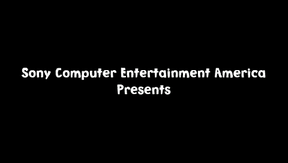
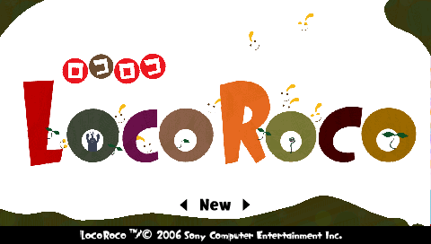

# LocoRoco (PSP) — technical reference

**Image.** `LocoRoco.cso` — 528,623,264 bytes, MD5 `c69f23b9926fd2dbe613092a79002289`.
A CISO-compressed dump of a UMD (`DISC_ID` UCUS98662). The uncompressed ISO is
589,299,712 bytes. The image is not committed (see the repository copyright policy);
supply a dump with the MD5 above.

## Contents

- **Part I — The image.** The CISO container, the ISO 9660 UMD filesystem, PARAM.SFO,
  the `PSP_GAME/SYSDIR` boot files, the `~PSP` KIRK-encrypted executable and its
  decryption, the ELF/PRX module, and the Allegrex memory map.
- **Part II — Boot chain.** Module relocation and load, register/stack seeding, the
  kernel-HLE syscall-stub mechanism, scheduling and IO, and pad-input injection —
  the oracle plays from the language screen into the first stage.
- **Part III — Graphics engine (GE).** The display-list interpreter, the software
  rasterizer, and the framebuffer output.
- **Part IV — Audio.** *(future)*
- **Part V — Game data.** The resource pipeline: DATA.BIN raw-extent access by LBN,
  the GPRS codec (reimplemented, byte-exact), the GARC archive, and the XUI screen
  resources.

The toolchain — the Allegrex CPU core and its disassembler/tracer, the PSP machine
oracle, and the `pspinfo`/`bootoracle` front-ends — is documented in Parts I and II.

---

## Part I — The image

### 1. Container: CISO ("CSO")

A UMD dump is commonly stored as CISO, a run of fixed-size logical blocks each held
raw or raw-DEFLATE compressed, indexed for random access. The 24-byte header
(little-endian):

| offset | size | field |
|--------|------|-------|
| 0x00 | 4 | magic `CISO` |
| 0x04 | 4 | header size (reserved) |
| 0x08 | 8 | uncompressed total size — `0x23270000` = 589,299,712 |
| 0x10 | 4 | block size — `0x800` = 2048 |
| 0x14 | 1 | version — 1 |
| 0x15 | 1 | align — 0 |
| 0x18 | . | index: `(nblocks+1)` uint32 |

Each index entry's bit 31 flags a block stored uncompressed; bits 0..30 are the
block's file offset right-shifted by `align`. A block's stored length is the gap to
the next entry's offset; compressed blocks are raw DEFLATE (no zlib wrapper). The
2048-byte block size equals the ISO logical block, so the CISO block index *is* the
ISO LBA. The decoder (`tools/platform/psp/cso.go`) reads through an `io.ReaderAt`
with a small LRU of decoded blocks, so the ~562 MiB image is never fully resident.

### 2. Filesystem: ISO 9660 UMD

The volume is a plain "cooked" 2048-byte-per-sector ISO 9660: a Primary Volume
Descriptor at logical block 16 (`CD001`), both-endian numeric fields, directory
records packed within a logical block. The reader (`iso.go`) sits on a block source
satisfied by either the CISO decoder or a flat `.iso`. The boot tree:

```
PSP_GAME/
  PARAM.SFO           title metadata
  SYSDIR/
    EBOOT.BIN         the encrypted boot executable (~PSP)
    BOOT.BIN          blanked on this UMD
  USRDIR/
    data/DATA.BIN     the packed game data (445 MiB)
    modules/*.prx     media codecs (audiocodec, atrac3plus, mpeg, libfont, …)
```

### 3. Metadata: PARAM.SFO

`PARAM.SFO` (`sfo.go`) is a key/value table (`\0PSF` magic, a 16-byte index record
per entry, a key string table and a data table). For this disc:

| key | value |
|-----|-------|
| `TITLE` | LocoRoco |
| `DISC_ID` | UCUS98662 |
| `CATEGORY` | UG |
| `PSP_SYSTEM_VER` | 2.71 |
| `BOOTABLE` | 1 |

### 4. The boot executable: `~PSP` / KIRK

`PSP_GAME/SYSDIR/EBOOT.BIN` is a `~PSP` container: a 0x150-byte header over an
AES-CBC-encrypted body. `BOOT.BIN`, the historically-plaintext companion, is blanked
on this UMD, so decryption is required to reach code. Header fields used:

| offset | field | value |
|--------|-------|-------|
| 0x28 | decrypted ELF size | `0x2388F4` = 2,328,820 |
| 0x2C | `~PSP` file size | `0x238A50` = 2,329,168 |
| 0xB0 | body size | `0x2388F4` |
| 0xD0 | tag | `0xC0CB167C` |

Decryption is performed by the PSP's KIRK security coprocessor. The tag at +0xD0
selects a per-firmware XOR seed; the header is descrambled with it and rebuilt into a
KIRK command-1 header, which KIRK decrypts. The steps (`kirk.go`, `prx.go`), for the
2.xx-game tag `0xC0CB167C` (seed `g_keyEBOOT2xx`, kirk7 key id `0x5D`):

1. Reassemble a 0x150-byte structure from the header regions (the embedded SHA-1 at
   +0xD4, the "unused" block at +0xE8, the 0x90-byte key block split across +0x110
   and +0x80, and the 0x80-byte PRX header at +0x00).
2. Type-1 pre-decrypt: `kirk7` (AES-128-CBC decrypt under `keyvault[0x5D]`, zero IV) a
   0xA0-byte slice of the structure; verify the embedded SHA-1 over the seed's first
   0x14 bytes and the reassembled blocks.
3. Build a KIRK command-1 header: XOR the first 0x70 header bytes with `seed[+0x14]`,
   `kirk7`-descramble, XOR with `seed[+0x20]`.
4. KIRK command 1: AES-CBC-decrypt the header's first 0x20 bytes under the KIRK master
   key to recover the body's AES key, then AES-CBC-decrypt the body → the plaintext
   ELF (verified: `\x7fELF`, exactly `0x2388F4` bytes).

The KIRK AES key set (the master key and the `keyvault`/tag seeds) are hardware
constants of the PSP's KIRK engine — not present on the UMD and not derivable from
ciphertext. They are treated as documented platform constants (`kirk_keys.go`), the
same standing as a boot-ROM seed; the KIRK *algorithm* is reimplemented from the
format and verified against ground truth.

### 5. The module: ELF32 / PRX

The plaintext is an ELF32 little-endian MIPS relocatable module (`e_machine` 8,
`e_type` `0xFFA0` = PRX). One `PT_LOAD` segment (file `0x1B9570`, mem `0xBF7580`),
entry `0x3C500`, `gp` `0x1C1560`. The PSP-specific `.rodata.sceModuleInfo` (located
by the first program header's `p_paddr`) names the module (`LocoRoco`) and lists the
import stub tables: **29 libraries** — `ThreadManForUser`, `SysMemUserForUser`,
`IoFileMgrForUser`, `sceDisplay`, `sceGe_user`, `sceCtrl`, `sceAudio`, `sceSasCore`,
`sceAtrac3plus`, `sceMpeg`, `sceUmdUser`, `sceUtility`, `sceLibFont`, `scePower`,
and others — each a list of function NIDs and a call-stub address. (`elf.go`.)

### 6. The Allegrex and its memory map

The PSP CPU is the Allegrex: a little-endian MIPS32R2 core with a single-precision
COP1 FPU and a 128-bit COP2 vector unit (the VFPU). The core (`tools/cpu/allegrex`)
shares the R3000 skeleton of `tools/cpu/mips` — branch delay slots, the same `Bus`
interface — but retires loads immediately (MIPS32R2 removed the load delay slot). It
adds the MIPS32R2 integer group (`movz`/`movn`/`rotr`, SPECIAL2 `mul`/`madd`/`clz`,
SPECIAL3 `ext`/`ins`/`seb`/`seh`/`wsbh`), the Allegrex `min`/`max` and the SPECIAL
encodings of `clz`/`clo` (funct `0x16`/`0x17`, distinct from the MIPS32 SPECIAL2
pair), the likely branches, the FPU — the `c.cond.s` compare family maps condition
bit 2 to *less*, bit 1 to *equal* and bit 0 to *unordered*, latched in FCC and
consumed by `bc1t`/`bc1f` and their delay-slot-nullifying `bc1tl`/`bc1fl` forms —
and the full VFPU (below). Its disassembler (`disallegrex`) and
tracer (`codetraceallegrex`) follow the shared CPU-command layout; the machine
oracle drives it through the memory map:

| range | region |
|-------|--------|
| `0x00010000`–`0x00013FFF` | scratchpad (16 KiB) |
| `0x04000000`–`0x041FFFFF` | VRAM (2 MiB) |
| `0x08000000`–`0x09FFFFFF` | main RAM (32 MiB; user partition at `0x08800000`) |
| `0x1C000000`–`0x1FFFFFFF` | hardware I/O |

Addresses fold through the MIPS kseg mirrors (`addr & 0x1FFFFFFF`).

### 7. The VFPU

The vector unit (`vfpu.go`) is 128 single-precision registers seen as eight 4×4
matrices. A 7-bit register number selects a single/pair/triple/quad vector — a
column, or a row through a transpose bit — and 2×2/3×3/4×4 matrices; the flat file
is column-major within each matrix (`V[mtx*16 + col*4 + row]`). Three operand
prefixes latch before an op and apply once: `vpfxs`/`vpfxt` swizzle, negate,
take absolute value, or substitute a constant per source element; `vpfxd`
saturates and write-masks the destination. The implemented set covers everything
Loco Roco's transform and setup code issues: the element-wise arithmetic
(`vadd`/`vsub`/`vmul`/`vdiv`/`vscl`), the reductions (`vdot`/`vhdp`/`vfad`/`vavg`),
the matrix ops (`vmmul`/`vtfm`/`vhtfm`/`vmscl`/`vmmov`/`vmidt`/`vmzero`/`vmone`),
the vector moves and transcendentals (`vmov`/`vabs`/`vneg`/`vrcp`/`vrsq`/`vsqrt`/
`vsin`/`vcos`, the last two in the VFPU's quarter-turn angle convention),
`vrot`, the comparisons and conditional moves (`vcmp`/`vcmov`/`vmin`/`vmax`/
`vslt`/`vsge`), the conversions (`vi2f`/`vf2i`/`vcst`), the quaternion/cross
products, the loads and stores (`lv.s`/`lv.q`/`sv.s`/`sv.q`/`lvl`/`lvr`) and the
register moves and control registers (`mtv`/`mfv`/`mtvc`/`mfvc`, `bvf`/`bvt`). The
encodings, register addressing and operation behaviour follow the PSP platform
specification as documented by the PPSSPP interpreter, treated as a hardware
reference (like the KIRK and GE constants); the tail of exotic ops halts with its
word. Assembled-loop tests (`vfpu_test.go`) check the addressing, the prefixes and
each executed op against independently computed values.

`pspinfo` is the Part I inspector: `-ls` walks the disc, `-sfo` dumps the metadata,
`-exe` KIRK-decrypts and describes the module, `-extract` pulls files.

---

## Part II — Boot chain

The oracle (`tools/platform/psp`, driven by `extract/cmd/bootoracle`) boots the
decrypted module directly.

### 1. Load and relocation

The PRX is relocatable (segment virtual address 0). It is loaded into the user
partition at base `0x08804000` and relocated: the `SHT_PRXRELOC` sections
(`0x700000A0`) carry MIPS relocations (`R_MIPS_32`, `R_MIPS_26` for `jal` targets, the
`HI16`/`LO16` pairs for split immediates), all resolved against the single segment's
base. The entry becomes `0x08840500` and `gp` `0x089C5560`.

### 2. Register and stack seeding

`$sp`/`$fp` are seeded near the top of user RAM (`0x09FF0000`), `$gp` to the
relocated module gp, `$ra` to 0 (a return to `$ra=0` ends the run), and `$a0`/`$a1`
(argc/argv) to 0. A bump heap is placed above the module image for
`sceKernelAllocPartitionMemory`.

### 3. Kernel HLE: syscall-stub patching

The PSP kernel is high-level-emulated. A game calls an imported `sceXxx` function
through a call stub that ends in a `syscall`; at load time each stub is patched to

```
jr $ra
syscall <synthetic code>
```

and the code is mapped to a Go handler. Functions are identified by NID — the first
four bytes (little-endian) of SHA-1(function name) — so hashing a curated name list
gives the NID→name map used to label the trace and bind the modelled handlers. The
CPU's syscall hook dispatches by code. Handlers are grown from the boot trace: the
memory, threading, timing and display calls the runtime reads are modelled; kernel
objects are given real behaviour where the game depends on it (below); everything
else logs its `(library, NID)` and returns 0, so one run enumerates the whole
syscall surface the boot path reaches.

### 4. Scheduling, synchronization and interrupts

A cooperative scheduler (`sched.go`) carries the boot through its thread hand-offs:
`sceKernelStartThread` makes a thread runnable and lets the caller continue; when a
thread sleeps, blocks or returns (to a sentinel `$ra`) the scheduler saves its
register context and switches to the highest-priority ready thread. Timed waits
(`sceKernelDelayThread`, the audio-output and VBlank waits) park the thread until a
future VBlank; when every thread is blocked on a timer, the scheduler idles forward
VBlank by VBlank rather than declaring the machine dead, so lower-priority threads
get their turn instead of starving behind a frame loop.

Each thread starts with a 256-byte `$k0` context area at the top of its stack — the
kernel writes the thread uid at `+0xC0` and the stack base at `+0xC8`, which Sony's
libc walks to find its per-thread reentrancy data (without it, `_getmodreent`
fails and the heap zones never come up). Sony's kernel objects are modelled with
real semantics because the runtime's heap zones and worker threads depend on them:
semaphores (`WaitSema`/`SignalSema`/`PollSema` with a real count and a blocked-thread
wake list), event flags (`WaitEventFlag`/`SetEventFlag`/`PollEventFlag` with the
OR/AND/clear modes), variable-length pools (`sceKernelCreateVpl`/`AllocateVpl`,
bump-allocated out of the heap), and callbacks. The display VBlank is delivered as a
sub-interrupt: a game registers a handler with `sceKernelRegisterSubIntrHandler` and
the run loop calls it on a cadence (`intr.go`), running it to completion in a nested
execution frame on a scratch stack.

`sceIo` (`io.go`) is backed by the mounted UMD volume: `sceIoOpen`/`Read`/`Lseek`/
`Close` resolve the disc path on the ISO 9660 filesystem and stream bytes through
`ReadFileAt`; `sceKernelStdout`/`stderr` and `sceIoWrite` feed the TTY, and
`sceKernelPrintf` renders the game's own debug logging. `sceIoGetstat` fills a
0x58-byte `SceIoStat`; on the PSP's umd9660 driver the file's start sector (LBN)
is reported in `st_private[0]`, and the game reads it there. The driver's
raw-extent path syntax `disc0:/sce_lbn0x<lbn>_size0x<size>` — the game's own
format string — opens a sector run directly, without a directory lookup; the
volume resolver recognises it and serves the extent, which is how the game
streams individual files out of the 445 MiB `DATA.BIN` pack (Part V). With these the boot runs the
module entry and C runtime, brings up its six heap zones, loads its media PRXs from
`USRDIR/modules`, starts its worker threads (`sgsfile-req-th`, the SAS mixer
threads, `ptnCallbackTh`) and reaches its **per-frame render loop**: every frame it
builds transforms with the VFPU, reads the pad, and submits GE display lists via
`sceGeListEnQueue`, flipping the framebuffer with `sceDisplaySetFrameBuf`.

### 5. Input — the oracle plays the game

The pad is modelled at both of the game's sampling points: `sceCtrlReadBufferPositive`
fills a `SceCtrlData` (buttons, centred analog axes), and `sceCtrlReadLatch` fills a
`SceCtrlLatch` with true edge data — make/break derived from the previous latch
read's state, consumed by Read and preserved by Peek. The game polls both every
frame; without a modelled latch its edge detection reads uninitialised memory, so
the latch is load-bearing for any input at all.

Input is injected on a VBlank schedule (`bootoracle -keys FILE`): each script line
is `<vblank> [button ...]`, setting the held buttons from that VBlank until the next
event. The savedata system-utility dialog is modelled to completion —
`sceUtilitySavedataInitStart` reads the operation mode at `+48` of the parameter
block and completes the load modes with `SCE_UTILITY_SAVEDATA_ERROR_LOAD_NO_DATA`
in the result field at `+28` (there is no memory stick), and `GetStatus` walks the
INIT → RUNNING → FINISHED → SHUTDOWN progression the game's poll loop expects.

With those, a scripted run drives the boot the way a player would: cross on the
language screen (left/right moves the selection — a press on Français loads
`reside_fr.arc` in place of `reside_us.arc`), cross through the title menu's
`◀ New ▶` selector, cross to advance the MuiMui intro dialogue, and the L/R
triggers to tilt the world in the stage itself — the game's tutorial answers a
too-short press with "Hold the L and R buttons down longer!". The savedata check
runs at title entry; a "New" selection loads `st_flower01.clv` and enters the
first stage playing.

Savestates (`state.go`) snapshot the full machine (RAM, VRAM, scratchpad, the
Allegrex register files including FPU/VFPU, the thread contexts and their wait
state, the kernel objects, the sub-interrupt handlers, the open file descriptors and
the syscall tables) with the image MD5 pinned.

---

## Part III — Graphics engine (GE)

The GE is the PSP's GPU: a game builds a display list of 32-bit commands (top 8 bits =
command, low 24 = argument) in memory and submits it with `sceGeListEnQueue`; the GE
walks the list maintaining render state and draws primitives into the framebuffer in
VRAM.

- **Capture (`ge.go`).** A submitted list is captured by following its control flow —
  `JUMP`/`CALL`/`RET`/`BASE` — to the `END`, flattening it to a command sequence.
- **Interpret (`ge_raster.go`).** The GE registers persist across list submissions
  (a frame's framebuffer/viewport setup list conditions the draw lists that follow),
  so the interpreter keeps one state on the machine. The commands set the framebuffer
  target (`FRAME_BUF_PTR`/`FRAME_BUF_WIDTH`/`FRAMEBUF_PIX_FORMAT`), the viewport
  (scale/center) and the screen offset (`OFFSETX`/`OFFSETY`, 4-bit-subpixel values
  subtracted from viewport space to reach screen pixels), the world/view/projection
  matrices (a matrix-number command sets the write index, data commands stream
  elements), the vertex format (`VERTEX_TYPE`), the material ambient colour and alpha
  (the vertex colour when the format carries none), the texture binding (address,
  stride, size, format, swizzle mode, UV scale/offset), the CLUT (address and format;
  `LOADCLUT` latches entries from memory at execution time), and alpha blending;
  `PRIM` triggers a draw. Vertices are decoded per the vertex type (position
  s8/s16/float, colour 565/5551/4444/8888 or material, texcoords u8/u16/float —
  fixed-point texcoords are fractional, scaled by `TEXSCALEU/V`), and — for
  non-through primitives — transformed by model-view-projection, the viewport and
  the screen offset, or taken as screen-space coordinates in through mode.
- **Rasterize (`ge_draw.go`).** Triangles (lists/strips/fans) fill by barycentric
  interpolation of per-vertex colour; sprites fill axis-aligned rectangles. A bound
  texture modulates the colour: the direct formats (5650/5551/4444/8888) and the
  indexed ones (CLUT4/CLUT8) are sampled, honouring the PSP's swizzled block layout
  (16-byte × 8-row tiles stored contiguously) and mapping indices through the
  latched palette per `CLUTFORMAT` (shift, mask, base). With blending enabled the
  source mixes over the destination by source alpha. Pixels are written in the
  framebuffer's PSP format.
- **Output (`framebuffer.go`).** The 480×272 framebuffer is decoded from VRAM to an
  RGBA image and written to PNG (`bootoracle -shot`).

The GE pipeline is validated end to end by a rasterizer test that renders a list
into VRAM and reads the result back, and by the game itself: the boot runs the
publisher splash, streams the title assets (Part V) and renders the full animated
title screen — the logo letters with their inhabitants, the singing LocoRocos on
the hill, the crossfading menu — from its own display lists (~1,100 primitives per
frame; `bootoracle -gelog N` prints a per-list command census, `-gedump N` the raw
words, and `PSP_GE_DEBUG=N` the per-primitive render state).





---

## Part IV — Audio

*(future)* `sceSasCore`, `sceAtrac3plus` and the `USRDIR/data/stream/*.sgb` /
`*.at3` assets.

## Part V — Game data

### 1. DATA.BIN and raw-extent access

Nearly all game content lives in `USRDIR/data/DATA.BIN`, a 445 MiB pack of
sector-aligned files. The game locates it once at boot: it stats
`data/DATA.BIN`, reads the file's start sector from `SceIoStat.st_private[0]`
(the umd9660 driver reports it there), stores it in a global and prints it —
`DATA.BIN : LBN[23472]`. Individual files are then opened by raw disc extent:
the file layer formats `disc0:/sce_lbn0x%X_size0x%X` from the pack's base LBN
plus the file's relative sector offset, and streams the extent in 64 KiB
chunks. The pack itself is never opened as a file.

### 2. The file layer (sgsfile)

File access goes through the game's own request layer, built at init
(`sgsfile-*` configuration strings; the worker thread `sgsfile-req-th`, entry
`0x0881AAF8`, and the `sgsfile-queue` semaphore set — one items-available
counter and two 256-slot free-list counters). A request is a small command
block (command 8 is "stat": resolve a path, return the 512-byte resolved name,
the LBN and the size); the dispatcher (`0x08819A10`) either queues it to the
worker or — when the device's synchronous flag is set (`0x088144B4`) — executes
it inline on the calling thread and invokes the completion callback directly.
`FileOpen` (`0x08846A14`) consults the loaded directory archive first: a hit
resolves the name to an `sce_lbn` path into DATA.BIN (printed as
`FileOpen: disc0:/sce_lbn0x6C50_size0xF694C[yel_locoroco.arc]`), a miss falls
back to the literal disc path.

### 3. The GPRS codec

Archive files are stored GPRS-compressed. The 8-byte header is the magic
`GPRS` and the big-endian decompressed size; the body is a byte-aligned LZSS
stream driven by MSB-first control bits, decoded by the routine at
`0x08846EDC` (reached from the archive loader `0x088486A8`; files larger than
128 KiB stream through the same codec in chunks). The stream interleaves
control bits with whole bytes:

| bits | meaning |
|------|---------|
| `0` | literal: copy the next stream byte |
| `1 0` | short match: offset byte `D` (`D = 0` terminates), source `dst − (256−D)`, 1-255 back |
| `1 1` | long match: offset byte `D` plus four more bits `N`, source `dst + (((D−256)<<4) \| N) − 255`, 256-4351 back |

A match's length is interleaved Elias-gamma — `len = 1`, then while the next
control bit is 1, `len = len<<1 | following-bit` — and `len+1` bytes are
copied source-forward (overlap allowed; the game unrolls the copy eight-wide
through a jump table). The reimplementation (`extract/gprs`) is verified
against the running game: the decoded `first_us.arc` matches the buffer the
game's own decompressor produced (captured from the oracle at the loader's
return, before the game patches runtime handles into it) byte-exact across
all 392,304 bytes, and `system.arc` — a 1.9 MiB archive that takes the
chunked path — decodes to a well-formed 3.1 MiB GARC.

### 4. GARC archives

The decompressed content of an `.arc` is a GARC archive:

| offset | field |
|--------|-------|
| 0x00 | magic `GARC` |
| 0x04 | version float 1.0 |
| 0x14 | offset of the first chunk |

Chunks are tagged blocks (`FILE`, …) walked by magic and next-offset; the
`FILE` chunk is the file directory. The boot directory `data/first_us.arc`
(98,275 bytes compressed) decompresses to the GARC naming 77 packed files;
its entries carry each file's sector offset within DATA.BIN (`entry+4`) and
byte size (`entry+12`), which is exactly what `FileOpen` needs to build the
`sce_lbn` path. Loaded archives whose payload begins with `GARC` are
registered in a global resource list (head `0x090EB8C8`, guarded by
`garcListSema`), which resource queries walk by chunk magic and key.

### 5. XUI screen resources

The boot scene's on-screen content is an `XUI` resource served from a loaded
GARC: magic `XUI\0`, version float 1.0, a 0x140-byte header, then a chain of
typed nodes (type at `+0`, next-offset at `+4`, name-offset at `+8` — names
like `Haikei` (background), `yajirusi` (arrow), `gengo_us`). The scene state
machine (`0x0894D370`) parses the chain (`0x0894089C`), keeps per-type node
pointers on the scene object (the type-3 node is the screen root it waits
for), and advances from its loading state once the parse lands.

### 6. The boot load chain

The sequence from module start into the first stage, as the game's own log and
the oracle's IO notes record it: `modules/module.cnf` and the media PRXs;
`data/first_us.arc` (the GPRS→GARC directory); then by name through the
directory — `system.arc`, the per-language `reside_us.arc` and
`title_miyano_us.clv` (the title music stream; a language-select choice swaps
the `_us` pair for `_fr`, `_de`, …), `yel_locoroco.arc` (the yellow LocoRoco's
assets), and on starting a game `st_flower01.clv` (the first stage) — each an
`sce_lbn` extent of DATA.BIN. Left idle at the title, the game runs an
in-engine attract demo (`demo_start` in its log, demo characters from
`data/reside/chara/*.txt`) and returns to the title; the intro movie
(`data/movie/*.pmf`) is probed through `scePsmfPlayer`/`sceMpeg` and torn down
without a file open.


